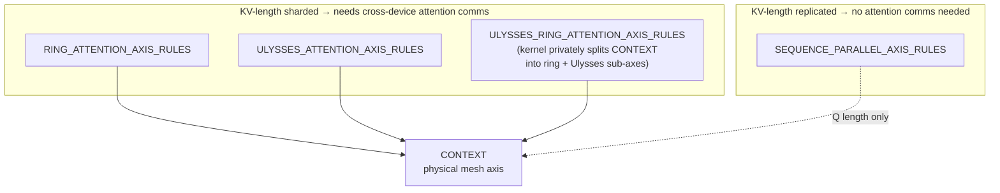

# maxdiffusion/common_types — sequence-parallel attention axis-rule presets

## Overview
Four named logical-axis-rule lists — [`RING_ATTENTION_AXIS_RULES`](../catalog/src/maxdiffusion/common_types.md#RING_ATTENTION_AXIS_RULES), [`SEQUENCE_PARALLEL_AXIS_RULES`](../catalog/src/maxdiffusion/common_types.md#SEQUENCE_PARALLEL_AXIS_RULES), [`ULYSSES_ATTENTION_AXIS_RULES`](../catalog/src/maxdiffusion/common_types.md#ULYSSES_ATTENTION_AXIS_RULES), [`ULYSSES_RING_ATTENTION_AXIS_RULES`](../catalog/src/maxdiffusion/common_types.md#ULYSSES_RING_ATTENTION_AXIS_RULES) — map logical self/cross-attention activation axes onto the physical `context` mesh axis, selecting between four distinct long-sequence attention parallelism strategies used across MaxDiffusion's video/diffusion transformer models. The key design idea: all four share the same *logical* axis names, so the difference between "plain sequence parallelism" and "ring/Ulysses attention" is entirely in whether the KV-length axis is sharded (forcing cross-device attention communication) or left replicated.

## Diagram

## Design rationale (why it's built this way)
Splitting self- vs. cross-attention axis names (`SELF_ATTN_*` vs `CROSS_ATTN_*`) lets a model shard the two attention types differently even when the underlying tensors would otherwise look identical — cross-attention's KV comes from a separately-sharded text/condition encoder, so its sharding constraints are logically distinct from self-attention's own sequence sharding, even though both ultimately reduce to a handful of `[logical, physical-or-None]` pairs.

## Entry points
- [`RING_ATTENTION_AXIS_RULES`](../catalog/src/maxdiffusion/common_types.md#RING_ATTENTION_AXIS_RULES) / [`ULYSSES_ATTENTION_AXIS_RULES`](../catalog/src/maxdiffusion/common_types.md#ULYSSES_ATTENTION_AXIS_RULES) / [`ULYSSES_RING_ATTENTION_AXIS_RULES`](../catalog/src/maxdiffusion/common_types.md#ULYSSES_RING_ATTENTION_AXIS_RULES) / [`SEQUENCE_PARALLEL_AXIS_RULES`](../catalog/src/maxdiffusion/common_types.md#SEQUENCE_PARALLEL_AXIS_RULES) — one of these is selected by a model's configuration and passed to Flax's logical-to-physical axis-rule machinery wherever attention activations are annotated (e.g. `nn.with_logical_constraint`-style calls in the attention modules that consume [`CONTEXT`](../catalog/src/maxdiffusion/common_types.md#CONTEXT) and the `*_ATTN_*` axis names), determining how sequence-parallel attention actually communicates across devices.

## Mechanism (step-by-step)
1. Each rule list is a list of `[logical_axis_name, physical_axis_name_or_None]` pairs over the same six logical axes: [`SELF_ATTN_HEAD`](../catalog/src/maxdiffusion/common_types.md#SELF_ATTN_HEAD), [`SELF_ATTN_Q_LENGTH`](../catalog/src/maxdiffusion/common_types.md#SELF_ATTN_Q_LENGTH), [`SELF_ATTN_KV_LENGTH`](../catalog/src/maxdiffusion/common_types.md#SELF_ATTN_KV_LENGTH), [`CROSS_ATTN_HEAD`](../catalog/src/maxdiffusion/common_types.md#CROSS_ATTN_HEAD), [`CROSS_ATTN_Q_LENGTH`](../catalog/src/maxdiffusion/common_types.md#CROSS_ATTN_Q_LENGTH), [`CROSS_ATTN_KV_LENGTH`](../catalog/src/maxdiffusion/common_types.md#CROSS_ATTN_KV_LENGTH) — a separate set of logical names for self-attention versus cross-attention lets a model shard the two differently even though they'd otherwise share axis names.
2. In [`RING_ATTENTION_AXIS_RULES`](../catalog/src/maxdiffusion/common_types.md#RING_ATTENTION_AXIS_RULES), [`ULYSSES_ATTENTION_AXIS_RULES`](../catalog/src/maxdiffusion/common_types.md#ULYSSES_ATTENTION_AXIS_RULES), and [`ULYSSES_RING_ATTENTION_AXIS_RULES`](../catalog/src/maxdiffusion/common_types.md#ULYSSES_RING_ATTENTION_AXIS_RULES), every one of `SELF_ATTN_Q_LENGTH`, `SELF_ATTN_KV_LENGTH`, `CROSS_ATTN_Q_LENGTH`, `CROSS_ATTN_KV_LENGTH` maps to [`CONTEXT`](../catalog/src/maxdiffusion/common_types.md#CONTEXT) — both the query *and* key/value length axes are sharded across the same physical mesh axis, meaning attention itself must cross device boundaries to see the full sequence (ring rotation or Ulysses all-to-all, depending on which kernel consumes these rules).
3. [`SEQUENCE_PARALLEL_AXIS_RULES`](../catalog/src/maxdiffusion/common_types.md#SEQUENCE_PARALLEL_AXIS_RULES) differs from the other three in exactly one respect: `SELF_ATTN_KV_LENGTH` and `CROSS_ATTN_KV_LENGTH` map to `None` (replicated) instead of `CONTEXT` — only the query length axis stays sharded. This is the "plain" sequence-parallelism variant: each device holds a full, unsharded KV for the attention it computes locally, so no ring/all-to-all communication is needed *for the attention op itself* — sharding only affects the non-attention (elementwise/norm/projection) portions of the sequence dimension.
4. All four rule lists ([`RING_ATTENTION_AXIS_RULES`](../catalog/src/maxdiffusion/common_types.md#RING_ATTENTION_AXIS_RULES), [`SEQUENCE_PARALLEL_AXIS_RULES`](../catalog/src/maxdiffusion/common_types.md#SEQUENCE_PARALLEL_AXIS_RULES), [`ULYSSES_ATTENTION_AXIS_RULES`](../catalog/src/maxdiffusion/common_types.md#ULYSSES_ATTENTION_AXIS_RULES), [`ULYSSES_RING_ATTENTION_AXIS_RULES`](../catalog/src/maxdiffusion/common_types.md#ULYSSES_RING_ATTENTION_AXIS_RULES)) map `SELF_ATTN_HEAD`/`CROSS_ATTN_HEAD` to `None` uniformly — none of these strategies shard along the attention-head axis; head-dimension parallelism is out of scope for this axis-rule family.
5. A source comment directly above [`ULYSSES_RING_ATTENTION_AXIS_RULES`](../catalog/src/maxdiffusion/common_types.md#ULYSSES_RING_ATTENTION_AXIS_RULES) states the hybrid strategy's real mechanism: "Public configs shard sequence on `context`; attention code privately reshapes that axis into hidden ring and Ulysses axes for the hybrid kernel" — i.e. this rule list's *externally visible* sharding is identical to plain Ulysses or ring attention (one physical `context` axis), but the consuming kernel further subdivides that one physical axis into two logical sub-axes (one for ring rotation, one for Ulysses all-to-all) internally, which is invisible at the axis-rule level.

## Key data structures
- [`WAN_MODEL`](../catalog/src/maxdiffusion/common_types.md#WAN_MODEL) — bound to [`WAN2_1`](../catalog/src/maxdiffusion/common_types.md#WAN2_1) (`"wan2.1"`), used elsewhere in the codebase as a model-family identifier string.
- [`CONTEXT`](../catalog/src/maxdiffusion/common_types.md#CONTEXT) — the physical mesh axis name (`"context"`) that every one of these rule lists shards the sequence-length logical axes onto; it is one of four physical axis names defined in this module (alongside `DATA`, `FSDP`, `TENSOR`, visible in source but outside this packet's cited subgraph) reserved specifically for sequence/context parallelism, distinct from the batch/FSDP/tensor-parallel axes used elsewhere in the mesh.

## Dynamics (design intent)
> [!inferred] The near-duplication between [`RING_ATTENTION_AXIS_RULES`](../catalog/src/maxdiffusion/common_types.md#RING_ATTENTION_AXIS_RULES), [`ULYSSES_ATTENTION_AXIS_RULES`](../catalog/src/maxdiffusion/common_types.md#ULYSSES_ATTENTION_AXIS_RULES), and [`ULYSSES_RING_ATTENTION_AXIS_RULES`](../catalog/src/maxdiffusion/common_types.md#ULYSSES_RING_ATTENTION_AXIS_RULES) (byte-for-byte identical axis mappings) reflects that the *axis rules* only describe the logical→physical sharding contract, not the communication pattern used to satisfy it — ring attention, Ulysses attention, and the 2D hybrid all present the same sharded-KV contract to the rest of the model and differ only in which collective (ring `ppermute` vs. all-to-all vs. both) the attention kernel itself uses internally to gather the KV it needs.

## Edge cases
- [`WAN_MODEL`](../catalog/src/maxdiffusion/common_types.md#WAN_MODEL) is assigned twice in the source (once to `WAN2_1`, then reassigned a few lines later to the literal string `"Wan2.1"` — differing in capitalization from `WAN2_1`'s `"wan2.1"`) — the second assignment silently shadows the first, so any code relying on `WAN_MODEL == WAN2_1` would be comparing against a differently-cased string than intended.
- Because [`SEQUENCE_PARALLEL_AXIS_RULES`](../catalog/src/maxdiffusion/common_types.md#SEQUENCE_PARALLEL_AXIS_RULES) leaves KV-length unsharded, choosing it for a model whose attention kernel *assumes* a sharded KV (i.e. a ring/Ulysses kernel) would silently change the kernel's actual sharding behavior versus its logical-axis contract — the axis-rule choice and the kernel choice must be paired correctly by the caller; nothing in this file enforces that pairing.

## Open questions
> [!inferred] Whether the `WAN_MODEL` double-assignment (see Edge cases) is a bug or an intentional override is not resolvable from this packet alone — the two values differ only in casing, which could go unnoticed if `WAN_MODEL` is only ever used for logging/display rather than an exact-match comparison.

## See also
- [maxdiffusion/kernels/splash_attention](maxdiffusion-kernels-splash_attention-splash_attention_kernel.md) — the TPU Pallas kernel these axis rules ultimately configure sharding for.
