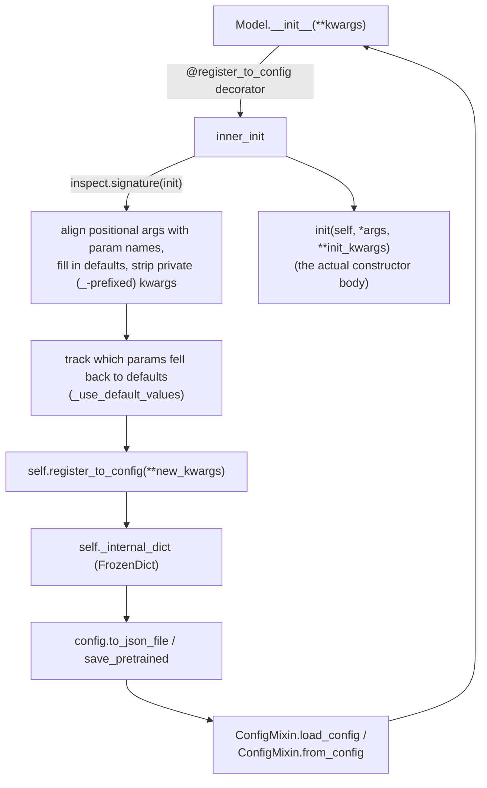

# maxdiffusion/configuration_utils — ConfigMixin auto-capture and JSON config round-tripping

## Overview
A HuggingFace-diffusers-derived mechanism (not itself TPU-perf-relevant, but load-bearing infrastructure every model class in this codebase inherits) that automatically captures a model's constructor arguments into a JSON-serializable config dict via the [`@register_to_config`](../catalog/src/maxdiffusion/configuration_utils.md#register_to_config) decorator and [`ConfigMixin`](../catalog/src/maxdiffusion/configuration_utils.md#ConfigMixin) base class, and reloads them via [`ConfigMixin.load_config`](../catalog/src/maxdiffusion/configuration_utils.md#ConfigMixin.load_config) — this is what lets every `nnx.Module`/`nn.Module` model class in this codebase (e.g. `LTX2VideoTransformer3DModel`, `FluxTransformer2DModel`) be saved/loaded from a `config.json` without hand-writing serialization code.

## Diagram

## Design rationale (why it's built this way)
- **The decorator, not the class, does the argument capture** — [`register_to_config`](../catalog/src/maxdiffusion/configuration_utils.md#register_to_config) (the module-level function, distinct from the instance method of the same name on [`ConfigMixin`](../catalog/src/maxdiffusion/configuration_utils.md#ConfigMixin)) wraps `__init__` via `functools.wraps`, so every subclass only needs to apply `@register_to_config` to its own `__init__` and inherit from `ConfigMixin` — no boilerplate config-dict-building code per model class. Its own docstring: "Decorator to apply on the init of classes inheriting from `ConfigMixin` so that all the arguments are automatically sent to `self.register_for_config`."
- **Private (underscore-prefixed) kwargs are deliberately excluded from the saved config** — the decorator's docstring warns explicitly: "Once decorated, all private arguments (beginning with an underscore) are trashed and not sent to the init!" — this is the mechanism by which internal/non-serializable state (e.g. a live `mesh` object, an `rngs` object) can be passed to a constructor without ending up in a JSON config file that's meant to be portable across runs/machines.
- **`_use_default_values` records which parameters were *not* explicitly supplied**, computed as `set(new_kwargs.keys()) - set(init_kwargs)` — this distinction matters when later loading an older saved config against a newer model class: a parameter added since the config was saved should be recognized as "using its default," not silently absent, which downstream tooling can use to warn about config/model version skew.
- **`FrozenDict`** (visible in source, an `OrderedDict` subclass) backs `_internal_dict` — making the captured config immutable after construction, so a model's declared configuration can't be silently mutated post-hoc in a way that would desync from what was actually used to build the model.

## Entry points
- [`register_to_config`](../catalog/src/maxdiffusion/configuration_utils.md#register_to_config) — the decorator every model's `__init__` in this codebase applies (seen directly, e.g., on `LTX2VideoTransformer3DModel.__init__` in [ltx2/transformer_ltx2](maxdiffusion-models-ltx2-transformer_ltx2.md)); it is also the mechanism that ultimately stores the captured kwargs onto the instance (via an internal call, not itself a separately-cited symbol in this packet).
- [`ConfigMixin.load_config`](../catalog/src/maxdiffusion/configuration_utils.md#ConfigMixin.load_config) — the classmethod entry point for reloading a saved config (from a local path or the Hub) back into a kwargs dict suitable for reconstructing a model.
- [`ConfigMixin.config`](../catalog/src/maxdiffusion/configuration_utils.md#ConfigMixin.config) — the property exposing the captured config dict for read access (used throughout this codebase's `setup()` methods, e.g. `self.config.in_channels` in [maxdiffusion/models/vae_flax](maxdiffusion-models-vae_flax.md)'s `FlaxAutoencoderKL.setup`), per its own docstring "Returns the config of the class as a frozen dictionary."

## Mechanism (step-by-step)
1. [`register_to_config`](../catalog/src/maxdiffusion/configuration_utils.md#register_to_config) wraps a class's `__init__`; on each instantiation, `inner_init` first asserts `isinstance(self, ConfigMixin)` (raising `RuntimeError` otherwise — the decorator only makes sense on a [`ConfigMixin`](../catalog/src/maxdiffusion/configuration_utils.md#ConfigMixin) subclass), strips underscore-prefixed kwargs into a separate `config_init_kwargs` bucket, and keeps the rest as `init_kwargs`.
2. [`register_to_config`](../catalog/src/maxdiffusion/configuration_utils.md#register_to_config) uses `inspect.signature(init)` to build a `parameters` dict of every non-`self`, non-`ignore_for_config` parameter name mapped to its default value, then walks positional `args` in order to align them with parameter names (`new_kwargs[name] = arg`), before filling in any remaining parameters from `init_kwargs` or their defaults.
3. Still inside [`register_to_config`](../catalog/src/maxdiffusion/configuration_utils.md#register_to_config), it computes `_use_default_values` as the set of parameter names present in `new_kwargs` but absent from the caller-supplied `init_kwargs` — i.e. every parameter that ended up using its default rather than an explicit value.
4. [`register_to_config`](../catalog/src/maxdiffusion/configuration_utils.md#register_to_config) calls `self.register_to_config(**new_kwargs)` (the [`ConfigMixin`](../catalog/src/maxdiffusion/configuration_utils.md#ConfigMixin) instance method of the same name, storing the config into `self._internal_dict`, readable back via [`config`](../catalog/src/maxdiffusion/configuration_utils.md#ConfigMixin.config)), then finally calls the *original* `init(self, *args, **init_kwargs)` — the actual model construction happens only after the config has already been captured.
5. Loading works in the reverse direction: [`ConfigMixin.load_config`](../catalog/src/maxdiffusion/configuration_utils.md#ConfigMixin.load_config) reads a saved `config.json` (locally or via Hub download, given the module's `http_user_agent` reference for HTTP requests), and a model's `from_config`/`from_pretrained` classmethod (visible in source on [`ConfigMixin`](../catalog/src/maxdiffusion/configuration_utils.md#ConfigMixin)) uses the resulting dict as `**kwargs` to reconstruct the model — passing back through the same `@register_to_config`-decorated `__init__`.

## Key data structures
- [`ConfigMixin`](../catalog/src/maxdiffusion/configuration_utils.md#ConfigMixin) — the base class every configurable model class inherits, providing `register_to_config`/`load_config`/`config` and (visible in source) `from_config`/`save_config`.
- `FrozenDict` — the immutable dict subclass backing `_internal_dict`.
- `CustomEncoder` (visible in source, a `json.JSONEncoder` subclass) — handles serialization of non-standard-JSON types (e.g. NumPy arrays, `jnp` dtypes) that might appear in a model's config.

## Dynamics (design intent)
> [!inferred] The private-kwarg-stripping behavior means every model constructor in this codebase must accept genuinely non-serializable objects (a `mesh`, `rngs`, sharding specs) either as private (underscore-prefixed) parameters or accept that they'll be silently dropped from the saved config and must be re-supplied by the caller when reconstructing from a saved config — this is consistent with what's observed in [ltx2/transformer_ltx2](maxdiffusion-models-ltx2-transformer_ltx2.md), where `mesh`/`rngs` are ordinary (non-underscore) constructor parameters, implying they *are* captured into the config unless a class explicitly lists them in `ignore_for_config`.

## Edge cases
- `register_to_config`'s `RuntimeError` guard only fires if the decorated class doesn't inherit `ConfigMixin` — applying the decorator to an unrelated class is a construction-time (not import-time) failure, only surfacing the first time that class is instantiated.
- Because positional arguments are aligned to parameter names purely by position (`zip(args, parameters.keys())`), a subclass `__init__` that reorders inherited parameters relative to its parent class's signature could silently misassign captured config values — a structural risk inherent to this style of introspection-based capture.

## Open questions
> [!inferred] Whether `ignore_for_config` (referenced as a per-class attribute lookup, `getattr(self, "ignore_for_config", [])`) is actually set on any model class in this codebase, or is exclusively an escape hatch inherited unused from the upstream diffusers pattern, is not established by this packet's cited subgraph.

## See also
- [maxdiffusion/utils/import_utils](maxdiffusion-utils-import_utils.md) — another HuggingFace-diffusers-derived infrastructure module this codebase carries forward, addressing a different concern (optional-dependency gating rather than config capture).
- [maxdiffusion/models/ltx2/transformer_ltx2](maxdiffusion-models-ltx2-transformer_ltx2.md) — a concrete model class using `@register_to_config` on its `__init__`.
