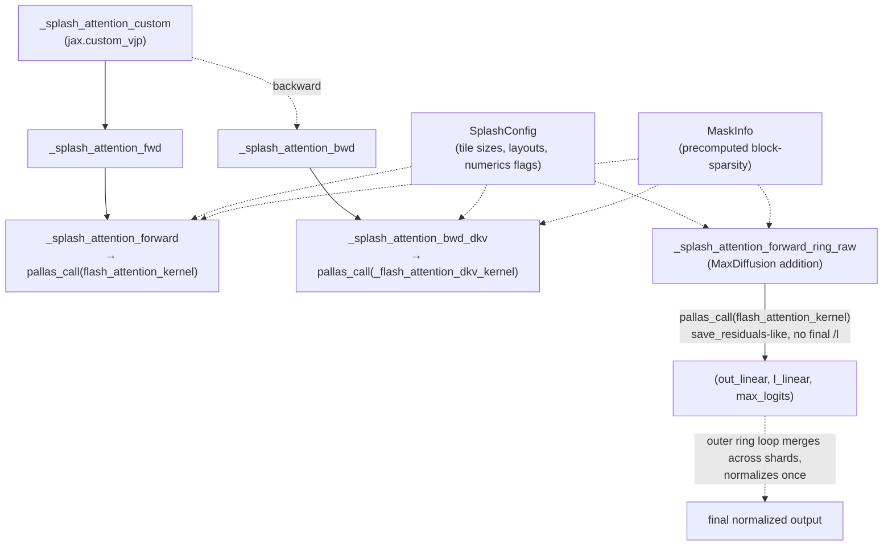

# maxdiffusion/kernels/splash_attention/splash_attention_kernel — block-sparse flash attention (+ ring-attention merge variant)

<!-- connect:up:begin -->
> **Cross-repo concept:** part of [flash-attention](../../../concepts/flash-attention.md), [ring-attention](../../../concepts/ring-attention.md), [sparsecore](../../../concepts/sparsecore.md), [splash-attention](../../../concepts/splash-attention.md) across this wiki's repos.
<!-- connect:up:end -->
## Overview
This module is a MaxDiffusion-vendored copy of DeepMind/JAX's "Splash" (sparse flash) attention Pallas TPU kernel — block-sparse flash attention driven by a precomputed [`MaskInfo`](../catalog/src/maxdiffusion/kernels/splash_attention/splash_attention_mask_info.md#MaskInfo) sparsity pattern, with MQA/MHA support, segment ids, attention sinks, logit soft-capping, and a `jax.custom_vjp`-registered forward/backward pair. MaxDiffusion adds one function not present upstream — [`_splash_attention_forward_ring_raw`](../catalog/src/maxdiffusion/kernels/splash_attention/splash_attention_kernel.md#_splash_attention_forward_ring_raw) — which returns *unnormalized* fp32 accumulators instead of a finished attention output, so an outer ring-attention loop can merge partial results from multiple ring steps and normalize exactly once at the end.

## Diagram

## Design rationale (why it's built this way)
- **Mask sparsity is precomputed, not evaluated per-block at kernel time.** [`MaskInfo`](../catalog/src/maxdiffusion/kernels/splash_attention/splash_attention_mask_info.md#MaskInfo) — imported from the sibling `splash_attention_mask_info` module — carries [`active_rows`](../catalog/src/maxdiffusion/kernels/splash_attention/splash_attention_mask_info.md#MaskInfo.active_rows)/[`active_cols`](../catalog/src/maxdiffusion/kernels/splash_attention/splash_attention_mask_info.md#MaskInfo.active_cols)/[`mask_next`](../catalog/src/maxdiffusion/kernels/splash_attention/splash_attention_mask_info.md#MaskInfo.mask_next) so [`_splash_attention_forward`](../catalog/src/maxdiffusion/kernels/splash_attention/splash_attention_kernel.md#_splash_attention_forward) and [`_splash_attention_forward_ring_raw`](../catalog/src/maxdiffusion/kernels/splash_attention/splash_attention_kernel.md#_splash_attention_forward_ring_raw) can build a **dynamic grid** (`dynamic_grid = mask_info.active_rows is not None`) that only visits the (query-block, kv-block) pairs the mask actually permits, rather than visiting every block and masking within it — this is what makes "splash" attention faster than dense flash attention for genuinely sparse patterns.
- **Separate config knobs for block-transfer size vs. compute size** (`block_kv` vs. [`block_kv_compute`](../catalog/src/maxdiffusion/kernels/splash_attention/splash_attention_kernel.md#_splash_attention_forward) — the same two-level-blocking idea seen elsewhere in this wiki's Pallas kernels): [`SplashConfig`](../catalog/src/maxdiffusion/kernels/splash_attention/splash_attention_kernel.md#SplashConfig)'s docstring states these tile-size params "have negligible effect on numerics, but affect performance greatly" — decoupling the DMA'd tile from the inner compute granularity.
- **`QKVLayout` (`HEAD_DIM_MINOR` vs `SEQ_MINOR`) is a physical-layout choice with a fixed logical interface.** [`SplashConfig`](../catalog/src/maxdiffusion/kernels/splash_attention/splash_attention_kernel.md#SplashConfig)'s own docstring is explicit: "changing the layouts only influences the physical layout that the kernel will enforce. The logical interface to splash attention always takes the head dimension as the minormost one" — [`from_head_minor`](../catalog/src/maxdiffusion/kernels/splash_attention/splash_attention_kernel.md#from_head_minor) is the one helper that translates between the two, called from every BlockSpec-building closure in both [`_splash_attention_forward`](../catalog/src/maxdiffusion/kernels/splash_attention/splash_attention_kernel.md#_splash_attention_forward) and [`_splash_attention_forward_ring_raw`](../catalog/src/maxdiffusion/kernels/splash_attention/splash_attention_kernel.md#_splash_attention_forward_ring_raw).
- **The ring-merge split (`_splash_attention_forward_ring_raw`) exists because normalizing per-ring-step would be wrong.** Its own docstring states the reason directly: "returns the raw fp32 numerator (`out_linear`) together with the linear softmax denominator (`l_linear`) and per-row max logits (`max_logits`)... lets the outer ring kernel merge shard contributions and normalize only once at the very end" — the online-softmax numerator/denominator only compose correctly across ring steps in their *unnormalized* form (matching the same principle used in [ringattention](../../ringattention/concepts/ringattention-ringattention_pallas_tpu.md)'s device-ring flash attention).
- **`jax.custom_vjp` instead of relying on autodiff through Pallas**, matching the same rationale seen in other TPU flash-attention kernels this wiki covers: [`_splash_attention_custom`](../catalog/src/maxdiffusion/kernels/splash_attention/splash_attention_kernel.md#_splash_attention_custom) registers [`_splash_attention_fwd`](../catalog/src/maxdiffusion/kernels/splash_attention/splash_attention_kernel.md#_splash_attention_fwd)/[`_splash_attention_bwd`](../catalog/src/maxdiffusion/kernels/splash_attention/splash_attention_kernel.md#_splash_attention_bwd) as an explicit VJP pair with `nondiff_argnames` covering every non-array config (`save_residuals`, `mask_value`, `is_mqa`, `config`, `mask_function`, sparsity ratios).

## Entry points
- [`_splash_attention_custom`](../catalog/src/maxdiffusion/kernels/splash_attention/splash_attention_kernel.md#_splash_attention_custom) — the `jax.custom_vjp`-decorated public dispatch point; a caller building the standard (non-ring) splash attention op goes through here.
- [`_splash_attention_forward_ring_raw`](../catalog/src/maxdiffusion/kernels/splash_attention/splash_attention_kernel.md#_splash_attention_forward_ring_raw) — the entry point for ring-attention callers that need per-shard raw accumulators rather than a finished, normalized output.
- [`_splash_attention_bwd_dkv`](../catalog/src/maxdiffusion/kernels/splash_attention/splash_attention_kernel.md#_splash_attention_bwd_dkv) — the dK/dV backward kernel dispatch, reached from [`_splash_attention_bwd`](../catalog/src/maxdiffusion/kernels/splash_attention/splash_attention_kernel.md#_splash_attention_bwd) once per backward call.

## Mechanism (step-by-step)
1. [`_splash_attention_forward`](../catalog/src/maxdiffusion/kernels/splash_attention/splash_attention_kernel.md#_splash_attention_forward) validates Q/K/V ranks against `is_mqa` (MQA expects a rank-2 KV tensor; MHA expects rank-3 with `num_q_heads % num_kv_heads == 0`), builds `q_layout`/`k_layout`/`v_layout`-aware `BlockSpec` index-map closures via [`unravel`](../catalog/src/maxdiffusion/kernels/splash_attention/splash_attention_kernel.md#_splash_attention_forward.unravel) and [`create_kv_index_map`](../catalog/src/maxdiffusion/kernels/splash_attention/splash_attention_kernel.md#_splash_attention_forward.create_kv_index_map), and dispatches [`flash_attention_kernel`](../catalog/src/maxdiffusion/kernels/splash_attention/splash_attention_kernel.md#flash_attention_kernel) via `pallas_call`, using [`MaskInfo`](../catalog/src/maxdiffusion/kernels/splash_attention/splash_attention_mask_info.md#MaskInfo)'s [`active_rows`](../catalog/src/maxdiffusion/kernels/splash_attention/splash_attention_mask_info.md#MaskInfo.active_rows)/[`active_cols`](../catalog/src/maxdiffusion/kernels/splash_attention/splash_attention_mask_info.md#MaskInfo.active_cols)/[`mask_next`](../catalog/src/maxdiffusion/kernels/splash_attention/splash_attention_mask_info.md#MaskInfo.mask_next) to determine whether the grid is dynamic (sparsity-driven) or static.
2. [`_splash_attention_forward_ring_raw`](../catalog/src/maxdiffusion/kernels/splash_attention/splash_attention_kernel.md#_splash_attention_forward_ring_raw) mirrors nearly the same validation and BlockSpec-construction logic as step 1 (same [`unravel`](../catalog/src/maxdiffusion/kernels/splash_attention/splash_attention_kernel.md#_splash_attention_forward_ring_raw.unravel)/[`create_kv_index_map`](../catalog/src/maxdiffusion/kernels/splash_attention/splash_attention_kernel.md#_splash_attention_forward_ring_raw.create_kv_index_map) helpers, same [`NUM_LANES`](../catalog/src/maxdiffusion/kernels/splash_attention/splash_attention_kernel.md#NUM_LANES)/[`NUM_SUBLANES`](../catalog/src/maxdiffusion/kernels/splash_attention/splash_attention_kernel.md#NUM_SUBLANES)-aligned segment-id broadcasting), but its `pallas_call` to [`flash_attention_kernel`](../catalog/src/maxdiffusion/kernels/splash_attention/splash_attention_kernel.md#flash_attention_kernel) is configured to stop short of the final softmax division, returning the numerator/denominator/max-logits triple for external merging instead of a finished attention output.
3. [`_splash_attention_fwd`](../catalog/src/maxdiffusion/kernels/splash_attention/splash_attention_kernel.md#_splash_attention_fwd) is the thin `custom_vjp`-forward wrapper: it calls [`_splash_attention_forward`](../catalog/src/maxdiffusion/kernels/splash_attention/splash_attention_kernel.md#_splash_attention_forward) and packages the residuals ([`MaskInfo`](../catalog/src/maxdiffusion/kernels/splash_attention/splash_attention_mask_info.md#MaskInfo) for both fwd and dKV, Q/K/V, segment ids, sinks) needed for the backward pass.
4. [`_splash_attention_bwd`](../catalog/src/maxdiffusion/kernels/splash_attention/splash_attention_kernel.md#_splash_attention_bwd) unpacks those residuals and calls [`_splash_attention_bwd_dkv`](../catalog/src/maxdiffusion/kernels/splash_attention/splash_attention_kernel.md#_splash_attention_bwd_dkv), which dispatches [`_flash_attention_dkv_kernel`](../catalog/src/maxdiffusion/kernels/splash_attention/splash_attention_kernel.md#_flash_attention_dkv_kernel) via its own `pallas_call`, guided by the dKV-specific [`MaskInfo`](../catalog/src/maxdiffusion/kernels/splash_attention/splash_attention_mask_info.md#MaskInfo) (a potentially different sparsity pattern than the forward pass's, since the dKV grid iterates kv-major/q-minor rather than q-major/kv-minor).
5. Numeric behavior throughout is governed by [`SplashConfig`](../catalog/src/maxdiffusion/kernels/splash_attention/splash_attention_kernel.md#SplashConfig) flags referenced across both forward paths: [`use_base2_exp`](../catalog/src/maxdiffusion/kernels/splash_attention/splash_attention_kernel.md#SplashConfig.use_base2_exp) (switches the softmax exponential base for cheaper hardware exponentiation), [`max_logit_const`](../catalog/src/maxdiffusion/kernels/splash_attention/splash_attention_kernel.md#SplashConfig.max_logit_const) (an optional fixed logit-max substitute, avoiding a max-reduction pass when the caller already knows a safe bound), and attention-sink support (an extra per-head learned logit injected into the softmax, gated on whether `sinks` is `None`).

## Key data structures
- [`SplashConfig`](../catalog/src/maxdiffusion/kernels/splash_attention/splash_attention_kernel.md#SplashConfig) — the frozen, slotted dataclass carrying every tile-size (`block_q`, `block_kv`, `block_kv_compute`, and their `*_dkv` backward counterparts), layout ([`q_layout`](../catalog/src/maxdiffusion/kernels/splash_attention/splash_attention_kernel.md#SplashConfig.q_layout)/[`k_layout`](../catalog/src/maxdiffusion/kernels/splash_attention/splash_attention_kernel.md#SplashConfig.k_layout)/[`v_layout`](../catalog/src/maxdiffusion/kernels/splash_attention/splash_attention_kernel.md#SplashConfig.v_layout)), and numerics ([`use_base2_exp`](../catalog/src/maxdiffusion/kernels/splash_attention/splash_attention_kernel.md#SplashConfig.use_base2_exp), `fuse_reciprocal`, `attn_logits_soft_cap`) knob for every kernel variant in this file.
- [`QKVLayout`](../catalog/src/maxdiffusion/kernels/splash_attention/splash_attention_kernel.md#QKVLayout) — an `enum.IntEnum` (JSON-serializable, per its comment, "to make it JSON serializable as regen metadata") with two values, `HEAD_DIM_MINOR` and `SEQ_MINOR`; [`from_head_minor`](../catalog/src/maxdiffusion/kernels/splash_attention/splash_attention_kernel.md#from_head_minor) is the sole translation point between the fixed logical (head-dim-minor) interface and either physical layout.
- [`SegmentIds`](../catalog/src/maxdiffusion/kernels/splash_attention/base.md#SegmentIds) (defined in the sibling `base` module) — a `NamedTuple` of `(q, kv)` id arrays; its docstring notes a correctness subtlety: the static mask (e.g. causal) is AND-ed with the segment-id mask, and "it is important that the latter does not have any all-zero rows... otherwise it would result in an invalid softmax" — a condition guaranteed for causal self-attention but not automatically for cross-attention configurations.
- [`MaskInfo`](../catalog/src/maxdiffusion/kernels/splash_attention/splash_attention_mask_info.md#MaskInfo) (imported from the sibling module) — its own docstring: "Contains runtime masking information for the Splash attention kernel"; carries [`active_rows`](../catalog/src/maxdiffusion/kernels/splash_attention/splash_attention_mask_info.md#MaskInfo.active_rows)/[`active_cols`](../catalog/src/maxdiffusion/kernels/splash_attention/splash_attention_mask_info.md#MaskInfo.active_cols)/[`block_mask`](../catalog/src/maxdiffusion/kernels/splash_attention/splash_attention_mask_info.md#MaskInfo.block_mask)/[`mask_next`](../catalog/src/maxdiffusion/kernels/splash_attention/splash_attention_mask_info.md#MaskInfo.mask_next)/[`q_sequence`](../catalog/src/maxdiffusion/kernels/splash_attention/splash_attention_mask_info.md#MaskInfo.q_sequence) — see [splash_attention_mask_info](maxdiffusion-kernels-splash_attention-splash_attention_mask_info.md) for how these are computed.

## Dynamics (design intent)
> [!inferred] `SplashConfig.dq_reduction_steps`'s comment states the underlying constraint precisely: "The fused bwd kernel accumulates dq at every grid step. To safely avoid read/write conflicts we conservatively avoid *any* in-kernel reductions" — i.e. the default fused-backward path trades some potential reduction-fusion opportunity for guaranteed correctness under Pallas's grid-step read/write model, with `dq_reduction_steps` as an opt-in override (restricted to `3` or `None`) for callers who have verified it's safe for their shape.

## Edge cases
- [`SplashConfig.__post_init__`](../catalog/src/maxdiffusion/kernels/splash_attention/splash_attention_kernel.md#SplashConfig) raises `ValueError` if `use_fused_bwd_kernel` is `False` — the non-fused backward path implied by that flag's existence is no longer supported; the flag survives only as a (now-enforced-true) config field.
- [`_splash_attention_forward_ring_raw`](../catalog/src/maxdiffusion/kernels/splash_attention/splash_attention_kernel.md#_splash_attention_forward_ring_raw) raises `ValueError` if both `config.max_logit_const` and the function's own `max_logit_value` argument are set — only one fixed-max-logit override mechanism may be active per call.
- [`_splash_attention_bwd_dkv`](../catalog/src/maxdiffusion/kernels/splash_attention/splash_attention_kernel.md#_splash_attention_bwd_dkv) takes a `dkv_mask_sparsity` distinct from the forward pass's `fwd_mask_sparsity` — the backward pass's sparsity ratio can differ from the forward pass's because the dKV grid's dynamic-vs-static block-visitation pattern is derived from a separately-computed [`MaskInfo`](../catalog/src/maxdiffusion/kernels/splash_attention/splash_attention_mask_info.md#MaskInfo).

## Open questions
> [!inferred] Whether MaxDiffusion's fork has otherwise diverged from the upstream JAX/DeepMind splash_attention_kernel.py beyond adding `_splash_attention_forward_ring_raw` is not established by this packet's cited subgraph alone — the file header attributes copyright to "DeepMind Technologies Limited," consistent with a vendored-and-extended upstream kernel rather than an independent implementation.

## See also
- [maxdiffusion/kernels/splash_attention/splash_attention_mask_info](maxdiffusion-kernels-splash_attention-splash_attention_mask_info.md) — defines `MaskInfo` and the block-sparsity precomputation this kernel's dynamic grid depends on.
- [maxdiffusion/kernels/splash_attention/splash_attention_mask](maxdiffusion-kernels-splash_attention-splash_attention_mask.md) — the higher-level mask abstractions that get compiled down into a `MaskInfo`.
- [ringattention — TPU Pallas kernel](../../ringattention/concepts/ringattention-ringattention_pallas_tpu.md) — a different repo's flash-attention kernel using the same online-softmax-merge principle that motivates `_splash_attention_forward_ring_raw`'s unnormalized-accumulator return.
