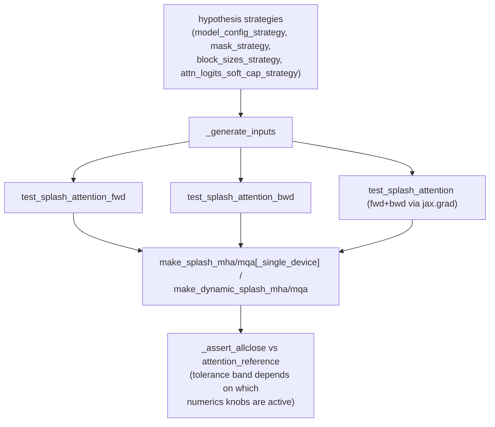

# maxdiffusion/kernels/splash_attention/splash_attention_kernel_test — property-based correctness suite (and its numerical-tolerance map)

<!-- connect:up:begin -->
> **Cross-repo concept:** part of [splash-attention](../../../concepts/splash-attention.md) across this wiki's repos.
<!-- connect:up:end -->
## Overview
This is the `hypothesis`-driven property-based test suite validating [`splash_attention_kernel`](maxdiffusion-kernels-splash_attention-splash_attention_kernel.md) against a plain-JAX reference implementation across a combinatorial space of MQA/MHA, segment ids, static/dynamic masks, and — most informative for TPU-perf work — every numerically-sensitive config knob (`use_base2_exp`, `fuse_reciprocal`, `max_logit` estimation mode, attention sinks). The test suite's per-config tolerance bands are effectively a map of which performance optimizations cost numerical precision, and by how much.

## Diagram

## Design rationale (why it's built this way)
- **Property-based generation (not fixed test cases) covers the huge SplashAttention config surface.** `hypothesis` strategies (`model_config_strategy`, `mask_strategy`, `block_sizes_strategy`) generate random-but-valid `(q_seq_len, kv_seq_len, num_heads, block sizes, mask shape)` combinations, and `@parameterized.product` cross-multiplies the boolean/enum axes (`is_mqa`, `is_segmented`, `is_dynamic_mask`, `use_base2_exp`, `use_max_logit_estimate`, `fuse_reciprocal`, `use_sinks`) — a fixed-example test suite would need to hand-write an impractical number of cases to reach the same coverage.
- **Tolerance bands are tuned per numerics configuration, not uniform** — [`test_splash_attention_fwd`](../catalog/src/maxdiffusion/kernels/splash_attention/splash_attention_kernel_test.md#SplashAttentionTest.test_splash_attention_fwd) picks a *looser* `o_tol`/`lse_tol` specifically when `use_sinks` is true (`atol=8e-2, rtol=1e-1` vs. the tightest `atol=4e-3, rtol=3e-3` baseline), and a middle-tier tolerance when `use_base2_exp`, a non-`None` `use_max_logit_estimate`, or `not fuse_reciprocal` is active — this is a direct, executable record of which speed-oriented numerics options (base-2 exponentials, precomputed max-logit shortcuts, deferred reciprocal) are expected to diverge from a float32 reference, and roughly by how much.

## Entry points
- [`test_splash_attention`](../catalog/src/maxdiffusion/kernels/splash_attention/splash_attention_kernel_test.md#SplashAttentionTest.test_splash_attention) — end-to-end forward-value check across `is_mqa`/`is_segmented`/`is_dynamic_mask`, comparing the kernel's output directly against [`attention_reference`](../catalog/src/maxdiffusion/kernels/splash_attention/base.md#attention_reference) via [`_assert_allclose`](../catalog/src/maxdiffusion/kernels/splash_attention/splash_attention_test_utils.md#SplashAttentionTestCase._assert_allclose).
- [`test_splash_attention_fwd`](../catalog/src/maxdiffusion/kernels/splash_attention/splash_attention_kernel_test.md#SplashAttentionTest.test_splash_attention_fwd) — the numerics-focused forward test; additionally checks the residual statistics (`logsumexp`, `max_logits`) match the reference, across every combination of `use_base2_exp`/`use_max_logit_estimate`/`fuse_reciprocal`/`use_sinks`.
- [`test_splash_attention_bwd`](../catalog/src/maxdiffusion/kernels/splash_attention/splash_attention_kernel_test.md#SplashAttentionTest.test_splash_attention_bwd) — gradient-correctness check across the same `is_mqa`/`is_segmented`/`is_dynamic_mask` axes plus `use_max_logit_estimate` and `dq_reduction_steps` (`None` or `3`, matching [`SplashConfig.dq_reduction_steps`](maxdiffusion-kernels-splash_attention-splash_attention_kernel.md)'s only two supported values).

## Mechanism (step-by-step)
1. [`_generate_inputs`](../catalog/src/maxdiffusion/kernels/splash_attention/splash_attention_kernel_test.md#_generate_inputs) draws Q/K/V (and optional attention-sink) arrays sized by a drawn `ModelConfig`'s `q_seq_len`/`kv_seq_len`, plus segment ids when `is_segmented`; it is the single input-generation path shared by all three test entry points.
2. [`test_splash_attention`](../catalog/src/maxdiffusion/kernels/splash_attention/splash_attention_kernel_test.md#SplashAttentionTest.test_splash_attention) draws a mask via `mask_strategy`, skips a known bad combination (`hp.assume(not (num_q_heads == 1 and isinstance(mask_obj, RandomMask)))` — the test's own comment: "Skip edge case: single attention head + random mask triggers JAX/Mosaic compilation bug"), then dispatches to one of four kernel-construction functions ([`make_splash_mha_single_device`](../catalog/src/maxdiffusion/kernels/splash_attention/splash_attention_kernel.md#make_splash_mha_single_device) / `make_splash_mqa_single_device` for static masks, [`make_dynamic_splash_mha`](../catalog/src/maxdiffusion/kernels/splash_attention/splash_attention_kernel.md#make_dynamic_splash_mha) / [`make_dynamic_splash_mqa`](../catalog/src/maxdiffusion/kernels/splash_attention/splash_attention_kernel.md#make_dynamic_splash_mqa) for dynamic ones) selected by the `is_mqa`/`is_dynamic_mask` combination.
3. Both [`test_splash_attention`](../catalog/src/maxdiffusion/kernels/splash_attention/splash_attention_kernel_test.md#SplashAttentionTest.test_splash_attention) and [`test_splash_attention_fwd`](../catalog/src/maxdiffusion/kernels/splash_attention/splash_attention_kernel_test.md#SplashAttentionTest.test_splash_attention_fwd) call [`check_mask_no_empty_rows`](../catalog/src/maxdiffusion/kernels/splash_attention/splash_attention_kernel_test.md#check_mask_no_empty_rows) before running the kernel — a precondition check mirroring `SegmentIds`' own documented invariant (an all-zero KV row would make the softmax denominator zero).
4. [`test_splash_attention_fwd`](../catalog/src/maxdiffusion/kernels/splash_attention/splash_attention_kernel_test.md#SplashAttentionTest.test_splash_attention_fwd) constructs the kernel with `save_residuals=True` so it can additionally compare `stats["logsumexp"]`/`stats["max_logits"]` against [`attention_reference`](../catalog/src/maxdiffusion/kernels/splash_attention/base.md#attention_reference)'s own residuals — selecting the tolerance band described in Design rationale based on which numerics knobs are active for this parameterization.
5. [`test_splash_attention_bwd`](../catalog/src/maxdiffusion/kernels/splash_attention/splash_attention_kernel_test.md#SplashAttentionTest.test_splash_attention_bwd) additionally parameterizes over `dq_reduction_steps`, directly exercising both the default (all-steps, no in-kernel reduction) and the `3`-step fused-reduction path that [`SplashConfig`](maxdiffusion-kernels-splash_attention-splash_attention_kernel.md)'s `dq_reduction_steps` field gates.

## Key data structures
- [`attention_reference`](../catalog/src/maxdiffusion/kernels/splash_attention/base.md#attention_reference) — imported from `base` (visible in source as `base.attention_reference`), the plain-JAX ground-truth attention implementation every kernel variant is checked against; it accepts the same `mask`/`segment_ids`/`sinks`/`attn_logits_soft_cap` arguments so a like-for-like comparison is possible regardless of which kernel construction path produced the output under test.
- [`_assert_allclose`](../catalog/src/maxdiffusion/kernels/splash_attention/splash_attention_test_utils.md#SplashAttentionTestCase._assert_allclose) — the shared numeric-comparison helper every test funnels its final assertions through, taking explicit `atol`/`rtol` per call site so each test can express its own tolerance policy.

## Dynamics (design intent)
> [!inferred] Reading the three tests' shared structure (same `_generate_inputs`, same mask/config strategies, same kernel-selection branching) together with their differing focus (fwd values only / fwd values + residual stats / gradients), this suite is designed so a change to any single numerics knob in `SplashConfig` gets exercised at three different levels of the computation — output values, saved softmax statistics, and gradients — rather than relying on end-to-end output matching alone to catch a regression in, say, the backward-pass-specific dQ-reduction logic.

## Edge cases
- The skipped combination in [`test_splash_attention`](../catalog/src/maxdiffusion/kernels/splash_attention/splash_attention_kernel_test.md#SplashAttentionTest.test_splash_attention) (single attention head + `RandomMask`) is a documented compiler bug workaround, not a fundamental limitation of the kernel itself — the test's own comment attributes it to "a JAX/Mosaic compilation bug."
- [`test_splash_attention_fwd`](../catalog/src/maxdiffusion/kernels/splash_attention/splash_attention_kernel_test.md#SplashAttentionTest.test_splash_attention_fwd) only checks `stats["max_logits"]` against the reference when `use_max_logit_estimate is None` — when a max-logit estimate (const or supplied value) is used instead of the kernel's own computed max, there is no "correct" max-logit for the kernel to reproduce, so that particular check is skipped rather than compared against a mismatched reference.

## Open questions
> [!inferred] Whether these tests run against real TPU hardware in CI or exclusively via Pallas's interpret mode (`config.interpret=self.INTERPRET`, with `INTERPRET` presumably a class-level flag not itself in this packet's cited subgraph) is not resolvable from this packet alone.

## See also
- [maxdiffusion/kernels/splash_attention/splash_attention_kernel](maxdiffusion-kernels-splash_attention-splash_attention_kernel.md) — the kernel implementation this suite validates, including the `SplashConfig` numerics flags whose tolerance impact this suite documents empirically.
- [maxdiffusion/kernels/splash_attention/splash_attention_mask](maxdiffusion-kernels-splash_attention-splash_attention_mask.md) — the mask classes (`RandomMask`, `CausalMask`, etc.) this suite's `mask_strategy` draws from.
