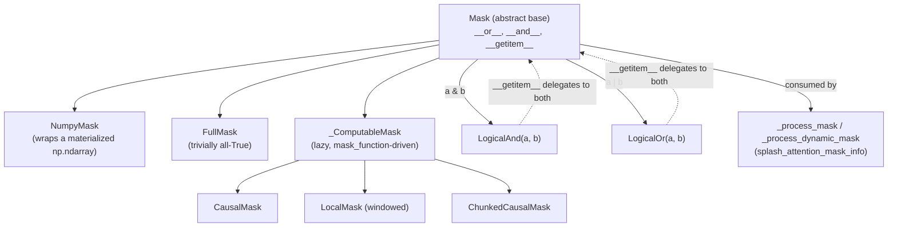

# maxdiffusion/kernels/splash_attention/splash_attention_mask — lazy, composable attention masks

## Overview
The logical mask layer splash attention is built on: a [`Mask`](../catalog/src/maxdiffusion/kernels/splash_attention/splash_attention_mask.md#Mask) base class supporting `&`/`|` composition, concrete materialized variants ([`NumpyMask`](../catalog/src/maxdiffusion/kernels/splash_attention/splash_attention_mask.md#Mask), [`FullMask`](../catalog/src/maxdiffusion/kernels/splash_attention/splash_attention_mask.md#FullMask)), and — the design centerpiece — [`_ComputableMask`](../catalog/src/maxdiffusion/kernels/splash_attention/splash_attention_mask.md#_ComputableMask) (parent of [`CausalMask`](../catalog/src/maxdiffusion/kernels/splash_attention/splash_attention_mask.md#CausalMask), [`LocalMask`](../catalog/src/maxdiffusion/kernels/splash_attention/splash_attention_mask.md#LocalMask), [`ChunkedCausalMask`](../catalog/src/maxdiffusion/kernels/splash_attention/splash_attention_mask.md#ChunkedCausalMask)), which never materializes the full `(q_seq_len, kv_seq_len)` boolean array — it evaluates a `mask_function` closure per-block on demand, specifically to avoid an O(seq_len²) memory cost that would be prohibitive for the long video/sequence lengths this codebase targets.

## Diagram

## Design rationale (why it's built this way)
- **Lazy masks exist to avoid materializing an O(seq_len²) array.** [`_ComputableMask`](../catalog/src/maxdiffusion/kernels/splash_attention/splash_attention_mask.md#_ComputableMask)'s own docstring is explicit: it "allows the mask logic to be computed on-the-fly or fused into the attention kernel, avoiding the memory cost of materializing the full (sequence_length, sequence_length) boolean mask array, which can be excessive for long sequences." This is the mechanism that makes causal/local/chunked masking practical at the sequence lengths MaxDiffusion's video models use.
- **`&`/`|` composition on the base [`Mask`](../catalog/src/maxdiffusion/kernels/splash_attention/splash_attention_mask.md#Mask) class, not `and`/`or`,** is enforced deliberately: `Mask.__bool__` raises `NotImplementedError` with the message "Conversion to bool is unsupported. Could be caused by using logical instead of bitwise operations on masks" — a defensive guard against a caller accidentally writing `mask_a and mask_b` (which Python would resolve via `__bool__`, silently doing the wrong thing) instead of `mask_a & mask_b`.
- **`q_sequence` is cached once per `_ComputableMask` instance and reused across every `__getitem__` call**, per its docstring ("q_sequence is reused across `__getitem__` calls which is important for compile-time performance") — recomputing `np.arange` on every block query would otherwise add per-block Python/NumPy overhead during mask preprocessing.

## Entry points
- [`Mask.__getitem__`](../catalog/src/maxdiffusion/kernels/splash_attention/splash_attention_mask.md#Mask) — the uniform interface every mask subclass implements; [`_process_mask`](../catalog/src/maxdiffusion/kernels/splash_attention/splash_attention_mask_info.md#_process_mask) (in the sibling `splash_attention_mask_info` module) calls this to pull out one block's boolean content at a time when building the sparse mask representation the Pallas kernel consumes (see [splash_attention_mask_info](maxdiffusion-kernels-splash_attention-splash_attention_mask_info.md)).
- [`Mask.shape`](../catalog/src/maxdiffusion/kernels/splash_attention/splash_attention_mask.md#Mask) — every composed/lazy mask must report a consistent `(q_seq_len, kv_seq_len)`; `__or__`/`__and__` raise `ValueError` on shape mismatch before ever constructing the composed mask.

## Mechanism (step-by-step)
1. [`Mask.__or__`](../catalog/src/maxdiffusion/kernels/splash_attention/splash_attention_mask.md#Mask) and [`Mask.__and__`](../catalog/src/maxdiffusion/kernels/splash_attention/splash_attention_mask.md#Mask) validate `self.shape == other.shape` then wrap both operands in a `LogicalOr`/`LogicalAnd` node (visible in source, not itself in this packet's cited subgraph beyond the base class) — composition is structural (a small tree of mask objects), not eager evaluation; the actual boolean result for any given block is only computed when that composed mask is sliced.
2. [`_ComputableMask.__init__`](../catalog/src/maxdiffusion/kernels/splash_attention/splash_attention_mask.md#_ComputableMask) validates `q_seq_len % (shard_count * shard_count) == 0` (raising `ValueError` otherwise) — this is a sharding-compatibility precondition, ensuring a computable mask can later be evenly split across `shard_count` device shards on both the Q and (implicitly, via the squared term) the ring/Ulysses hybrid decomposition.
3. [`_ComputableMask.__getitem__`](../catalog/src/maxdiffusion/kernels/splash_attention/splash_attention_mask.md#_ComputableMask) only accepts a 2-tuple of `slice` objects (raising `NotImplementedError` for anything else), then evaluates its `mask_function` closure over the requested `(q_slice, kv_slice)` block using the cached `q_sequence` — this is the actual "lazy" evaluation point: nothing is computed until a specific block is requested, and [`CausalMask`](../catalog/src/maxdiffusion/kernels/splash_attention/splash_attention_mask.md#CausalMask)/[`LocalMask`](../catalog/src/maxdiffusion/kernels/splash_attention/splash_attention_mask.md#LocalMask)/[`ChunkedCausalMask`](../catalog/src/maxdiffusion/kernels/splash_attention/splash_attention_mask.md#ChunkedCausalMask) each supply a different `mask_function` implementing their respective boolean predicate.
4. Concrete materialized masks — [`NumpyMask`](../catalog/src/maxdiffusion/kernels/splash_attention/splash_attention_mask.md#Mask) (wrapping a real `np.ndarray`, presumably produced by one of the sibling `make_causal_mask`/`make_local_attention_mask`/`make_chunk_attention_mask`/`make_random_mask` helpers visible in source) and [`FullMask`](../catalog/src/maxdiffusion/kernels/splash_attention/splash_attention_mask.md#FullMask) (trivially all-True) — implement `__getitem__` as a plain array slice rather than a function evaluation, since their content already exists in memory.
5. Whichever mask a caller builds — composed, lazy, or materialized — flows into [`_process_mask`](../catalog/src/maxdiffusion/kernels/splash_attention/splash_attention_mask_info.md#_process_mask) (or its dynamic-mask counterpart, visible in source but outside this packet's cited subgraph), which slices it block-by-block via `__getitem__` to build the sparse mask representation the Pallas kernel actually consumes.

## Key data structures
- [`Mask`](../catalog/src/maxdiffusion/kernels/splash_attention/splash_attention_mask.md#Mask) — abstract base; its docstring is simply "A base class for splash attention masks," with `shape`/`__getitem__` as `NotImplementedError`-raising abstract members subclasses must fill in.
- [`_ComputableMask`](../catalog/src/maxdiffusion/kernels/splash_attention/splash_attention_mask.md#_ComputableMask) — holds `_shape`, the cached `q_sequence` array, and a `mask_function` callable; its docstring notes `offset` semantics generically shared by its causal-family subclasses ("A positive offset shifts the bottom triangle upward, a negative one shifts it downward. A negative offset makes the first 'offset' rows of the attention matrix all 0s which leads to undefined softmax").

## Dynamics (design intent)
> [!inferred] The shard-count-squared divisibility check in `_ComputableMask.__init__` (`q_seq_len % (shard_count * shard_count) != 0`) suggests this mask class is designed with the 2D Ulysses+ring hybrid decomposition in mind (see [maxdiffusion/common_types](maxdiffusion-common_types.md)'s `ULYSSES_RING_ATTENTION_AXIS_RULES`, whose comment describes the physical `context` axis being privately reshaped into two hidden sub-axes) — a single `shard_count` parameter implicitly reserving room for a two-factor split of the sequence dimension, not just a single flat one.

## Edge cases
- [`Mask.__bool__`](../catalog/src/maxdiffusion/kernels/splash_attention/splash_attention_mask.md#Mask) unconditionally raises — any code path that implicitly coerces a `Mask` to bool (e.g. `if mask:`, or Python's short-circuit `and`/`or`) fails loudly rather than producing a wrong-but-silent result.
- [`_ComputableMask.__getitem__`](../catalog/src/maxdiffusion/kernels/splash_attention/splash_attention_mask.md#_ComputableMask) rejects any index that isn't exactly a 2-tuple of `slice`s — fancy/boolean/integer indexing on a lazy mask is unsupported by design, not merely unimplemented as an oversight (the base `Mask.__getitem__` is likewise `NotImplementedError` until a subclass defines it).

## Open questions
> [!inferred] Whether `LogicalAnd`/`LogicalOr` compose correctly with `_ComputableMask` operands specifically (i.e. whether their `__getitem__` delegation preserves the "never materialize the full array" property, or forces a materialization at composition time) is not resolvable from this packet's cited subgraph alone, since those two composition classes are only referenced here as return types of `Mask.__or__`/`__and__`, not deeply cited themselves.

## See also
- [maxdiffusion/kernels/splash_attention/splash_attention_mask_info](maxdiffusion-kernels-splash_attention-splash_attention_mask_info.md) — consumes these mask objects via `__getitem__` to build the sparse `MaskInfo` the kernel actually runs against.
- [maxdiffusion/kernels/splash_attention/splash_attention_kernel](maxdiffusion-kernels-splash_attention-splash_attention_kernel.md) — the Pallas kernel whose dynamic grid is ultimately shaped by these masks' sparsity.
- [maxdiffusion/common_types](maxdiffusion-common_types.md) — the axis-rule presets (ring/Ulysses/sequence-parallel) that determine how a sharded mask's `shard_count` relates to the physical mesh.
