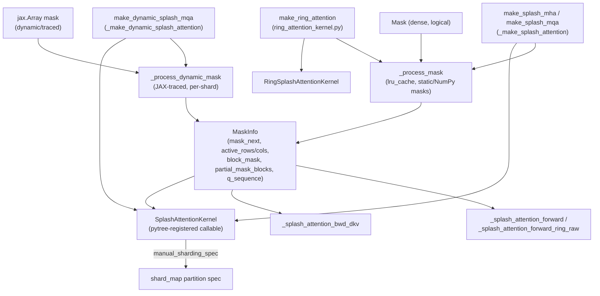

# maxdiffusion/kernels/splash_attention/splash_attention_mask_info — dense-mask-to-sparse-block precomputation

<!-- connect:up:begin -->
> **Cross-repo concept:** part of [sparsecore](../../../concepts/sparsecore.md), [splash-attention](../../../concepts/splash-attention.md) across this wiki's repos.
<!-- connect:up:end -->
## Overview
This module converts a dense boolean attention [`Mask`](../catalog/src/maxdiffusion/kernels/splash_attention/splash_attention_mask.md#Mask) into the compact [`MaskInfo`](../catalog/src/maxdiffusion/kernels/splash_attention/splash_attention_mask_info.md#MaskInfo) representation the splash-attention Pallas kernel actually consumes to build its sparsity-driven grid — which (query-block, kv-block) pairs are fully active, fully empty (skippable), or partially masked, packed into TPU-scalar-memory-friendly integer arrays. It is the layer between the user-facing mask abstractions ([`Mask`](../catalog/src/maxdiffusion/kernels/splash_attention/splash_attention_mask.md#Mask)/[`NumpyMask`](../catalog/src/maxdiffusion/kernels/splash_attention/splash_attention_mask.md#Mask) etc.) and every kernel entry point in [splash_attention_kernel](maxdiffusion-kernels-splash_attention-splash_attention_kernel.md) that takes a `MaskInfo` argument.

## Diagram

## Design rationale (why it's built this way)
- **Precomputing sparsity once, outside the kernel, is what makes "splash" (sparse flash) attention cheaper than dense flash attention.** [`_process_mask`](../catalog/src/maxdiffusion/kernels/splash_attention/splash_attention_mask_info.md#_process_mask)'s own docstring states its purpose plainly: "Transform a dense mask into a sparse representation." Doing this analysis once at kernel-construction time (not per training step) means the actual Pallas kernel only ever needs to loop over active blocks.
- **`@functools.lru_cache(maxsize=12)` on `_process_mask` exists because the same mask recurs across every transformer layer.** The comment directly above it: "When used in a transformer network with multiple layers, the SplashAttention kernel is created several times with the same mask. Cache MaskInfo to avoid blowing up compile times." Without the cache, an N-layer transformer with a shared causal mask would redo the identical sparse-block analysis N times.
- **SMEM data is downcast to the smallest sufficient integer type** because, per [`MaskInfo`](../catalog/src/maxdiffusion/kernels/splash_attention/splash_attention_mask_info.md#MaskInfo)'s own docstring, "The arrays, `mask_next` and `block_mask`, are placed in TPU scalar-memory. This is a scarce resource so the mask creation logic attempts to shrink the data-type of these arrays to the smallest possible one" — `int8`/`int16`/`int32`, chosen by the actual maximum value present, since SMEM capacity is a hard TPU resource constraint, not merely a memory-bandwidth optimization.
- **A dynamic-grid variant exists alongside the static one** because a mask that is only known at trace time (e.g. a runtime-computed sparsity pattern) can't go through the same NumPy-side, `lru_cache`-able static path — [`_process_dynamic_mask`](../catalog/src/maxdiffusion/kernels/splash_attention/splash_attention_mask_info.md#_process_dynamic_mask) reimplements the same any/all-block-reduction logic using `jnp` ops so it can run inside a trace, at the cost of losing the cross-layer cache.

## Entry points
- [`_process_mask`](../catalog/src/maxdiffusion/kernels/splash_attention/splash_attention_mask_info.md#_process_mask) — the static (NumPy-mask, cacheable) entry point; called from [`_make_splash_attention`](../catalog/src/maxdiffusion/kernels/splash_attention/splash_attention_kernel.md#_make_splash_attention) (via its `make_splash_mha`/`make_splash_mqa` public aliases) and from [`make_ring_attention`](../catalog/src/maxdiffusion/kernels/splash_attention/ring_attention_kernel.md#make_ring_attention).
- [`MaskInfo`](../catalog/src/maxdiffusion/kernels/splash_attention/splash_attention_mask_info.md#MaskInfo) — the `NamedTuple` every kernel-side consumer ([`_splash_attention_forward`](../catalog/src/maxdiffusion/kernels/splash_attention/splash_attention_kernel.md#_splash_attention_forward), [`_splash_attention_forward_ring_raw`](../catalog/src/maxdiffusion/kernels/splash_attention/splash_attention_kernel.md#_splash_attention_forward_ring_raw), [`_splash_attention_bwd_dkv`](../catalog/src/maxdiffusion/kernels/splash_attention/splash_attention_kernel.md#_splash_attention_bwd_dkv)) takes as an argument.
- [`SplashAttentionKernel.manual_sharding_spec`](../catalog/src/maxdiffusion/kernels/splash_attention/splash_attention_kernel.md#SplashAttentionKernel.manual_sharding_spec) / [`RingSplashAttentionKernel.manual_sharding_spec`](../catalog/src/maxdiffusion/kernels/splash_attention/ring_attention_kernel.md#RingSplashAttentionKernel.manual_sharding_spec) — the entry point a caller uses to get a `shard_map`-compatible partition spec matching a `MaskInfo`'s actual field shapes, needed because `MaskInfo`'s fields are only sometimes present (`None` for fields not computed in a given mode).

## Mechanism (step-by-step)
1. [`_process_mask`](../catalog/src/maxdiffusion/kernels/splash_attention/splash_attention_mask_info.md#_process_mask) validates the mask is 2-D and that `block_shape` evenly divides both the Q and KV sequence lengths, then (in the part of its body outside this packet's cited subgraph) tiles the dense mask into `(block_q, block_kv)`-shaped blocks and classifies each as empty/full/partial.
2. Each classified block becomes one entry in [`block_mask`](../catalog/src/maxdiffusion/kernels/splash_attention/splash_attention_mask_info.md#MaskInfo.block_mask); per its docstring, a value of 1 means the corresponding block is full and 2 means it is partially masked (an empty block simply isn't included among the active entries at all) — only [`num_active_blocks`](../catalog/src/maxdiffusion/kernels/splash_attention/splash_attention_mask_info.md#MaskInfo) worth of entries exist, not one per block in the whole dense mask.
3. Partial (mixed) blocks additionally need their actual per-element boolean content, which is what [`partial_mask_blocks`](../catalog/src/maxdiffusion/kernels/splash_attention/splash_attention_mask_info.md#MaskInfo.partial_mask_blocks) stores — an `int8[num_partial_blocks, block_q, block_kv]` array, with [`mask_next`](../catalog/src/maxdiffusion/kernels/splash_attention/splash_attention_mask_info.md#MaskInfo.mask_next) (one entry per active block) pointing to the row in `partial_mask_blocks` the kernel should prefetch for that block, if any.
4. [`_downcast_to_small_type`](../catalog/src/maxdiffusion/kernels/splash_attention/splash_attention_mask_info.md#_downcast_to_small_type) shrinks a validated (non-negative, `int32`) array to `int8` or `int16` when its maximum value fits — applied to the SMEM-resident `mask_next`/`block_mask` arrays specifically, per the design-rationale note above.
5. For the dynamic (trace-time) path, [`_process_dynamic_mask`](../catalog/src/maxdiffusion/kernels/splash_attention/splash_attention_mask_info.md#_process_dynamic_mask) reshapes the mask into `(q_blocks, block_q, kv_blocks, block_kv)` tiles, computes `any_mask`/`all_mask` reductions per tile (`block_mask = any_mask + all_mask`), and — for the dKV direction specifically — force-activates the first column of any row that would otherwise be entirely inactive ("If an entire row is masked then that kv output tile won't be visited. We extend the grid to visit these tiles to initialize them," per the inline comment), ensuring every dK/dV output tile gets written even when its corresponding forward-attention row contributed nothing.
6. [`_make_splash_attention`](../catalog/src/maxdiffusion/kernels/splash_attention/splash_attention_kernel.md#_make_splash_attention) (aliased as `make_splash_mha`/`make_splash_mqa`) wraps a NumPy/[`Mask`](../catalog/src/maxdiffusion/kernels/splash_attention/splash_attention_mask.md#Mask) input in [`NumpyMask`](../catalog/src/maxdiffusion/kernels/splash_attention/splash_attention_mask.md#Mask) if needed, calls [`_process_mask`](../catalog/src/maxdiffusion/kernels/splash_attention/splash_attention_mask_info.md#_process_mask) once for the forward direction and again (with the dKV-specific block shape) for the backward direction when `config.has_backward_blocks`, computes each direction's mask *sparsity ratio* (`np.mean(block_mask != 0)`) for cost-estimation purposes, and packages both `MaskInfo`s plus every other kernel config into one [`SplashAttentionKernel`](../catalog/src/maxdiffusion/kernels/splash_attention/splash_attention_kernel.md#SplashAttentionKernel.manual_sharding_spec) instance — a single callable object a model can invoke directly as `kernel(q, k, v, ...)`.
7. [`make_ring_attention`](../catalog/src/maxdiffusion/kernels/splash_attention/ring_attention_kernel.md#make_ring_attention) — its own docstring: "Creates a RingSplashAttentionKernel" — follows the same `_process_mask` precomputation but returns a `RingSplashAttentionKernel` parameterized by a `ring_axis` mesh-axis name; its [`manual_sharding_spec`](../catalog/src/maxdiffusion/kernels/splash_attention/ring_attention_kernel.md#RingSplashAttentionKernel.manual_sharding_spec) states directly in its docstring that "Ring attention expects MaskInfo to be sharded by `q_seq_shards`" — the mask sparsity structure itself must be split across the ring's device axis, matching how Q is split.

## Key data structures
- [`MaskInfo`](../catalog/src/maxdiffusion/kernels/splash_attention/splash_attention_mask_info.md#MaskInfo) — the `NamedTuple` of [`mask_next`](../catalog/src/maxdiffusion/kernels/splash_attention/splash_attention_mask_info.md#MaskInfo.mask_next), `active_rows`/`active_cols`, [`block_mask`](../catalog/src/maxdiffusion/kernels/splash_attention/splash_attention_mask_info.md#MaskInfo.block_mask), `num_active_blocks`, [`partial_mask_blocks`](../catalog/src/maxdiffusion/kernels/splash_attention/splash_attention_mask_info.md#MaskInfo.partial_mask_blocks), and `q_sequence` (only populated for causal masks, holding the per-token Q index sequence).
- [`SplashAttentionKernel`](../catalog/src/maxdiffusion/kernels/splash_attention/splash_attention_kernel.md#SplashAttentionKernel.manual_sharding_spec) — a `jax.tree_util.register_pytree_node_class`-registered callable wrapping a forward `MaskInfo`, an optional dKV `MaskInfo`, and every other kernel config as closed-over kwargs; being pytree-registered is what lets it pass through `jax.jit`/`shard_map` boundaries as an ordinary argument despite holding precomputed NumPy/JAX arrays.

## Dynamics (design intent)
> [!inferred] The forward and backward (dKV) directions get **independently computed** `MaskInfo`s (different block shapes, and the dKV path additionally force-activates otherwise-empty rows) — this means the sparsity ratio, and therefore how much of the compute the dynamic grid skips, can differ meaningfully between the forward and backward passes of the same logical mask, which is why [`_make_splash_attention`](../catalog/src/maxdiffusion/kernels/splash_attention/splash_attention_kernel.md#_make_splash_attention) tracks `fwd_mask_sparsity` and `dkv_mask_sparsity` as two separate numbers rather than one.

## Edge cases
- The static-path [`MaskInfo`](../catalog/src/maxdiffusion/kernels/splash_attention/splash_attention_mask_info.md#MaskInfo) docstring states `block_mask` values are "1 means... full and 2 means... partially masked," but the traced [`_process_dynamic_mask`](../catalog/src/maxdiffusion/kernels/splash_attention/splash_attention_mask_info.md#_process_dynamic_mask) computes `block_mask = any_mask + all_mask`, which yields `2` for a fully-active block (`any=1, all=1`) and `1` for a partially-active block (`any=1, all=0`) — matching the docstring only if "full" and "partial" are read in the opposite sense from a first glance at the formula; readers should verify the exact convention against the kernel body that consumes `block_mask` rather than assuming from the arithmetic alone.
- `_check_mask` (visible in source, not itself in this packet's cited subgraph) explicitly checks for all-zero rows along the KV dimension and raises `ValueError` — an invalid mask (one that would zero out an entire softmax denominator) is caught at mask-processing time, not left to surface as a silent NaN later.

## Open questions
> [!inferred] Whether `_HashableNDArray` (visible in source, wrapping a NumPy array with a `tobytes()`-based hash for use in associative containers) is used specifically to make masks cacheable in `_process_mask`'s `lru_cache`, or serves some other deduplication purpose in a part of the file outside this packet's cited subgraph, isn't resolvable from this packet alone.

## See also
- [maxdiffusion/kernels/splash_attention/splash_attention_kernel](maxdiffusion-kernels-splash_attention-splash_attention_kernel.md) — every kernel-side consumer of the `MaskInfo` this module produces, including the ring-attention-specific raw-accumulator forward path.
- [maxdiffusion/kernels/splash_attention/splash_attention_mask](maxdiffusion-kernels-splash_attention-splash_attention_mask.md) — the logical `Mask` abstractions (`FullMask`, `NumpyMask`, `_ComputableMask`, etc.) that `_process_mask`/`_process_dynamic_mask` consume as input.
