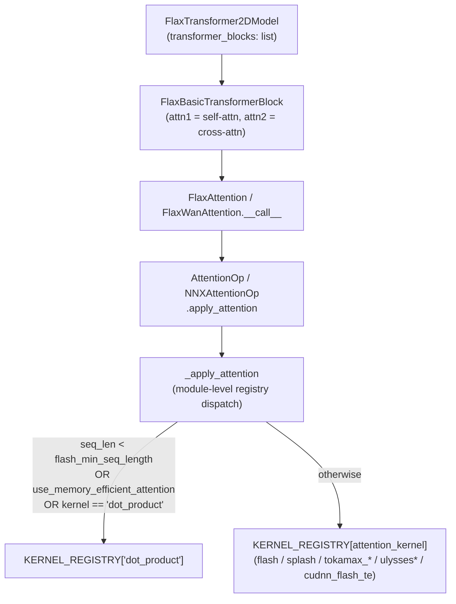

# maxdiffusion/models/attention_flax — attention-kernel registry and transformer blocks

## Overview
This is MaxDiffusion's central attention module: a module-level `KERNEL_REGISTRY`-based dispatcher (`_apply_attention`) that routes to one of many interchangeable attention implementations — dense dot-product, TPU Pallas flash attention, splash attention, Ulysses/ring sequence-parallel variants, an NVIDIA cuDNN fused kernel, and "tokamax"-prefixed variants — selected by a single `attention_kernel` string, plus the `FlaxAttention`/`FlaxWanAttention`/`FlaxTransformer2DModel`/`FlaxBasicTransformerBlock` layers that use it. Which kernel actually executes depends not just on the requested string but on the input sequence length and whether the call site is self- or cross-attention.

## Diagram

## Design rationale (why it's built this way)
- **A module-level registry (not an if/elif chain) is what lets new attention kernels be added without touching the dispatch function.** [`_apply_attention`](../catalog/src/maxdiffusion/models/attention_flax.md#NNXAttentionOp.apply_attention)'s own docstring: "Routes to different attention kernels using a module-level registry" — every kernel implementation registers itself once under a string key, and dispatch is a single dict lookup plus a fallback rule.
- **The `dot_product` fallback is unconditional and takes priority over the requested kernel** whenever the sequence is shorter than `flash_min_seq_length`, `use_memory_efficient_attention` is set, or the kernel is explicitly `"dot_product"` — this mirrors the same short-sequence-skips-flash pattern seen in [maxdiffusion/models/embeddings_flax](maxdiffusion-models-embeddings_flax.md)'s `NNXWanImageEmbedding`: below some sequence-length threshold, the fixed overhead of a specialized flash/splash kernel isn't worth paying, so the plain dense op is faster in practice.
- **Ring/Ulysses-family kernels are automatically demoted to their non-ring/non-Ulysses form for cross-attention**, since (as seen directly in [`FlaxWanAttention`](../catalog/src/maxdiffusion/models/attention_flax.md#FlaxWanAttention.__call__)'s constructor, visible in source) ring and Ulysses attention parallelism only make sense when *both* Q and KV are the same long, sequence-sharded tensor — cross-attention's KV comes from a differently-shaped/sharded source (e.g. a text encoder), so the sequence-parallel communication pattern those kernels implement doesn't apply.
- **TPU-generation-aware alignment recurs here** (as in `embeddings_flax`): `FlaxWanAttention`'s constructor (visible in source) sets `alignment = 256` on `TPU_V6_LITE`/`TPU_7X` and `128` otherwise via `get_tpu_type()` — the same hardware-tiling-preference encoding reused across this codebase's flash-attention-adjacent modules.

## Entry points
- [`FlaxWanAttention.__call__`](../catalog/src/maxdiffusion/models/attention_flax.md#FlaxWanAttention.__call__) — the Wan-model attention forward pass; projects [`query`](../catalog/src/maxdiffusion/models/attention_flax.md#FlaxWanAttention.query)/`key`/`value`, applies optional [`qk_norm`](../catalog/src/maxdiffusion/models/attention_flax.md#FlaxWanAttention.qk_norm)-gated [`norm_k`](../catalog/src/maxdiffusion/models/attention_flax.md#FlaxWanAttention.norm_k)/[`norm_added_k`](../catalog/src/maxdiffusion/models/attention_flax.md#FlaxWanAttention.norm_added_k), and calls [`self.attention_op.apply_attention`](../catalog/src/maxdiffusion/models/attention_flax.md#NNXAttentionOp.apply_attention) — wrapped in [`conditional_named_scope`](../catalog/src/maxdiffusion/models/attention_flax.md#FlaxWanAttention.conditional_named_scope) for optional profiler-visible named regions.
- [`NNXAttentionOp.apply_attention`](../catalog/src/maxdiffusion/models/attention_flax.md#NNXAttentionOp.apply_attention) — the thin wrapper every attention layer calls, which forwards straight to the module-level [`_apply_attention`](../catalog/src/maxdiffusion/models/attention_flax.md#NNXAttentionOp.apply_attention) dispatcher along with every context field (`heads`, `mesh`, axis names, `flash_block_sizes`, numerics flags).
- [`FlaxTransformer2DModel.transformer_blocks`](../catalog/src/maxdiffusion/models/attention_flax.md#FlaxTransformer2DModel.transformer_blocks) — the list of [`FlaxBasicTransformerBlock`](../catalog/src/maxdiffusion/models/attention_flax.md#FlaxBasicTransformerBlock.attn1) instances forming a UNet-style spatial transformer's depth; each block is constructed with the same `attention_kernel`/`flash_block_sizes`/`mesh`/`quant` configuration passed down uniformly.

## Mechanism (step-by-step)
1. [`FlaxWanAttention.__call__`](../catalog/src/maxdiffusion/models/attention_flax.md#FlaxWanAttention.__call__) computes `query`/`key`/`value` projections, optionally merges an image-conditioning KV via `added_kv_proj_dim`/`image_seq_len` (I2V support), and calls [`apply_attention`](../catalog/src/maxdiffusion/models/attention_flax.md#NNXAttentionOp.apply_attention) on `self.attention_op` before reshaping the result via `_unflatten_heads`.
2. [`NNXAttentionOp.apply_attention`](../catalog/src/maxdiffusion/models/attention_flax.md#NNXAttentionOp.apply_attention) packages every stored config field into a call to the module-level `_apply_attention`, which (per its own docstring) is the single routing point for every attention call in this file regardless of which higher-level layer (`FlaxAttention`, `FlaxWanAttention`, or a model-specific attention class in a sibling module) invoked it.
3. The module-level `_apply_attention` that [`NNXAttentionOp.apply_attention`](../catalog/src/maxdiffusion/models/attention_flax.md#NNXAttentionOp.apply_attention) calls into (visible in source) first checks `can_use_flash_attention` — true only if every one of query/key/value's sequence-length dimension is `>= flash_min_seq_length` and `attention_kernel` is one of the flash/Ulysses-family kernels — then falls back to `KERNEL_REGISTRY["dot_product"]` if that check fails, `use_memory_efficient_attention` is set, or `attention_kernel == "dot_product"` explicitly; otherwise it looks up `KERNEL_REGISTRY[attention_kernel]` directly, raising `ValueError` for an unrecognized kernel string.
4. [`FlaxTransformer2DModel`](../catalog/src/maxdiffusion/models/attention_flax.md#FlaxTransformer2DModel.transformer_blocks)'s [`transformer_blocks`](../catalog/src/maxdiffusion/models/attention_flax.md#FlaxTransformer2DModel.transformer_blocks) list construction threads `attention_kernel`/[`flash_block_sizes`](../catalog/src/maxdiffusion/models/attention_flax.md#FlaxTransformer2DModel.transformer_blocks)/`mesh`/`quant`/`flash_min_seq_length` uniformly to every [`FlaxBasicTransformerBlock`](../catalog/src/maxdiffusion/models/attention_flax.md#FlaxBasicTransformerBlock.attn1) at every depth — a single model-level attention-kernel choice applies identically across the whole transformer stack, not configured per-layer.
5. [`FlaxBasicTransformerBlock`](../catalog/src/maxdiffusion/models/attention_flax.md#FlaxBasicTransformerBlock.attn1)'s [`attn1`](../catalog/src/maxdiffusion/models/attention_flax.md#FlaxBasicTransformerBlock.attn1) field (a `FlaxAttention` instance, self-attention) is constructed with the same `attention_kernel`/`dtype`/`mesh`/`quant`/`precision` config as the parent block — the self-attention path is the one that actually gets to use ring/Ulysses/flash kernels at full strength; the corresponding cross-attention layer (visible in source as a sibling field, not itself in this packet's cited subgraph) is the one ring/Ulysses kernels get demoted away from.

## Key data structures
- `KERNEL_REGISTRY` (module-level dict, referenced by `_apply_attention` but not itself a separate citable entry in this packet) — maps `attention_kernel` strings to callables; `"dot_product"` is guaranteed to be a registered key since it is the universal fallback target.
- [`FlaxWanAttention`](../catalog/src/maxdiffusion/models/attention_flax.md#FlaxWanAttention.__call__)'s [`attention_op`](../catalog/src/maxdiffusion/models/attention_flax.md#FlaxWanAttention.__call__) field — an `NNXAttentionOp` holding every attention-kernel config (mesh, axis names, block sizes, numerics flags) as instance state, constructed once and reused across every forward call.

## Dynamics (design intent)
> [!inferred] Threading the same `attention_kernel` config to every `FlaxBasicTransformerBlock` in a `FlaxTransformer2DModel` (rather than letting each layer pick independently) reflects a design choice to treat "which attention kernel" as a whole-model hyperparameter swept externally (e.g. via a benchmark harness comparing `attention_kernel="flash"` vs `"splash"` vs `"tokamax_flash"` end-to-end), not a per-layer tuning knob.

## Edge cases
- `_apply_attention`'s flash-eligibility check (`can_use_flash_attention`) only applies to kernels in `["flash", "tokamax_flash", "ulysses", "ulysses_custom", "ulysses_ring"]` — a kernel string outside that list (e.g. `"cudnn_flash_te"` or `"tokamax_ring"`) skips the sequence-length gate entirely and is dispatched to directly whenever requested, regardless of sequence length.
- [`FlaxWanAttention`](../catalog/src/maxdiffusion/models/attention_flax.md#FlaxWanAttention.__call__)'s constructor (visible in source) raises `ValueError` if `attention_kernel in {"flash", "cudnn_flash_te"}` and `mesh is None` — those two kernels have a hard mesh requirement that other kernel choices don't.

## Open questions
> [!inferred] The exact set of kernel implementations registered under `KERNEL_REGISTRY` (beyond `"dot_product"` and the string names referenced in the eligibility checks and the cross-attention-demotion rules) is not enumerated in this packet's cited subgraph — a full accounting would require reading the registry's population code directly.

## See also
- [maxdiffusion/models/embeddings_flax](maxdiffusion-models-embeddings_flax.md) — shares the same TPU-generation-aware alignment pattern and the same short-sequence-skips-flash design.
- [maxdiffusion/kernels/splash_attention/splash_attention_kernel](maxdiffusion-kernels-splash_attention-splash_attention_kernel.md) — one of the kernel implementations this registry can dispatch to.
- [maxdiffusion/common_types](maxdiffusion-common_types.md) — the axis-rule presets (`ULYSSES_*`, `RING_ATTENTION_*`) that pair with the Ulysses/ring kernel choices this dispatcher selects among.
