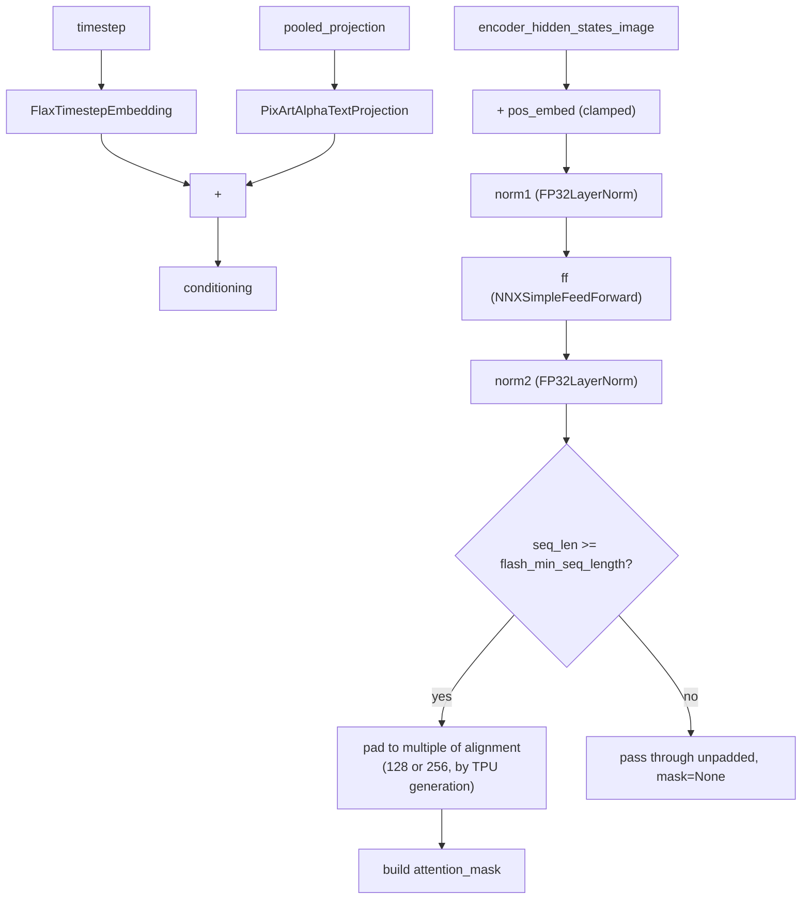

# maxdiffusion/models/embeddings_flax — conditioning embeddings (timestep, text, image, TPU-aware padding)

## Overview
The conditioning-signal embedding layer shared across MaxDiffusion's diffusion transformer models: sinusoidal timestep embeddings, PixArt-style caption/size projections, Flux positional embeddings, and — most TPU-perf-relevant — [`NNXWanImageEmbedding`](../catalog/src/maxdiffusion/models/embeddings_flax.md#NNXWanImageEmbedding.__call__), which dynamically pads its output sequence to a TPU-generation-specific alignment before deciding whether to route through flash attention. The file carries two parallel module families — older `flax.linen` modules and newer `flax.nnx` (`NNX`-prefixed) modules — reflecting an in-progress migration between the two APIs.

## Diagram

## Design rationale (why it's built this way)
Gating the padding/masking logic on `flash_min_seq_length` avoids paying alignment-padding overhead on short sequences that wouldn't route through the flash-attention kernel anyway; making `alignment` itself depend on `get_tpu_type()` (256 on `TPU_V6_LITE`/`TPU_7X`, 128 otherwise) encodes a hardware-specific tiling preference for the flash kernel directly into the embedding layer that feeds it, rather than leaving every caller to rediscover the right block-size multiple independently.

## Entry points
- [`CombinedTimestepTextProjEmbeddings.__call__`](../catalog/src/maxdiffusion/models/embeddings_flax.md#CombinedTimestepTextProjEmbeddings.__call__) / [`CombinedTimestepGuidanceTextProjEmbeddings.__call__`](../catalog/src/maxdiffusion/models/embeddings_flax.md#CombinedTimestepGuidanceTextProjEmbeddings.__call__) — the Flux-style conditioning entry points, combining a timestep (and, for the guidance variant, a distillation-guidance scalar) with a pooled text projection into one conditioning vector.
- [`NNXWanImageEmbedding.__call__`](../catalog/src/maxdiffusion/models/embeddings_flax.md#NNXWanImageEmbedding.__call__) — projects image-conditioning hidden states and decides, per call, whether the downstream attention should run in flash mode based on sequence length.
- [`NNXPixArtAlphaCombinedTimestepSizeEmbeddings.__call__`](../catalog/src/maxdiffusion/models/embeddings_flax.md#NNXPixArtAlphaCombinedTimestepSizeEmbeddings.__call__) — the PixArt-style combined timestep + optional resolution/aspect-ratio conditioning entry point.

## Mechanism (step-by-step)
1. [`CombinedTimestepTextProjEmbeddings.__call__`](../catalog/src/maxdiffusion/models/embeddings_flax.md#CombinedTimestepTextProjEmbeddings.__call__) embeds the raw timestep via [`FlaxTimestepEmbedding`](../catalog/src/maxdiffusion/models/embeddings_flax.md#FlaxTimestepEmbedding) (two `Dense` layers with a `silu` in between, sized by [`time_embed_dim`](../catalog/src/maxdiffusion/models/embeddings_flax.md#FlaxTimestepEmbedding.time_embed_dim)/[`dtype`](../catalog/src/maxdiffusion/models/embeddings_flax.md#FlaxTimestepEmbedding.dtype)/[`weights_dtype`](../catalog/src/maxdiffusion/models/embeddings_flax.md#FlaxTimestepEmbedding.weights_dtype)), separately projects the pooled text embedding through [`PixArtAlphaTextProjection`](../catalog/src/maxdiffusion/models/embeddings_flax.md#PixArtAlphaTextProjection), and adds the two together — a simple additive conditioning fusion.
2. [`CombinedTimestepGuidanceTextProjEmbeddings.__call__`](../catalog/src/maxdiffusion/models/embeddings_flax.md#CombinedTimestepGuidanceTextProjEmbeddings.__call__) extends the same pattern with a third [`FlaxTimestepEmbedding`](../catalog/src/maxdiffusion/models/embeddings_flax.md#FlaxTimestepEmbedding) call over a distillation-guidance scalar, added to the timestep embedding before the pooled-text-projection sum — this is Flux's classifier-free-guidance-distillation conditioning path, distinct from the plain-timestep variant.
3. [`NNXWanImageEmbedding.__call__`](../catalog/src/maxdiffusion/models/embeddings_flax.md#NNXWanImageEmbedding.__call__) adds a learned [`pos_embed`](../catalog/src/maxdiffusion/models/embeddings_flax.md#NNXWanImageEmbedding.pos_embed) (when configured with a fixed `pos_embed_seq_len`) to the input, sliced/clamped to `min(current_seq_len, pos_embed_len)` so a shorter-than-expected input sequence doesn't index out of bounds, then runs [`norm1`](../catalog/src/maxdiffusion/models/embeddings_flax.md#NNXWanImageEmbedding.norm1) → [`ff`](../catalog/src/maxdiffusion/models/embeddings_flax.md#NNXWanImageEmbedding.ff) → [`norm2`](../catalog/src/maxdiffusion/models/embeddings_flax.md#NNXWanImageEmbedding.norm2) (an `FP32LayerNorm`/`NNXSimpleFeedForward`/`FP32LayerNorm` sandwich).
4. After that projection, [`NNXWanImageEmbedding.__call__`](../catalog/src/maxdiffusion/models/embeddings_flax.md#NNXWanImageEmbedding.__call__) decides `use_flash_attn = current_seq_len >= self.flash_min_seq_length` (gated by [`flash_min_seq_length`](../catalog/src/maxdiffusion/models/embeddings_flax.md#NNXWanImageEmbedding.flash_min_seq_length), default 4096) — short sequences skip flash attention (and thus skip the padding below entirely), while long sequences get padded to a multiple of [`alignment`](../catalog/src/maxdiffusion/models/embeddings_flax.md#NNXWanImageEmbedding.alignment) via `num_blocks = ceil(current_seq_len / alignment); target_seq_len = num_blocks * alignment`, with the padding region zero-filled and an explicit `attention_mask` (1 for real tokens, 0 for padding) constructed so the downstream flash-attention kernel can exclude the padded positions.
5. [`alignment`](../catalog/src/maxdiffusion/models/embeddings_flax.md#NNXWanImageEmbedding.alignment) is itself TPU-generation-dependent when not explicitly overridden: the surrounding constructor (visible in source, calling `get_tpu_type()`) sets it to `256` on `TPU_V6_LITE`/`TPU_7X` and `128` otherwise — a direct encoding of the fact that different TPU generations have different native tiling/block-size sweet spots for the flash-attention kernel this padding feeds into.
6. [`NNXPixArtAlphaCombinedTimestepSizeEmbeddings.__call__`](../catalog/src/maxdiffusion/models/embeddings_flax.md#NNXPixArtAlphaCombinedTimestepSizeEmbeddings.__call__) always computes a [`time_proj`](../catalog/src/maxdiffusion/models/embeddings_flax.md#NNXPixArtAlphaCombinedTimestepSizeEmbeddings.time_proj) → [`timestep_embedder`](../catalog/src/maxdiffusion/models/embeddings_flax.md#NNXPixArtAlphaCombinedTimestepSizeEmbeddings.timestep_embedder) embedding; when [`use_additional_conditions`](../catalog/src/maxdiffusion/models/embeddings_flax.md#NNXPixArtAlphaCombinedTimestepSizeEmbeddings.use_additional_conditions) is set, it additionally embeds `resolution`/`aspect_ratio` via [`additional_condition_proj`](../catalog/src/maxdiffusion/models/embeddings_flax.md#NNXPixArtAlphaCombinedTimestepSizeEmbeddings.additional_condition_proj) fed into separate [`resolution_embedder`](../catalog/src/maxdiffusion/models/embeddings_flax.md#NNXPixArtAlphaCombinedTimestepSizeEmbeddings.resolution_embedder)/[`aspect_ratio_embedder`](../catalog/src/maxdiffusion/models/embeddings_flax.md#NNXPixArtAlphaCombinedTimestepSizeEmbeddings.aspect_ratio_embedder) modules, concatenates the two resulting embeddings along the feature axis, and adds that to the timestep embedding — raising `ValueError` if `resolution`/`aspect_ratio` are missing while `use_additional_conditions` is true.

## Key data structures
- Every embedding class exists in two parallel forms — an `nnx.Module` (`NNX*`-prefixed, e.g. [`NNXWanImageEmbedding`](../catalog/src/maxdiffusion/models/embeddings_flax.md#NNXWanImageEmbedding.__call__), [`NNXPixArtAlphaCombinedTimestepSizeEmbeddings`](../catalog/src/maxdiffusion/models/embeddings_flax.md#NNXPixArtAlphaCombinedTimestepSizeEmbeddings.__call__)) and a `flax.linen`/`nn.Module` (unprefixed, e.g. [`FlaxTimestepEmbedding`](../catalog/src/maxdiffusion/models/embeddings_flax.md#FlaxTimestepEmbedding), [`PixArtAlphaTextProjection`](../catalog/src/maxdiffusion/models/embeddings_flax.md#PixArtAlphaTextProjection)) — the model family being built (Wan/PixArt-style NNX modules vs. older linen-based Flux/PixArt path) determines which form gets used.
- [`FP32LayerNorm`](../catalog/src/maxdiffusion/models/normalization_flax.md#FP32LayerNorm) — imported from `normalization_flax`, used to bracket [`NNXWanImageEmbedding`](../catalog/src/maxdiffusion/models/embeddings_flax.md#NNXWanImageEmbedding.__call__)'s feed-forward projection; forcing LayerNorm's reduction to run in float32 regardless of the surrounding compute dtype is a standard numerical-stability guard for norms in mixed-precision models.
- [`NNXSimpleFeedForward`](../catalog/src/maxdiffusion/models/attention_flax.md#NNXSimpleFeedForward) — imported from the sibling `attention_flax` module and reused here as the projection MLP inside [`NNXWanImageEmbedding`](../catalog/src/maxdiffusion/models/embeddings_flax.md#NNXWanImageEmbedding.__call__).
- [`NNXTimesteps`](../catalog/src/maxdiffusion/models/embeddings_flax.md#NNXTimesteps) — the NNX sinusoidal-embedding module `NNXPixArtAlphaCombinedTimestepSizeEmbeddings` instantiates (fixed at 256 channels) for both the timestep and the optional resolution/aspect-ratio conditioning signals.

## Dynamics (design intent)
> [!inferred] The `alignment`/`flash_min_seq_length` gating in `NNXWanImageEmbedding` encodes a two-part perf decision: below `flash_min_seq_length`, the sequence is short enough that the non-flash (presumably dense/XLA-native) attention path is used directly with no padding overhead; above it, the sequence is padded to the TPU generation's preferred block-size multiple so the flash-attention kernel gets clean, fully-utilized tiles rather than a ragged tail block — the explicit `attention_mask` is what lets the padded positions be excluded from the actual attention computation's softmax despite occupying real tile slots.

## Edge cases
- [`NNXWanImageEmbedding.__call__`](../catalog/src/maxdiffusion/models/embeddings_flax.md#NNXWanImageEmbedding.__call__) prints a `[WARN]` (not raises) when `current_seq_len > pos_embed_len` — a sequence longer than the learned positional embedding's configured length silently receives positional information for only its first `pos_embed_len` tokens, with no positional signal added beyond that.
- When `use_flash_attn` is `False`, [`NNXWanImageEmbedding.__call__`](../catalog/src/maxdiffusion/models/embeddings_flax.md#NNXWanImageEmbedding.__call__) explicitly sets `attention_mask = None` even if it was constructed as all-ones — callers must not assume a non-`None` mask return is universal across both code paths.

## Open questions
> [!inferred] Whether the `256`/`128` TPU-generation alignment split in `NNXWanImageEmbedding`'s constructor (not itself part of this packet's cited subgraph, only its resulting [`alignment`](../catalog/src/maxdiffusion/models/embeddings_flax.md#NNXWanImageEmbedding.alignment) field is) generalizes to other flash-attention-consuming modules in this codebase, or is specific to this one embedding module, isn't answerable from this packet alone.

## See also
- [maxdiffusion/models/attention_flax](maxdiffusion-models-attention_flax.md) — defines `NNXSimpleFeedForward`, reused here, and the flash-attention kernels this embedding's padding/masking logic feeds into.
