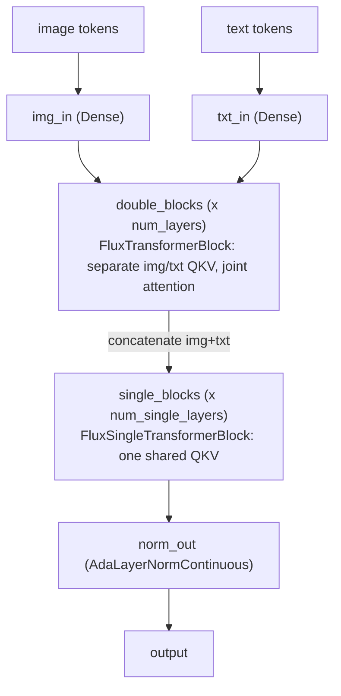

# maxdiffusion/models/flux/transformers/transformer_flux_flax — Flux MMDiT (double-stream + single-stream blocks)

## Overview
`FluxTransformer2DModel` implements Black Forest Labs' Flux architecture: `num_layers` "double" blocks where image and text tokens keep separate Q/K/V projections but attend jointly, followed by `num_single_layers` "single" blocks where the two streams have already been concatenated and share one set of projections. Unlike this codebase's newer `flax.nnx`-based models ([ltx2/transformer_ltx2](maxdiffusion-models-ltx2-transformer_ltx2.md), [wan/transformers/transformer_wan_animate](maxdiffusion-models-wan-transformers-transformer_wan_animate.md)), both block lists here are plain `flax.linen` Python lists built in a `setup()` loop — no `nnx.vmap`/`nnx.scan` stack-and-scan construction.

## Diagram

## Design rationale (why it's built this way)
- **Separate-then-shared QKV is the defining MMDiT design**: keeping image and text as distinct-projection streams in the double blocks lets each modality learn its own Q/K/V transform while still attending jointly (a richer parameterization than immediately concatenating), while the later single blocks (operating on the already-fused representation) can share one projection since the streams have converged.
- **Every block in both lists is constructed with the identical `attention_kernel`/`flash_min_seq_length`/`flash_block_sizes`/`mesh`/`dtype`/`precision` configuration** — the same model-wide-uniform-config pattern seen throughout this codebase ([attention_flax](maxdiffusion-models-attention_flax.md)'s `FlaxTransformer2DModel`, [unet_2d_blocks_flax](maxdiffusion-models-unet_2d_blocks_flax.md)).
- **No stack-and-scan construction here**, in contrast to [ltx2/transformer_ltx2](maxdiffusion-models-ltx2-transformer_ltx2.md)'s `nnx.vmap`-built `transformer_blocks` — `double_blocks`/`single_blocks` are ordinary Python lists appended to in a loop, meaning (absent some other mechanism not in this packet's cited subgraph) each of the `num_layers + num_single_layers` blocks compiles as its own distinct HLO computation rather than one compiled program reused via `jax.lax.scan`.

## Entry points
- [`FluxTransformer2DModel.img_in`](../catalog/src/maxdiffusion/models/flux/transformers/transformer_flux_flax.md#FluxTransformer2DModel.img_in) — the image-token input projection (`nn.Dense`), the first layer image tokens pass through before entering [`double_blocks`](../catalog/src/maxdiffusion/models/flux/transformers/transformer_flux_flax.md#FluxTransformer2DModel.double_blocks).
- [`FluxTransformer2DModel.double_blocks`](../catalog/src/maxdiffusion/models/flux/transformers/transformer_flux_flax.md#FluxTransformer2DModel.double_blocks) — the list of `FluxTransformerBlock`s implementing the dual-stream MMDiT layers.
- [`FluxTransformerBlock.attn`](../catalog/src/maxdiffusion/models/flux/transformers/transformer_flux_flax.md#FluxTransformerBlock.attn) / [`FluxSingleTransformerBlock.attn`](../catalog/src/maxdiffusion/models/flux/transformers/transformer_flux_flax.md#FluxSingleTransformerBlock.attn) — the joint-attention sub-module each block type constructs, ultimately routing through [attention_flax](maxdiffusion-models-attention_flax.md)'s `AttentionOp`/`_apply_attention` kernel dispatch.

## Mechanism (step-by-step)
1. `FluxTransformer2DModel.setup` (visible in source) builds [`img_in`](../catalog/src/maxdiffusion/models/flux/transformers/transformer_flux_flax.md#FluxTransformer2DModel.img_in)/`txt_in` (both `nn.Dense` projections to `inner_dim`, kernel-initialized with explicit logical partitioning `(None, "mlp")`), then loops `num_layers` times constructing one `FluxTransformerBlock` per iteration into the [`double_blocks`](../catalog/src/maxdiffusion/models/flux/transformers/transformer_flux_flax.md#FluxTransformer2DModel.double_blocks) list, and separately loops `num_single_layers` times constructing `FluxSingleTransformerBlock`s into `single_blocks`.
2. Each [`FluxTransformerBlock`](../catalog/src/maxdiffusion/models/flux/transformers/transformer_flux_flax.md#FluxTransformerBlock) (visible in source) holds its own [`attn`](../catalog/src/maxdiffusion/models/flux/transformers/transformer_flux_flax.md#FluxTransformerBlock.attn) sub-module — a `FlaxAttention`-family layer configured with this block's `attention_kernel`/`flash_block_sizes`/`mesh`, computing joint self-attention over the concatenated image+text sequence while each modality still has its own upstream Q/K/V projection.
3. [`FluxSingleTransformerBlock`](../catalog/src/maxdiffusion/models/flux/transformers/transformer_flux_flax.md#FluxSingleTransformerBlock) (visible in source) holds its own [`attn`](../catalog/src/maxdiffusion/models/flux/transformers/transformer_flux_flax.md#FluxSingleTransformerBlock.attn), operating on the already-concatenated image+text tensor with one shared set of projections — structurally simpler than the double block since there's no per-modality QKV split to maintain.

## Key data structures
- [`FluxTransformer2DModel.double_blocks`](../catalog/src/maxdiffusion/models/flux/transformers/transformer_flux_flax.md#FluxTransformer2DModel.double_blocks) / `single_blocks` — plain Python lists of block modules, iterated by index in `__call__` (visible in source), not a stacked/scanned parameter pytree.
- [`BlockSizes`](../catalog/src/maxdiffusion/models/attention_flax.md#BlockSizes) (aliased from `common_types.BlockSizes`, itself aliased from `splash_attention_kernel.BlockSizes` — [maxdiffusion/kernels/splash_attention](maxdiffusion-kernels-splash_attention-splash_attention_kernel.md)'s tile-size config type) — threaded into every block via `flash_block_sizes`.

> [!inferred] Two further mechanisms are visible in source but not part of this packet's cited subgraph: `FluxPosEmbed` (constructed as `self.pe_embedder`) computes rotary position embeddings via `axes_dims_rope` (a 3-tuple, e.g. `(16, 56, 56)`) — one RoPE axis-dim split across however many positional axes Flux's patchified image + text token layout requires; and `text_time_guidance_cls` is chosen at construction time between `CombinedTimestepGuidanceTextProjEmbeddings` (when `guidance_embeds=True`) and `CombinedTimestepTextProjEmbeddings` (otherwise) — the same two conditioning-embedding classes documented in [maxdiffusion/models/embeddings_flax](maxdiffusion-models-embeddings_flax.md), reused here rather than reimplemented.

## Dynamics (design intent)
> [!inferred] The absence of `nnx.scan`-based layer stacking here (versus its presence in [ltx2/transformer_ltx2](maxdiffusion-models-ltx2-transformer_ltx2.md)) is consistent with this file predating (or simply not yet having been migrated to) the `flax.nnx` API this codebase's newer models use — `FluxTransformer2DModel` is a plain `flax.linen`/`nn.Module`, and linen's `setup()`-time Python loop over `range(num_layers)` is the idiomatic linen way to build a list of layers, at the cost of `num_layers` separate traced/compiled sub-computations rather than one reused via scan.

## Edge cases
- `double_blocks`/`single_blocks` being plain Python lists (rather than `nn.Module`-registered submodule containers with special Flax handling) means correct Flax parameter-naming/registration for each list entry depends on Flax's list-of-submodules support working correctly for this specific construction pattern — a detail not verifiable purely from this packet's cited subgraph.

## Open questions
> [!inferred] Whether a scan-based variant of this Flux model exists elsewhere in the codebase (mirroring the `scan_layers` flag pattern seen in [ltx2/transformer_ltx2](maxdiffusion-models-ltx2-transformer_ltx2.md)) or whether Flux is exclusively run with per-layer compilation in this codebase is not addressed by this packet's cited subgraph.

## See also
- [maxdiffusion/models/attention_flax](maxdiffusion-models-attention_flax.md) — the attention-kernel dispatch every `FluxTransformerBlock.attn`/`FluxSingleTransformerBlock.attn` routes through.
- [maxdiffusion/models/embeddings_flax](maxdiffusion-models-embeddings_flax.md) — `CombinedTimestepTextProjEmbeddings`/`CombinedTimestepGuidanceTextProjEmbeddings`, reused here for time/guidance conditioning.
- [maxdiffusion/models/ltx2/transformer_ltx2](maxdiffusion-models-ltx2-transformer_ltx2.md) — a contrasting `flax.nnx`-based model using `nnx.vmap`/`nnx.scan` layer stacking instead of this file's plain Python-list construction.
