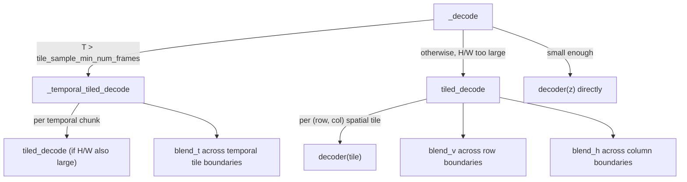

# maxdiffusion/models/ltx2/autoencoder_kl_ltx2 — causal 3D video VAE with overlapping-tile decode

## Overview
`LTX2VideoAutoencoderKL` is a causal 3D-convolutional video VAE whose decode (and encode) path can tile the latent along the spatial (height/width) and temporal (frame) axes to bound peak memory for long/high-resolution videos, blending each tile's boundary linearly against its neighbor rather than producing hard seams — [`tiled_decode`](../catalog/src/maxdiffusion/models/ltx2/autoencoder_kl_ltx2.md#LTX2VideoAutoencoderKL.tiled_decode) and [`_temporal_tiled_decode`](../catalog/src/maxdiffusion/models/ltx2/autoencoder_kl_ltx2.md#LTX2VideoAutoencoderKL._temporal_tiled_decode) are the two independent tiling axes, composable because the temporal tiler calls the spatial tiler per temporal chunk.

## Diagram

## Design rationale (why it's built this way)
- **Tiles overlap by `min_size - stride`, and the overlap region is linearly blended, specifically to avoid visible seams at tile boundaries.** [`tiled_decode`](../catalog/src/maxdiffusion/models/ltx2/autoencoder_kl_ltx2.md#LTX2VideoAutoencoderKL.tiled_decode) computes `blend_height = tile_sample_min_height - tile_sample_stride_height` (and the width analogue), decodes each `tile_latent_min_height × tile_latent_min_width`-sized tile independently, then blends adjacent decoded tiles over exactly that overlap width via `blend_v`/`blend_h` before cropping each tile down to its stride-sized contribution and concatenating — a naive non-overlapping tile-and-concatenate would instead produce a visible discontinuity at every tile edge, since each tile's convolutions see different (zero-padded or absent) context near its own boundary.
- **Temporal tiling and spatial tiling are independent, composable mechanisms, not one combined 3D-tiling routine.** [`_temporal_tiled_decode`](../catalog/src/maxdiffusion/models/ltx2/autoencoder_kl_ltx2.md#LTX2VideoAutoencoderKL._temporal_tiled_decode) slices along frames and, *for each temporal chunk*, calls [`tiled_decode`](../catalog/src/maxdiffusion/models/ltx2/autoencoder_kl_ltx2.md#LTX2VideoAutoencoderKL.tiled_decode) only if that chunk's spatial extent still exceeds the spatial tile threshold (`self.use_tiling and (tile.shape[2] > tile_latent_min_height or tile.shape[3] > tile_latent_min_width)`) — this means a caller decoding a long-but-narrow video pays only the temporal-tiling memory cost, and a caller decoding a short-but-huge-frame video pays only the spatial-tiling cost.
- **Causal convolutions let each temporal tile overlap by exactly one frame rather than a full receptive-field-sized overlap** — `_temporal_tiled_decode` slices `tile = z[:, i : i + tile_latent_min_num_frames + 1, ...]` (one frame more than the nominal tile size) and, for all but the first chunk, drops the tile's leading frame after blending — a lighter-weight overlap than the spatial blend width, consistent with the model's `LTX2VideoCausalConv3d` layers only needing one frame of causal context rather than a full symmetric receptive field.

## Entry points
- [`LTX2VideoAutoencoderKL._decode`](../catalog/src/maxdiffusion/models/ltx2/autoencoder_kl_ltx2.md#LTX2VideoAutoencoderKL._decode) — the top-level dispatch a caller's `decode()` (visible in source, calling this) reaches; picks between plain, spatially-tiled, or temporally-tiled decode based on the input's shape versus the configured tile thresholds.
- [`LTX2VideoAutoencoderKL.tiled_decode`](../catalog/src/maxdiffusion/models/ltx2/autoencoder_kl_ltx2.md#LTX2VideoAutoencoderKL.tiled_decode) — the spatial-tiling entry point, callable directly or via `_decode`/`_temporal_tiled_decode`.
- [`LTX2VideoAutoencoderKL._temporal_tiled_decode`](../catalog/src/maxdiffusion/models/ltx2/autoencoder_kl_ltx2.md#LTX2VideoAutoencoderKL._temporal_tiled_decode) — the temporal-tiling entry point, which internally may call `tiled_decode` per chunk.
- [`LTX2VideoResnetBlock3d.__call__`](../catalog/src/maxdiffusion/models/ltx2/autoencoder_kl_ltx2.md#LTX2VideoResnetBlock3d.__call__) — the 3D ResNet block every encoder/decoder stage (down/mid/up blocks, visible in source) is built from; each tiling routine ultimately bottoms out in repeated calls to blocks built from this primitive.

## Mechanism (step-by-step)
1. [`tiled_decode`](../catalog/src/maxdiffusion/models/ltx2/autoencoder_kl_ltx2.md#LTX2VideoAutoencoderKL.tiled_decode) iterates `i` over height in steps of `tile_latent_stride_height` and `j` over width in steps of `tile_latent_stride_width`, slicing `z[:, :, i:i+tile_latent_min_height, j:j+tile_latent_min_width, :]` for each tile and decoding it independently through `self.decoder` — every tile's decode is a fully independent call, so tiles could in principle be processed sequentially to bound peak activation memory to one tile's worth rather than the whole latent's.
2. After all tiles are decoded, [`tiled_decode`](../catalog/src/maxdiffusion/models/ltx2/autoencoder_kl_ltx2.md#LTX2VideoAutoencoderKL.tiled_decode)'s second pass blends each tile against its top (`blend_v`) and left (`blend_h`) neighbor over the precomputed `blend_height`/`blend_width` overlap, then crops each tile down to `[:tile_sample_stride_height, :tile_sample_stride_width]` before concatenating rows and columns — the crop is what turns the overlapping tiles back into a non-overlapping, seamless grid.
3. [`_temporal_tiled_decode`](../catalog/src/maxdiffusion/models/ltx2/autoencoder_kl_ltx2.md#LTX2VideoAutoencoderKL._temporal_tiled_decode) applies the identical overlap/blend/crop pattern along the frame axis (`blend_t`, `tile_sample_stride_num_frames`), recursing into [`tiled_decode`](../catalog/src/maxdiffusion/models/ltx2/autoencoder_kl_ltx2.md#LTX2VideoAutoencoderKL.tiled_decode) per chunk when that chunk is still spatially oversized.
4. Both [`tiled_decode`](../catalog/src/maxdiffusion/models/ltx2/autoencoder_kl_ltx2.md#LTX2VideoAutoencoderKL.tiled_decode) and [`_temporal_tiled_decode`](../catalog/src/maxdiffusion/models/ltx2/autoencoder_kl_ltx2.md#LTX2VideoAutoencoderKL._temporal_tiled_decode) thread an optional per-tile PRNG `key` (split via `jax.random.split` into one subkey per tile/chunk) through to the decoder — necessary because a stochastic decoder component (e.g. dropout, if present) run once per tile needs distinct randomness per tile rather than reusing one key everywhere, which would correlate the "noise" across tiles.

## Key data structures
- `blend_v`/`blend_h`/`blend_t` (visible in source, cited as method names in the packet's subgraph indirectly via their call sites) — the three axis-specific linear-blend helpers; each presumably ramps the overlap region from the earlier tile's value to the later tile's value across the blend extent.
- Configuration fields threaded through every tiling decision — `tile_sample_min_height`/`tile_sample_min_width`/`tile_sample_min_num_frames` (the size at which tiling activates) and `tile_sample_stride_height`/`tile_sample_stride_width`/`tile_sample_stride_num_frames` (the non-overlapping advance per tile) — their difference is exactly the blend width/extent on each axis.

## Dynamics (design intent)
> [!inferred] `_decode`'s ordering — check temporal tiling first (`use_framewise_decoding and T > tile_sample_min_num_frames`), then spatial tiling — means a caller with both a very long video and a very large frame size gets full 3D tiling for free through the composition described in Design rationale, without either tiling routine needing to know about the other's activation criteria beyond the shape check each performs independently.

## Edge cases
- [`tiled_decode`](../catalog/src/maxdiffusion/models/ltx2/autoencoder_kl_ltx2.md#LTX2VideoAutoencoderKL.tiled_decode)'s row/column loop bounds (`range(0, H, tile_latent_stride_height)`) mean the last tile in each dimension may extend past `H`/`W` if they aren't an exact multiple of the stride — JAX's slicing semantics silently clip rather than erroring, so the last tile is simply smaller than the nominal tile size; the subsequent crop-and-concatenate step must still produce the correct final `sample_height`/`sample_width` via the explicit `dec[:, :, :sample_height, :sample_width, :]` crop at the end.

## Open questions
> [!inferred] Whether `tiled_encode`/`_temporal_tiled_encode` (referenced from `_encode`, visible in source but only partially covered by this packet's cited subgraph) implement the exact same overlap/blend/crop pattern as their decode counterparts, or a structurally different one (e.g. no blending needed if encoding is exact and tiling artifacts only matter on the decode side), isn't fully verifiable from this packet alone.

## See also
- [maxdiffusion/models/vae_flax](maxdiffusion-models-vae_flax.md) — the simpler, non-tiled 2D image VAE this video VAE's tiling machinery generalizes beyond.
- [maxdiffusion/models/ltx2/transformer_ltx2](maxdiffusion-models-ltx2-transformer_ltx2.md) — the diffusion transformer whose video-token output this VAE's decoder ultimately reconstructs into pixels.
