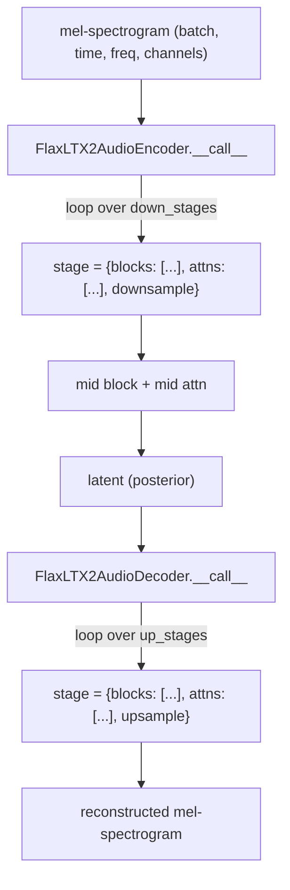

# maxdiffusion/models/ltx2/autoencoder_kl_ltx2_audio — mel-spectrogram VAE (causal-on-one-axis 2D convs)

## Overview
`FlaxAutoencoderKLLTX2Audio` is LTX2's audio-side VAE, treating a mel-spectrogram as a 2D image (`time × frequency`) and applying 2D convolutions that are causal along the time axis but not the frequency axis — [`FlaxLTX2AudioCausalConv`](../catalog/src/maxdiffusion/models/ltx2/autoencoder_kl_ltx2_audio.md#FlaxLTX2AudioResnetBlock.__call__)'s own docstring: "A causal 2D convolution that pads asymmetrically along the causal axis." [`FlaxLTX2AudioEncoder`](../catalog/src/maxdiffusion/models/ltx2/autoencoder_kl_ltx2_audio.md#FlaxLTX2AudioEncoder.__call__)/[`FlaxLTX2AudioDecoder`](../catalog/src/maxdiffusion/models/ltx2/autoencoder_kl_ltx2_audio.md#FlaxLTX2AudioDecoder.__call__) organize their ResNet+attention+resample layers into an explicit list of "stages" ([`down_stages`](../catalog/src/maxdiffusion/models/ltx2/autoencoder_kl_ltx2_audio.md#FlaxLTX2AudioEncoder.down_stages)/[`up_stages`](../catalog/src/maxdiffusion/models/ltx2/autoencoder_kl_ltx2_audio.md#FlaxLTX2AudioDecoder.up_stages)) rather than a flat layer sequence.

## Diagram

## Design rationale (why it's built this way)
- **Causality is applied to one spatial axis only, because a spectrogram's two axes have different physical meaning.** Time must be processed causally (a frame's decode must not depend on future frames, matching this codebase's video-VAE causal convention), but frequency has no such directional constraint — [`FlaxLTX2AudioCausalConv`](../catalog/src/maxdiffusion/models/ltx2/autoencoder_kl_ltx2_audio.md#FlaxLTX2AudioResnetBlock.__call__)'s `causality_axis` parameter (default `"height"`, i.e. time) lets the asymmetric causal padding be applied to just that one axis while the other gets ordinary symmetric padding.
- **Stages are structured as `nnx.Dict({"blocks", "attns", "downsample"/"upsample"})` lists, not a flat sequence of layers** — grouping each resolution level's ResNet blocks, optional attention blocks, and single resample operation together makes the encoder/decoder's `__call__` loop (`for stage in self.down_stages: ...`) directly mirror the architecture's resolution-level structure, rather than requiring index arithmetic to find where one resolution level ends and the next begins.

## Entry points
- [`FlaxLTX2AudioEncoder.__call__`](../catalog/src/maxdiffusion/models/ltx2/autoencoder_kl_ltx2_audio.md#FlaxLTX2AudioEncoder.__call__) — loops [`down_stages`](../catalog/src/maxdiffusion/models/ltx2/autoencoder_kl_ltx2_audio.md#FlaxLTX2AudioEncoder.down_stages), running each stage's blocks/attentions/downsample in sequence.
- [`FlaxLTX2AudioDecoder.__call__`](../catalog/src/maxdiffusion/models/ltx2/autoencoder_kl_ltx2_audio.md#FlaxLTX2AudioDecoder.__call__) — the mirror, looping [`up_stages`](../catalog/src/maxdiffusion/models/ltx2/autoencoder_kl_ltx2_audio.md#FlaxLTX2AudioDecoder.up_stages) and finishing with `conv_out`/`norm_out`; accepts `target_frames`/`target_mel_bins` to pin the exact output shape.
- [`FlaxLTX2AudioResnetBlock.__call__`](../catalog/src/maxdiffusion/models/ltx2/autoencoder_kl_ltx2_audio.md#FlaxLTX2AudioResnetBlock.__call__) — the per-block primitive every stage's `"blocks"` list is built from.

## Mechanism (step-by-step)
1. [`FlaxLTX2AudioEncoder.down_stages`](../catalog/src/maxdiffusion/models/ltx2/autoencoder_kl_ltx2_audio.md#FlaxLTX2AudioEncoder.down_stages) is built once at construction time from `ch_mult`/`num_res_blocks`/`attn_resolutions`/`base_channels`/`norm_type`/`causality_axis`/`resolution` — one stage per channel-multiplier level, each stage holding a list of [`FlaxLTX2AudioResnetBlock`](../catalog/src/maxdiffusion/models/ltx2/autoencoder_kl_ltx2_audio.md#FlaxLTX2AudioResnetBlock.__call__)s, a list of `FlaxLTX2AudioAttnBlock`s (present only at resolutions listed in `attn_resolutions`), and one `FlaxLTX2AudioDownsample`.
2. [`FlaxLTX2AudioEncoder.__call__`](../catalog/src/maxdiffusion/models/ltx2/autoencoder_kl_ltx2_audio.md#FlaxLTX2AudioEncoder.__call__) runs `conv_in`, then for each stage in [`down_stages`](../catalog/src/maxdiffusion/models/ltx2/autoencoder_kl_ltx2_audio.md#FlaxLTX2AudioEncoder.down_stages) runs every block, every attention (if any), then the stage's downsample — before finishing with the mid-block/mid-attention pair and output norm/conv.
3. [`FlaxLTX2AudioDecoder.__call__`](../catalog/src/maxdiffusion/models/ltx2/autoencoder_kl_ltx2_audio.md#FlaxLTX2AudioDecoder.__call__) mirrors this with [`up_stages`](../catalog/src/maxdiffusion/models/ltx2/autoencoder_kl_ltx2_audio.md#FlaxLTX2AudioDecoder.up_stages), starting from `conv_in`/`mid_block1`/`mid_attn`/`mid_block2`, running each stage's blocks/attentions/upsample, and finishing with [`norm_out`](../catalog/src/maxdiffusion/models/ltx2/autoencoder_kl_ltx2_audio.md#FlaxLTX2AudioDecoder.norm_out)/[`conv_out`](../catalog/src/maxdiffusion/models/ltx2/autoencoder_kl_ltx2_audio.md#FlaxLTX2AudioDecoder.conv_out); [`output_channels`](../catalog/src/maxdiffusion/models/ltx2/autoencoder_kl_ltx2_audio.md#FlaxLTX2AudioDecoder.output_channels) sizes the final projection.
4. [`FlaxLTX2AudioResnetBlock.__call__`](../catalog/src/maxdiffusion/models/ltx2/autoencoder_kl_ltx2_audio.md#FlaxLTX2AudioResnetBlock.__call__) follows the same norm→activation→conv→(temb-add)→norm→activation→dropout→conv→shortcut-add structure as [maxdiffusion/models/resnet_flax](maxdiffusion-models-resnet_flax.md)'s `FlaxResnetBlock2D`, via [`norm1`](../catalog/src/maxdiffusion/models/ltx2/autoencoder_kl_ltx2_audio.md#FlaxLTX2AudioResnetBlock.norm1)/[`conv1`](../catalog/src/maxdiffusion/models/ltx2/autoencoder_kl_ltx2_audio.md#FlaxLTX2AudioResnetBlock.conv1)/[`temb_proj`](../catalog/src/maxdiffusion/models/ltx2/autoencoder_kl_ltx2_audio.md#FlaxLTX2AudioResnetBlock.temb_proj)/[`norm2`](../catalog/src/maxdiffusion/models/ltx2/autoencoder_kl_ltx2_audio.md#FlaxLTX2AudioResnetBlock.norm2)/[`conv2`](../catalog/src/maxdiffusion/models/ltx2/autoencoder_kl_ltx2_audio.md#FlaxLTX2AudioResnetBlock.conv2)/[`conv_shortcut_layer`](../catalog/src/maxdiffusion/models/ltx2/autoencoder_kl_ltx2_audio.md#FlaxLTX2AudioResnetBlock.conv_shortcut_layer)/[`dropout_layer`](../catalog/src/maxdiffusion/models/ltx2/autoencoder_kl_ltx2_audio.md#FlaxLTX2AudioResnetBlock.dropout_layer) — the same ResNet-block skeleton reused across this codebase's image, video, and audio VAEs.

## Key data structures
- `down_stages`/`up_stages` — `nnx.List` of `nnx.Dict({"blocks": [...], "attns": [...], "downsample"/"upsample": ...})` — see Design rationale for why this grouping exists.
- [`FlaxLTX2AudioCausalConv`](../catalog/src/maxdiffusion/models/ltx2/autoencoder_kl_ltx2_audio.md#FlaxLTX2AudioResnetBlock.__call__)'s `causality_axis` field — a string (`"height"` by default, i.e. the time axis given the `(batch, time, freq, channels)` layout comment in its `__call__`) selecting which of the two spatial axes gets asymmetric causal padding.

## Dynamics (design intent)
> [!inferred] Treating a spectrogram as a 2D image with one axis causal and the other not is a natural fit for audio specifically because frequency bins at a given time step are all "known" simultaneously (there's no physical ordering constraint across frequency), whereas time genuinely has a causal/generative ordering — unlike the video VAEs in this codebase where all three spatial-plus-temporal axes could in principle need independent treatment.

## Edge cases
- [`FlaxLTX2AudioDecoder.__call__`](../catalog/src/maxdiffusion/models/ltx2/autoencoder_kl_ltx2_audio.md#FlaxLTX2AudioDecoder.__call__)'s `target_frames`/`target_mel_bins` parameters (default `None`) suggest the decoder's natural output shape (determined by how many upsample stages ran) may not exactly match a caller's desired output resolution, requiring an explicit crop/pad step when they're supplied — the packet's cited subgraph doesn't show that adjustment's implementation, only the parameter's presence.

## Open questions
> [!inferred] Whether this audio VAE uses the same tiled-decode-with-blending or streaming-feature-cache memory-bounding strategy as the video VAEs ([ltx2/autoencoder_kl_ltx2](maxdiffusion-models-ltx2-autoencoder_kl_ltx2.md), [wan/autoencoder_kl_wan](maxdiffusion-models-wan-autoencoder_kl_wan.md)) for very long audio clips, or processes the whole spectrogram in one call, is not addressed by this packet's cited subgraph.

## See also
- [maxdiffusion/models/resnet_flax](maxdiffusion-models-resnet_flax.md) — the same ResNet-block skeleton this audio VAE's `FlaxLTX2AudioResnetBlock` follows.
- [maxdiffusion/models/ltx2/vocoder_ltx2](maxdiffusion-models-ltx2-vocoder_ltx2.md) — the downstream model that converts this VAE's reconstructed mel-spectrogram into a raw waveform.
- [maxdiffusion/models/ltx2/transformer_ltx2](maxdiffusion-models-ltx2-transformer_ltx2.md) — the diffusion transformer whose audio-token output this VAE's decoder reconstructs into a mel-spectrogram.
