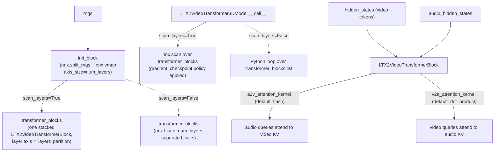

# maxdiffusion/models/ltx2/transformer_ltx2 — joint audio-video DiT (nnx.vmap layer stacking + scan)

## Overview
`LTX2VideoTransformer3DModel` is a joint audio+video diffusion transformer with two parallel token streams (video and audio) cross-attending to each other at every layer. Its [`transformer_blocks`](../catalog/src/maxdiffusion/models/ltx2/transformer_ltx2.md#LTX2VideoTransformer3DModel.transformer_blocks) are built either as a single `nnx.vmap`-stacked module (for `jax.lax.scan`-compiled reuse across layers) or as a plain Python list, selected by `scan_layers` — the same per-layer-object-vs-stacked-and-scanned tradeoff seen in [learning-machine's llama_ref model variants](../../../learning-machine/concepts/llama_ref-model_with_scan.md), here expressed through `flax.nnx` primitives instead of `torch_xla2` interop.

## Diagram

## Design rationale (why it's built this way)
- **`nnx.vmap` over `rngs` is how one shared-structure, differently-initialized block per layer gets built without a Python loop.** [`init_block`](../catalog/src/maxdiffusion/models/ltx2/transformer_ltx2.md#LTX2VideoTransformer3DModel.init_block) is decorated `@nnx.split_rngs(splits=self.num_layers)` then `@nnx.vmap(in_axes=0, out_axes=0, axis_size=self.num_layers, transform_metadata={nnx.PARTITION_NAME: "layers"})` — vmapping the constructor itself over a batch of RNG keys produces one `LTX2VideoTransformerBlock` whose parameters already carry a leading `num_layers` axis, ready to be `nnx.scan`ned over at call time; the `transform_metadata` ties that leading axis to a `"layers"` logical partition name for sharding.
- **Video and audio cross-attention use *different default kernels* (`a2v_attention_kernel="flash"`, `v2a_attention_kernel="dot_product"`)** — an explicit, asymmetric perf decision baked into the constructor's defaults, presumably reflecting that the two cross-attention directions have very different KV sequence lengths (video tokens vastly outnumber audio tokens at typical configs), so the same "does it clear `flash_min_seq_length`" logic from [attention_flax](maxdiffusion-models-attention_flax.md) would naturally favor different kernels per direction even without hardcoding it — though this file hardcodes the *default* explicitly rather than leaving it to be inferred per call.
- **Rematerialization is model-wide, not per-block:** `remat_policy`/`names_which_can_be_saved`/`names_which_can_be_offloaded` are constructor arguments threaded uniformly into every layer via [`init_block`](../catalog/src/maxdiffusion/models/ltx2/transformer_ltx2.md#LTX2VideoTransformer3DModel.init_block), and `gradient_checkpoint = GradientCheckpointType.from_str(remat_policy)` (visible in source) converts the string policy into whatever gates the `nnx.scan`'s checkpoint behavior at call time.

## Entry points
- [`LTX2VideoTransformer3DModel.__call__`](../catalog/src/maxdiffusion/models/ltx2/transformer_ltx2.md#LTX2VideoTransformer3DModel.__call__) — the full forward pass; takes separate `hidden_states`/`audio_hidden_states` and `encoder_hidden_states`/`audio_encoder_hidden_states` (independent text-conditioning per modality), projects both through [`proj_in`](../catalog/src/maxdiffusion/models/ltx2/transformer_ltx2.md#LTX2VideoTransformer3DModel.proj_in)/[`audio_proj_in`](../catalog/src/maxdiffusion/models/ltx2/transformer_ltx2.md#LTX2VideoTransformer3DModel.audio_proj_in), embeds timesteps via [`time_embed`](../catalog/src/maxdiffusion/models/ltx2/transformer_ltx2.md#LTX2VideoTransformer3DModel.time_embed)/[`audio_time_embed`](../catalog/src/maxdiffusion/models/ltx2/transformer_ltx2.md#LTX2VideoTransformer3DModel.audio_time_embed), runs every [`transformer_blocks`](../catalog/src/maxdiffusion/models/ltx2/transformer_ltx2.md#LTX2VideoTransformer3DModel.transformer_blocks) layer, and projects both streams back out via [`proj_out`](../catalog/src/maxdiffusion/models/ltx2/transformer_ltx2.md#LTX2VideoTransformer3DModel.proj_out)/[`audio_proj_out`](../catalog/src/maxdiffusion/models/ltx2/transformer_ltx2.md#LTX2VideoTransformer3DModel.audio_proj_out).
- [`LTX2VideoTransformer3DModel.init_block`](../catalog/src/maxdiffusion/models/ltx2/transformer_ltx2.md#LTX2VideoTransformer3DModel.init_block) — the `nnx.vmap`-decorated block-construction closure, invoked once at model-construction time (not per forward call) when `scan_layers` is true.

## Mechanism (step-by-step)
1. [`init_block`](../catalog/src/maxdiffusion/models/ltx2/transformer_ltx2.md#LTX2VideoTransformer3DModel.init_block) constructs one `LTX2VideoTransformerBlock`, forwarding every shared config field ([`dtype`](../catalog/src/maxdiffusion/models/ltx2/transformer_ltx2.md#LTX2VideoTransformer3DModel.dtype), [`weights_dtype`](../catalog/src/maxdiffusion/models/ltx2/transformer_ltx2.md#LTX2VideoTransformer3DModel.weights_dtype), [`rope_type`](../catalog/src/maxdiffusion/models/ltx2/transformer_ltx2.md#LTX2VideoTransformer3DModel.rope_type), [`cross_attn_mod`](../catalog/src/maxdiffusion/models/ltx2/transformer_ltx2.md#LTX2VideoTransformerBlock.cross_attn_mod), `num_attention_heads`, `audio_num_attention_heads`, `flash_min_seq_length`, `names_which_can_be_saved`, `names_which_can_be_offloaded`) — because it's wrapped in `nnx.vmap` with `axis_size=self.num_layers`, calling it once produces a single block object whose leaf arrays already carry the full per-layer stack.
2. [`transformer_blocks`](../catalog/src/maxdiffusion/models/ltx2/transformer_ltx2.md#LTX2VideoTransformer3DModel.transformer_blocks) is assigned the vmapped-and-stacked result of [`init_block`](../catalog/src/maxdiffusion/models/ltx2/transformer_ltx2.md#LTX2VideoTransformer3DModel.init_block) when `scan_layers` is true; when false, an ordinary Python loop constructs `num_layers` independent `LTX2VideoTransformerBlock` instances into an `nnx.List` instead — the two paths are mutually exclusive constructions of the same field.
3. [`LTX2VideoTransformer3DModel.__call__`](../catalog/src/maxdiffusion/models/ltx2/transformer_ltx2.md#LTX2VideoTransformer3DModel.__call__) computes rotary position embeddings for both self-attention ([`rope`](../catalog/src/maxdiffusion/models/ltx2/transformer_ltx2.md#LTX2VideoTransformer3DModel.rope), [`audio_rope`](../catalog/src/maxdiffusion/models/ltx2/transformer_ltx2.md#LTX2VideoTransformer3DModel.audio_rope)) and cross-modal attention ([`cross_attn_rope`](../catalog/src/maxdiffusion/models/ltx2/transformer_ltx2.md#LTX2VideoTransformer3DModel.cross_attn_rope), [`cross_attn_audio_rope`](../catalog/src/maxdiffusion/models/ltx2/transformer_ltx2.md#LTX2VideoTransformer3DModel.cross_attn_audio_rope)) — four distinct rotary embedding sets, since video and audio have independent position spaces that must still be reconciled when one modality attends to the other.
4. AdaLN-style conditioning is applied per stream via [`prompt_adaln`](../catalog/src/maxdiffusion/models/ltx2/transformer_ltx2.md#LTX2VideoTransformer3DModel.prompt_adaln)/[`audio_prompt_adaln`](../catalog/src/maxdiffusion/models/ltx2/transformer_ltx2.md#LTX2VideoTransformer3DModel.audio_prompt_adaln) and cross-modal gate/scale-shift parameters ([`av_cross_attn_video_a2v_gate`](../catalog/src/maxdiffusion/models/ltx2/transformer_ltx2.md#LTX2VideoTransformer3DModel.av_cross_attn_video_a2v_gate), [`av_cross_attn_audio_v2a_gate`](../catalog/src/maxdiffusion/models/ltx2/transformer_ltx2.md#LTX2VideoTransformer3DModel.av_cross_attn_audio_v2a_gate), [`av_cross_attn_video_scale_shift`](../catalog/src/maxdiffusion/models/ltx2/transformer_ltx2.md#LTX2VideoTransformer3DModel.av_cross_attn_video_scale_shift), [`av_cross_attn_audio_scale_shift`](../catalog/src/maxdiffusion/models/ltx2/transformer_ltx2.md#LTX2VideoTransformer3DModel.av_cross_attn_audio_scale_shift)) — each modality has its own learned gate controlling how strongly it's influenced by the other, rather than a single shared cross-modal gate.
5. When `scan_layers` is true, the call proceeds through `nnx.scan` over [`transformer_blocks`](../catalog/src/maxdiffusion/models/ltx2/transformer_ltx2.md#LTX2VideoTransformer3DModel.transformer_blocks) (visible in source, gated by `self.gradient_checkpoint`); when false, an ordinary Python loop iterates the `nnx.List` — [`num_layers`](../catalog/src/maxdiffusion/models/ltx2/transformer_ltx2.md#LTX2VideoTransformer3DModel.num_layers) determines the depth either way.

## Key data structures
- `LTX2VideoTransformerBlock` (visible in source, the type every `transformer_blocks` entry is) — holds both video-stream ([`norm1`](../catalog/src/maxdiffusion/models/ltx2/transformer_ltx2.md#LTX2VideoTransformerBlock.norm1), [`norm2`](../catalog/src/maxdiffusion/models/ltx2/transformer_ltx2.md#LTX2VideoTransformerBlock.norm2), [`norm3`](../catalog/src/maxdiffusion/models/ltx2/transformer_ltx2.md#LTX2VideoTransformerBlock.norm3), [`attn1`](../catalog/src/maxdiffusion/models/ltx2/transformer_ltx2.md#LTX2VideoTransformerBlock.attn1)) and audio-stream ([`audio_norm1`](../catalog/src/maxdiffusion/models/ltx2/transformer_ltx2.md#LTX2VideoTransformerBlock.audio_norm1)/[`audio_norm2`](../catalog/src/maxdiffusion/models/ltx2/transformer_ltx2.md#LTX2VideoTransformerBlock.audio_norm2)/[`audio_norm3`](../catalog/src/maxdiffusion/models/ltx2/transformer_ltx2.md#LTX2VideoTransformerBlock.audio_norm3)) sub-layers plus explicit cross-modal norms ([`audio_to_video_norm`](../catalog/src/maxdiffusion/models/ltx2/transformer_ltx2.md#LTX2VideoTransformerBlock.audio_to_video_norm), [`video_to_audio_norm`](../catalog/src/maxdiffusion/models/ltx2/transformer_ltx2.md#LTX2VideoTransformerBlock.video_to_audio_norm)) — the dual-stream structure is duplicated end-to-end through every normalization/attention component, not shared between modalities.
- [`LTX2AdaLayerNormSingle`](../catalog/src/maxdiffusion/models/ltx2/transformer_ltx2.md#LTX2AdaLayerNormSingle) — the AdaLN implementation each modality's `*_prompt_adaln` uses (visible in source at the top of the file).
- [`sharding_specs`](../catalog/src/maxdiffusion/models/ltx2/transformer_ltx2.md#LTX2VideoTransformer3DModel.sharding_specs) — an `LTX2DiTShardingSpecs` object (defaulting to `get_sharding_specs("default", "ltx2_dit")` if unset) that centralizes the sharding decisions for this model's many linear/attention layers, rather than hardcoding partition specs per layer inline.

## Dynamics (design intent)
> [!inferred] The `spatio_temporal_guidance_blocks`/`perturbed_attn` constructor arguments (present but not deeply covered in this packet's cited subgraph) suggest this model supports a classifier-free-guidance-like perturbation applied to specific block indices during sampling — consistent with newer diffusion-guidance techniques that perturb intermediate attention rather than only the final output.

## Edge cases
- [`init_block`](../catalog/src/maxdiffusion/models/ltx2/transformer_ltx2.md#LTX2VideoTransformer3DModel.init_block)'s `@nnx.vmap` decoration means every `LTX2VideoTransformerBlock` constructor argument must be vmap-compatible (broadcastable across the `num_layers` axis or a static Python value) — any per-layer-varying config (e.g. a hypothetical different attention kernel on layer 0 vs. layer 47) is not expressible through this construction path; only the `scan_layers=False` per-layer-list path could support that, at the cost of losing compile-time reuse.

## Open questions
> [!inferred] Whether `a2v_attention_kernel`/`v2a_attention_kernel`'s asymmetric defaults (`"flash"` vs `"dot_product"`) were chosen from measured benchmarks or from a first-order sequence-length argument is not stated in this packet's cited subgraph.

## See also
- [maxdiffusion/models/attention_flax](maxdiffusion-models-attention_flax.md) — the `attention_kernel`-string dispatch mechanism this model's `a2v_attention_kernel`/`v2a_attention_kernel`/`attention_kernel` fields select among.
- [llama_ref/model_with_collectives](../../../learning-machine/concepts/llama_ref-model_with_collectives.md) — a different repo's analogous stack-and-scan layer construction (there via `torch_xla2`/`jax.lax.scan`, here via `flax.nnx`/`nnx.scan`).
