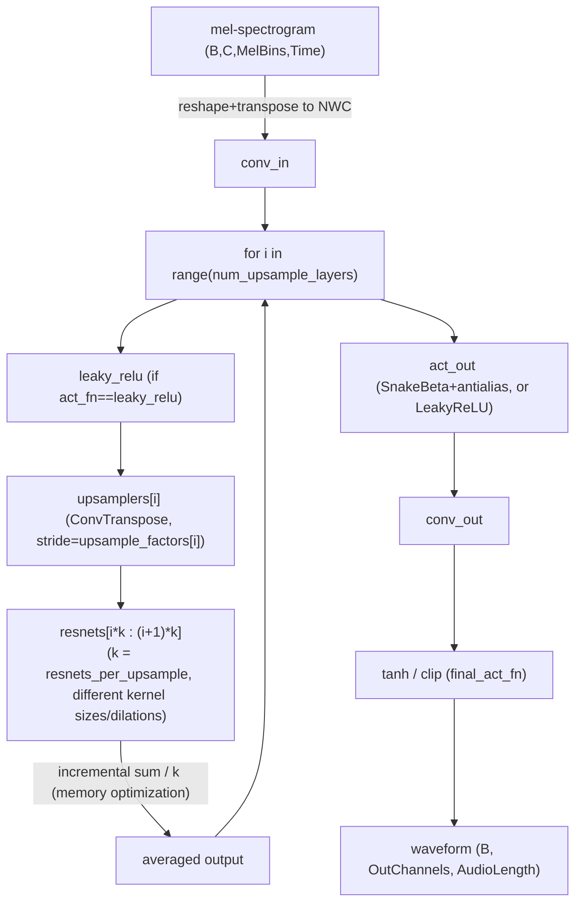

# maxdiffusion/models/ltx2/vocoder_ltx2 — HiFi-GAN-style neural vocoder (multi-receptive-field fusion)

## Overview
`LTX2Vocoder` converts a mel-spectrogram into a raw audio waveform via a HiFi-GAN-style architecture: a stack of transposed-conv upsampling stages, each followed by several parallel dilated 1D ResNet blocks of *different* kernel sizes whose outputs are averaged (multi-receptive-field fusion) — its own docstring: "LTX 2.0 vocoder for converting generated mel spectrograms back to audio waveforms."

## Diagram

## Design rationale (why it's built this way)
- **Multiple parallel ResNet blocks per upsample stage, each with a different kernel size/dilation set ([`resnets_per_upsample`](../catalog/src/maxdiffusion/models/ltx2/vocoder_ltx2.md#LTX2Vocoder.resnets_per_upsample) entries per stage from `resnet_kernel_sizes`/`resnet_dilations`), then averaged** — this is HiFi-GAN's multi-receptive-field-fusion (MRF) technique: kernels of different sizes capture different temporal receptive fields at the same resolution stage, and averaging their outputs blends multiple receptive-field scales rather than committing to a single one.
- **The per-stage average is computed by incremental summation, not `jnp.mean(jnp.stack(...))`** — the source comment directly above the loop states the reason: `"# Accumulate ResNet outputs (Memory Optimization)"`; summing into `res_sum` one ResNet output at a time and dividing once at the end avoids ever materializing all `resnets_per_upsample` ResNet outputs simultaneously as a stacked tensor, trading a longer dependency chain for lower peak memory.
- **`AntiAliasAct1d` wraps the final activation only when `act_fn` is `"snakebeta"`/`"snake"`**, not for `"leaky_relu"` — anti-aliased activation (via a Kaiser-windowed sinc filter, [`kaiser_sinc_filter1d`](../catalog/src/maxdiffusion/models/ltx2/vocoder_ltx2.md#kaiser_sinc_filter1d)) exists specifically to counteract the periodic-nonlinearity aliasing that Snake-family activations are known to introduce at high frequencies — a concern that doesn't apply the same way to a simple leaky ReLU.

## Entry points
- [`LTX2Vocoder.__call__`](../catalog/src/maxdiffusion/models/ltx2/vocoder_ltx2.md#LTX2Vocoder.__call__) — the full mel-to-waveform forward pass.
- [`ResBlock.__call__`](../catalog/src/maxdiffusion/models/ltx2/vocoder_ltx2.md#ResBlock.__call__) — the per-kernel-size dilated residual block every vocoder stage's [`resnets`](../catalog/src/maxdiffusion/models/ltx2/vocoder_ltx2.md#LTX2Vocoder.resnets) list is built from.
- [`AntiAliasAct1d.__call__`](../catalog/src/maxdiffusion/models/ltx2/vocoder_ltx2.md#AntiAliasAct1d.__call__) — the anti-aliased-activation wrapper applied as [`act_out`](../catalog/src/maxdiffusion/models/ltx2/vocoder_ltx2.md#LTX2Vocoder.act_out) when the vocoder is configured with a Snake-family activation.

## Mechanism (step-by-step)
1. [`LTX2Vocoder.__call__`](../catalog/src/maxdiffusion/models/ltx2/vocoder_ltx2.md#LTX2Vocoder.__call__) normalizes the input mel-spectrogram's layout (transposing to `time_last` if needed, per the `time_last` legacy-layout flag), flattens the channel and mel-bin axes together into one feature axis, then transposes to Flax's native `NWC` layout before running `conv_in`.
2. Still inside [`LTX2Vocoder.__call__`](../catalog/src/maxdiffusion/models/ltx2/vocoder_ltx2.md#LTX2Vocoder.__call__), for each of `num_upsample_layers` stages: apply `leaky_relu` (only if `act_fn == "leaky_relu"`), run the stage's `upsamplers[i]` (an `nnx.ConvTranspose` with the stage's configured `upsample_factors[i]` stride), then run every one of that stage's [`resnets_per_upsample`](../catalog/src/maxdiffusion/models/ltx2/vocoder_ltx2.md#LTX2Vocoder.resnets_per_upsample) [`ResBlock.__call__`](../catalog/src/maxdiffusion/models/ltx2/vocoder_ltx2.md#ResBlock.__call__)s (each with a distinct kernel size/dilation set) on the *same* upsampled input and incrementally sum their outputs before dividing by `resnets_per_upsample` — the "Memory Optimization" comment (see Design rationale) marks this incremental-sum choice explicitly.
3. After the last upsample stage, [`act_out`](../catalog/src/maxdiffusion/models/ltx2/vocoder_ltx2.md#LTX2Vocoder.act_out) runs (either the anti-aliased Snake activation or a plain `LeakyReLU`, chosen at construction time), then `conv_out` projects to the final `out_channels`, followed by an optional `tanh`/`clip` via [`final_act_fn`](../catalog/src/maxdiffusion/models/ltx2/vocoder_ltx2.md#LTX2Vocoder.final_act_fn) to bound the waveform's output range.
4. Finally, still within [`LTX2Vocoder.__call__`](../catalog/src/maxdiffusion/models/ltx2/vocoder_ltx2.md#LTX2Vocoder.__call__), the output is transposed back from `NWC` to the `(Batch, Channels, Time)` layout the surrounding PyTorch/Diffusers-derived pipeline code expects, matching this codebase's general pattern (seen also in [maxdiffusion/models/vae_flax](maxdiffusion-models-vae_flax.md)) of preserving a channel-first API boundary over Flax's channel-last internal convolutions.

## Key data structures
- [`resnets`](../catalog/src/maxdiffusion/models/ltx2/vocoder_ltx2.md#LTX2Vocoder.resnets) — a flat `nnx.List` of `ResBlock`s, indexed by stage via `i * resnets_per_upsample : (i+1) * resnets_per_upsample` slices rather than a nested per-stage list — the flattening is what the incremental-sum loop in step 2 iterates over directly.
- [`kaiser_sinc_filter1d`](../catalog/src/maxdiffusion/models/ltx2/vocoder_ltx2.md#kaiser_sinc_filter1d) — the anti-aliasing filter construction function `AntiAliasAct1d` uses; a signal-processing technique (Kaiser-windowed sinc low-pass) rather than a learned component.
- `self.total_upsample_factor` (`math.prod(upsample_factors)`) — the overall time-axis expansion ratio from mel-spectrogram frames to output audio samples; validated at construction time via length-matching checks between `upsample_kernel_sizes`/`upsample_factors` and `resnet_kernel_sizes`/`resnet_dilations` (raising `ValueError` on mismatch).

## Dynamics (design intent)
> [!inferred] Because each `ResBlock` in a stage's fused set operates on the *same* upsampled activation and their outputs are only combined by averaging (not concatenation or a learned mixing weight), the memory-optimization comment's incremental-sum trick is purely an implementation-level saving — it does not change the mathematical result versus stacking-then-averaging, only the peak-memory footprint while computing it.

## Edge cases
- [`LTX2Vocoder.__init__`](../catalog/src/maxdiffusion/models/ltx2/vocoder_ltx2.md#LTX2Vocoder.__call__) raises `ValueError` if `len(upsample_kernel_sizes) != len(upsample_factors)` or `len(resnet_kernel_sizes) != len(resnet_dilations)` — a misconfigured vocoder fails fast at construction rather than producing a shape error deep inside the forward pass.
- `act_out` is only ever assigned for `act_fn in {"snakebeta", "snake", "leaky_relu"}` (visible in the constructor's if/elif chain) — any other `act_fn` string would leave `self.act_out` unset, causing an `AttributeError` at call time rather than at construction time.

## Open questions
> [!inferred] Whether the `antialias`/`antialias_ratio`/`antialias_kernel_size` parameters also apply anti-aliasing *inside* each `ResBlock`'s activation (not just the final `act_out`) is suggested by `ResBlock`'s constructor accepting the same `antialias*` arguments, but the exact per-block application isn't covered by this packet's cited subgraph.

## See also
- [maxdiffusion/models/ltx2/autoencoder_kl_ltx2_audio](maxdiffusion-models-ltx2-autoencoder_kl_ltx2_audio.md) — the upstream mel-spectrogram VAE whose decoder output this vocoder consumes.
