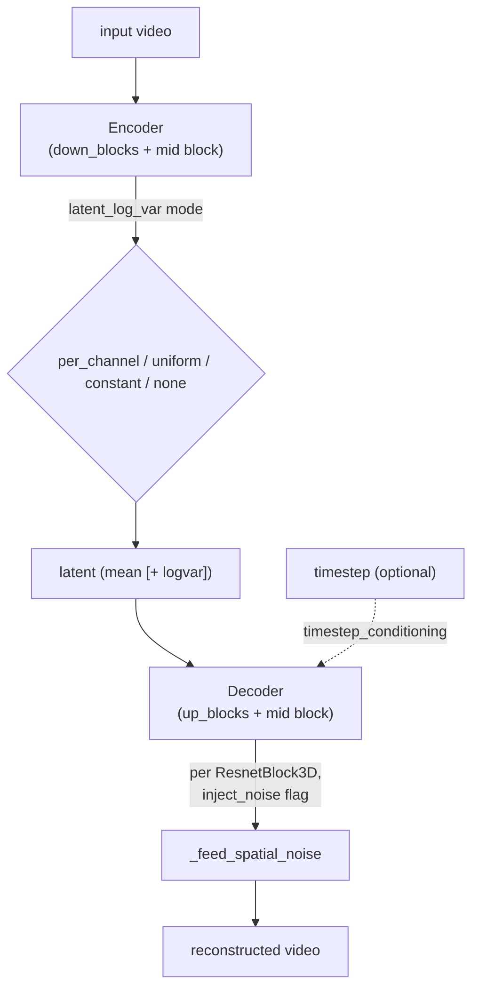

# maxdiffusion/models/ltx_video/autoencoders/causal_video_autoencoder — LTX-Video causal VAE (configurable posterior, timestep-conditioned decoder noise)

## Overview
`CausalVideoAutoencoder` (PyTorch, the LTX-Video predecessor to this codebase's LTX2/Wan video VAEs) wraps an `Encoder`/`Decoder` pair with a configurable posterior-variance strategy (`latent_log_var`: `"per_channel"`/`"uniform"`/`"constant"`/`"none"`) and a decoder that can be conditioned on a diffusion timestep and inject learned noise per ResNet block — features not present in the plainer [maxdiffusion/models/vae_flax](maxdiffusion-models-vae_flax.md) image VAE.

## Diagram

## Design rationale (why it's built this way)
- **`latent_log_var` is a pluggable posterior-variance strategy, not a fixed choice** — `"per_channel"` (the default when the model uses `double_z`, i.e. the encoder outputs both mean and log-variance per channel, the standard KL-VAE parameterization), `"uniform"`/`"constant"` (a single scalar or fixed variance rather than per-channel/per-position), or `"none"` (deterministic, no variance at all). The constructor raises `ValueError` if `use_quant_conv and latent_log_var in ["uniform", "constant"]` — those two reduced-variance modes are incompatible with a quant-conv bottleneck, presumably because the quant conv's per-channel structure assumes a per-channel variance representation.
- **Timestep conditioning and per-block noise injection make the decoder robust to slightly-imperfect latents.** `timestep_conditioning` (passed to `Decoder`) and per-`ResnetBlock3D` `inject_noise` flags let the decoder behave less like a fixed deterministic function of the latent and more like a diffusion-aware reconstruction step — consistent with techniques (seen in some video-diffusion VAEs) where the decoder is trained to denoise/stabilize against the specific imperfections a diffusion model's sampled latents exhibit, rather than only ever seeing "clean" encoder-produced latents during training.
- **`SpaceToDepthDownsample`/`DepthToSpaceUpsample` mirror the same space-to-depth reshuffle** documented in [wan/autoencoder_kl_wan_2p2](maxdiffusion-models-wan-autoencoder_kl_wan_2p2.md)'s `WanPatchify`/`WanUnpatchify` — the same "shrink spatial resolution, grow channel depth before convolving" idea appearing independently in this earlier LTX-Video codebase.

## Entry points
- [`Encoder.forward`](../catalog/src/maxdiffusion/models/ltx_video/autoencoders/causal_video_autoencoder.md#Encoder.forward) — runs [`down_blocks`](../catalog/src/maxdiffusion/models/ltx_video/autoencoders/causal_video_autoencoder.md#Encoder.down_blocks) then the mid block, producing the latent (and log-variance, depending on [`latent_log_var`](../catalog/src/maxdiffusion/models/ltx_video/autoencoders/causal_video_autoencoder.md#Encoder.latent_log_var) mode).
- [`Decoder.forward`](../catalog/src/maxdiffusion/models/ltx_video/autoencoders/causal_video_autoencoder.md#Decoder.forward) — runs the mid block then [`up_blocks`](../catalog/src/maxdiffusion/models/ltx_video/autoencoders/causal_video_autoencoder.md#Decoder.up_blocks), optionally conditioned on a timestep when [`timestep_conditioning`](../catalog/src/maxdiffusion/models/ltx_video/autoencoders/causal_video_autoencoder.md#Decoder.timestep_conditioning) is enabled.
- [`ResnetBlock3D.forward`](../catalog/src/maxdiffusion/models/ltx_video/autoencoders/causal_video_autoencoder.md#ResnetBlock3D.forward) / [`_feed_spatial_noise`](../catalog/src/maxdiffusion/models/ltx_video/autoencoders/causal_video_autoencoder.md#ResnetBlock3D._feed_spatial_noise) — the per-block forward and its noise-injection helper, invoked once per block when that block's [`inject_noise`](../catalog/src/maxdiffusion/models/ltx_video/autoencoders/causal_video_autoencoder.md#ResnetBlock3D.inject_noise) flag is set.

## Mechanism (step-by-step)
1. `CausalVideoAutoencoder.__init__` (visible in source) reads [`latent_log_var`](../catalog/src/maxdiffusion/models/ltx_video/autoencoders/causal_video_autoencoder.md#Encoder.latent_log_var) from config (defaulting to `"per_channel"` if `double_z` else `"none"`), validates it against `use_quant_conv`, and forwards it to the `Encoder` constructor along with [`timestep_conditioning`](../catalog/src/maxdiffusion/models/ltx_video/autoencoders/causal_video_autoencoder.md#Decoder.timestep_conditioning) to the `Decoder` constructor.
2. [`Encoder.forward`](../catalog/src/maxdiffusion/models/ltx_video/autoencoders/causal_video_autoencoder.md#Encoder.forward)'s behavior branches on [`latent_log_var`](../catalog/src/maxdiffusion/models/ltx_video/autoencoders/causal_video_autoencoder.md#Encoder.latent_log_var) (`if/elif` over `"per_channel"`/`"uniform"`/`"constant"`, visible in source), which determines how the encoder's final projection is shaped and interpreted — `"per_channel"` doubles the output channel count (mean + log-var per channel, the `double_z` convention also used by [maxdiffusion/models/vae_flax](maxdiffusion-models-vae_flax.md)'s image VAE), while `"uniform"`/`"constant"` instead produce a single shared variance value applied uniformly.
3. `Decoder`'s per-block construction threads [`timestep_conditioning`](../catalog/src/maxdiffusion/models/ltx_video/autoencoders/causal_video_autoencoder.md#Decoder.timestep_conditioning) and each block's [`inject_noise`](../catalog/src/maxdiffusion/models/ltx_video/autoencoders/causal_video_autoencoder.md#ResnetBlock3D.inject_noise) flag (read from `block_params.get("inject_noise", False)`) into every [`ResnetBlock3D`](../catalog/src/maxdiffusion/models/ltx_video/autoencoders/causal_video_autoencoder.md#ResnetBlock3D) — noise injection is therefore configurable per resolution stage, not a single global on/off switch.
4. [`ResnetBlock3D.forward`](../catalog/src/maxdiffusion/models/ltx_video/autoencoders/causal_video_autoencoder.md#ResnetBlock3D.forward) calls [`_feed_spatial_noise`](../catalog/src/maxdiffusion/models/ltx_video/autoencoders/causal_video_autoencoder.md#ResnetBlock3D._feed_spatial_noise) when its [`inject_noise`](../catalog/src/maxdiffusion/models/ltx_video/autoencoders/causal_video_autoencoder.md#ResnetBlock3D.inject_noise) flag is active, adding a learned-scale noise term at that point in the block's forward computation, alongside its [`norm1`](../catalog/src/maxdiffusion/models/ltx_video/autoencoders/causal_video_autoencoder.md#ResnetBlock3D.norm1)/[`norm2`](../catalog/src/maxdiffusion/models/ltx_video/autoencoders/causal_video_autoencoder.md#ResnetBlock3D.norm2)/[`norm3`](../catalog/src/maxdiffusion/models/ltx_video/autoencoders/causal_video_autoencoder.md#ResnetBlock3D.norm3)/[`non_linearity`](../catalog/src/maxdiffusion/models/ltx_video/autoencoders/causal_video_autoencoder.md#ResnetBlock3D.non_linearity) sequence.
5. [`UNetMidBlock3D`](../catalog/src/maxdiffusion/models/ltx_video/autoencoders/causal_video_autoencoder.md#UNetMidBlock3D) sits between the down/up-block stacks in both `Encoder` and `Decoder`, following the same encoder-mid-decoder shape as this codebase's other VAEs ([maxdiffusion/models/vae_flax](maxdiffusion-models-vae_flax.md), [ltx2/autoencoder_kl_ltx2](maxdiffusion-models-ltx2-autoencoder_kl_ltx2.md)).

## Key data structures
- `latent_log_var` (string enum: `"per_channel"`/`"uniform"`/`"constant"`/`"none"`) — the posterior-variance representation choice, validated against `use_quant_conv` at construction time.
- `ResnetBlock3D`'s per-block `norm1`/`norm2`/`norm3` (three norms, one more than [maxdiffusion/models/resnet_flax](maxdiffusion-models-resnet_flax.md)'s two-norm `FlaxResnetBlock2D`) and its `causal` flag — this ResNet block variant has an extra normalization stage and an explicit per-block causality toggle.
- `DepthToSpaceUpsample`/`SpaceToDepthDownsample` — the up/down-sampling primitives implementing the space-to-depth channel/resolution tradeoff.

## Dynamics (design intent)
> [!inferred] The three `latent_log_var` modes (`"per_channel"`, `"uniform"`, `"constant"`) represent a spectrum from most expressive (independent variance per channel and spatial position) to least expressive (one fixed variance for the whole latent) — the more constrained modes plausibly reduce the KL-divergence regularization's degrees of freedom, trading some reconstruction/posterior flexibility for a simpler, more constrained latent space, though the specific tradeoff isn't stated in this packet's cited subgraph.

## Edge cases
- `CausalVideoAutoencoder.__init__` raises `ValueError` for the `use_quant_conv=True` + `latent_log_var in ("uniform","constant")` combination — this VAE cannot be configured with both a quant-conv bottleneck and a reduced-expressiveness variance mode simultaneously.
- The module includes `test_vae_patchify_unpatchify`/`demo_video_autoencoder_forward_backward` functions directly in the model source file (visible in source, module-level `def`s alongside the model classes) rather than in a separate test file — an unusual co-location of a smoke-test/demo with production model code.

## Open questions
> [!inferred] Whether the `timestep_conditioning`/`inject_noise` decoder-robustness features are actually exercised by current LTX-Video training/inference configs in this codebase, or are present as unused-by-default options, is not established by this packet's cited subgraph.

## See also
- [maxdiffusion/models/vae_flax](maxdiffusion-models-vae_flax.md) — the simpler two-norm image VAE this file's three-norm `ResnetBlock3D` and configurable posterior extend beyond.
- [maxdiffusion/models/wan/autoencoder_kl_wan_2p2](maxdiffusion-models-wan-autoencoder_kl_wan_2p2.md) — shares the same space-to-depth down/up-sampling idea via its `WanPatchify`/`WanUnpatchify`.
- [maxdiffusion/models/ltx2/autoencoder_kl_ltx2](maxdiffusion-models-ltx2-autoencoder_kl_ltx2.md) — the LTX2 successor video VAE, using overlapping-tile decode instead of this file's mechanism for memory bounding.
