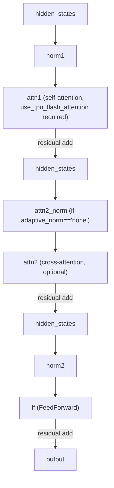

# maxdiffusion/models/ltx_video/transformers/attention — LTX-Video JAX attention (TPU-flash-only)

<!-- connect:up:begin -->
> **Cross-repo concept:** part of [flash-attention](../../../concepts/flash-attention.md) across this wiki's repos.
<!-- connect:up:end -->
## Overview
This is the `flax.linen` JAX port of LTX-Video's transformer attention block — `BasicTransformerBlock` with separate [`attn1`](../catalog/src/maxdiffusion/models/ltx_video/transformers/attention.md#BasicTransformerBlock.attn1) (self-attention) and [`attn2`](../catalog/src/maxdiffusion/models/ltx_video/transformers/attention.md#BasicTransformerBlock.attn2) (optional cross-attention) sub-modules plus an [`ff`](../catalog/src/maxdiffusion/models/ltx_video/transformers/attention.md#BasicTransformerBlock.ff) feed-forward — paired one-to-one with a PyTorch reference implementation in the sibling [ltx_video/transformers_pytorch/attention](maxdiffusion-models-ltx_video-transformers_pytorch-attention.md) module. Unlike the rest of this codebase's attention layers, this port hard-requires TPU flash attention: `setup()` asserts `self.use_tpu_flash_attention`, with the message "Jax version only use tpu_flash attention."

## Diagram

## Design rationale (why it's built this way)
- **This JAX port is deliberately TPU-flash-attention-only, unlike the rest of this codebase's attention layers** (which dispatch through [attention_flax](maxdiffusion-models-attention_flax.md)'s multi-kernel `KERNEL_REGISTRY`) — `setup()`'s assertion (`"Jax version only use tpu_flash attention."`) means there's no dense/dot-product fallback path in this specific model port, a stricter requirement than the rest of the codebase's flash-below-threshold-falls-back-to-dense pattern.
- **`standardization_norm` and `adaptive_norm` are independently configurable enums** (`"layer_norm"`/`"rms_norm"`, and `"single_scale_shift"`/`"single_scale"`/`"none"`), asserted valid at the top of `setup()` — this file supports several distinct normalization/conditioning strategies within one class rather than needing a separate block class per combination.
- **`attn2_norm` is only constructed `if self.adaptive_norm == "none"`** — when adaptive normalization is active (the AdaLN-style default), the cross-attention normalization is presumably folded into the AdaLN conditioning itself rather than needing its own separate norm layer.

## Entry points
- [`BasicTransformerBlock.attn1`](../catalog/src/maxdiffusion/models/ltx_video/transformers/attention.md#BasicTransformerBlock.attn1) — the self-attention sub-module every block constructs unconditionally.
- [`BasicTransformerBlock.attn2`](../catalog/src/maxdiffusion/models/ltx_video/transformers/attention.md#BasicTransformerBlock.attn2) — the optional cross-attention sub-module, constructed only when `cross_attention_dim is not None or double_self_attention`.
- [`BasicTransformerBlock.ff`](../catalog/src/maxdiffusion/models/ltx_video/transformers/attention.md#BasicTransformerBlock.ff) — the feed-forward sub-module every block constructs, taking `activation_fn`/`ffn_dim_mult`/`ff_inner_dim` from the block's config.
- [`BasicTransformerBlock.__call__`](../catalog/src/maxdiffusion/models/ltx_video/transformers/attention.md#BasicTransformerBlock.__call__) — the block's forward pass, running norm→self-attn→(norm→cross-attn)→norm→ff with residual adds at each stage.

## Mechanism (step-by-step)
1. `setup()` selects a normalization constructor (`make_norm_layer`) based on `standardization_norm` (visible in source, not itself part of this packet's cited subgraph) — either `nn.LayerNorm` or the file's own `RMSNorm` — reused for every norm this block constructs; separately, [`adaptive_norm`](../catalog/src/maxdiffusion/models/ltx_video/transformers/attention.md#BasicTransformerBlock.adaptive_norm) selects between `"single_scale_shift"`/`"single_scale"`/`"none"` conditioning strategies, both asserted valid at the top of `setup()`.
2. [`attn1`](../catalog/src/maxdiffusion/models/ltx_video/transformers/attention.md#BasicTransformerBlock.attn1) is constructed as an `Attention` module with `use_tpu_flash_attention=self.use_tpu_flash_attention` (asserted `True`), `qk_norm`, and `use_rope` forwarded from the block's own config — self-attention is unconditional in every block.
3. [`attn2`](../catalog/src/maxdiffusion/models/ltx_video/transformers/attention.md#BasicTransformerBlock.attn2) is constructed identically but only if the block needs cross-attention (`cross_attention_dim is not None`) or "double self-attention" (`double_self_attention`, using the same query source for a second self-attention-shaped pass) — when neither condition holds, both [`attn2`](../catalog/src/maxdiffusion/models/ltx_video/transformers/attention.md#BasicTransformerBlock.attn2) and [`attn2_norm`](../catalog/src/maxdiffusion/models/ltx_video/transformers/attention.md#BasicTransformerBlock.attn2_norm) are set to `None`.
4. [`ff`](../catalog/src/maxdiffusion/models/ltx_video/transformers/attention.md#BasicTransformerBlock.ff) is a `FeedForward` module (visible in source) parameterized by `activation_fn` (default `"geglu"`) and the block's dtype/precision config, applied after `norm2`.
5. [`BasicTransformerBlock.__call__`](../catalog/src/maxdiffusion/models/ltx_video/transformers/attention.md#BasicTransformerBlock.__call__) chains `norm1 → `[`attn1`](../catalog/src/maxdiffusion/models/ltx_video/transformers/attention.md#BasicTransformerBlock.attn1)` → residual`, then conditionally `attn2_norm → `[`attn2`](../catalog/src/maxdiffusion/models/ltx_video/transformers/attention.md#BasicTransformerBlock.attn2)` → residual` when cross-attention is present, then `norm2 → `[`ff`](../catalog/src/maxdiffusion/models/ltx_video/transformers/attention.md#BasicTransformerBlock.ff)` → residual` — the standard pre-norm transformer block shape, with the middle stage made optional.

## Key data structures
- `Attention` (visible in source, constructed as [`attn1`](../catalog/src/maxdiffusion/models/ltx_video/transformers/attention.md#BasicTransformerBlock.attn1)/[`attn2`](../catalog/src/maxdiffusion/models/ltx_video/transformers/attention.md#BasicTransformerBlock.attn2)) — this module's own `AttentionOp`/`ExplicitAttention` sub-classes (visible in source) implement the TPU-flash dispatch this file's `BasicTransformerBlock` requires.
- `SkipLayerStrategy` (visible in source, an `Enum`) — suggests this model supports selectively skipping specific layers during some inference mode (e.g. classifier-free-guidance-adjacent techniques), though its consumption isn't covered by this packet's cited subgraph.

## Dynamics (design intent)
> [!inferred] The hard `use_tpu_flash_attention` requirement, combined with this file living in a `transformers/` (JAX) directory paired one-to-one with a `transformers_pytorch/` reference, suggests this port was written specifically as a TPU-targeted production path rather than a general-purpose portable implementation — correctness-testing against the PyTorch reference presumably happens on GPU/CPU where the PyTorch model runs natively, while this JAX port commits to the TPU-specific kernel from the start.

## Edge cases
- `setup()`'s `assert self.use_tpu_flash_attention` means constructing this block with `use_tpu_flash_attention=False` fails immediately at model-construction time with an `AssertionError`, not a later runtime error — there is no code path in this file for running without TPU flash attention.

## Open questions
> [!inferred] Whether `Attention`'s `AttentionOp`/`ExplicitAttention` classes (visible in source, referenced by `attn1`/`attn2` but not deeply covered by this packet's cited subgraph) reuse the same `KERNEL_REGISTRY` dispatch as [attention_flax](maxdiffusion-models-attention_flax.md), or implement an independent TPU-flash-only path specific to this LTX-Video port, is not resolvable from this packet alone.

## See also
- [maxdiffusion/models/ltx_video/transformers_pytorch/attention](maxdiffusion-models-ltx_video-transformers_pytorch-attention.md) — the PyTorch reference implementation this JAX port mirrors.
- [maxdiffusion/models/attention_flax](maxdiffusion-models-attention_flax.md) — this codebase's more general multi-kernel attention dispatch, contrasted against this file's TPU-flash-only requirement.
