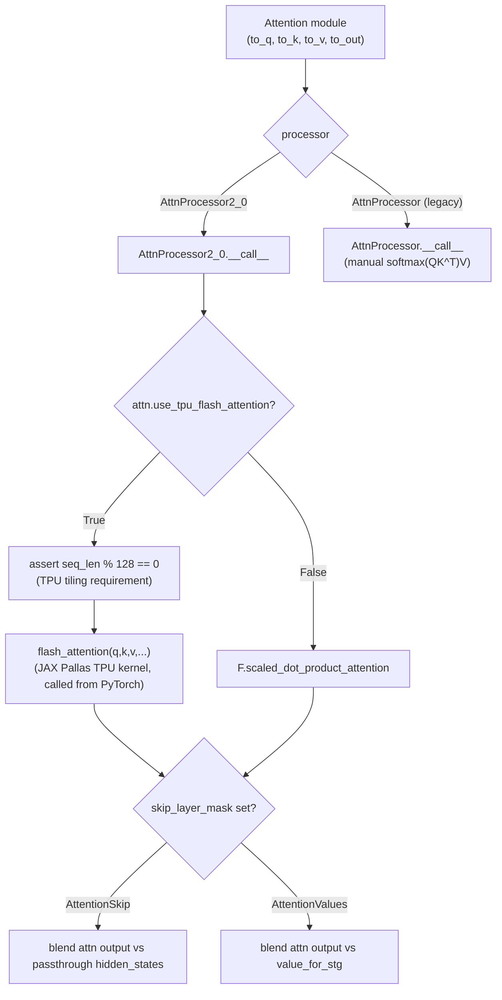

# maxdiffusion/models/ltx_video/transformers_pytorch/attention — PyTorch reference (calls JAX Pallas flash attention directly)

## Overview
This is the PyTorch reference implementation of LTX-Video's attention, paired with the JAX/Flax port in [ltx_video/transformers/attention](maxdiffusion-models-ltx_video-transformers-attention.md). It follows the standard Diffusers "attention processor" pattern — pluggable processor objects ([`AttnProcessor2_0`](../catalog/src/maxdiffusion/models/ltx_video/transformers_pytorch/attention.md#AttnProcessor2_0.__call__) using PyTorch 2.0's `scaled_dot_product_attention`, [`AttnProcessor`](../catalog/src/maxdiffusion/models/ltx_video/transformers_pytorch/attention.md#AttnProcessor.__call__) using a manual softmax) operating on a shared `Attention` module — but [`AttnProcessor2_0.__call__`](../catalog/src/maxdiffusion/models/ltx_video/transformers_pytorch/attention.md#AttnProcessor2_0.__call__) additionally branches on `attn.use_tpu_flash_attention` to call a **JAX Pallas TPU flash-attention kernel directly from PyTorch model code**, the same cross-framework kernel-bridging pattern documented in [learning-machine/custom_kernel_spmd](../../../learning-machine/concepts/custom_kernel_spmd.md).

## Diagram

## Design rationale (why it's built this way)
- **`use_tpu_flash_attention` lets one PyTorch `Attention` module transparently swap its backend between a native PyTorch op and a JAX Pallas TPU kernel**, without changing the surrounding model code — the flag lives on the `attn` module itself, and [`AttnProcessor2_0.__call__`](../catalog/src/maxdiffusion/models/ltx_video/transformers_pytorch/attention.md#AttnProcessor2_0.__call__) branches on it at the point where the actual attention op would run, matching the same "call into JAX/Pallas via a bridge, keep PyTorch code otherwise unchanged" pattern seen in [learning-machine/custom_kernel_spmd](../../../learning-machine/concepts/custom_kernel_spmd.md)'s `SPMDFlashAttention`.
- **The TPU tiling constraint is enforced as a hard assertion directly in the model's forward pass**: `assert query.shape[2] % 128 == 0, "ERROR: QUERY SHAPE must be divisible by 128 (TPU limitation)"` (and the same for key) — this makes the Pallas kernel's block-size requirement visible and fail-fast at the PyTorch model level, rather than surfacing as an opaque XLA compilation error deep inside the kernel.
- **Skip-layer-guidance (`SkipLayerStrategy`) is implemented as a post-hoc blend between the real attention output and an alternate value, not as a structural change to the attention computation** — `AttentionSkip` blends the attention output against the pre-attention `hidden_states` (effectively skipping this layer's contribution), while `AttentionValues` blends against a separate `value_for_stg` tensor — both computed as `real_output * mask + alternate * (1 - mask)`, letting a caller apply spatiotemporal guidance per-token via `skip_layer_mask` without a separate no-attention code path.

## Entry points
- [`AttnProcessor2_0.__call__`](../catalog/src/maxdiffusion/models/ltx_video/transformers_pytorch/attention.md#AttnProcessor2_0.__call__) — the modern processor; every call site constructing an `Attention` module with the default processor reaches here, and it's the one with the TPU-flash-attention branch.
- [`AttnProcessor.__call__`](../catalog/src/maxdiffusion/models/ltx_video/transformers_pytorch/attention.md#AttnProcessor.__call__) — the legacy manual-softmax processor, used for older/compatibility code paths; it does not reference `use_tpu_flash_attention` at all (per its own calls/refs list), so it never routes to the Pallas kernel.
- [`BasicTransformerBlock.forward`](../catalog/src/maxdiffusion/models/ltx_video/transformers_pytorch/attention.md#BasicTransformerBlock.forward) — the block-level forward pass, accepting `freqs_cis` (rotary embedding) and `skip_layer_mask`/`skip_layer_strategy` directly as parameters that flow down to whichever attention processor is active.

## Mechanism (step-by-step)
1. [`AttnProcessor2_0.__call__`](../catalog/src/maxdiffusion/models/ltx_video/transformers_pytorch/attention.md#AttnProcessor2_0.__call__) projects `hidden_states` through `attn.to_q`/`to_k`/`to_v`, applies `q_norm`/`k_norm` if configured, applies rotary embeddings via `apply_rotary_emb` when `attn.use_rope`, and reshapes to `(batch, heads, seq, head_dim)`.
2. Still inside [`AttnProcessor2_0.__call__`](../catalog/src/maxdiffusion/models/ltx_video/transformers_pytorch/attention.md#AttnProcessor2_0.__call__): if `attn.use_tpu_flash_attention`, it builds `q_segment_indexes` from any supplied `attention_mask` (asserting the mask's KV-length dimension matches `key.shape[2]`), asserts both query and key sequence lengths are multiples of 128, then calls `flash_attention(q=query, k=key, v=value, q_segment_ids=..., kv_segment_ids=attention_mask, sm_scale=attn.scale)` — a JAX-side Pallas kernel invoked directly from this PyTorch forward pass.
3. Otherwise, [`AttnProcessor2_0.__call__`](../catalog/src/maxdiffusion/models/ltx_video/transformers_pytorch/attention.md#AttnProcessor2_0.__call__) falls back to `F.scaled_dot_product_attention(query, key, value, attn_mask=attention_mask, dropout_p=0.0, is_causal=False)` — PyTorch's native fused-attention op.
4. After either path, [`AttnProcessor2_0.__call__`](../catalog/src/maxdiffusion/models/ltx_video/transformers_pytorch/attention.md#AttnProcessor2_0.__call__) reshapes the result back to `(batch, seq, heads*head_dim)`; if `skip_layer_mask` is set, the output is blended against either the pre-attention `hidden_states` (`SkipLayerStrategy.AttentionSkip`) or a separately-provided `value_for_stg` (`SkipLayerStrategy.AttentionValues`) using the mask as a per-token interpolation weight.
5. [`AttnProcessor.__call__`](../catalog/src/maxdiffusion/models/ltx_video/transformers_pytorch/attention.md#AttnProcessor.__call__) — the legacy path — instead calls `head_to_batch_dim`/`get_attention_scores`/`batch_to_head_dim` (visible in source; the pre-SDPA, manual-softmax-based Diffusers attention pattern), never touching `use_tpu_flash_attention` at all.

## Key data structures
- `Attention` (visible in source, the shared module both processors operate on) — holds `to_q`/`to_k`/`to_v`/`to_out` projections plus configuration flags (`use_tpu_flash_attention`, `use_rope`, `scale`, `heads`) that the processor reads but does not own.
- `SkipLayerStrategy` (visible in source, shared with the JAX port via the sibling `ltx_video/transformers/attention` module's import) — an `Enum` of `AttentionSkip`/`AttentionValues`, the two spatiotemporal-guidance blending modes.

## Dynamics (design intent)
> [!inferred] Having the same PyTorch model directly call a JAX Pallas kernel (rather than only the JAX/Flax port using it) suggests this codebase's PyTorch LTX-Video path is *also* meant to run on TPU (via a `torch_xla`/`torch_xla2`-style bridge, matching [learning-machine/custom_kernel_spmd](../../../learning-machine/concepts/custom_kernel_spmd.md)'s pattern) rather than being a CPU/GPU-only reference — the hard 128-divisibility assertion, which is meaningless off-TPU, only makes sense if this exact code path is expected to execute on TPU hardware.

## Edge cases
- The `assert query.shape[2] % 128 == 0` / `assert key.shape[2] % 128 == 0` checks fail hard (raising `AssertionError`, not falling back to `scaled_dot_product_attention`) whenever `use_tpu_flash_attention=True` and the sequence length doesn't divide evenly by 128 — a caller must pad sequences to a multiple of 128 themselves before reaching this code path.
- [`AttnProcessor.__call__`](../catalog/src/maxdiffusion/models/ltx_video/transformers_pytorch/attention.md#AttnProcessor.__call__) has no `use_tpu_flash_attention`/`skip_layer_mask` handling at all — a caller relying on TPU flash attention or spatiotemporal guidance must ensure the model is configured to use `AttnProcessor2_0`, not the legacy processor.

## Open questions
> [!inferred] The exact mechanism by which this PyTorch code invokes the JAX-side `flash_attention` function (a `torch_xla`/`torch_xla2` custom-kernel bridge, an XLA custom call, or some other interop) is not shown within this packet's cited subgraph — only the call site and its TPU-tiling preconditions are visible.

## See also
- [maxdiffusion/models/ltx_video/transformers/attention](maxdiffusion-models-ltx_video-transformers-attention.md) — the JAX/Flax port of this same model, which similarly hard-requires TPU flash attention.
- [learning-machine/custom_kernel_spmd](../../../learning-machine/concepts/custom_kernel_spmd.md) — a different repo's PyTorch-calls-JAX-Pallas-kernel bridge (`SPMDFlashAttention`), the same cross-framework pattern this file exercises.
