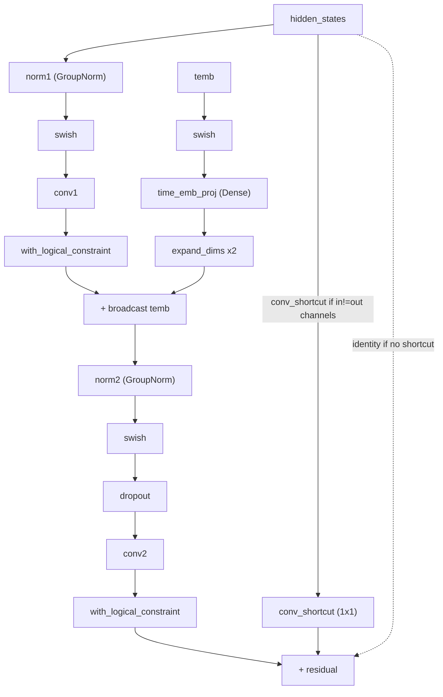

# maxdiffusion/models/resnet_flax — UNet ResNet block (sharded conv/dense layers)

## Overview
`FlaxResnetBlock2D` is the timestep-conditioned residual convolution block used throughout MaxDiffusion's UNet-style image diffusion models (see the `setup()` call sites in [unet_2d_blocks_flax](maxdiffusion-models-unet_2d_blocks_flax.md)) — GroupNorm → SiLU → conv, inject the timestep embedding additively, GroupNorm → SiLU → dropout → conv again, then add the (optionally 1×1-conv-projected) residual. Every conv/dense kernel is initialized with an explicit logical partition spec, and every intermediate activation is re-asserted against the same logical axes — sharding is treated as part of the block's definition, not an afterthought applied externally.

## Diagram

## Design rationale (why it's built this way)
The compute-dtype (`dtype`) vs. storage-dtype (`weights_dtype`) split, and the explicit `nn.with_logical_partitioning`/`nn.with_logical_constraint` calls on every conv/dense boundary, reflect this codebase's general pattern of making sharding and mixed-precision decisions part of every layer's definition rather than relying on GSPMD to infer them correctly from usage alone — consistent with the repeated-constraint pattern seen in the sibling [unet_2d_blocks_flax](maxdiffusion-models-unet_2d_blocks_flax.md) blocks that construct this one.

## Entry points
- [`FlaxResnetBlock2D.__call__`](../catalog/src/maxdiffusion/models/resnet_flax.md#FlaxResnetBlock2D.__call__) — the block's forward pass, invoked once per ResNet block position inside every UNet down-block, mid-block, and up-block ([`setup`](../catalog/src/maxdiffusion/models/unet_2d_blocks_flax.md#FlaxDownBlock2D.setup), [`setup`](../catalog/src/maxdiffusion/models/unet_2d_blocks_flax.md#FlaxCrossAttnDownBlock2D.setup), [`setup`](../catalog/src/maxdiffusion/models/unet_2d_blocks_flax.md#FlaxUNetMidBlock2DCrossAttn.setup), [`setup`](../catalog/src/maxdiffusion/models/unet_2d_blocks_flax.md#FlaxCrossAttnUpBlock2D.setup), [`setup`](../catalog/src/maxdiffusion/models/unet_2d_blocks_flax.md#FlaxUpBlock2D.setup) each construct one or more `FlaxResnetBlock2D` instances).

## Mechanism (step-by-step)
1. `FlaxResnetBlock2D`'s (undocumented in this packet, but visible in source) `setup()` builds two `nn.GroupNorm`s ([`norm1`](../catalog/src/maxdiffusion/models/resnet_flax.md#FlaxResnetBlock2D.norm1), [`norm2`](../catalog/src/maxdiffusion/models/resnet_flax.md#FlaxResnetBlock2D.norm2)) sized by [`norm_num_groups`](../catalog/src/maxdiffusion/models/resnet_flax.md#FlaxResnetBlock2D.norm_num_groups) (default 32), a [`dropout`](../catalog/src/maxdiffusion/models/resnet_flax.md#FlaxResnetBlock2D.dropout) layer at [`dropout_prob`](../catalog/src/maxdiffusion/models/resnet_flax.md#FlaxResnetBlock2D.dropout_prob), and two 3×3 `nn.Conv`s ([`conv1`](../catalog/src/maxdiffusion/models/resnet_flax.md#FlaxResnetBlock2D.conv1), [`conv2`](../catalog/src/maxdiffusion/models/resnet_flax.md#FlaxResnetBlock2D.conv2)) — every conv/dense layer's kernel is initialized via `nn.with_logical_partitioning(nn.initializers.lecun_normal(), ("keep_1","keep_2","conv_in","conv_out"))`, tying weight sharding to Flax's logical-axis-rule system from the start rather than leaving it to be inferred.
2. Whether a 1×1 shortcut convolution ([`conv_shortcut`](../catalog/src/maxdiffusion/models/resnet_flax.md#FlaxResnetBlock2D.conv_shortcut)) is created depends on [`use_nin_shortcut`](../catalog/src/maxdiffusion/models/resnet_flax.md#FlaxResnetBlock2D.use_nin_shortcut): if left `None` (the default), it's computed as `in_channels != out_channels` — the shortcut conv exists exactly when the block changes channel count, since a bare residual add would otherwise be shape-invalid.
3. [`FlaxResnetBlock2D.__call__`](../catalog/src/maxdiffusion/models/resnet_flax.md#FlaxResnetBlock2D.__call__) runs `norm1 → swish → conv1`, applies `nn.with_logical_constraint(hidden_states, ("conv_batch","height","keep_2","out_channels"))` immediately after `conv1` (and again after `conv2`) — re-asserting the logical sharding axes at each conv boundary rather than relying on it propagating implicitly through the op.
4. The timestep embedding `temb` is passed through `swish` and [`time_emb_proj`](../catalog/src/maxdiffusion/models/resnet_flax.md#FlaxResnetBlock2D.time_emb_proj) (an `nn.Dense` to `out_channels`), then broadcast-added to the spatial feature map via two `jnp.expand_dims` calls (inserting the height/width axes) — this is the standard diffusion-UNet mechanism for conditioning every spatial location on the same scalar-per-channel timestep signal.
5. After the second `norm2 → swish → dropout → conv2` sequence, the residual path applies [`conv_shortcut`](../catalog/src/maxdiffusion/models/resnet_flax.md#FlaxResnetBlock2D.conv_shortcut) (if present) to the *original* input before the final `hidden_states + residual` add — so channel-count-changing blocks never add mismatched-channel tensors.

## Key data structures
- Type aliases defined at module scope — [`Array`](../catalog/src/maxdiffusion/models/resnet_flax.md#Array) (`jnp.ndarray`), [`DType`](../catalog/src/maxdiffusion/models/resnet_flax.md#DType) (`jnp.dtype`), [`PRNGKey`](../catalog/src/maxdiffusion/models/resnet_flax.md#PRNGKey), [`Shape`](../catalog/src/maxdiffusion/models/resnet_flax.md#Shape), [`InitializerAxis`](../catalog/src/maxdiffusion/models/resnet_flax.md#InitializerAxis), and [`NdInitializer`](../catalog/src/maxdiffusion/models/resnet_flax.md#NdInitializer) — a callable signature `(PRNGKey, Shape, DType, InitializerAxis, InitializerAxis) -> Array` for parameter initializers that need to know both the sharding axis of the *input* and *output* dimensions, consistent with this file's convention of tying every initializer to explicit logical partition axes.
- [`FlaxResnetBlock2D`](../catalog/src/maxdiffusion/models/resnet_flax.md#FlaxResnetBlock2D.__call__)'s constructor fields — [`in_channels`](../catalog/src/maxdiffusion/models/resnet_flax.md#FlaxResnetBlock2D.in_channels), [`out_channels`](../catalog/src/maxdiffusion/models/resnet_flax.md#FlaxResnetBlock2D.out_channels) (defaults to `in_channels` when `None`), [`dtype`](../catalog/src/maxdiffusion/models/resnet_flax.md#FlaxResnetBlock2D.dtype) (activation compute dtype) versus [`weights_dtype`](../catalog/src/maxdiffusion/models/resnet_flax.md#FlaxResnetBlock2D.weights_dtype) (parameter storage dtype) — the split between compute and storage dtype is what lets the block run activations in a lower-precision compute dtype (e.g. bfloat16) while keeping parameters at a different stored precision, and [`precision`](../catalog/src/maxdiffusion/models/resnet_flax.md#FlaxResnetBlock2D.precision) (`jax.lax.Precision`, forwarded to every conv/dense).

## Dynamics (design intent)
> [!inferred] The repeated `nn.with_logical_constraint(..., ("conv_batch","height","keep_2","out_channels"))` calls after every convolution (not just once at the block boundary) suggest this codebase treats logical-axis reassertion as cheap insurance against GSPMD inferring a different (and possibly worse) sharding partway through a sequence of convolutions, rather than trusting propagation across the whole block.

## Edge cases
- [`use_nin_shortcut`](../catalog/src/maxdiffusion/models/resnet_flax.md#FlaxResnetBlock2D.use_nin_shortcut) accepts an explicit `True`/`False` override in addition to its auto-detect (`None`) default — a caller could force a shortcut conv even when channel counts match (adding an extra learned 1×1 projection) or force its absence when channel counts differ (which would fail at the final residual add).

## Open questions
> [!inferred] Whether `dtype` (compute) and `weights_dtype` (storage) are ever set to genuinely different values anywhere in this codebase's model configs, or whether the split exists purely for future flexibility, is not answerable from this packet's cited subgraph alone.

## See also
- [maxdiffusion/models/unet_2d_blocks_flax](maxdiffusion-models-unet_2d_blocks_flax.md) — the five UNet block types that each construct one or more `FlaxResnetBlock2D` instances inside their `setup()`.
