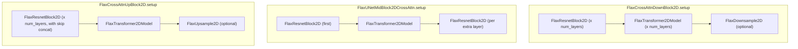

# maxdiffusion/models/unet_2d_blocks_flax — UNet down/up/mid blocks (ResNet + cross-attention composition)

## Overview
Five Flax modules — [`FlaxCrossAttnDownBlock2D`](../catalog/src/maxdiffusion/models/unet_2d_blocks_flax.md#FlaxCrossAttnDownBlock2D.setup), `FlaxDownBlock2D` (visible in source), [`FlaxCrossAttnUpBlock2D`](../catalog/src/maxdiffusion/models/unet_2d_blocks_flax.md#FlaxCrossAttnUpBlock2D.setup), [`FlaxUpBlock2D`](../catalog/src/maxdiffusion/models/unet_2d_blocks_flax.md#FlaxUpBlock2D.setup), [`FlaxUNetMidBlock2DCrossAttn`](../catalog/src/maxdiffusion/models/unet_2d_blocks_flax.md#FlaxUNetMidBlock2DCrossAttn.setup) — that compose [`FlaxResnetBlock2D`](../../maxdiffusion/concepts/maxdiffusion-models-resnet_flax.md) and `FlaxTransformer2DModel` (from [attention_flax](maxdiffusion-models-attention_flax.md)) into the standard SD-UNet down/mid/up-sampling path. Every block threads the same attention-kernel and precision configuration uniformly through every ResNet+attention pair it constructs.

## Diagram

## Design rationale (why it's built this way)
- **Every block-level parameter (`attention_kernel`, `flash_min_seq_length`, `flash_block_sizes`, `mesh`, `split_head_dim`, `quant`) is threaded identically to every ResNet+attention pair the block constructs** — a single down/up/mid-block-level config choice applies uniformly across its internal layers, matching the model-wide uniformity pattern already seen in [attention_flax](maxdiffusion-models-attention_flax.md)'s `FlaxTransformer2DModel`.
- **`split_head_dim`'s perf effect is documented directly in the class docstring**, not left implicit: `FlaxCrossAttnDownBlock2D`'s docstring states "Whether to split the head dimension into a new axis for the self-attention computation. In most cases, enabling this flag should speed up the computation for Stable Diffusion 2.x and Stable Diffusion XL" — a concrete, source-grounded performance claim tied to specific model families.

## Entry points
- [`FlaxCrossAttnDownBlock2D.setup`](../catalog/src/maxdiffusion/models/unet_2d_blocks_flax.md#FlaxCrossAttnDownBlock2D.setup) — builds the down-sampling path's `resnets`/`attentions` lists plus an optional `FlaxDownsample2D`; called once per down-block position in a UNet. Its attention-free sibling `FlaxDownBlock2D.setup` (visible in source, not itself part of this packet's cited subgraph) follows the same construction shape for UNet stages that skip cross-attention entirely.
- [`FlaxUNetMidBlock2DCrossAttn.setup`](../catalog/src/maxdiffusion/models/unet_2d_blocks_flax.md#FlaxUNetMidBlock2DCrossAttn.setup) — the bottleneck block sitting between the down- and up-paths.
- [`FlaxCrossAttnUpBlock2D.setup`](../catalog/src/maxdiffusion/models/unet_2d_blocks_flax.md#FlaxCrossAttnUpBlock2D.setup) / [`FlaxUpBlock2D.setup`](../catalog/src/maxdiffusion/models/unet_2d_blocks_flax.md#FlaxUpBlock2D.setup) — the up-sampling mirrors of the two down-block variants, additionally consuming skip-connection activations from the corresponding down-block.

## Mechanism (step-by-step)
1. [`FlaxCrossAttnDownBlock2D.setup`](../catalog/src/maxdiffusion/models/unet_2d_blocks_flax.md#FlaxCrossAttnDownBlock2D.setup) loops `num_layers` times, constructing one `FlaxResnetBlock2D` (input channels equal to the block's `in_channels` only on the first iteration, `out_channels` thereafter — the standard channel-doubling-then-constant pattern) paired with one `FlaxTransformer2DModel` per iteration, appending both into `resnets`/`attentions` lists; a `FlaxDownsample2D` is appended only if `add_downsample`.
2. [`FlaxCrossAttnDownBlock2D`](../catalog/src/maxdiffusion/models/unet_2d_blocks_flax.md#FlaxCrossAttnDownBlock2D.setup)'s `__call__` (visible in source) zips the `resnets` and `attentions` lists [`setup`](../catalog/src/maxdiffusion/models/unet_2d_blocks_flax.md#FlaxCrossAttnDownBlock2D.setup) built, running `resnet → attn` per layer and accumulating every intermediate `hidden_states` into `output_states` — these accumulated per-layer outputs are exactly the skip-connection tensors the mirroring up-block will later concatenate back in.
3. [`FlaxUNetMidBlock2DCrossAttn.setup`](../catalog/src/maxdiffusion/models/unet_2d_blocks_flax.md#FlaxUNetMidBlock2DCrossAttn.setup) constructs one extra leading `FlaxResnetBlock2D` before entering the same per-layer resnet+attention loop — the bottleneck's structure is `resnet, (attn, resnet) x num_layers`, one more resnet than attention block.
4. [`FlaxCrossAttnUpBlock2D.setup`](../catalog/src/maxdiffusion/models/unet_2d_blocks_flax.md#FlaxCrossAttnUpBlock2D.setup) mirrors the down-block's loop but sizes each `FlaxResnetBlock2D`'s input channels to account for the concatenated skip connection (`resnet_in_channels + res_skip_channels`, visible in source) — every up-block ResNet layer consumes both the running hidden state and the corresponding down-block's saved output.
5. `FlaxDownBlock2D.setup` (visible in source) / [`FlaxUpBlock2D.setup`](../catalog/src/maxdiffusion/models/unet_2d_blocks_flax.md#FlaxUpBlock2D.setup) are the no-attention variants: identical ResNet-block looping without ever constructing a `FlaxTransformer2DModel`, used at UNet resolutions/stages that don't apply cross-attention (typically the highest-resolution stages, for compute cost reasons).

## Key data structures
- Per-block `resnets`/`attentions` Python lists (constructed in every `setup()`) — plain lists of submodules, not a `ScanLayer`-style stacked-and-scanned representation; each layer is a distinct traced Flax submodule, consistent with this being an image-UNet architecture (typically far fewer layers than a transformer LLM, where the scan-for-compile-reuse pattern seen in [learning-machine's llama_ref model variants](../../../learning-machine/concepts/llama_ref-model_with_scan.md) pays off more).

## Dynamics (design intent)
> [!inferred] The consistent "loop `num_layers` times, thread every attention-kernel/precision/mesh config field identically" pattern across all five block types means changing one attention-kernel choice at the top-level model config propagates uniformly through every down/mid/up block without per-block overrides — simplifying model-wide perf experiments (e.g. sweeping `attention_kernel` across an entire UNet) at the cost of not being able to tune attention strategy per-resolution-stage without code changes.

## Edge cases
- [`FlaxCrossAttnDownBlock2D`](../catalog/src/maxdiffusion/models/unet_2d_blocks_flax.md#FlaxCrossAttnDownBlock2D.setup)'s docstring documents `flash_min_seq_length`/`flash_block_sizes`/`mesh` as flash-attention-specific parameters ("jax mesh is required if attention is set to flash") — passing `attention_kernel="flash"` without a `mesh` would fail downstream in the constructed `FlaxTransformer2DModel`/`AttentionOp`, not in this block's own `setup()`.

## Open questions
> [!inferred] Whether any UNet configuration in this codebase actually varies `attention_kernel` (or other threaded config) per down/mid/up-block position, rather than passing one value model-wide, is not established by this packet's cited subgraph — the block classes support per-instance configuration, but whether callers exploit that isn't visible here.

## See also
- [maxdiffusion/models/resnet_flax](maxdiffusion-models-resnet_flax.md) — the `FlaxResnetBlock2D` primitive every block in this file composes.
- [maxdiffusion/models/attention_flax](maxdiffusion-models-attention_flax.md) — `FlaxTransformer2DModel` and the attention-kernel dispatch these blocks configure and invoke.
- [maxdiffusion/models/vae_flax](maxdiffusion-models-vae_flax.md) — the sibling VAE encoder/decoder that reuses the same ResNet/attention/sampling primitives outside the diffusion UNet.
