# maxdiffusion/models/vae_flax — Stable-Diffusion-style KL-VAE (Flax)

## Overview
`FlaxAutoencoderKL` is the image-space ↔ latent-space variational autoencoder used by MaxDiffusion's Stable-Diffusion-style pipelines: an [`encoder`](../catalog/src/maxdiffusion/models/vae_flax.md#FlaxAutoencoderKL.encoder) that compresses an image into a diagonal-Gaussian posterior over a latent, and a [`decoder`](../catalog/src/maxdiffusion/models/vae_flax.md#FlaxAutoencoderKL.decoder) that reconstructs an image from a sampled (or mode) latent — both built from the same `FlaxResnetBlock2D`/attention/up-down-sampling building blocks used throughout this codebase's UNet. The `decoder`'s own [`mid_block`](../catalog/src/maxdiffusion/models/vae_flax.md#FlaxDecoder.mid_block) is a `FlaxUNetMidBlock2D`, whose [`setup`](../catalog/src/maxdiffusion/models/vae_flax.md#FlaxUNetMidBlock2D.setup) wires it together the same way [maxdiffusion/models/unet_2d_blocks_flax](maxdiffusion-models-unet_2d_blocks_flax.md)'s mid-block does.

## Diagram

```mermaid
flowchart LR
    IMG["image (NCHW)"] -->|"transpose to NHWC"| ENC["encoder (FlaxEncoder)"]
    ENC --> QC["quant_conv (1x1, optional)"]
    QC --> POST["FlaxDiagonalGaussianDistribution<br/>(posterior over latent)"]
    POST -->|"sample() or mode()"| LAT["latent"]
    LAT --> PQC["post_quant_conv (1x1, optional)"]
    PQC --> DEC["decoder (FlaxDecoder)<br/>mid_block + up blocks"]
    DEC -->|"transpose back to NCHW"| OUT["reconstructed image"]
```

## Design rationale (why it's built this way)
- **`quant_conv`/`post_quant_conv` are separate 1×1 convs bracketing the latent, gated by `use_quant_conv`/`use_post_quant_conv` flags** — a comment on `post_quant_conv`'s construction ("shape is too small to shard") notes this specific 1×1 conv is not worth applying logical sharding partitioning to, unlike the larger convs elsewhere in this codebase's models.
- **The encoder always outputs `2 * latent_channels`** (via `double_z=True` passed to `FlaxEncoder`) — the extra factor of 2 is the mean and log-variance halves that `FlaxDiagonalGaussianDistribution` (visible in source) splits apart, the standard VAE parameterization.

## Entry points
- [`FlaxAutoencoderKL.encode`](../catalog/src/maxdiffusion/models/vae_flax.md#FlaxAutoencoderKL.encode) — image-to-latent-distribution; transposes NCHW→NHWC, runs [`encoder`](../catalog/src/maxdiffusion/models/vae_flax.md#FlaxAutoencoderKL.encoder), optionally applies the quant conv, and wraps the result in a `FlaxDiagonalGaussianDistribution`.
- [`FlaxAutoencoderKL.decode`](../catalog/src/maxdiffusion/models/vae_flax.md#FlaxAutoencoderKL.decode) — latent-to-image; optionally applies the post-quant conv, runs [`decoder`](../catalog/src/maxdiffusion/models/vae_flax.md#FlaxAutoencoderKL.decoder) (whose own [`__call__`](../catalog/src/maxdiffusion/models/vae_flax.md#FlaxDecoder.__call__) runs its [`mid_block`](../catalog/src/maxdiffusion/models/vae_flax.md#FlaxDecoder.mid_block) then its up-blocks), and transposes back to NCHW. `FlaxAutoencoderKL.__call__` (visible in source, not itself part of this packet's cited subgraph) composes both of these into a full round-trip — encode, sample (or take the mode) from the posterior, then decode — used for VAE training/reconstruction rather than the diffusion-inference path (which typically only calls `decode` on a diffusion-model-produced latent).

## Mechanism (step-by-step)
1. `FlaxAutoencoderKL`'s construction (visible in source) builds [`encoder`](../catalog/src/maxdiffusion/models/vae_flax.md#FlaxAutoencoderKL.encoder) (a `FlaxEncoder` sized by `in_channels`→`latent_channels`, `double_z=True`) and [`decoder`](../catalog/src/maxdiffusion/models/vae_flax.md#FlaxAutoencoderKL.decoder) (a `FlaxDecoder` sized `latent_channels`→`out_channels`), both parameterized by the same `block_out_channels`/`layers_per_block`/`norm_num_groups`/`act_fn` config fields; the `quant_conv`/`post_quant_conv` 1×1 convs are constructed conditionally on their respective `use_*` flags.
2. [`FlaxDecoder`](../catalog/src/maxdiffusion/models/vae_flax.md#FlaxDecoder.__call__)'s own [`mid_block`](../catalog/src/maxdiffusion/models/vae_flax.md#FlaxDecoder.mid_block) is a `FlaxUNetMidBlock2D`, whose [`setup`](../catalog/src/maxdiffusion/models/vae_flax.md#FlaxUNetMidBlock2D.setup) builds it from `FlaxResnetBlock2D` and attention sub-layers — matching [maxdiffusion/models/unet_2d_blocks_flax](maxdiffusion-models-unet_2d_blocks_flax.md)'s pattern of composing the same ResNet-block primitive across encoder/decoder/UNet.
3. [`FlaxAutoencoderKL.encode`](../catalog/src/maxdiffusion/models/vae_flax.md#FlaxAutoencoderKL.encode) transposes the input from channel-first (`NCHW`, the diffusers/PyTorch convention this Flax port preserves at the API boundary) to channel-last (`NHWC`, Flax's native conv layout) before running the encoder — every image tensor entering/leaving this module crosses that layout boundary.
4. [`FlaxAutoencoderKL.decode`](../catalog/src/maxdiffusion/models/vae_flax.md#FlaxAutoencoderKL.decode) checks `latents.shape[-1] != self.config.latent_channels` before transposing — a defensive check that only transposes if the input isn't already channel-last, tolerating callers that pass a latent in either layout — before running [`decoder`](../catalog/src/maxdiffusion/models/vae_flax.md#FlaxAutoencoderKL.decoder)'s [`__call__`](../catalog/src/maxdiffusion/models/vae_flax.md#FlaxDecoder.__call__). `FlaxAutoencoderKL.__call__` (visible in source) composes [`encode`](../catalog/src/maxdiffusion/models/vae_flax.md#FlaxAutoencoderKL.encode) with this same `decode` path and branches on `sample_posterior`: if true, it draws an actual sample from the posterior via `self.make_rng("gaussian")` (a dedicated Flax RNG stream); if false, it uses the posterior's `mode()` (the mean, a deterministic reconstruction) — the `"gaussian"` RNG stream name must be supplied by the caller's `rngs` dict specifically when `sample_posterior=True`.

## Key data structures
- `FlaxAutoencoderKLOutput`/`FlaxDecoderOutput` (visible in source as `BaseOutput` subclasses) — the dataclass-like return wrappers for `encode`/`decode`, supporting both dict-like (`return_dict=True`, the default) and plain-tuple returns.
- `FlaxDiagonalGaussianDistribution` (visible in source) — wraps the encoder's `moments` output (mean and log-variance concatenated), exposing `.sample(rng)` and `.mode()`.

## Dynamics (design intent)
> [!inferred] The `use_quant_conv`/`use_post_quant_conv` flags (both default `True`) suggest this VAE definition is meant to support variants that skip the quant-conv bottleneck entirely (e.g. a newer VAE architecture that folds the mean/logvar split directly into the encoder's last layer) without needing a structurally different class — the same `FlaxAutoencoderKL` handles both by construction-time branching.

## Edge cases
- `FlaxAutoencoderKL.__call__` requires a `"gaussian"` RNG stream at call time only when `sample_posterior=True`; a caller running purely deterministic reconstruction (`sample_posterior=False`, the default) never needs to supply it, so a missing `"gaussian"` RNG only surfaces as an error under the non-default code path.

## Open questions
> [!inferred] Whether `scaling_factor` (documented in the class docstring as the latent normalization constant used before/after the diffusion model, `0.18215` default) is applied anywhere inside this file's cited subgraph, or is expected to be applied by the calling pipeline code, is not resolvable from this packet alone — the field is declared but not referenced in `encode`/`decode`/`__call__`.

## See also
- [maxdiffusion/models/resnet_flax](maxdiffusion-models-resnet_flax.md) — the `FlaxResnetBlock2D` building block this VAE's encoder/decoder are composed from.
- [maxdiffusion/models/unet_2d_blocks_flax](maxdiffusion-models-unet_2d_blocks_flax.md) — the sibling UNet blocks that reuse the same ResNet/attention/up-down-sampling primitives.
