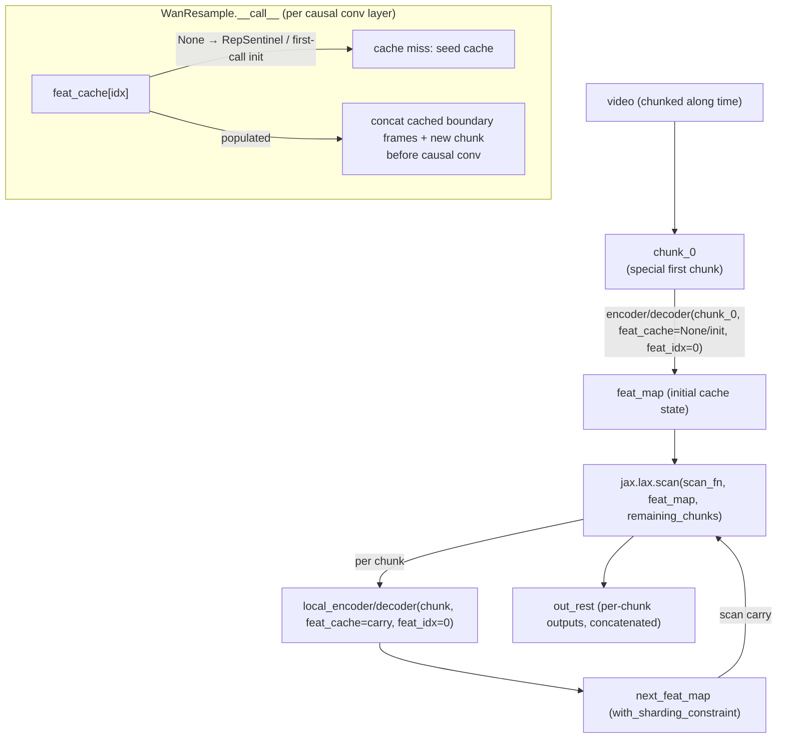

# maxdiffusion/models/wan/autoencoder_kl_wan — causal-conv streaming cache VAE (scan-over-chunks)

## Overview
`AutoencoderKLWan` processes video temporally in fixed-size chunks via `jax.lax.scan`, carrying a per-layer causal-convolution feature cache (`feat_cache`/`feat_idx`) as the scan carry — a fundamentally different memory-bounding strategy from [ltx2/autoencoder_kl_ltx2](maxdiffusion-models-ltx2-autoencoder_kl_ltx2.md)'s overlapping-tile-and-blend approach: instead of decoding overlapping tiles and blending seams, each chunk is causally exact because the cache carries forward precisely the boundary frames each causal conv layer needs, so chunked processing produces bit-identical results to whole-video processing rather than an approximation.

## Diagram

## Design rationale (why it's built this way)
- **The feature cache makes chunked processing exact, not approximate.** Each causal conv layer (`WanCausalConv3d`, `WanResample`, `WanResidualBlock` — visible in source) needs `CACHE_T` (=2) frames of *prior* context to compute a causal output; rather than re-deriving that context from scratch per chunk (which would require re-processing overlapping input, as [ltx2's tiled decode](maxdiffusion-models-ltx2-autoencoder_kl_ltx2.md) does), each layer's cache slot stores exactly the last `CACHE_T` frames of its *own* input from the previous chunk, concatenated onto the new chunk before that layer's causal conv runs — no output blending is needed because there's no approximation to blend away.
- **`jax.lax.scan` over chunks (not a Python loop) is what makes the streaming cache mechanism compile once and reuse across chunks**, matching the same compile-once-reuse-per-iteration principle behind the `nnx.scan`-over-layers pattern seen in [ltx2/transformer_ltx2](maxdiffusion-models-ltx2-transformer_ltx2.md) — here the scan axis is *time* rather than *layer depth*, but the motivation (avoid N separately-compiled copies of the same computation) is the same.
- **The cache's `with_sharding_constraint` inside the scan body** re-asserts the feature-map's spatial sharding after every chunk — the same "re-assert logical sharding at every step, don't trust propagation" pattern already seen in [maxdiffusion/models/resnet_flax](maxdiffusion-models-resnet_flax.md).
- **A `RepSentinel` placeholder distinguishes "cache slot never populated" from "cache slot populated with an all-zeros/replicated tensor"** — [`WanResample.__call__`](../catalog/src/maxdiffusion/models/wan/autoencoder_kl_wan.md#WanResample.__call__)'s logic checks `isinstance(feat_cache[idx], RepSentinel)` specifically to special-case the very first chunk, where there is no real prior-frame cache yet, from a slot on chunk 2+ that already holds real cached frames.

## Entry points
- [`AutoencoderKLWan._encode`](../catalog/src/maxdiffusion/models/wan/autoencoder_kl_wan.md#AutoencoderKLWan._encode) — dispatches the first chunk directly through `self.encoder`, then drives `jax.lax.scan` over the remaining chunks with the encoder's feature-cache state as scan carry.
- [`AutoencoderKLWan._decode`](../catalog/src/maxdiffusion/models/wan/autoencoder_kl_wan.md#AutoencoderKLWan._decode) — the decode-side mirror, scanning the decoder over chunks with its own `feat_cache`/`dec_feat_map` state.
- [`WanResample.__call__`](../catalog/src/maxdiffusion/models/wan/autoencoder_kl_wan.md#WanResample.__call__) — the per-layer cache-read/cache-write logic every causal conv/resample layer in the encoder and decoder executes once per chunk, built around its own [`resample`](../catalog/src/maxdiffusion/models/wan/autoencoder_kl_wan.md#WanResample.resample) `Sequential` sub-module.

## Mechanism (step-by-step)
1. [`_encode`](../catalog/src/maxdiffusion/models/wan/autoencoder_kl_wan.md#AutoencoderKLWan._encode)/[`_decode`](../catalog/src/maxdiffusion/models/wan/autoencoder_kl_wan.md#AutoencoderKLWan._decode) special-case `chunk_0` (the first temporal chunk): it runs through `self.encoder`/`self.decoder` with `feat_idx=0` and either `feat_cache=None` or a freshly-initialized cache, producing both the chunk's output and the cache state (`enc_feat_map`/`dec_feat_map`) to seed the scan.
2. Still inside [`_encode`](../catalog/src/maxdiffusion/models/wan/autoencoder_kl_wan.md#AutoencoderKLWan._encode)/[`_decode`](../catalog/src/maxdiffusion/models/wan/autoencoder_kl_wan.md#AutoencoderKLWan._decode), the remaining chunks are processed via `jax.lax.scan(scan_fn, enc_feat_map, x_scannable)` (or the decoder equivalent), where `scan_fn` calls a `local_encoder`/`local_decoder` closure over each chunk with the running cache as input, returns the updated cache as the new carry, and collects each chunk's output as the scan's stacked `ys` output.
3. Inside [`WanResample.__call__`](../catalog/src/maxdiffusion/models/wan/autoencoder_kl_wan.md#WanResample.__call__), for each causal-conv-bearing sub-layer built into its [`resample`](../catalog/src/maxdiffusion/models/wan/autoencoder_kl_wan.md#WanResample.resample) sub-module: if `feat_cache[idx] is None` (true only on the very first invocation for that slot), the cache is seeded with a `RepSentinel()` placeholder and the feature index advances without yet running a "real" cached conv; on subsequent calls, `cache_x = jnp.copy(x[:, -CACHE_T:, :, :, :])` captures the last `CACHE_T` frames of the *current* chunk's input for the *next* chunk's use, and — if the previous cache slot held a `RepSentinel` or fewer than 2 frames — the missing context is patched from what's available before the causal conv (`self.time_conv`) actually runs.
4. Within that same [`_encode`](../catalog/src/maxdiffusion/models/wan/autoencoder_kl_wan.md#AutoencoderKLWan._encode)/[`_decode`](../catalog/src/maxdiffusion/models/wan/autoencoder_kl_wan.md#AutoencoderKLWan._decode) scan body, `enc_feat_map`/`dec_feat_map` are `jax.tree_util.tree_map`-processed after every scan step to apply `with_sharding_constraint` to every array leaf, re-pinning the sharding of the (structurally uniform, but content-varying) cache pytree at every chunk boundary.

## Key data structures
- `feat_cache` / `feat_idx` — a pytree of per-layer cached boundary-frame tensors plus a running integer index into it, threaded through every encoder/decoder submodule call so each causal conv layer reads/writes its own dedicated cache slot without needing to know about any other layer's slot.
- `RepSentinel` (visible in source) — a marker class occupying a cache slot before it's ever been populated with real cached frames, distinguishing "never written" from "written with a genuine (possibly zero-valued) tensor."
- `CACHE_T = 2` — the fixed number of prior frames every causal conv layer's cache needs to remain exact across a chunk boundary; this constant is shared globally rather than configured per-layer, implying every causal conv in this VAE has the same temporal receptive field overlap requirement.

## Dynamics (design intent)
> [!inferred] Because the scan carry (`feat_map`) is a pytree whose *values* vary per call but whose *structure* must stay fixed for `lax.scan` to trace once, the source comment "We must adjust enc_feat_map from None/'Rep'/'zeros' for scan shapes" (visible near the `_encode` call site) points at exactly this tension: the natural "cache slot starts as `None`" representation isn't directly scannable, so an adjustment step normalizes the cache's shape/dtype before entering the `lax.scan` loop.

## Edge cases
- Because the cache mechanism is only exact if every chunk after the first sees a real (non-sentinel) cache populated by its immediate predecessor, processing chunks out of temporal order — or resuming a scan from a checkpoint without also restoring `feat_cache`/`feat_idx` — would silently produce incorrect (non-causal) output rather than raising an error.

## Open questions
> [!inferred] Whether [maxdiffusion/models/wan/autoencoder_kl_wan_2p2](maxdiffusion-models-wan-autoencoder_kl_wan_2p2.md) (Wan 2.2's VAE) reuses this exact `feat_cache`/`RepSentinel`/`CACHE_T` streaming mechanism or diverges from it is addressed in that page, not resolvable from this packet's cited subgraph alone.

## See also
- [maxdiffusion/models/ltx2/autoencoder_kl_ltx2](maxdiffusion-models-ltx2-autoencoder_kl_ltx2.md) — a different video-VAE memory-bounding strategy (overlapping-tile-and-blend) worth contrasting against this exact-cache approach.
- [maxdiffusion/models/wan/autoencoder_kl_wan_2p2](maxdiffusion-models-wan-autoencoder_kl_wan_2p2.md) — the sibling Wan 2.2 VAE.
