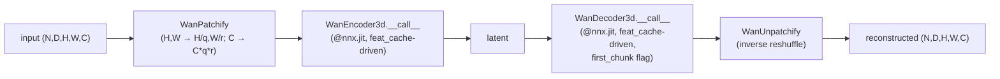

# maxdiffusion/models/wan/autoencoder_kl_wan_2p2 — Wan 2.2 VAE (patchify + avg-pool down/up-sampling)

## Overview
`AutoencoderKLWan2p2` reuses the same causal-conv streaming feature-cache mechanism documented in [wan/autoencoder_kl_wan](maxdiffusion-models-wan-autoencoder_kl_wan.md) (`feat_cache`/`feat_idx`/`CACHE_T`/`RepSentinel`, chunk-by-chunk causal processing), but adds a `WanPatchify`/`WanUnpatchify` space-to-depth reshuffle at the encoder/decoder boundary and replaces some down/up-sampling with average-pool-based (`WanAvgDown3D`) and duplicate-based (`WanDupUp3D`) primitives instead of strided causal convs alone.

## Diagram

## Design rationale (why it's built this way)
- **`WanPatchify` trades spatial resolution for channel depth before the first convolution runs**, reshaping `[N,D,H,W,C] → [N,D,H/q,W/r,C*q*r]` via reshape+transpose (no learned parameters) — this is the same idea as a "pixel-unshuffle"/space-to-depth op: the encoder's early convolutions then operate on a spatially-smaller, channel-richer tensor, reducing per-conv FLOPs and activation memory relative to running those same convolutions at the original resolution. `WanUnpatchify` is its exact inverse, applied symmetrically at the decoder's output.
- **`WanEncoder3d.__call__`/`WanDecoder3d.__call__` are `@nnx.jit`-decorated with `static_argnames`** (`"feat_idx"` for the encoder; `"feat_idx"` and `"first_chunk"` for the decoder) — marking the chunk-index/first-chunk-flag as static means each distinct value triggers its own trace/compile, appropriate since these are Python-level control-flow switches (e.g. `first_chunk` gates which special-case branch of the causal cache runs), not values that should vary within one compiled program.

## Entry points
- [`WanEncoder3d.__call__`](../catalog/src/maxdiffusion/models/wan/autoencoder_kl_wan_2p2.md#WanEncoder3d.__call__) — the encoder forward, `@nnx.jit(static_argnames="feat_idx")`; drives [`down_blocks`](../catalog/src/maxdiffusion/models/wan/autoencoder_kl_wan_2p2.md#WanEncoder3d.__call__)/`mid_block` with the causal feature cache.
- [`WanDecoder3d.__call__`](../catalog/src/maxdiffusion/models/wan/autoencoder_kl_wan_2p2.md#WanDecoder3d.__call__) — the decoder forward, `@nnx.jit(static_argnames=("feat_idx", "first_chunk"))`; the added `first_chunk` flag (absent from the plain Wan 2.1 VAE's decoder) is decoder-specific state this model needs that the encoder doesn't.
- [`WanResidualBlock.__call__`](../catalog/src/maxdiffusion/models/wan/autoencoder_kl_wan_2p2.md#WanResidualBlock.__call__) — the per-block forward every down/mid/up stage is built from, threading `feat_cache`/`feat_idx` through [`conv1`](../catalog/src/maxdiffusion/models/wan/autoencoder_kl_wan_2p2.md#WanResidualBlock.__call__)/[`conv2`](../catalog/src/maxdiffusion/models/wan/autoencoder_kl_wan_2p2.md#WanResidualBlock.__call__)/`conv_shortcut`.

## Mechanism (step-by-step)
1. [`WanEncoder3d.__call__`](../catalog/src/maxdiffusion/models/wan/autoencoder_kl_wan_2p2.md#WanEncoder3d.__call__) runs `conv_in`, then each `down_blocks` entry (built from [`WanResidualBlock`](../catalog/src/maxdiffusion/models/wan/autoencoder_kl_wan_2p2.md#WanResidualBlock.__call__), some incorporating `WanAvgDown3D` for average-pool downsampling per the class list, visible in source), then `mid_block`, `norm_out`, `nonlinearity`, `conv_out` — the same causal `feat_cache`/`feat_idx`-threading discipline as [wan/autoencoder_kl_wan](maxdiffusion-models-wan-autoencoder_kl_wan.md) applies at every stage.
2. [`WanDecoder3d.__call__`](../catalog/src/maxdiffusion/models/wan/autoencoder_kl_wan_2p2.md#WanDecoder3d.__call__) mirrors the encoder with `up_blocks` (incorporating `WanDupUp3D`, the up-sampling counterpart) instead of `down_blocks`, and additionally accepts `first_chunk: bool = False` — a static flag distinguishing the very first temporal chunk's decode (where the causal cache is being seeded rather than consumed) from every subsequent chunk.
3. [`WanResidualBlock.__call__`](../catalog/src/maxdiffusion/models/wan/autoencoder_kl_wan_2p2.md#WanResidualBlock.__call__) applies [`norm1`](../catalog/src/maxdiffusion/models/wan/autoencoder_kl_wan_2p2.md#WanResidualBlock.__call__)/`nonlinearity`/[`conv1`](../catalog/src/maxdiffusion/models/wan/autoencoder_kl_wan_2p2.md#WanResidualBlock.__call__), threading `feat_cache`/`feat_idx` through the conv (identical structure to [wan/autoencoder_kl_wan](maxdiffusion-models-wan-autoencoder_kl_wan.md)'s `WanResidualBlock`), then [`norm2`](../catalog/src/maxdiffusion/models/wan/autoencoder_kl_wan_2p2.md#WanResidualBlock.__call__)/`nonlinearity`/[`conv2`](../catalog/src/maxdiffusion/models/wan/autoencoder_kl_wan_2p2.md#WanResidualBlock.__call__), applying `conv_shortcut` on the residual path when channel counts differ (the same pattern as [maxdiffusion/models/resnet_flax](maxdiffusion-models-resnet_flax.md)'s `FlaxResnetBlock2D`).

## Key data structures
- `WanPatchify`/`WanUnpatchify` — parameter-free reshape+transpose modules; `patch_size=1` is a no-op fast path (`if self.patch_size == 1: return x`), so this mechanism can be disabled entirely by configuration without any structural change.
- The `feat_cache`/`feat_idx`/`CACHE_T`/`RepSentinel` streaming-cache primitives — identical in shape and purpose to [wan/autoencoder_kl_wan](maxdiffusion-models-wan-autoencoder_kl_wan.md); see that page for the full mechanism.

## Dynamics (design intent)
> [!inferred] Making `first_chunk` a `static_argnames` entry on `WanDecoder3d.__call__` (rather than, say, inferring "is this the first chunk" from whether `feat_cache` slots are `None`, as `WanResample.__call__` does internally) suggests the outer chunk-driving loop (in `_decode`, analogous to `autoencoder_kl_wan`'s scan-based driver) explicitly knows which chunk index it's on and passes that knowledge down, rather than relying purely on cache-state introspection.

## Edge cases
- Because `feat_idx` and `first_chunk` are `static_argnames`, calling `WanEncoder3d`/`WanDecoder3d` with many distinct `feat_idx` values across a long video would trigger a separate JIT trace per distinct value unless the surrounding chunking driver (per `autoencoder_kl_wan`'s pattern) always resets `feat_idx` to a fixed value per chunk call rather than passing a running global chunk counter.

## Open questions
> [!inferred] Whether `WanAvgDown3D`/`WanDupUp3D` (referenced by class name in source but not deeply covered by this packet's cited subgraph) are a straight average-pool/nearest-duplicate replacement for strided-conv downsampling/transposed-conv upsampling, or add additional learned parameters, is not resolvable from this packet alone.

## See also
- [maxdiffusion/models/wan/autoencoder_kl_wan](maxdiffusion-models-wan-autoencoder_kl_wan.md) — the Wan 2.1 VAE sharing this file's causal-cache streaming mechanism, without the patchify/avg-pool additions.
- [maxdiffusion/models/resnet_flax](maxdiffusion-models-resnet_flax.md) — the 2D-image analogue of this file's `WanResidualBlock` ResNet-block pattern.
