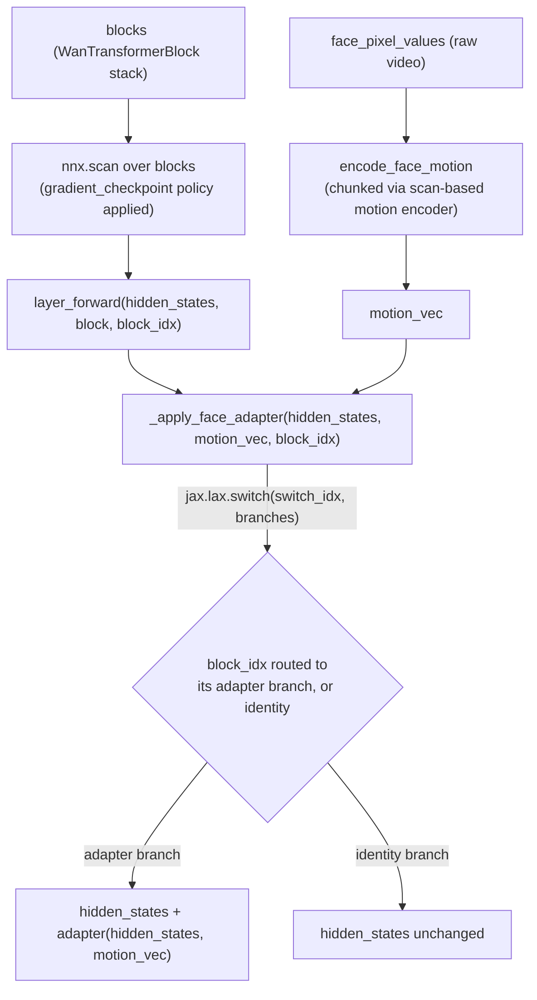

# maxdiffusion/models/wan/transformers/transformer_wan_animate — face/motion-conditioned Wan (lax.switch adapter routing inside a scan)

## Overview
`WanAnimateTransformer3DModel` extends Wan's video transformer with face/motion conditioning: a `WanAnimateMotionEncoder`/`WanAnimateFaceEncoder` pipeline turns raw face-video pixels into motion vectors, which [`_apply_face_adapter`](../catalog/src/maxdiffusion/models/wan/transformers/transformer_wan_animate.md#WanAnimateTransformer3DModel._apply_face_adapter) injects into specific transformer blocks via `WanAnimateFaceBlockCrossAttention` adapters — selected per-block using `jax.lax.switch` rather than Python-level conditionals, because the block loop itself runs inside `nnx.scan`.

## Diagram

## Design rationale (why it's built this way)
- **`jax.lax.switch` is what lets per-block-index conditional logic live inside a `jax.lax.scan`-compiled loop.** [`_apply_face_adapter`](../catalog/src/maxdiffusion/models/wan/transformers/transformer_wan_animate.md#WanAnimateTransformer3DModel._apply_face_adapter)'s own docstring: "Inject face-conditioning latents at the configured adapter blocks." Because `blocks` is scanned (one compiled program reused across all layers, per this codebase's general stack-and-scan pattern), a plain Python `if block_idx == target_block` can't work — `block_idx` is a traced value inside the scan body, not a concrete Python int. `jax.lax.switch(switch_idx, branches, hidden_states)` instead builds one branch closure per face-adapter (each adding `adapter(hidden_states, motion_vec)`) plus a final identity branch, and dispatches to exactly one at trace time per scan step based on the traced `switch_idx`.
- **Only every `inject_face_latents_blocks`-th block gets an adapter, and the routing computes this via modular arithmetic, not a lookup table**: `switch_idx = jnp.where(block_idx % self.inject_face_latents_blocks == 0, adapter_idx, num_adapters)` — a block routes to its designated adapter only when `block_idx` is an exact multiple of the injection stride, and to the identity (`num_adapters`, the branch tuple's last entry) otherwise.
- **`encode_face_motion` is designed to be called once per segment, decoupled from the main `__call__`** — its docstring: "Call once per segment, then pass the result to `__call__` via `face_motion_vec`." This separation means the (potentially expensive) face-motion encoding is not recomputed on every transformer forward call within a segment, only once per segment boundary.

## Entry points
- [`WanAnimateTransformer3DModel.encode_face_motion`](../catalog/src/maxdiffusion/models/wan/transformers/transformer_wan_animate.md#WanAnimateTransformer3DModel.encode_face_motion) — pre-computes `motion_vec` from raw face pixels, chunked via a scan-based motion encoder at `motion_encode_batch_size` granularity, with a leading zero-pad frame prepended to the result.
- [`WanAnimateTransformer3DModel._apply_face_adapter`](../catalog/src/maxdiffusion/models/wan/transformers/transformer_wan_animate.md#WanAnimateTransformer3DModel._apply_face_adapter) — the per-block conditioning-injection point, called from inside the scanned block loop.
- [`WanAnimateTransformer3DModel.layer_forward`](../catalog/src/maxdiffusion/models/wan/transformers/transformer_wan_animate.md#WanAnimateTransformer3DModel.layer_forward) — the per-layer closure `nnx.scan` iterates, wrapping one `WanTransformerBlock` call plus (implicitly, via `_apply_face_adapter`) the face-adapter injection.

## Mechanism (step-by-step)
1. [`encode_face_motion`](../catalog/src/maxdiffusion/models/wan/transformers/transformer_wan_animate.md#WanAnimateTransformer3DModel.encode_face_motion) reshapes `(B,C,T,H,W)` face pixels into a flat frame sequence, pads it to an exact multiple of `motion_encode_batch_size`, and processes it in fixed-size chunks — the same chunk-for-bounded-memory idea seen in [wan/autoencoder_kl_wan](maxdiffusion-models-wan-autoencoder_kl_wan.md)'s scan-over-temporal-chunks pattern, here applied to motion encoding rather than VAE encode/decode.
2. [`WanAnimateTransformer3DModel.blocks`](../catalog/src/maxdiffusion/models/wan/transformers/transformer_wan_animate.md#WanAnimateTransformer3DModel.blocks) holds the stacked `WanTransformerBlock`s (constructed via the same `nnx.vmap`-over-rngs pattern documented in [ltx2/transformer_ltx2](maxdiffusion-models-ltx2-transformer_ltx2.md)), and `nnx.scan` iterates over them with [`gradient_checkpoint`](../catalog/src/maxdiffusion/models/wan/transformers/transformer_wan_animate.md#WanAnimateTransformer3DModel.gradient_checkpoint) (a `GradientCheckpointType`, converted from the `remat_policy` string via `GradientCheckpointType.from_str`) gating what gets rematerialized versus saved.
3. Inside the scan, [`layer_forward`](../catalog/src/maxdiffusion/models/wan/transformers/transformer_wan_animate.md#WanAnimateTransformer3DModel.layer_forward) closes over the current `block`/`block_idx`, runs the transformer block's own self/cross-attention and feed-forward, then calls [`_apply_face_adapter`](../catalog/src/maxdiffusion/models/wan/transformers/transformer_wan_animate.md#WanAnimateTransformer3DModel._apply_face_adapter) with the block's own `hidden_states`, the precomputed `motion_vec`, and `block_idx`.
4. [`_apply_face_adapter`](../catalog/src/maxdiffusion/models/wan/transformers/transformer_wan_animate.md#WanAnimateTransformer3DModel._apply_face_adapter) short-circuits to a no-op (`return hidden_states`) if `motion_vec is None or len(self.face_adapter) == 0` — face conditioning is entirely optional and skippable per-call, not baked permanently into the block's computation graph.
5. [`GradientCheckpointType.to_jax_policy`](../catalog/src/maxdiffusion/models/gradient_checkpoint.md#GradientCheckpointType.to_jax_policy) (imported from the sibling `gradient_checkpoint` module) is what ultimately converts the model's `remat_policy` configuration into an actual `jax.checkpoint_policies`-compatible policy object consumed by the scan.

## Key data structures
- `WanAnimateFaceBlockCrossAttention` (visible in source) — the per-adapter cross-attention module `_apply_face_adapter`'s branches invoke; its constructor raises `ValueError` if no `mesh` is supplied ("requires a mesh for sharding-aware attention"), a hard mesh requirement matching the pattern seen in [attention_flax](maxdiffusion-models-attention_flax.md)'s flash/cuDNN kernels.
- `motion_vec` — the output of `encode_face_motion`, carrying a leading zero-pad frame "ready for the transformer blocks" per the method's own docstring — the padding presumably aligns the motion-vector sequence with the video-token sequence's own frame indexing.
- [`GradientCheckpointType`](../catalog/src/maxdiffusion/models/gradient_checkpoint.md#GradientCheckpointType) (from the shared `gradient_checkpoint` module) — the enum/class this model (and presumably others in this codebase, given it's a separate shared module) uses to translate a string remat policy into JAX's checkpoint-policy objects.

## Dynamics (design intent)
> [!inferred] Because `_apply_face_adapter`'s routing happens via `jax.lax.switch` rather than being baked into which blocks *have* an adapter at construction time, changing `inject_face_latents_blocks` (the injection stride) doesn't require rebuilding the block stack — the same scanned block stack structure handles any injection stride via the traced routing computation alone.

## Edge cases
- `_apply_face_adapter`'s `switch_idx` computation assumes `block_idx // self.inject_face_latents_blocks` always lands within `range(num_adapters)` for blocks that satisfy the modulo condition — a misconfigured `inject_face_latents_blocks` relative to the actual number of face adapters could route to an out-of-range adapter index (though `jax.lax.switch` clamps out-of-range indices to the last branch by default, which would silently select the wrong adapter or the identity branch rather than raising).

## Open questions
> [!inferred] Whether `WanAnimateFaceEncoder`/`WanAnimateMotionEncoder` (visible in source, upstream of `encode_face_motion`) share any structure with this codebase's other conditioning-encoder patterns (e.g. [maxdiffusion/models/embeddings_flax](maxdiffusion-models-embeddings_flax.md)'s conditioning embeddings) is not addressed by this packet's cited subgraph.

## See also
- [maxdiffusion/models/ltx2/transformer_ltx2](maxdiffusion-models-ltx2-transformer_ltx2.md) — the same `nnx.vmap`-stack-then-`nnx.scan` layer construction pattern this model reuses.
- [maxdiffusion/models/wan/autoencoder_kl_wan](maxdiffusion-models-wan-autoencoder_kl_wan.md) — the same chunk-via-scan memory-bounding idea, applied here to face-motion encoding instead of VAE encode/decode.
- [maxdiffusion/models/attention_flax](maxdiffusion-models-attention_flax.md) — the mesh-requiring flash-attention pattern `WanAnimateFaceBlockCrossAttention` also follows.
