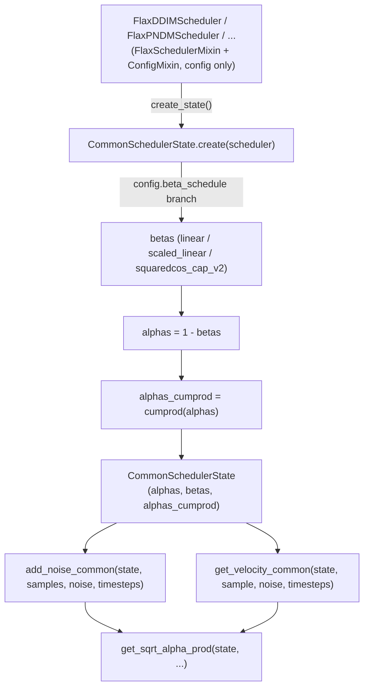

# maxdiffusion/schedulers/scheduling_utils_flax — functional scheduler state (JAX-compatible noise-schedule math)

## Overview
The shared base for every diffusion scheduler in this codebase (DDIM, DPM-Solver, PNDM, Euler, etc.): [`FlaxSchedulerMixin`](../catalog/src/maxdiffusion/schedulers/scheduling_utils_flax.md#FlaxSchedulerMixin) (a [`ConfigMixin`](maxdiffusion-configuration_utils.md) subclass, not a Flax module) holds only configuration, while all actual noise-schedule numerics (alphas, betas, cumulative products) live in a separate immutable [`CommonSchedulerState`](../catalog/src/maxdiffusion/schedulers/scheduling_utils_flax.md#CommonSchedulerState) dataclass created via a pure `create()` classmethod — the standard JAX "functional state" split that keeps every scheduler-math function jit/vmap-compatible by threading state explicitly as an argument rather than storing it as mutable instance attributes.

## Diagram

## Design rationale (why it's built this way)
- **State is a separate immutable dataclass, not scheduler instance attributes, because Flax/JAX functions need explicit, hashable/traceable state to be jit-compatible.** [`CommonSchedulerState`](../catalog/src/maxdiffusion/schedulers/scheduling_utils_flax.md#CommonSchedulerState) holds exactly [`alphas_cumprod`](../catalog/src/maxdiffusion/schedulers/scheduling_utils_flax.md#CommonSchedulerState.alphas_cumprod) plus `alphas`/`betas`, and every scheduler-math helper (`add_noise_common`, `get_velocity_common`, `get_sqrt_alpha_prod`) takes this state as its first explicit argument rather than reading `self.something` — this is what lets these functions be freely `jax.jit`-ed/`vmap`-ed without a scheduler instance (which carries non-array config values) needing to cross a trace boundary.
- **`beta_schedule` is a small closed set of named formulas selected by string** (`"linear"`, `"scaled_linear"`, `"squaredcos_cap_v2"`) computed once in `CommonSchedulerState.create` — `"scaled_linear"`'s own inline comment notes it "is very specific to the latent diffusion model," documenting that this particular schedule choice was tuned for/inherited from Stable-Diffusion-style latent diffusion rather than being a generic default.
- **`rescale_betas_zero_snr` is applied conditionally, gated by a config flag** (`config.get("rescale_zero_terminal_snr", False)`) after the base beta schedule is computed — a documented technique (from the "common diffusion noise schedules and sample steps are flawed" line of work) for fixing signal-to-noise-ratio inconsistencies at the final diffusion timestep, applied as a post-processing step over whichever base schedule was selected.
- **`ignore_for_config = ["dtype"]` on `FlaxSchedulerMixin`** excludes `dtype` from the saved JSON config (via the [`ConfigMixin`](maxdiffusion-configuration_utils.md) mechanism documented in [maxdiffusion/configuration_utils](maxdiffusion-configuration_utils.md)) — a scheduler's numeric precision is a runtime/deployment choice, not part of its portable, architecture-defining configuration.

## Entry points
- `FlaxSchedulerMixin.from_pretrained` (visible in source, not itself part of this packet's cited subgraph) — loads a scheduler's config via `cls.load_config`, reconstructs it via `cls.from_config`, and — if the scheduler defines `create_state` and `has_state` is true — immediately calls `create_state()` to produce the initial [`CommonSchedulerState`](../catalog/src/maxdiffusion/schedulers/scheduling_utils_flax.md#CommonSchedulerState)-derived state alongside the scheduler object.
- Per-scheduler `create_state` methods (e.g. [`FlaxDDIMScheduler.create_state`](../catalog/src/maxdiffusion/schedulers/scheduling_ddim_flax.md#FlaxDDIMScheduler.create_state), [`FlaxLMSDiscreteScheduler.create_state`](../catalog/src/maxdiffusion/schedulers/scheduling_lms_discrete_flax.md#FlaxLMSDiscreteScheduler.create_state), and others defined in sibling scheduler files) — each scheduler subclass's own entry point for producing its (possibly extended) state object, typically starting from `CommonSchedulerState.create(self)`.
- [`add_noise_common`](../catalog/src/maxdiffusion/schedulers/scheduling_utils_flax.md#add_noise_common) / [`get_velocity_common`](../catalog/src/maxdiffusion/schedulers/scheduling_utils_flax.md#get_velocity_common) — the shared forward-diffusion math every scheduler's own `add_noise`/`get_velocity` method (visible in source, per-scheduler) delegates to.

## Mechanism (step-by-step)
1. [`CommonSchedulerState`](../catalog/src/maxdiffusion/schedulers/scheduling_utils_flax.md#CommonSchedulerState)'s `create(scheduler)` classmethod reads `scheduler.config` and branches on `config.beta_schedule` (or uses `config.trained_betas` directly if supplied) to compute the `betas` array, optionally rescaling it via `rescale_betas_zero_snr` if configured, then derives `alphas = 1 - betas` and [`alphas_cumprod`](../catalog/src/maxdiffusion/schedulers/scheduling_utils_flax.md#CommonSchedulerState.alphas_cumprod) `= jnp.cumprod(alphas, axis=0)` — this cumulative product is the core quantity essentially every diffusion-schedule computation in this codebase is built from.
2. [`get_sqrt_alpha_prod`](../catalog/src/maxdiffusion/schedulers/scheduling_utils_flax.md#get_sqrt_alpha_prod) indexes `state.alphas_cumprod[timesteps]`, takes its square root (and the complementary `sqrt(1 - alphas_cumprod[timesteps])`), and broadcasts both from a flat per-sample-in-batch shape up to `original_samples.shape` via `broadcast_to_shape_from_left` — handling the case where `timesteps` varies per-batch-element while the noise/sample tensors carry additional trailing (spatial/channel) dimensions.
3. [`add_noise_common`](../catalog/src/maxdiffusion/schedulers/scheduling_utils_flax.md#add_noise_common) computes `noisy_samples = sqrt_alpha_prod * original_samples + sqrt_one_minus_alpha_prod * noise` — the standard DDPM forward-diffusion (noising) formula, reused by every scheduler's own `add_noise` rather than being reimplemented per scheduler.
4. [`get_velocity_common`](../catalog/src/maxdiffusion/schedulers/scheduling_utils_flax.md#get_velocity_common) computes `velocity = sqrt_alpha_prod * noise - sqrt_one_minus_alpha_prod * sample` — the "v-prediction" parameterization's target formula, sharing the same `get_sqrt_alpha_prod` helper as `add_noise_common`.
5. `FlaxSchedulerMixin.from_pretrained` (visible in source) orchestrates config loading and (conditionally) state creation in one call, producing a `CommonSchedulerState`-derived state via the per-scheduler `create_state` methods (e.g. [`FlaxDDIMScheduler.create_state`](../catalog/src/maxdiffusion/schedulers/scheduling_ddim_flax.md#FlaxDDIMScheduler.create_state)) so a caller gets back a ready-to-use `(scheduler, state)` pair rather than needing to separately call `create_state()` after construction.

## Key data structures
- [`CommonSchedulerState`](../catalog/src/maxdiffusion/schedulers/scheduling_utils_flax.md#CommonSchedulerState) — the immutable `(alphas, betas, alphas_cumprod)` triple every specific scheduler's own state class is built from (e.g. `DPMSolverMultistepSchedulerState`, `PNDMSchedulerState`, visible in source, presumably wrapping/extending `CommonSchedulerState` with solver-specific extra state).
- [`FlaxSchedulerOutput`](../catalog/src/maxdiffusion/schedulers/scheduling_utils_flax.md#FlaxSchedulerOutput) — the shared `BaseOutput` return type for a scheduler `step`, giving every scheduler's `step` method (DDIM, PNDM, LMS, Euler — all cited in this packet) a uniform return shape.
- `FlaxKarrasDiffusionSchedulers` (visible in source, an `Enum`) — presumably a registry enumerating every supported scheduler class name, used for compatibility/lookup purposes.

## Dynamics (design intent)
> [!inferred] The functional-state split (config-only mixin + separate immutable numeric state) means a single `FlaxSchedulerMixin` config object can have multiple independently-created `CommonSchedulerState` instances derived from it (e.g. re-derived after changing `num_train_timesteps` at inference time) without needing to mutate or re-instantiate the scheduler object itself — appropriate for a JAX-idiomatic design where the "model" (config) and "state" (numeric arrays) are cleanly separated so both can be passed independently through `jax.jit` boundaries.

## Edge cases
- `CommonSchedulerState.create` raises `NotImplementedError` for any `beta_schedule` string outside its three known values (unless `config.trained_betas` is supplied instead) — a new/typo'd schedule name fails at state-creation time with a scheduler-class-named error message, not silently producing an incorrect schedule.
- `FlaxSchedulerMixin.from_pretrained`'s conditional `create_state()` call (`if hasattr(scheduler, "create_state") and getattr(scheduler, "has_state", False)`) means a scheduler subclass that defines `create_state` but leaves `has_state` at its default (unset/`False`) would skip state creation entirely, silently returning `state` unbound in the function body unless a scheduler always sets both consistently — a latent naming-convention footgun for new scheduler subclasses.

## Open questions
> [!inferred] Whether every scheduler's own `state` class (e.g. `DPMSolverMultistepSchedulerState`) wraps `CommonSchedulerState` via composition or subclassing, and what solver-specific extra fields each carries, is only partially visible in this packet's cited subgraph (their class names are cited, but their field definitions are not shown).

## See also
- [maxdiffusion/configuration_utils](maxdiffusion-configuration_utils.md) — the `ConfigMixin`/`@register_to_config` mechanism `FlaxSchedulerMixin` builds on for config capture and JSON round-tripping.
