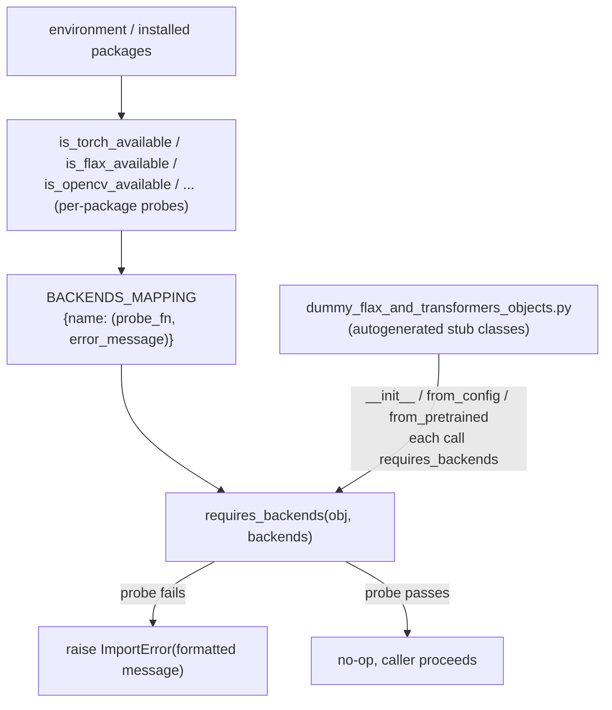

# maxdiffusion/utils/import_utils — optional-dependency detection and lazy-import infrastructure

## Overview
A HuggingFace-diffusers-derived utility module (not itself TPU-perf-relevant) that detects which optional third-party packages (`torch`, `flax`/`jax`, `opencv`, `librosa`, `wandb`, etc.) are installed, and provides the `requires_backends`/[`OptionalDependencyNotAvailable`](../catalog/src/maxdiffusion/utils/import_utils.md#OptionalDependencyNotAvailable) machinery that lets the rest of the package defer a missing-dependency error until the specific feature needing it is actually used, rather than failing at package-import time. It is pulled into this ingest because many perf-relevant modules (`_import_structure` lazy-loading, `mesh` construction in `modeling_flax_utils`) transitively depend on its availability checks.

## Diagram

## Design rationale (why it's built this way)
- **Dependency failures are deferred to first use, not import time.** Instead of a top-level `import torch` that would crash the whole package for users who never touch PyTorch-dependent code, every optional-backend probe (`is_torch_available`, `is_flax_available`, etc.) is a boolean check performed once at module-load time and cached into a module-level flag (`_torch_available`, `_flax_available`); the actual error only fires when [`requires_backends`](../catalog/src/maxdiffusion/utils/import_utils.md#requires_backends) is called by code that specifically needs that backend.
- **Autogenerated dummy classes give a good error message instead of a `NameError`.** [`dummy_flax_and_transformers_objects.py`](../catalog/src/maxdiffusion/utils/dummy_flax_and_transformers_objects.md) (its header comment: "This file is autogenerated by the command `make fix-copies`, do not edit") defines stand-in classes for every pipeline that needs an unavailable backend combination; each stub's `__init__`/`from_config`/`from_pretrained` calls [`requires_backends`](../catalog/src/maxdiffusion/utils/import_utils.md#requires_backends) so importing the *name* always succeeds, but *instantiating* it raises a clear, backend-specific `ImportError` rather than the module failing to define the symbol at all.

## Entry points
- [`requires_backends`](../catalog/src/maxdiffusion/utils/import_utils.md#requires_backends) — called from every generated dummy class's methods (see [`FlaxStableDiffusionControlNetPipeline.__init__`](../catalog/src/maxdiffusion/utils/dummy_flax_and_transformers_objects.md#FlaxStableDiffusionControlNetPipeline.__init__), [`FlaxStableDiffusionControlNetPipeline.from_config`](../catalog/src/maxdiffusion/utils/dummy_flax_and_transformers_objects.md#FlaxStableDiffusionControlNetPipeline.from_config), [`FlaxStableDiffusionControlNetPipeline.from_pretrained`](../catalog/src/maxdiffusion/utils/dummy_flax_and_transformers_objects.md#FlaxStableDiffusionControlNetPipeline.from_pretrained)) to raise a formatted `ImportError` naming exactly which missing backend(s) blocked the call.
- [`is_torch_available`](../catalog/src/maxdiffusion/utils/import_utils.md#is_torch_available) / [`is_flax_available`](../catalog/src/maxdiffusion/utils/import_utils.md#is_flax_available) (and the many sibling `is_*_available` probes) — the individual backend-availability checks referenced by [`BACKENDS_MAPPING`](../catalog/src/maxdiffusion/utils/import_utils.md#BACKENDS_MAPPING); called directly by any code that needs to branch on backend presence rather than raise.
- [`OptionalDependencyNotAvailable`](../catalog/src/maxdiffusion/utils/import_utils.md#OptionalDependencyNotAvailable) — a `BaseException` subclass raised by the package's `__init__`-time lazy-loading logic when an entire optional-backend import group is unavailable.

## Mechanism (step-by-step)
1. [`BACKENDS_MAPPING`](../catalog/src/maxdiffusion/utils/import_utils.md#BACKENDS_MAPPING) is an `OrderedDict` mapping a backend name (`"torch"`, `"flax"`, `"opencv"`, `"scipy"`, `"wandb"`, ...) to a `(probe_function, error_message_template)` pair — [`is_torch_available`](../catalog/src/maxdiffusion/utils/import_utils.md#is_torch_available), [`is_flax_available`](../catalog/src/maxdiffusion/utils/import_utils.md#is_flax_available), [`is_onnx_available`](../catalog/src/maxdiffusion/utils/import_utils.md#is_onnx_available), and every other `is_*_available` probe in this file are the values on the left of each pair.
2. [`requires_backends`](../catalog/src/maxdiffusion/utils/import_utils.md#requires_backends) accepts an object (or class) and one or more backend names, normalizes a single string into a one-element list, looks each name up in [`BACKENDS_MAPPING`](../catalog/src/maxdiffusion/utils/import_utils.md#BACKENDS_MAPPING), calls every probe function, and collects the formatted error messages for any that failed — raising one combined `ImportError` if the list is non-empty, or returning silently otherwise.
3. Each `is_*_available` probe (e.g. [`is_torch_available`](../catalog/src/maxdiffusion/utils/import_utils.md#is_torch_available)) simply returns the module-level cached boolean (`_torch_available`, computed once via `importlib.util.find_spec` + a version lookup at import time) — repeated calls do not re-probe the filesystem/package index.
4. [`_import_structure`](../catalog/src/maxdiffusion/utils/import_utils.md#is_torch_available) dicts (visible at several package `__init__.py` call sites cited in this packet, e.g. `src/maxdiffusion/__init__.py`, `src/maxdiffusion/pipelines/__init__.py`, `src/maxdiffusion/schedulers/__init__.py`) declare which submodule/class names are lazily importable — the actual `import` for a given name only happens the first time an attribute with that name is accessed on the package.

## Key data structures
- [`BACKENDS_MAPPING`](../catalog/src/maxdiffusion/utils/import_utils.md#BACKENDS_MAPPING) — the single source of truth tying a backend name to both its availability probe and its user-facing error message.
- [`OptionalDependencyNotAvailable`](../catalog/src/maxdiffusion/utils/import_utils.md#OptionalDependencyNotAvailable) — its own docstring: "An error indicating that an optional dependency of Diffusers was not found in the environment" — a `BaseException` (not `Exception`) subclass, meaning it deliberately won't be caught by a bare `except Exception` handler.

## Dynamics (design intent)
> [!inferred] Caching each backend's availability once at module-import time (rather than re-checking per call) trades a small amount of import-time cost (one `importlib.util.find_spec` + version lookup per backend) for zero-cost repeated checks afterward — appropriate for a check that, in practice, never changes during a process's lifetime (a package doesn't get installed or uninstalled mid-run).

## Edge cases
- [`requires_backends`](../catalog/src/maxdiffusion/utils/import_utils.md#requires_backends) derives the reported object name via `obj.__name__ if hasattr(obj, "__name__") else obj.__class__.__name__` — this means the error message names a *class* when called with an instance, and the class itself when called with the class object (as the dummy classes' `classmethod`s do), which is why the generated dummy stubs pass `cls`/`self` consistently rather than a fixed literal name.
- `requires_backends` contains a special-cased list of `VersatileDiffusion*` pipeline names (visible in source just past this packet's cited excerpt) — suggesting at least one pipeline has bespoke backend-requirement handling beyond the generic per-backend check.

## Open questions
> [!inferred] Whether every one of the ~20 `is_*_available` probes in `BACKENDS_MAPPING` is still actively used by current MaxDiffusion pipelines, or whether some (e.g. `"note_seq"`, `"k_diffusion"`) are vestigial carry-overs from the HuggingFace diffusers codebase this module was derived from, isn't answerable from this packet's cited subgraph.

## See also
- No other concept page in this ingest depends directly on this module's mechanism — it is infrastructure that many model/pipeline modules transitively rely on for optional-backend gating, not a perf-relevant surface itself.
