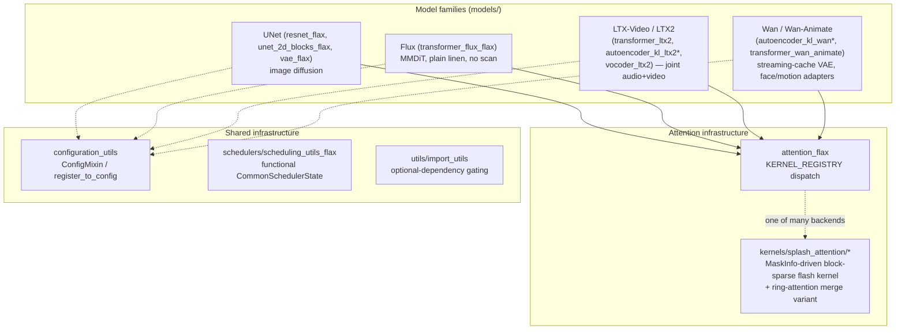

# maxdiffusion — what it is and how it fits together

## In one paragraph
MaxDiffusion is Google's JAX/Flax library for training and serving diffusion models (image UNets, and increasingly video/audio diffusion transformers — Flux, LTX-Video, LTX2, Wan) at scale on TPU. This ingest is scoped to its perf-relevant surfaces: model architectures (`models/`), the TPU Pallas splash-attention kernel family (`kernels/splash_attention/`), and shared trainer/config/scheduler infrastructure. Across every model family, the same handful of TPU-perf mechanisms recur: a registry-based attention-kernel dispatcher with a length-gated dense fallback, `nnx.vmap`/`nnx.scan` layer stacking for compile-once-reuse, TPU-generation-aware tiling/alignment constants, and (for video/audio models) memory-bounding strategies for processing sequences too large to hold in HBM at once — either overlapping-tile-and-blend or an exact causal-conv streaming cache.

## Core architecture

## Main concepts

### One attention-kernel registry, many models
[maxdiffusion/models/attention_flax](concepts/maxdiffusion-models-attention_flax.md)'s `KERNEL_REGISTRY`-based `_apply_attention` dispatcher is the single attention entry point nearly every model family routes through (`FlaxTransformer2DModel`'s UNet blocks, Flux's double/single blocks, Wan's `FlaxWanAttention`) — selecting between dense dot-product, TPU Pallas flash/splash attention, Ulysses/ring sequence-parallel variants, and an NVIDIA cuDNN kernel via one `attention_kernel` string, with an automatic fallback to dense attention below `flash_min_seq_length`. LTX-Video's own attention port ([ltx_video/transformers/attention](concepts/maxdiffusion-models-ltx_video-transformers-attention.md)) is a narrower exception — it hard-requires TPU flash attention with no fallback.

### The splash-attention kernel family
[maxdiffusion/kernels/splash_attention](concepts/maxdiffusion-kernels-splash_attention-splash_attention_kernel.md) is a vendored-and-extended copy of DeepMind/JAX's block-sparse "splash" flash-attention kernel: [splash_attention_mask](concepts/maxdiffusion-kernels-splash_attention-splash_attention_mask.md) defines lazy/composable logical masks, [splash_attention_mask_info](concepts/maxdiffusion-kernels-splash_attention-splash_attention_mask_info.md) precomputes them into a sparse block representation (`MaskInfo`), and [splash_attention_kernel](concepts/maxdiffusion-kernels-splash_attention-splash_attention_kernel.md) consumes that to build a sparsity-driven dynamic grid — plus a MaxDiffusion-specific addition, a ring-attention-compatible forward path returning unnormalized accumulators for cross-shard merging. [Its test suite](concepts/maxdiffusion-kernels-splash_attention-splash_attention_kernel_test.md) doubles as an executable map of which numerics options (base-2 exp, deferred reciprocal, max-logit shortcuts) cost precision.

### Sequence-parallelism axis-rule presets
[maxdiffusion/common_types](concepts/maxdiffusion-common_types.md) defines four named axis-rule lists (ring, sequence-parallel, Ulysses, Ulysses+ring hybrid) that all share the same logical axis names but differ in whether the KV-length axis is sharded (forcing cross-device attention communication) or replicated — the single source of truth every long-sequence video/audio model configures its mesh sharding against.

### Two distinct video/audio-VAE memory-bounding strategies
Long video/audio sequences can't be encoded/decoded in one shot within HBM. This codebase uses two different solutions: [ltx2/autoencoder_kl_ltx2](concepts/maxdiffusion-models-ltx2-autoencoder_kl_ltx2.md) tiles space and time with overlap-and-blend (approximate at tile boundaries, blended away), while [wan/autoencoder_kl_wan](concepts/maxdiffusion-models-wan-autoencoder_kl_wan.md) (and [wan/autoencoder_kl_wan_2p2](concepts/maxdiffusion-models-wan-autoencoder_kl_wan_2p2.md)) instead carries an exact causal-convolution feature cache across `jax.lax.scan`-processed temporal chunks — no approximation, no blending, because the cache captures precisely the boundary context each causal conv needs.

### Layer-stacking via `nnx.vmap`/`nnx.scan`
Newer `flax.nnx`-based models ([ltx2/transformer_ltx2](concepts/maxdiffusion-models-ltx2-transformer_ltx2.md), [wan/transformers/transformer_wan_animate](concepts/maxdiffusion-models-wan-transformers-transformer_wan_animate.md)) build their transformer-block stack by `nnx.vmap`-ing the block constructor over a batch of RNG keys, producing one block whose parameters carry a leading layer axis ready for `nnx.scan` — the same compile-once-reuse-across-layers principle documented cross-repo in [learning-machine's llama_ref/model_with_scan](../../learning-machine/concepts/llama_ref-model_with_scan.md). The older `flax.linen`-based Flux model ([flux/transformers/transformer_flux_flax](concepts/maxdiffusion-models-flux-transformers-transformer_flux_flax.md)) instead builds a plain Python list of per-layer blocks, one compiled sub-computation per layer.

### Cross-framework kernel bridging
[ltx_video/transformers_pytorch/attention](concepts/maxdiffusion-models-ltx_video-transformers_pytorch-attention.md) calls a JAX Pallas TPU flash-attention kernel directly from PyTorch model code (with a hard `seq_len % 128 == 0` assertion surfacing the kernel's tiling requirement at the PyTorch call site) — the same PyTorch-calls-JAX-Pallas pattern documented independently in [learning-machine/custom_kernel_spmd](../../learning-machine/concepts/custom_kernel_spmd.md).

### Shared HuggingFace-diffusers-derived infrastructure
[maxdiffusion/configuration_utils](concepts/maxdiffusion-configuration_utils.md) (`ConfigMixin`/`@register_to_config`, auto-capturing constructor kwargs into a JSON-serializable config) and [maxdiffusion/utils/import_utils](concepts/maxdiffusion-utils-import_utils.md) (optional-dependency detection and lazy-import gating) are not themselves TPU-perf-relevant, but every model class in this codebase depends on them. [schedulers/scheduling_utils_flax](concepts/maxdiffusion-schedulers-scheduling_utils_flax.md) similarly separates scheduler config (`FlaxSchedulerMixin`) from the actual noise-schedule numerics (`CommonSchedulerState`), a JAX-idiomatic functional-state split.

## How a request flows
A model (say, `LTX2VideoTransformer3DModel`) is constructed from a `@register_to_config`-decorated `__init__` that captures its config via [configuration_utils](concepts/maxdiffusion-configuration_utils.md), builds its transformer-block stack via `nnx.vmap` (or a plain Python loop, depending on the model), and wires each block's attention through [attention_flax](concepts/maxdiffusion-models-attention_flax.md)'s `KERNEL_REGISTRY` dispatch — which for TPU-targeted configs resolves to the [splash_attention](concepts/maxdiffusion-kernels-splash_attention-splash_attention_kernel.md) kernel family, itself configured by axis-rule presets from [common_types](concepts/maxdiffusion-common_types.md). A training/sampling loop drives the model forward through a [scheduler](concepts/maxdiffusion-schedulers-scheduling_utils_flax.md)'s noise schedule, and for video/audio models, the corresponding VAE ([ltx2/autoencoder_kl_ltx2](concepts/maxdiffusion-models-ltx2-autoencoder_kl_ltx2.md) or [wan/autoencoder_kl_wan](concepts/maxdiffusion-models-wan-autoencoder_kl_wan.md)) encodes/decodes between pixel and latent space, using its own memory-bounding strategy for sequences too large to process at once.

## Map of the wiki
- Read [attention_flax](concepts/maxdiffusion-models-attention_flax.md) first for the attention-kernel dispatch every model routes through.
- Read the `splash_attention` trio (concepts/maxdiffusion-kernels-splash_attention-splash_attention_{kernel,mask,mask_info}.md) for the TPU Pallas kernel itself.
- Read [common_types](concepts/maxdiffusion-common_types.md) for the sequence-parallelism axis-rule presets.
- For video/audio VAEs, contrast [ltx2/autoencoder_kl_ltx2](concepts/maxdiffusion-models-ltx2-autoencoder_kl_ltx2.md) (tile+blend) against [wan/autoencoder_kl_wan](concepts/maxdiffusion-models-wan-autoencoder_kl_wan.md) (streaming cache).
- See `catalog/` for the exhaustive per-module symbol index, and `index.md` for the concept table.
