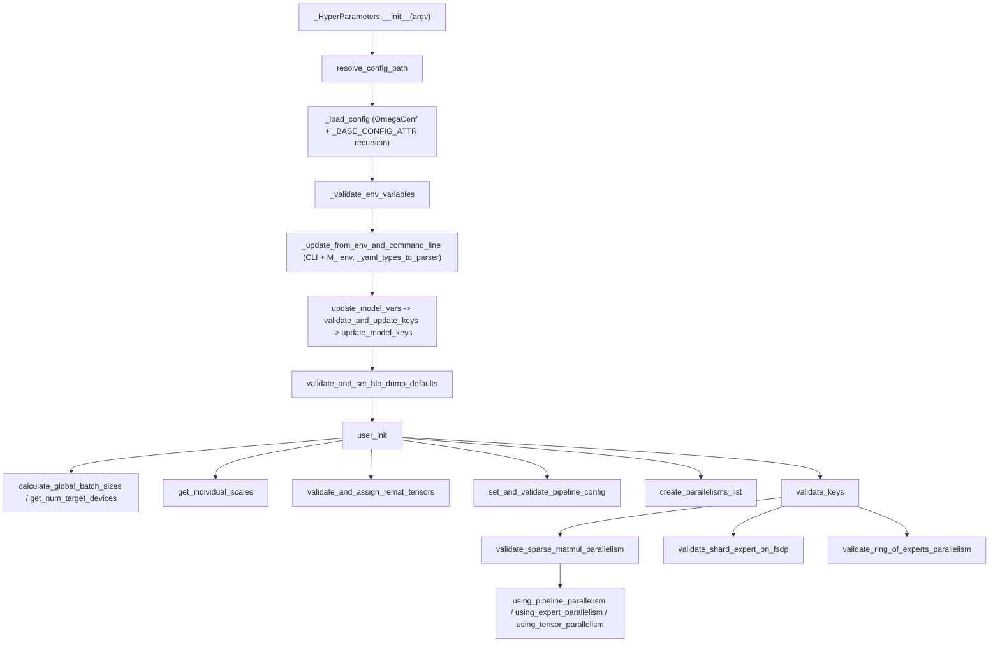

# MaxText legacy config loader (pyconfig_deprecated)

## Overview
`src/maxtext/configs/pyconfig_deprecated.py` is MaxText's *original* configuration system —
the dict-of-keys (`raw_keys`) loader that the Pydantic
[maxtext-configs-types](maxtext-configs-types.md) `MaxTextConfig` was ported from and is
meant to replace. It is orchestrated by
[`_HyperParameters.__init__`](../catalog/src/maxtext/configs/pyconfig_deprecated.md#_HyperParameters.__init__),
which loads a YAML config (with `base_config` inheritance), overlays environment-variable and
CLI overrides, splices in a model-specific `.yml`, then runs
[`user_init`](../catalog/src/maxtext/configs/pyconfig_deprecated.md#_HyperParameters.user_init)
to transform raw values into runtime-ready derived values and
[`validate_keys`](../catalog/src/maxtext/configs/pyconfig_deprecated.md#validate_keys) to run
a battery of cross-field validators. The whole thing is exposed through a read-only
[`HyperParameters`](../catalog/src/maxtext/configs/pyconfig_deprecated.md#_HyperParameters)
wrapper so downstream code treats config as immutable. The key idea: config is a *mutable
`OrderedDict` of primitives* threaded through free functions, in contrast to the typed
Pydantic object — but the derivation math (device counts, batch sizes, model scaling, remat
tensor lists) is deliberately identical so the two systems agree.

## Diagram

## Design rationale (why it's built this way)
- **`raw_keys` as a flat mutable dict.** Every helper takes and mutates a plain
  `OrderedDict`, so derivation is just imperative Python over string keys. This is simple and
  scriptable but type-unsafe — the reason the project migrated to the typed
  [`MaxTextConfig`](maxtext-configs-types.md). The file name
  literally marks it `deprecated`.
- **YAML inheritance via `base_config`.**
  [`_load_config`](../catalog/src/maxtext/configs/pyconfig_deprecated.md#_HyperParameters._load_config)
  resolves a chain of parent YAMLs (keyed by
  [`_BASE_CONFIG_ATTR`](../catalog/src/maxtext/configs/pyconfig_deprecated.md#_BASE_CONFIG_ATTR)
  = `"base_config"`) with override semantics, so a small experiment config need only state its
  diffs from a base. Resolution is relative to the child config's directory.
- **Three override channels with a strict precedence and anti-footgun checks.** A key can be
  set in YAML, via `M_`-prefixed environment variables
  ([`_MAX_PREFIX`](../catalog/src/maxtext/configs/pyconfig_deprecated.md#_MAX_PREFIX)), or on
  the CLI.
  [`_update_from_env_and_command_line`](../catalog/src/maxtext/configs/pyconfig_deprecated.md#_HyperParameters._update_from_env_and_command_line)
  *refuses* to let the same key be set by both CLI and ENV, and *refuses* CLI/ENV keys that
  don't already exist in YAML — you cannot introduce a flag from the command line.
- **Read-only wrapper.**
  [`HyperParameters`](../catalog/src/maxtext/configs/pyconfig_deprecated.md#_HyperParameters)
  raises on `__setattr__` and registers as a JAX pytree (`tree_flatten`/`tree_unflatten`), so
  the fully-derived config can be passed through `jax.jit` boundaries yet cannot be mutated
  after construction.

## Entry points
- [`_HyperParameters.__init__`](../catalog/src/maxtext/configs/pyconfig_deprecated.md#_HyperParameters.__init__)
  — the orchestrator. Called once (via the module `initialize` wrapper) with `argv`; runs the
  entire load → override → model-merge → validate → derive pipeline and leaves the finished
  config in `self.keys`.
- [`_load_config`](../catalog/src/maxtext/configs/pyconfig_deprecated.md#_HyperParameters._load_config)
  — first real step; reads the YAML with OmegaConf and recursively merges parent configs.
- [`user_init`](../catalog/src/maxtext/configs/pyconfig_deprecated.md#_HyperParameters.user_init)
  — the derivation stage; reached after all raw keys are settled. Its docstring:
  "Transformations between the config data and configs used at runtime."
- [`validate_keys`](../catalog/src/maxtext/configs/pyconfig_deprecated.md#validate_keys) — the
  master validation dispatcher, called from `user_init`; fans out to ~20 topical `validate_*`
  functions.

## Mechanism (step-by-step)
1. **Resolve + load YAML with inheritance.**
   [`__init__`](../catalog/src/maxtext/configs/pyconfig_deprecated.md#_HyperParameters.__init__)
   first rewrites the config path via `resolve_config_path`, then
   [`_load_config`](../catalog/src/maxtext/configs/pyconfig_deprecated.md#_HyperParameters._load_config)
   loads it with `omegaconf.OmegaConf`, and if a
   [`_BASE_CONFIG_ATTR`](../catalog/src/maxtext/configs/pyconfig_deprecated.md#_BASE_CONFIG_ATTR)
   parent is named, recurses into the parent and applies the child's keys as overrides —
   yielding one merged `raw_data_from_yaml` dict.
2. **Validate env vars, then apply ENV/CLI overrides.**
   [`_validate_env_variables`](../catalog/src/maxtext/configs/pyconfig_deprecated.md#_HyperParameters._validate_env_variables)
   checks any
   [`_MAX_PREFIX`](../catalog/src/maxtext/configs/pyconfig_deprecated.md#_MAX_PREFIX)-prefixed
   variables are legal, then
   [`_update_from_env_and_command_line`](../catalog/src/maxtext/configs/pyconfig_deprecated.md#_HyperParameters._update_from_env_and_command_line)
   merges CLI args and `**kwargs`, forbids double-setting a key by both CLI and ENV, and
   type-coerces each override to the YAML value's type using the
   [`_yaml_types_to_parser`](../catalog/src/maxtext/configs/pyconfig_deprecated.md#_yaml_types_to_parser)
   table (str/int/float/bool). Env key names are mapped via
   [`yaml_key_to_env_key`](../catalog/src/maxtext/configs/pyconfig_deprecated.md#yaml_key_to_env_key).
3. **Splice in model-specific config.**
   [`update_model_vars`](../catalog/src/maxtext/configs/pyconfig_deprecated.md#_HyperParameters.update_model_vars)
   loads `models/<model_name>.yml` and applies it through
   [`validate_and_update_keys`](../catalog/src/maxtext/configs/pyconfig_deprecated.md#validate_and_update_keys)
   →
   [`update_model_keys`](../catalog/src/maxtext/configs/pyconfig_deprecated.md#update_model_keys),
   which for `logical_axis_rules` merges old and new rules via
   [`create_new_logical_axis_rules`](../catalog/src/maxtext/configs/pyconfig_deprecated.md#create_new_logical_axis_rules)
   (itself normalizing lists to tuples with
   [`_lists_to_tuples`](../catalog/src/maxtext/configs/pyconfig_deprecated.md#_lists_to_tuples)).
   [`validate_no_keys_overwritten_twice`](../catalog/src/maxtext/configs/pyconfig_deprecated.md#validate_no_keys_overwritten_twice)
   then guards against a model config clobbering an explicit user override.
4. **Wire HLO-dump + backend init.** Before the JAX backend comes up,
   [`validate_and_set_hlo_dump_defaults`](../catalog/src/maxtext/configs/pyconfig_deprecated.md#validate_and_set_hlo_dump_defaults)
   sets the XLA dump flags (the legacy twin of the types.py method of the same name), then the
   distributed system is initialized and MLPerf/GPT-3 task configs are optionally applied.
5. **Derive runtime values (`user_init`).**
   [`user_init`](../catalog/src/maxtext/configs/pyconfig_deprecated.md#_HyperParameters.user_init)
   fills `run_name`/paths, resolves `learning_rate_schedule_steps`↔`steps`, nulls zero
   soft-caps, and scales model dimensions: `get_individual_scales` on
   `global_parameter_scale` yields per-axis exponents that multiply the `base_*` dims into
   `emb_dim`/`num_query_heads`/`mlp_dim`/`num_decoder_layers`.
   ([`get_individual_scales`](../catalog/src/maxtext/configs/pyconfig_deprecated.md#get_individual_scales)
   is the module-level helper of the same logic.)
6. **Compute batch sizes.** `user_init` calls
   [`calculate_global_batch_sizes`](../catalog/src/maxtext/configs/pyconfig_deprecated.md#calculate_global_batch_sizes)
   with the device count from
   [`get_num_target_devices`](../catalog/src/maxtext/configs/pyconfig_deprecated.md#get_num_target_devices)
   (which — note — triggers the first `jax.devices()` call and hence backend init) to derive
   `global_batch_size_to_load` / `global_batch_size_to_train_on` /
   `micro_batch_size_to_train_on`; ramp-up steps come from
   [`calculate_rampup_samples_and_steps`](../catalog/src/maxtext/configs/pyconfig_deprecated.md#calculate_rampup_samples_and_steps).
7. **Derive remat, quantization, optimizer, parallelism state.** `user_init` further runs
   [`validate_and_assign_remat_tensors`](../catalog/src/maxtext/configs/pyconfig_deprecated.md#validate_and_assign_remat_tensors)
   (partitions the named remat tensors into `tensors_on_device` / `tensors_to_offload`, and
   asserts `decoder_layer_input != "remat"` under scan),
   [`get_quantization_local_shard_count`](../catalog/src/maxtext/configs/pyconfig_deprecated.md#get_quantization_local_shard_count),
   [`set_mu_dtype`](../catalog/src/maxtext/configs/pyconfig_deprecated.md#set_mu_dtype),
   [`create_parallelisms_list`](../catalog/src/maxtext/configs/pyconfig_deprecated.md#create_parallelisms_list),
   and
   [`set_and_validate_pipeline_config`](../catalog/src/maxtext/configs/pyconfig_deprecated.md#set_and_validate_pipeline_config).
   The last, guarded by
   [`using_pipeline_parallelism`](../catalog/src/maxtext/configs/pyconfig_deprecated.md#using_pipeline_parallelism),
   reorders logical axis rules and mesh axes to put `stage` first (citing perf bug b/339009148
   that DCN axes should precede ICI).
8. **Run the validation dispatcher.**
   [`validate_keys`](../catalog/src/maxtext/configs/pyconfig_deprecated.md#validate_keys) fans
   out to attention validators
   ([`validate_attention_kernel`](../catalog/src/maxtext/configs/pyconfig_deprecated.md#validate_attention_kernel),
   [`validate_attention_type`](../catalog/src/maxtext/configs/pyconfig_deprecated.md#validate_attention_type),
   [`validate_attention_window_params`](../catalog/src/maxtext/configs/pyconfig_deprecated.md#validate_attention_window_params),
   [`validate_moba_attention`](../catalog/src/maxtext/configs/pyconfig_deprecated.md#validate_moba_attention)),
   profiler validators
   ([`validate_profiler_type`](../catalog/src/maxtext/configs/pyconfig_deprecated.md#validate_profiler_type),
   [`validate_periodic_profiler`](../catalog/src/maxtext/configs/pyconfig_deprecated.md#validate_periodic_profiler)),
   layout/quant validators
   ([`validate_compute_axis_order`](../catalog/src/maxtext/configs/pyconfig_deprecated.md#validate_compute_axis_order),
   [`validate_kv_quant_axis`](../catalog/src/maxtext/configs/pyconfig_deprecated.md#validate_kv_quant_axis)),
   length/context validators
   ([`validate_prefill_and_target_lengths`](../catalog/src/maxtext/configs/pyconfig_deprecated.md#validate_prefill_and_target_lengths),
   [`get_context_parallel_size`](../catalog/src/maxtext/configs/pyconfig_deprecated.md#get_context_parallel_size),
   [`validate_context_parallel_strategy_ring`](../catalog/src/maxtext/configs/pyconfig_deprecated.md#validate_context_parallel_strategy_ring)),
   and model/MoE validators
   ([`validate_llama4_config`](../catalog/src/maxtext/configs/pyconfig_deprecated.md#validate_llama4_config),
   [`validate_deepseek_moe`](../catalog/src/maxtext/configs/pyconfig_deprecated.md#validate_deepseek_moe),
   [`validate_gpt_oss_moe`](../catalog/src/maxtext/configs/pyconfig_deprecated.md#validate_gpt_oss_moe),
   [`validate_mlp_dim`](../catalog/src/maxtext/configs/pyconfig_deprecated.md#validate_mlp_dim),
   [`validate_model_call_mode`](../catalog/src/maxtext/configs/pyconfig_deprecated.md#validate_model_call_mode),
   [`validate_multimodal_model_name`](../catalog/src/maxtext/configs/pyconfig_deprecated.md#validate_multimodal_model_name),
   [`validate_expert_shard_attention_option`](../catalog/src/maxtext/configs/pyconfig_deprecated.md#validate_expert_shard_attention_option)),
   plus the parallelism-consistency checks in step 9.
9. **Parallelism-consistency validators.** The sharding-sensitive validators —
   [`validate_sparse_matmul_parallelism`](../catalog/src/maxtext/configs/pyconfig_deprecated.md#validate_sparse_matmul_parallelism),
   [`validate_shard_expert_on_fsdp`](../catalog/src/maxtext/configs/pyconfig_deprecated.md#validate_shard_expert_on_fsdp),
   [`validate_ring_of_experts_parallelism`](../catalog/src/maxtext/configs/pyconfig_deprecated.md#validate_ring_of_experts_parallelism),
   [`validate_optimizer_sharding_over_data`](../catalog/src/maxtext/configs/pyconfig_deprecated.md#validate_optimizer_sharding_over_data),
   [`validate_multiple_slices`](../catalog/src/maxtext/configs/pyconfig_deprecated.md#validate_multiple_slices)
   — decide which axes are active by calling the boolean predicates
   [`using_pipeline_parallelism`](../catalog/src/maxtext/configs/pyconfig_deprecated.md#using_pipeline_parallelism),
   [`using_tensor_parallelism`](../catalog/src/maxtext/configs/pyconfig_deprecated.md#using_tensor_parallelism),
   [`using_expert_parallelism`](../catalog/src/maxtext/configs/pyconfig_deprecated.md#using_expert_parallelism),
   and
   [`using_fsdp_and_transpose_parallelism`](../catalog/src/maxtext/configs/pyconfig_deprecated.md#using_fsdp_and_transpose_parallelism),
   then reject unsupported combinations (e.g. sparse matmul with expert+pipeline together, or
   embedding dim not divisible by tensor-parallel degree). Data/quant sanity comes from
   [`validate_data_input`](../catalog/src/maxtext/configs/pyconfig_deprecated.md#validate_data_input),
   [`validate_quantization_methods`](../catalog/src/maxtext/configs/pyconfig_deprecated.md#validate_quantization_methods),
   and
   [`validate_constant_bound`](../catalog/src/maxtext/configs/pyconfig_deprecated.md#validate_constant_bound).

## Key data structures
- **`raw_keys` (`OrderedDict`)** — the single mutable config dict threaded through every free
  function; there is no typed object, just string keys mapped to primitives, lists, and
  tuples. Consumed and produced by
  [`user_init`](../catalog/src/maxtext/configs/pyconfig_deprecated.md#_HyperParameters.user_init)
  and every `validate_*` helper.
- **[`_yaml_types_to_parser`](../catalog/src/maxtext/configs/pyconfig_deprecated.md#_yaml_types_to_parser)**
  — `{str, int, float, bool}` → parser map that governs how CLI/ENV string overrides are
  coerced to match the YAML value's type; an unlisted type cannot be overridden from CLI/ENV.
- **[`_MAX_PREFIX`](../catalog/src/maxtext/configs/pyconfig_deprecated.md#_MAX_PREFIX)
  (`"M_"`) and
  [`_BASE_CONFIG_ATTR`](../catalog/src/maxtext/configs/pyconfig_deprecated.md#_BASE_CONFIG_ATTR)
  (`"base_config"`)** — the two magic strings defining, respectively, the env-var namespace
  and the YAML inheritance key.
- **[`_HyperParameters`](../catalog/src/maxtext/configs/pyconfig_deprecated.md#_HyperParameters)**
  — internal orchestrator that owns `raw_keys` (as `self.keys`); wrapped by the read-only
  public `HyperParameters` for immutable, pytree-compatible access.

## Dynamics (design intent)
Ordering is load-bearing and matches the Pydantic port:
[`user_init`](../catalog/src/maxtext/configs/pyconfig_deprecated.md#_HyperParameters.user_init)
computes device count via
[`get_num_target_devices`](../catalog/src/maxtext/configs/pyconfig_deprecated.md#get_num_target_devices)
*before* batch sizes because
[`calculate_global_batch_sizes`](../catalog/src/maxtext/configs/pyconfig_deprecated.md#calculate_global_batch_sizes)
consumes it; the source comment flags that this `get_num_target_devices` call is
"the first command that initializes the backend" (it triggers `jax.devices()`), so anything
that must run before backend init (like
[`validate_and_set_hlo_dump_defaults`](../catalog/src/maxtext/configs/pyconfig_deprecated.md#validate_and_set_hlo_dump_defaults)
setting `XLA_FLAGS`) is done earlier in
[`__init__`](../catalog/src/maxtext/configs/pyconfig_deprecated.md#_HyperParameters.__init__).
The pipeline-axis reordering in
[`set_and_validate_pipeline_config`](../catalog/src/maxtext/configs/pyconfig_deprecated.md#set_and_validate_pipeline_config)
is a documented perf optimization (b/339009148): axes used for DCN are placed earlier in the
parallelism list than ICI axes for better performance.

## Edge cases
- **CLI cannot introduce keys.**
  [`_update_from_env_and_command_line`](../catalog/src/maxtext/configs/pyconfig_deprecated.md#_HyperParameters._update_from_env_and_command_line)
  raises if a CLI/ENV key isn't already present in YAML, and raises if a key is set by both
  channels at once.
- **`None` override sentinel.** A CLI value of `None` is stored as literal `None` (comment
  cites b/405981568) so users can set empty strings without them being reparsed as the string
  `"None"`.
- **`decoder_layer_input` under scan.**
  [`validate_and_assign_remat_tensors`](../catalog/src/maxtext/configs/pyconfig_deprecated.md#validate_and_assign_remat_tensors)
  asserts `decoder_layer_input != "remat"` when `scan_layers=True`, and rejects any remat
  tensor value outside `{remat, device, offload}`.
- **`base_config` path fallback.**
  [`_load_config`](../catalog/src/maxtext/configs/pyconfig_deprecated.md#_HyperParameters._load_config)
  tries the parent path relative to the child, then falls back to a `configs/` directory next
  to the module.
- **Ring context parallelism is GPU-only.**
  [`validate_context_parallel_strategy_ring`](../catalog/src/maxtext/configs/pyconfig_deprecated.md#validate_context_parallel_strategy_ring)
  rejects `strategy='ring'` unless hardware is GPU.

## Open questions
- The public module entry (`initialize`) and read-only `HyperParameters.__setattr__`-guard
  behavior are described from source but `initialize` itself is not a citable subgraph symbol
  here; where each downstream module chooses pyconfig vs. the Pydantic
  [`MaxTextConfig`](maxtext-configs-types.md) is not settled from
  this file alone.
- Several validators in
  [`validate_keys`](../catalog/src/maxtext/configs/pyconfig_deprecated.md#validate_keys)
  (e.g. `validate_shard_mode`, `validate_rope_type`, `validate_vocab_tiling`) are called but
  are outside this packet's subgraph, so their exact rules aren't documented here.

## See also
- [maxtext-configs-types](maxtext-configs-types.md) — the Pydantic `MaxTextConfig` that
  supersedes this loader and ports its derivation/validation logic.
