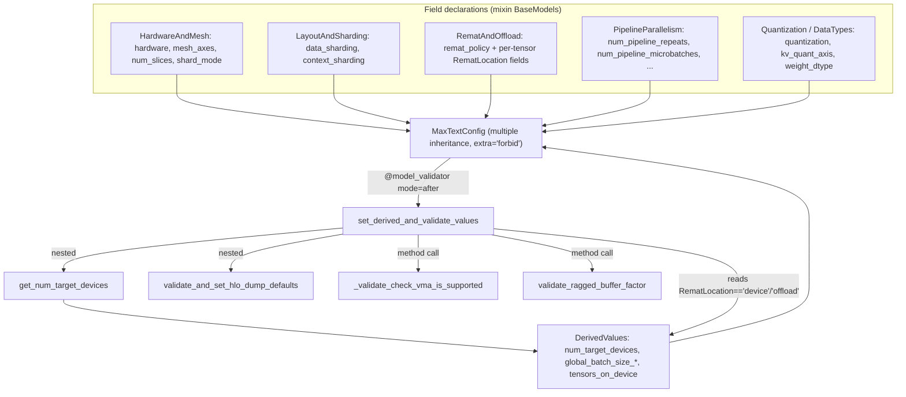

# MaxText config type system (Pydantic MaxTextConfig)

## Overview
`src/maxtext/configs/types.py` is MaxText's *current* configuration surface: a single
Pydantic model, [`MaxTextConfig`](../catalog/src/maxtext/configs/types.md#MaxTextConfig),
assembled by multiple inheritance from ~60 small topical mixin `BaseModel` classes
(`RunInfo`, `DataTypes`, `Quantization`, `ModelArchitecture`, `Attention`,
`HardwareAndMesh`, `LayoutAndSharding`, `PipelineParallelism`, `RematAndOffload`,
`Optimizer`, …) plus a trailing `DerivedValues` mixin. Each mixin declares a cluster of
typed `Field(...)` knobs; the union is the whole flag space. The key design idea is that
*declaration* (hundreds of `Field`s spread across mixins, each with a type, default, and
description) is cleanly separated from *derivation + cross-field validation*, which is
concentrated in one enormous `@model_validator(mode="after")` method,
[`set_derived_and_validate_values`](../catalog/src/maxtext/configs/types.md#MaxTextConfig.set_derived_and_validate_values).
That method is a near-line-for-line port of the legacy `pyconfig_deprecated` logic (see
[maxtext-configs-pyconfig_deprecated](maxtext-configs-pyconfig_deprecated.md)) onto a
type-checked, `extra="forbid"` object — so an unknown key or a wrong-typed value is a
construction-time error rather than a silent runtime surprise.

## Diagram

## Design rationale (why it's built this way)
- **Mixins as a namespace-free grouping.** MaxText has an unusually large flag surface
  (checkpointing, quantization, every attention variant, MoE kernels, five parallelism
  axes, remat, RL, multimodal). Splitting the fields into topical `BaseModel` mixins keeps
  each cluster readable while `MaxTextConfig` flattens them into one flat attribute space —
  configs still say `per_device_batch_size`, not `training.per_device_batch_size`.
- **`extra="forbid"` (`ConfigDict`).** The class docstring states the intent: "Every field
  is explicitly defined to prevent misconfigurations (`extra='forbid'`)." A typo'd YAML key
  is rejected instead of silently ignored — important when a mis-spelled perf flag would
  otherwise leave the default silently in force.
- **One post-validator, not many.** Rather than scatter `@field_validator`s, almost all
  derivation and cross-field validation lives in one `mode="after"` method
  [`set_derived_and_validate_values`](../catalog/src/maxtext/configs/types.md#MaxTextConfig.set_derived_and_validate_values).
  Its own docstring is explicit: "This logic is ported from the legacy
  pyconfig_deprecated.py system and adapted for Pydantic." Keeping it monolithic preserves
  the legacy ordering (paths → dims → devices → batch → pipeline → validate), which matters
  because later steps read fields written by earlier ones.
- **Enums for closed value sets.**
  [`RematLocation`](../catalog/src/maxtext/configs/types.md#RematLocation) (`remat` /
  `device` / `offload`) and
  [`DatasetType`](../catalog/src/maxtext/configs/types.md#DatasetType) subclass
  `(str, Enum)` so they serialize as plain strings in YAML yet are validated against a fixed
  set. [`PathStr`](../catalog/src/maxtext/configs/types.md#PathStr) is just a `str` alias
  used as a semantic marker on path-typed fields such as
  [`base_output_directory`](../catalog/src/maxtext/configs/types.md#RunInfo.base_output_directory).

## Entry points
- [`MaxTextConfig`](../catalog/src/maxtext/configs/types.md#MaxTextConfig) — the aggregate
  model. Constructing it (Pydantic validation) is what runs the whole config pipeline;
  every downstream module reads flags off this object. Control reaches it when the training
  entry point builds the config from parsed YAML/CLI values.
- [`set_derived_and_validate_values`](../catalog/src/maxtext/configs/types.md#MaxTextConfig.set_derived_and_validate_values)
  — the `mode="after"` model validator that fires automatically at the end of construction,
  once all raw fields are populated. It both *computes* derived fields (paths, model
  dimensions, device counts, batch sizes, pipeline schedule) and *rejects* invalid
  combinations. This is the heart of the page.
- [`get_num_target_devices`](../catalog/src/maxtext/configs/types.md#MaxTextConfig.get_num_target_devices)
  — a function nested inside the validator; reached mid-derivation to resolve how many
  devices the run targets (AOT topology vs. `jax.devices()` vs. single-controller subslice).
- [`validate_and_set_hlo_dump_defaults`](../catalog/src/maxtext/configs/types.md#MaxTextConfig.validate_and_set_hlo_dump_defaults)
  — nested helper invoked "before initializing the backend" to wire up XLA HLO-dump flags;
  the earliest perf-observability hook.

## Mechanism (step-by-step)
1. **Field population + `extra="forbid"` gate.** Pydantic first fills every declared
   `Field` on [`MaxTextConfig`](../catalog/src/maxtext/configs/types.md#MaxTextConfig) from
   the incoming dict, coercing to each field's annotated type (enums, `int`, `list[str]`,
   etc.) and rejecting any key not declared by a mixin. A `mode="before"` no-op validator
   (`load_model_specific_defaults`) is present only because model-specific defaulting is
   still done upstream by pyconfig.
2. **Custom mesh + run name/paths (section A).** `set_derived_and_validate_values` optionally
   overlays a `custom_mesh_and_rule` YAML onto
   [`mesh_axes`](../catalog/src/maxtext/configs/types.md#HardwareAndMesh.mesh_axes) /
   [`data_sharding`](../catalog/src/maxtext/configs/types.md#LayoutAndSharding.data_sharding) /
   [`context_sharding`](../catalog/src/maxtext/configs/types.md#LayoutAndSharding.context_sharding),
   then, if [`run_name`](../catalog/src/maxtext/configs/types.md#RunInfo.run_name) is empty,
   synthesizes one from `JOBSET_NAME` or
   [`model_name`](../catalog/src/maxtext/configs/types.md#RunInfo.model_name)+timestamp and
   joins it under
   [`base_output_directory`](../catalog/src/maxtext/configs/types.md#RunInfo.base_output_directory)
   to derive `checkpoint_dir` / `metrics_dir` / `tensorboard_dir`.
3. **Primary defaults (section C).** Interdependent scalars are resolved:
   `learning_rate_schedule_steps`↔`steps` fill each other when `-1`; soft-cap `0.0` becomes
   `None`; `mu_dtype` defaults to
   [`weight_dtype`](../catalog/src/maxtext/configs/types.md#DataTypes.weight_dtype); and the
   WSD branch keyed on
   [`lr_schedule_type`](../catalog/src/maxtext/configs/types.md#Optimizer.lr_schedule_type)
   checks warmup+decay fractions ≤ 1.0.
4. **HLO-dump wiring.**
   [`validate_and_set_hlo_dump_defaults`](../catalog/src/maxtext/configs/types.md#MaxTextConfig.validate_and_set_hlo_dump_defaults)
   runs before backend init: it refuses to have both `XLA_FLAGS` and `dump_hlo_xla_flags`
   set, otherwise builds `--xla_dump_to=… --xla_dump_large_constants` (optionally with a
   `--xla_dump_hlo_module_re` filter) and exports it into `os.environ["XLA_FLAGS"]`. This is
   the switch that makes a run's post-optimization HLO available for later analysis.
5. **Model dimensions from `global_parameter_scale` (section D).** `get_individual_scales`
   turns the single power-of-two scale into per-axis exponents, and the validator multiplies
   the `base_*` fields (e.g.
   [`base_mlp_dim`](../catalog/src/maxtext/configs/types.md#ModelArchitecture.base_mlp_dim))
   to produce effective `emb_dim`, `num_query_heads`, `num_kv_heads`, `mlp_dim`,
   `moe_mlp_dim`, `num_decoder_layers`. This is why a single knob rescales the whole model.
6. **Device count (section E).**
   [`get_num_target_devices`](../catalog/src/maxtext/configs/types.md#MaxTextConfig.get_num_target_devices)
   resolves the target device count with a priority ladder: explicit
   `internal_compile_num_devices` → AOT `compile_topology` spec → single-controller
   `subslice_shape` when
   [`enable_single_controller`](../catalog/src/maxtext/configs/types.md#DevelopmentAndDebugging.enable_single_controller)
   → elastic live devices → else `len(jax.devices())`. The result is stored in
   [`num_target_devices`](../catalog/src/maxtext/configs/types.md#DerivedValues.num_target_devices),
   defaulting to 1 if JAX isn't initialized; then
   [`num_slices`](../catalog/src/maxtext/configs/types.md#HardwareAndMesh.num_slices) is
   auto-filled from
   [`hardware`](../catalog/src/maxtext/configs/types.md#HardwareAndMesh.hardware).
7. **Batch sizes (section F).** Still inside [`set_derived_and_validate_values`](../catalog/src/maxtext/configs/types.md#MaxTextConfig.set_derived_and_validate_values), a nested `calculate_global_batch_sizes` combines
   `per_device_batch_size`, `expansion_factor_real_data`, `num_target_devices`, and
   `gradient_accumulation_steps` into the global/micro batch derived fields — sub-1.0
   per-device sizes are treated as fractional device sharing. Ramp-up variants are computed
   when enabled.
8. **Custom remat → device/offload tensor lists (section G).** When
   [`remat_policy`](../catalog/src/maxtext/configs/types.md#RematAndOffload.remat_policy) ==
   `"custom"`, the validator walks the per-tensor
   [`RematLocation`](../catalog/src/maxtext/configs/types.md#RematLocation) fields —
   [`decoder_layer_input`](../catalog/src/maxtext/configs/types.md#RematAndOffload.decoder_layer_input),
   [`context`](../catalog/src/maxtext/configs/types.md#RematAndOffload.context),
   [`mlpwi`](../catalog/src/maxtext/configs/types.md#RematAndOffload.mlpwi),
   [`moe_mlpwi_0`](../catalog/src/maxtext/configs/types.md#RematAndOffload.moe_mlpwi_0),
   [`qkv_proj`](../catalog/src/maxtext/configs/types.md#RematAndOffload.qkv_proj),
   [`mla_kv`](../catalog/src/maxtext/configs/types.md#RematAndOffload.mla_kv), … — and sorts
   each named tensor whose value is `"device"` into `tensors_on_device` and `"offload"` into
   `tensors_to_offload`. This is the memory-vs-recompute knob the optimization loop tunes
   most directly.
9. **Pipeline schedule derivation (section G cont.).** With
   [`pipeline_parallel_layers`](../catalog/src/maxtext/configs/types.md#PipelineParallelism.pipeline_parallel_layers)
   defaulting to the decoder-layer count (or MoE layers for DeepSeek), the validator derives
   [`num_pipeline_repeats`](../catalog/src/maxtext/configs/types.md#PipelineParallelism.num_pipeline_repeats)
   and
   [`num_pipeline_microbatches`](../catalog/src/maxtext/configs/types.md#PipelineParallelism.num_pipeline_microbatches)
   from the stage count and
   [`num_layers_per_pipeline_stage`](../catalog/src/maxtext/configs/types.md#PipelineParallelism.num_layers_per_pipeline_stage),
   asserting exact divisibility, and reorders
   [`mesh_axes`](../catalog/src/maxtext/configs/types.md#HardwareAndMesh.mesh_axes) so
   `stage` precedes `data` for correct microbatch sharding.
10. **Cross-field validation gauntlet (section I) + helper validators.** A long block rejects
    incompatible combinations — checkpoint-path exclusivity, dataset/packing rules keyed on
    [`packing`](../catalog/src/maxtext/configs/types.md#DatasetGeneral.packing) and
    [`dataset_type`](../catalog/src/maxtext/configs/types.md#DatasetType), attention-window
    rules keyed on
    [`attention`](../catalog/src/maxtext/configs/types.md#Attention.attention) /
    [`attention_type`](../catalog/src/maxtext/configs/types.md#Attention.attention_type),
    KV-quant rules keyed on
    [`kv_quant_axis`](../catalog/src/maxtext/configs/types.md#Quantization.kv_quant_axis) and
    [`quantization`](../catalog/src/maxtext/configs/types.md#Quantization.quantization),
    explicit-sharding decoder allow-lists keyed on
    [`shard_mode`](../catalog/src/maxtext/configs/types.md#HardwareAndMesh.shard_mode) and
    [`decoder_block`](../catalog/src/maxtext/configs/types.md#ModelArchitecture.decoder_block),
    and DPO checks on [`dpo`](../catalog/src/maxtext/configs/types.md#MaxTextConfig.dpo). Two
    checks are factored into methods called from here:
    [`validate_ragged_buffer_factor`](../catalog/src/maxtext/configs/types.md#MaxTextConfig.validate_ragged_buffer_factor)
    (MoE ragged-A2A / ragged-sort compatibility) and, near the end,
    [`_validate_check_vma_is_supported`](../catalog/src/maxtext/configs/types.md#MaxTextConfig._validate_check_vma_is_supported)
    (requires `shard_mode='auto'` and only FSDP/expert ICI axes). The method returns `self`.

## Key data structures
- **`MaxTextConfig`** — the flattened union of all mixin fields; the single object every
  module reads. `model_config = ConfigDict(extra="forbid", protected_namespaces=())`.
- **`RematAndOffload` fields typed as
  [`RematLocation`](../catalog/src/maxtext/configs/types.md#RematLocation)** — one enum-valued
  knob per checkpointable tensor (attention projections, MLP/MoE intermediates, decoder input,
  [`engram`](../catalog/src/maxtext/configs/types.md#RematAndOffload.engram)). The set of names
  the validator iterates *is* the remat vocabulary.
- **`DerivedValues`** — the trailing mixin holding all `None`-defaulted computed fields
  (`num_target_devices`, `global_batch_size_*`, `micro_batch_size_*`, `checkpoint_dir`,
  `tensors_on_device`, `tensors_to_offload`, `rampup_end_step`, …). Separating derived from
  input fields makes it clear which values the user sets vs. which the validator fills.
- **Enums** — [`RematLocation`](../catalog/src/maxtext/configs/types.md#RematLocation),
  [`DatasetType`](../catalog/src/maxtext/configs/types.md#DatasetType), and the many
  `Literal[...]`/enum-typed knobs (e.g.
  [`hardware`](../catalog/src/maxtext/configs/types.md#HardwareAndMesh.hardware),
  [`opt_type`](../catalog/src/maxtext/configs/types.md#Optimizer.opt_type),
  [`tokenizer_type`](../catalog/src/maxtext/configs/types.md#Tokenizer.tokenizer_type))
  encode closed value sets validated at parse time.

## Dynamics (design intent)
The validator is intentionally *ordered and stateful*: section A writes paths that section
D's `run_name`-derived dump dirs depend on; section E writes `num_target_devices` that
section F's batch math consumes; section G's pipeline block mutates
[`mesh_axes`](../catalog/src/maxtext/configs/types.md#HardwareAndMesh.mesh_axes) and
`logical_axis_rules` in place. Per the docstring on
[`set_derived_and_validate_values`](../catalog/src/maxtext/configs/types.md#MaxTextConfig.set_derived_and_validate_values),
this ordering is deliberately preserved from the legacy pyconfig port so behavior matches the
old system field-for-field. Device resolution in
[`get_num_target_devices`](../catalog/src/maxtext/configs/types.md#MaxTextConfig.get_num_target_devices)
is defensive — it catches `RuntimeError`/`IndexError` and assumes a single device so that
config validation still succeeds on a CPU box with no JAX backend (e.g. for AOT/testing).

## Edge cases
- **Fractional `per_device_batch_size`.** Section F treats `< 1.0` as fractional device
  sharing rather than rounding to a per-device count.
- **`num_target_devices` without JAX.** Falls back to 1 with a warning, so derived batch
  sizes computed during pure-validation runs are placeholders, not the real cluster values.
- **Pipeline divisibility asserts.** Section G raises `AssertionError` (not `ValueError`) when
  stage×repeat×layers-per-stage ≠
  [`pipeline_parallel_layers`](../catalog/src/maxtext/configs/types.md#PipelineParallelism.pipeline_parallel_layers)
  — a misconfigured pipeline aborts construction.
- **`check_vma` narrow support.**
  [`_validate_check_vma_is_supported`](../catalog/src/maxtext/configs/types.md#MaxTextConfig._validate_check_vma_is_supported)
  forbids everything but `ici_expert_parallelism`/`ici_fsdp_parallelism` and requires
  [`shard_mode`](../catalog/src/maxtext/configs/types.md#HardwareAndMesh.shard_mode)==`auto`.
- **Custom remat requires the name to exist.** Section G only recognizes the fixed tensor
  list; a `"device"`/`"offload"` value on a tensor not in that list has no effect.

## Open questions
- The nested `calculate_global_batch_sizes` and `get_individual_scales` used by the validator
  are module-local helpers not exposed as citable subgraph symbols here; the exact ramp-up
  step math (`rampup_end_step`) is derived in-line and not separately documented.
- How `logical_axis_rules` and `data_sharding` interact with the mesh at runtime (beyond the
  `stage`-first reordering) lives in the sharding/mesh runtime code, outside this packet.
- Whether any consumer still reads the legacy `dcn_diloco_parallelism`-style aggregate lists
  vs. the individual axis fields is not settled from this file alone
  ([`dcn_diloco_parallelism`](../catalog/src/maxtext/configs/types.md#DcnParallelism.dcn_diloco_parallelism)).

## See also
- [maxtext-configs-pyconfig_deprecated](maxtext-configs-pyconfig_deprecated.md) — the legacy
  dict-based system this Pydantic model ports its derivation/validation logic from.
