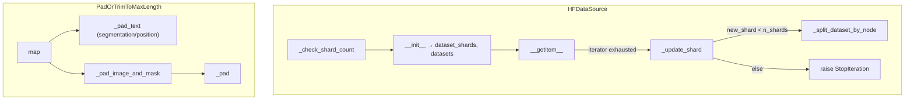

# MaxText input-pipeline utilities: HF sharding + pad/segment preprocessing

<!-- connect:up:begin -->
> **Cross-repo concept:** part of [sharding](../../../concepts/sharding.md) across this wiki's repos.
<!-- connect:up:end -->
Host-side helpers that (a) turn a streaming HuggingFace `IterableDataset` into a
Grain-compatible random-access source across many data-loading hosts and threads,
and (b) pad every example to a fixed `max_length` while emitting the segmentation
and position tensors the TPU model consumes. These are the two throughput-critical
CPU stages that feed the accelerator: get them wrong and the TPU starves or wastes
flops on padding.

## Overview

Two independent subsystems live in this module. `HFDataSource` adapts a
non-indexable HF stream to Grain's `RandomAccessDataSource` protocol by faking
`__len__` and translating each `__getitem__` into "pull the next item from the
per-thread iterator." It carves the dataset into `n_shards` node-shards, assigns
each `(host, thread)` a strided set of shards, and rotates to the next shard when
an iterator exhausts. `PadOrTrimToMaxLength` is a Grain map transform: for every
non-image column it derives a boolean `*_segmentation` mask and an `arange`
`*_position` vector, then right-pads (or trims) the data to `max_length` with
`pad_id`. The key idea shared by both: fixed shapes and deterministic shard
assignment let the accelerator see identical tensor shapes every step (no
recompilation) while the host keeps every loader thread busy on a disjoint slice
of data.

## Diagram

## Design rationale (why it's built this way)

The core problem `HFDataSource` solves is that HF `IterableDataset` has no length
and no random access, but Grain's `RandomAccessDataSource` demands both. The fix is
deliberately dishonest: `__len__` returns a huge fake length (10^10) so Grain never
believes it reached the end, and `__getitem__` ignores the requested index entirely
— it uses the calling thread's name to pick a per-thread iterator and returns
*that* iterator's next item. This is why shard assignment must be disjoint per
thread: two threads sharing a shard would double-read it.

`_check_shard_count` encodes a real performance cliff. If the dataset has fewer
shards than `dataloading_host_count * num_threads`, some loader threads get no
shard and idle, so it warns and clamps `n_shards` up — a documented
"multihost-dataloading-best-practice" concern.

> [!inferred]
> Padding to a single static `max_length` (rather than dynamic/bucketed lengths) is
> almost certainly to keep the XLA-compiled step shape constant across steps; the
> module doesn't state this, but constant input shapes are the standard reason
> MaxText fixes sequence length host-side.

## Entry points

- [`__getitem__`](../catalog/src/maxtext/input_pipeline/input_pipeline_utils.md#HFDataSource.__getitem__)
  is the hot path Grain calls once per example per worker thread. It lazily
  materializes [`data_iters`](../catalog/src/maxtext/input_pipeline/input_pipeline_utils.md#HFDataSource.data_iters)
  on first call, derives the thread index from `current_thread().name.split("_")[1]`,
  and loops `next()` on that thread's iterator — falling through to a shard rotation
  only on `StopIteration`.

- [`map`](../catalog/src/maxtext/input_pipeline/input_pipeline_utils.md#PadOrTrimToMaxLength.map)
  is the Grain transform applied to every example after tokenization. It is where a
  raw token array becomes the fixed-shape `{data, data_segmentation, data_position,
  (data_true_length)}` bundle the model expects.

## Mechanism (step-by-step)

1. **Construct disjoint shard sets.** At init the source reads `dataset.n_shards`
   into [`n_shards`](../catalog/src/maxtext/input_pipeline/input_pipeline_utils.md#HFDataSource.n_shards)
   (falling back to 1), then assigns this host the strided shard list
   [`dataset_shards`](../catalog/src/maxtext/input_pipeline/input_pipeline_utils.md#HFDataSource.dataset_shards)
   `= [host_index*num_threads + i for i in range(num_threads)]`. Each shard becomes
   its own node-split view in
   [`datasets`](../catalog/src/maxtext/input_pipeline/input_pipeline_utils.md#HFDataSource.datasets)
   via [`_split_dataset_by_node`](../catalog/src/maxtext/input_pipeline/input_pipeline_utils.md#HFDataSource._split_dataset_by_node),
   so the global shard space is partitioned across every `(host, thread)` with no
   overlap.

2. **Guard against too-few shards.** [`_check_shard_count`](../catalog/src/maxtext/input_pipeline/input_pipeline_utils.md#HFDataSource._check_shard_count)
   compares [`n_shards`](../catalog/src/maxtext/input_pipeline/input_pipeline_utils.md#HFDataSource.n_shards)
   against [`dataloading_host_count`](../catalog/src/maxtext/input_pipeline/input_pipeline_utils.md#HFDataSource.dataloading_host_count)
   × [`num_threads`](../catalog/src/maxtext/input_pipeline/input_pipeline_utils.md#HFDataSource.num_threads).
   When the dataset is under-sharded it warns about inefficient dataloading and
   raises `n_shards` to the loader count — a throughput safeguard, since idle loader
   threads translate directly into accelerator input-stall.

3. **Serve the next item per thread.** [`__getitem__`](../catalog/src/maxtext/input_pipeline/input_pipeline_utils.md#HFDataSource.__getitem__)
   selects the iterator by decoding the worker thread name into an index, then
   pulls from [`data_iters`](../catalog/src/maxtext/input_pipeline/input_pipeline_utils.md#HFDataSource.data_iters).
   The requested `index` argument is discarded — order comes entirely from the
   underlying stream, which is why this source cannot support true random access.

4. **Rotate shards on exhaustion.** When a thread's iterator raises `StopIteration`,
   [`_update_shard`](../catalog/src/maxtext/input_pipeline/input_pipeline_utils.md#HFDataSource._update_shard)
   advances that slot by a full stride (`+ dataloading_host_count * num_threads`),
   re-splits [`dataset`](../catalog/src/maxtext/input_pipeline/input_pipeline_utils.md#HFDataSource.dataset)
   at the new rank, and rebuilds the iterator. The stride keeps the per-thread shard
   sequence disjoint across the whole cluster; once the next shard index would exceed
   `n_shards`, it raises `StopIteration` to signal genuine exhaustion for this host.

5. **Derive segmentation + position, then pad text.** In
   [`map`](../catalog/src/maxtext/input_pipeline/input_pipeline_utils.md#PadOrTrimToMaxLength.map),
   each non-`images` column gets a `*_segmentation` mask computed as `element != pad_id`
   cast to int32, a `*_position` vector from `np.arange(len)`, and (if
   [`add_true_length`](../catalog/src/maxtext/input_pipeline/input_pipeline_utils.md#PadOrTrimToMaxLength.add_true_length))
   a `*_true_length` scalar. Note these are computed *before* padding, so the mask
   reflects real tokens — critical because the TPU attention kernel uses
   segmentation to mask out padded positions.

6. **Pad or trim text to a fixed shape.** [`_pad_text`](../catalog/src/maxtext/input_pipeline/input_pipeline_utils.md#PadOrTrimToMaxLength._pad_text)
   right-pads the first axis up to
   [`max_length`](../catalog/src/maxtext/input_pipeline/input_pipeline_utils.md#PadOrTrimToMaxLength.max_length)
   with [`pad_id`](../catalog/src/maxtext/input_pipeline/input_pipeline_utils.md#PadOrTrimToMaxLength.pad_id)
   (`pad_amount = max(max_length - len, 0)`), then slices `[:max_length]` to trim
   overlong sequences. The single `np.pad` + slice guarantees a constant output shape
   regardless of input length.

7. **Pad multimodal image/mask tensors.** For the `images` column,
   [`_pad_image_and_mask`](../catalog/src/maxtext/input_pipeline/input_pipeline_utils.md#PadOrTrimToMaxLength._pad_image_and_mask)
   computes `max_num_items = (max_length - 1) // single_image_offset` — reserving one
   slot for at least one text token — optionally clamped by
   [`max_num_images_per_example`](../catalog/src/maxtext/input_pipeline/input_pipeline_utils.md#PadOrTrimToMaxLength.max_num_images_per_example),
   then zero-pads along axis 0 via the inner
   [`_pad`](../catalog/src/maxtext/input_pipeline/input_pipeline_utils.md#PadOrTrimToMaxLength._pad).
   All of this reads model shape from
   [`config`](../catalog/src/maxtext/input_pipeline/input_pipeline_utils.md#PadOrTrimToMaxLength.config).

## Key data structures

- **Shard bookkeeping** on `HFDataSource`: `dataset_shards` (the integer shard ids
  this host owns), `datasets` (one node-split view per shard), and `data_iters` (the
  live iterators). These three lists are index-aligned; `_update_shard` mutates all
  three in lockstep for a single slot `idx`.
- **`PadOrTrimToMaxLength` config**: `max_length`, `pad_id`, `add_true_length`,
  `max_num_images_per_example`, and `config`. All are plain immutable settings read
  during `map`; the transform holds no per-example state, which makes it safe to run
  across Grain's parallel workers.

## Dynamics (design intent)

The per-thread routing in
[`__getitem__`](../catalog/src/maxtext/input_pipeline/input_pipeline_utils.md#HFDataSource.__getitem__)
(reading `current_thread().name`) implies the source is designed to be driven by
multiple worker threads, each pinned to one iterator slot; the strided assignment in
[`dataset_shards`](../catalog/src/maxtext/input_pipeline/input_pipeline_utils.md#HFDataSource.dataset_shards)
and the stride in
[`_update_shard`](../catalog/src/maxtext/input_pipeline/input_pipeline_utils.md#HFDataSource._update_shard)
are what keep those threads reading disjoint data. `map`, by contrast, is stateless
and per-element, matching Grain's parallel-map model.

> [!inferred]
> No tests reference this subgraph, so thread-count/shard-count interactions are
> read from source only; the exact Grain worker→thread-name convention that
> `__getitem__` parses is external to this module.

## Edge cases

- **Under-sharded datasets** trigger the `_check_shard_count` warning and an
  `n_shards` bump; downstream shard math then uses the inflated count.
- **Shard exhaustion** raises `StopIteration` from `_update_shard` when the next
  strided shard is out of range — real end-of-data for this host, distinct from a
  single iterator ending.
- **Overlong sequences** are silently trimmed by the `[:max_length]` slice in
  `_pad_text`; there is no error, so truncation is a quiet correctness/throughput
  tradeoff.
- **Multimodal limits**: `_pad_image_and_mask` raises if an image/mask tensor
  dimensionality is not 2/4/5 or if item count exceeds `max_num_items`; a `qwen3-omni`
  model name short-circuits image padding entirely.

## Open questions

- The `map` path also references helpers like `add_true_length`-driven true-length
  emission and image offset computation (`get_image_offsets`) that are not in this
  subgraph; how `single_image_offset` is derived per model lives outside this packet.
- Whether trimming vs. packing is preferred for training throughput is not decided
  here — this module only trims; sequence *packing* is handled elsewhere (see the
  prefill-packing concept).

## See also

- [MaxText prefill sequence packing](maxtext-input_pipeline-packing-prefill_packing.md)
