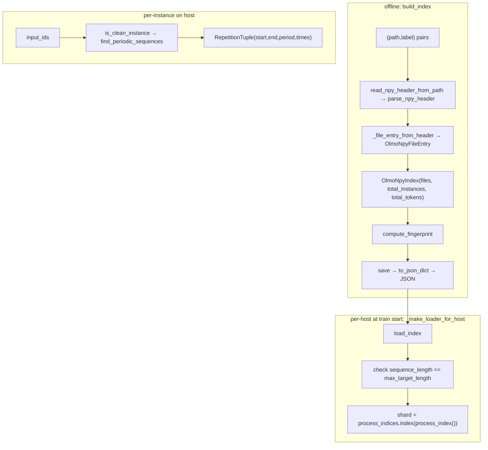

# OLMo numpy dataset indexing + host-side input pipeline
The dependency-free layer that turns a mix of flat `.npy` token-ID files into a global, byte-offset-addressable stream of fixed-length training instances, plus the repeated-n-gram quality filter that runs on the host.

## Overview
AI2's OLMo mix files are flat 1-D arrays of token IDs; a training "instance" is a non-overlapping `sequence_length`-token window over the *virtual concatenation* of those files in a fixed order. This module builds and persists the index that maps a global instance index to `(file, token-offset)` without ever reading token data — it parses only `.npy` headers. The single key idea is that the index is a **pure, hashable description of the stream**: [`build_index`](../catalog/src/maxtext/input_pipeline/olmo_data.md#build_index) walks headers to compute per-file instance counts, [`compute_fingerprint`](../catalog/src/maxtext/input_pipeline/olmo_data.md#compute_fingerprint) hashes the fields that determine batch ordering, and [`OlmoNpyIndex`](../catalog/src/maxtext/input_pipeline/olmo_data.md#OlmoNpyIndex) is serialized to JSON so a run can restart deterministically. Because the sampler is stateless, resuming needs only the index plus a step counter — no iterator-state to serialize.

The module also ports OLMo-core's data-cleaning filter: [`find_periodic_sequences`](../catalog/src/maxtext/input_pipeline/olmo_data.md#find_periodic_sequences) / [`is_clean_instance`](../catalog/src/maxtext/input_pipeline/olmo_data.md#is_clean_instance) reject instances containing long verbatim repetitions. This is the one part of the pipeline that touches every token on the host CPU, so it is the most likely place for input preprocessing to bottleneck a TPU step.

## Diagram

## Design rationale (why it's built this way)
The index is deliberately **header-only**. [`build_index`](../catalog/src/maxtext/input_pipeline/olmo_data.md#build_index)'s docstring warns *"Order matters — global instance ordering is the concatenation in this order"* and that `header_reader` is *"the seam tests use to avoid disk; production paths pass a GCS-aware reader."* Reading only the `.npy` header (via [`parse_npy_header`](../catalog/src/maxtext/input_pipeline/olmo_data.md#parse_npy_header) / [`read_npy_header_from_path`](../catalog/src/maxtext/input_pipeline/olmo_data.md#read_npy_header_from_path)) means the cost of indexing a petabyte-scale mix is O(number of files), not O(tokens) — a handful of bytes per file rather than a full read. That is what makes the index cheap enough to build offline and load at every host.

Restart-safety is enforced by a hash, not by trust. [`compute_fingerprint`](../catalog/src/maxtext/input_pipeline/olmo_data.md#compute_fingerprint)'s docstring is explicit: *"Stable hash over the fields a restart must preserve. If any of these change, the global instance ordering changes and resuming training from a checkpoint would silently produce different batches."* So it hashes [`sequence_length`](../catalog/src/maxtext/input_pipeline/olmo_data.md#OlmoNpyIndex.sequence_length), [`dtype`](../catalog/src/maxtext/input_pipeline/olmo_data.md#OlmoNpyIndex.dtype), [`tokenizer`](../catalog/src/maxtext/input_pipeline/olmo_data.md#OlmoNpyIndex.tokenizer), and each file's [`path`](../catalog/src/maxtext/input_pipeline/olmo_data.md#OlmoNpyFileEntry.path) + [`n_tokens`](../catalog/src/maxtext/input_pipeline/olmo_data.md#OlmoNpyFileEntry.n_tokens) — exactly the inputs to the instance→file mapping.

The n-gram filter is a faithful numpy port, chosen for correctness parity with OLMo-core rather than for raw speed. [`is_clean_instance`](../catalog/src/maxtext/input_pipeline/olmo_data.md#is_clean_instance)'s docstring notes its defaults *"match OLMo-core's `_validate_instance`."* Its cost is real: [`find_periodic_sequences`](../catalog/src/maxtext/input_pipeline/olmo_data.md#find_periodic_sequences) sweeps every candidate period, reshaping and rolling the whole instance array per period.

> [!inferred]
> Because `_make_loader_for_host` reads `grain_worker_count` with a `0`/in-process default (per its source comment "we don't auto-tune yet, so treat it as 0"), the n-gram filter and token reads run on the main host process unless the operator explicitly raises the worker count. On a fast TPU step this host-side per-token work is the realistic input-bottleneck candidate; the module itself does not parallelize it.

## Entry points
- [`build_index`](../catalog/src/maxtext/input_pipeline/olmo_data.md#build_index) — offline/setup entry: given `(path, label)` pairs and a `sequence_length`, produces the [`OlmoNpyIndex`](../catalog/src/maxtext/input_pipeline/olmo_data.md#OlmoNpyIndex). Reached from index-preparation tooling, not the hot training loop.
- [`_make_loader_for_host`](../catalog/src/maxtext/input_pipeline/olmo_grain_data_processing.md#_make_loader_for_host) — per-host training entry: calls [`load_index`](../catalog/src/maxtext/input_pipeline/olmo_data.md#load_index), validates `index.sequence_length` against `config.max_target_length`, derives this host's shard from `process_indices`, and computes `per_host_batch`. This is where the offline index meets the live multi-host dataloader.
- [`is_clean_instance`](../catalog/src/maxtext/input_pipeline/olmo_data.md#is_clean_instance) — per-instance filter entry, applied on the host as instances are produced; returns `False` to drop an instance with too many verbatim repeats.

## Mechanism (step-by-step)
1. **Header parse per file.** For each `(path, label)`, [`build_index`](../catalog/src/maxtext/input_pipeline/olmo_data.md#build_index) calls the header reader ([`read_npy_header_from_path`](../catalog/src/maxtext/input_pipeline/olmo_data.md#read_npy_header_from_path) → [`parse_npy_header`](../catalog/src/maxtext/input_pipeline/olmo_data.md#parse_npy_header)), which checks the [`_NPY_MAGIC`](../catalog/src/maxtext/input_pipeline/olmo_data.md#_NPY_MAGIC) prefix, reads the version-dependent header length, and `ast.literal_eval`s the header dict to recover `(dtype, shape)`. Only the header bytes are touched.
2. **File entry + running offset.** [`_file_entry_from_header`](../catalog/src/maxtext/input_pipeline/olmo_data.md#_file_entry_from_header) validates the array is 1-D, sets [`n_tokens`](../catalog/src/maxtext/input_pipeline/olmo_data.md#OlmoNpyFileEntry.n_tokens) = `shape[0]` and [`n_instances`](../catalog/src/maxtext/input_pipeline/olmo_data.md#OlmoNpyFileEntry.n_instances) = `n_tokens // sequence_length` (trailing tokens dropped), and stamps [`instance_offset`](../catalog/src/maxtext/input_pipeline/olmo_data.md#OlmoNpyFileEntry.instance_offset) with the cumulative count so far. [`build_index`](../catalog/src/maxtext/input_pipeline/olmo_data.md#build_index) also enforces a single shared dtype across all files.
3. **Index assembly.** The entries become the immutable [`files`](../catalog/src/maxtext/input_pipeline/olmo_data.md#OlmoNpyIndex.files) tuple; [`total_instances`](../catalog/src/maxtext/input_pipeline/olmo_data.md#OlmoNpyIndex.total_instances) is the final cumulative offset and [`total_tokens`](../catalog/src/maxtext/input_pipeline/olmo_data.md#OlmoNpyIndex.total_tokens) the sum of `n_tokens`. `OlmoNpyIndex.__post_init__` precomputes a cumulative-offset array (with a sentinel) for later binary search.
4. **Fingerprint + persist.** [`compute_fingerprint`](../catalog/src/maxtext/input_pipeline/olmo_data.md#compute_fingerprint) SHA-256s [`INDEX_FORMAT_VERSION`](../catalog/src/maxtext/input_pipeline/olmo_data.md#INDEX_FORMAT_VERSION), `sequence_length`, `dtype`, `tokenizer`, and every file's path+`n_tokens`; the result is stored in [`fingerprint`](../catalog/src/maxtext/input_pipeline/olmo_data.md#OlmoNpyIndex.fingerprint). [`save`](../catalog/src/maxtext/input_pipeline/olmo_data.md#OlmoNpyIndex.save) → [`to_json_dict`](../catalog/src/maxtext/input_pipeline/olmo_data.md#OlmoNpyIndex.to_json_dict) writes the whole index (minus the cached bisect helper) as JSON.
5. **Load + validate at train start.** [`load_index`](../catalog/src/maxtext/input_pipeline/olmo_data.md#load_index) reads the JSON, hard-fails if the stored [`format_version`](../catalog/src/maxtext/input_pipeline/olmo_data.md#OlmoNpyIndex.format_version) ≠ [`INDEX_FORMAT_VERSION`](../catalog/src/maxtext/input_pipeline/olmo_data.md#INDEX_FORMAT_VERSION), and rebuilds the [`OlmoNpyIndex`](../catalog/src/maxtext/input_pipeline/olmo_data.md#OlmoNpyIndex). [`_make_loader_for_host`](../catalog/src/maxtext/input_pipeline/olmo_grain_data_processing.md#_make_loader_for_host) then checks [`sequence_length`](../catalog/src/maxtext/input_pipeline/olmo_data.md#OlmoNpyIndex.sequence_length) matches the model's `max_target_length` and refuses to run on a mismatch, and slices the global stream into a non-overlapping shard per data-loading host, logging [`total_instances`](../catalog/src/maxtext/input_pipeline/olmo_data.md#OlmoNpyIndex.total_instances).
6. **Per-instance repetition filter.** [`is_clean_instance`](../catalog/src/maxtext/input_pipeline/olmo_data.md#is_clean_instance) streams [`find_periodic_sequences`](../catalog/src/maxtext/input_pipeline/olmo_data.md#find_periodic_sequences); for each candidate period it pads, reshapes into rows of length `period`, and compares each row to the previous (via `np.roll`) to detect a repeating block. Runs of matching rows are grouped by [`_group_consecutive_values`](../catalog/src/maxtext/input_pipeline/olmo_data.md#_group_consecutive_values), and the exact span boundaries are refined with [`_find_start_last_consecutive_true`](../catalog/src/maxtext/input_pipeline/olmo_data.md#_find_start_last_consecutive_true) / [`_find_end_first_consecutive_true`](../catalog/src/maxtext/input_pipeline/olmo_data.md#_find_end_first_consecutive_true), producing a [`RepetitionTuple`](../catalog/src/maxtext/input_pipeline/olmo_data.md#RepetitionTuple). The instance is dropped when any span's [`times`](../catalog/src/maxtext/input_pipeline/olmo_data.md#RepetitionTuple.times) reaches the count threshold.

## Key data structures
- [`OlmoNpyFileEntry`](../catalog/src/maxtext/input_pipeline/olmo_data.md#OlmoNpyFileEntry) — frozen record for one mix file: [`path`](../catalog/src/maxtext/input_pipeline/olmo_data.md#OlmoNpyFileEntry.path), [`label`](../catalog/src/maxtext/input_pipeline/olmo_data.md#OlmoNpyFileEntry.label), [`n_tokens`](../catalog/src/maxtext/input_pipeline/olmo_data.md#OlmoNpyFileEntry.n_tokens), [`n_instances`](../catalog/src/maxtext/input_pipeline/olmo_data.md#OlmoNpyFileEntry.n_instances), [`instance_offset`](../catalog/src/maxtext/input_pipeline/olmo_data.md#OlmoNpyFileEntry.instance_offset). The `instance_offset` chain is what makes global→file lookup a binary search.
- [`OlmoNpyIndex`](../catalog/src/maxtext/input_pipeline/olmo_data.md#OlmoNpyIndex) — the whole stream description: [`files`](../catalog/src/maxtext/input_pipeline/olmo_data.md#OlmoNpyIndex.files), [`total_instances`](../catalog/src/maxtext/input_pipeline/olmo_data.md#OlmoNpyIndex.total_instances), [`total_tokens`](../catalog/src/maxtext/input_pipeline/olmo_data.md#OlmoNpyIndex.total_tokens), [`sequence_length`](../catalog/src/maxtext/input_pipeline/olmo_data.md#OlmoNpyIndex.sequence_length), [`dtype`](../catalog/src/maxtext/input_pipeline/olmo_data.md#OlmoNpyIndex.dtype), [`tokenizer`](../catalog/src/maxtext/input_pipeline/olmo_data.md#OlmoNpyIndex.tokenizer), [`format_version`](../catalog/src/maxtext/input_pipeline/olmo_data.md#OlmoNpyIndex.format_version), [`fingerprint`](../catalog/src/maxtext/input_pipeline/olmo_data.md#OlmoNpyIndex.fingerprint).
- [`RepetitionTuple`](../catalog/src/maxtext/input_pipeline/olmo_data.md#RepetitionTuple) — a detected repeat span: [`start`](../catalog/src/maxtext/input_pipeline/olmo_data.md#RepetitionTuple.start), [`end`](../catalog/src/maxtext/input_pipeline/olmo_data.md#RepetitionTuple.end), [`period`](../catalog/src/maxtext/input_pipeline/olmo_data.md#RepetitionTuple.period), [`times`](../catalog/src/maxtext/input_pipeline/olmo_data.md#RepetitionTuple.times).

## Dynamics (design intent)
Instance ordering is fully determined by file order and per-file token counts, and [`compute_fingerprint`](../catalog/src/maxtext/input_pipeline/olmo_data.md#compute_fingerprint) freezes exactly those inputs so a checkpoint restart maps to the same batches. Sharding is by index arithmetic — [`_make_loader_for_host`](../catalog/src/maxtext/input_pipeline/olmo_grain_data_processing.md#_make_loader_for_host) turns `process_indices.index(process_index())` into a shard id over [`total_instances`](../catalog/src/maxtext/input_pipeline/olmo_data.md#OlmoNpyIndex.total_instances), giving each host a disjoint slice with no coordination. The `to_json_dict`/`load_index` round-trip is designed to drop the cached bisect helper and rebuild it, so persistence never carries derived state.

## Edge cases
- **Heterogeneous dtypes** across mix files raise in [`build_index`](../catalog/src/maxtext/input_pipeline/olmo_data.md#build_index); the index assumes one dtype for the whole stream ([`dtype`](../catalog/src/maxtext/input_pipeline/olmo_data.md#OlmoNpyIndex.dtype)).
- **Non-1-D `.npy`** raises in [`_file_entry_from_header`](../catalog/src/maxtext/input_pipeline/olmo_data.md#_file_entry_from_header); the mix must be flat token streams. Trailing tokens beyond a whole number of instances are silently dropped ([`n_instances`](../catalog/src/maxtext/input_pipeline/olmo_data.md#OlmoNpyFileEntry.n_instances) uses floor division).
- **Format-version drift** makes [`load_index`](../catalog/src/maxtext/input_pipeline/olmo_data.md#load_index) refuse a stale JSON rather than silently misread it.
- **mask_value collision:** [`find_periodic_sequences`](../catalog/src/maxtext/input_pipeline/olmo_data.md#find_periodic_sequences) uses `-1` (max uint32) as reshape padding and raises if that id actually appears in the array; a vocab that reaches that id must pass a different sentinel. Spans shorter than 3 repeats are ignored (the [`times`](../catalog/src/maxtext/input_pipeline/olmo_data.md#RepetitionTuple.times) `> 2` guard).

## Open questions
- The global-instance→`(file, token_offset)` resolver and the `OlmoIndexSampler` that actually draws instances per shard are outside this packet's subgraph (the resolver lives beside `OlmoNpyIndex` but is not a cited symbol here); confirming the exact per-step read pattern and whether reads overlap compute needs `olmo_data_grain`.
- Where token *bytes* are read (GCSFUSE mount vs direct GCS) and whether that read is prefetched relative to the TPU step is a property of the grain data loader, not this indexing module.

## See also
- [`maxtext-models-gpt3`](maxtext-models-gpt3.md) — the model this pipeline feeds; input throughput must exceed its per-step token consumption or the step stalls.
