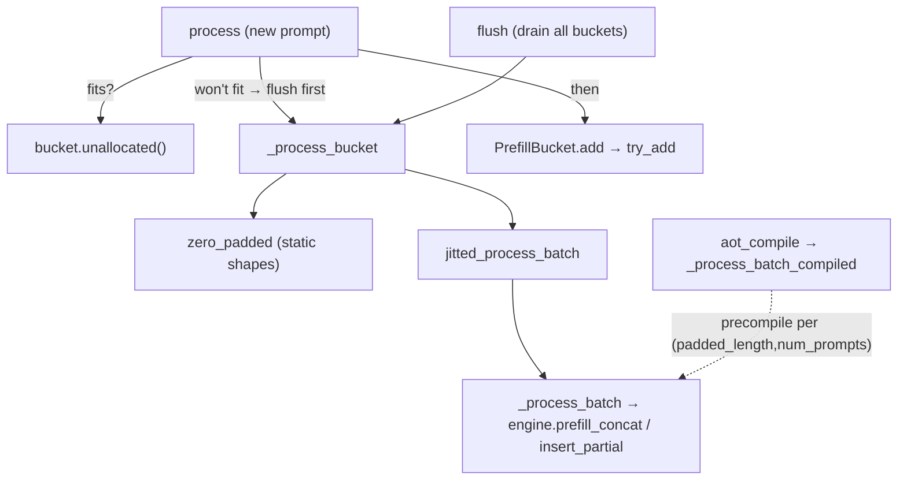

# MaxText prefill sequence packing (BatchedPrefillProcessor)

Inference-time bin-packing that concatenates several short prompts into one
fixed-length prefill call, using per-prompt segment ids and positions so the
attention kernel keeps them independent. The point is TPU utilization: a lone
50-token prompt padded to 2048 wastes ~97% of the prefill flops; packing many
prompts into that same 2048 window fills the wasted slots with real work.

## Overview

The subsystem has two collaborators. `PrefillBucket` is a pure host-side
accumulator: a first-fit bin of fixed `capacity` that holds prompts until it can't
fit the next one. `BatchedPrefillProcessor` owns one bucket per padding size,
appends incoming prompts, and — when a prompt won't fit — *flushes* the bucket by
concatenating its prompts into a single token array and issuing one packed
`prefill_concat` + `insert_partial` through the engine. The non-obvious core is in
how a flush builds three parallel arrays: concatenated **tokens**, per-prompt
**positions** (each prompt restarts at 0), and **segment ids** (prompt *i* gets id
`i*2+1`, padding gets 0). Those segment ids are what let a single attention call
treat the packed window as N independent sequences rather than one long one.

## Diagram

## Design rationale (why it's built this way)

Packing exists because prefill cost scales with the *padded* length, not the true
prompt length. A [`PrefillBucket`](../catalog/src/maxtext/input_pipeline/packing/prefill_packing.md#PrefillBucket)
of fixed [`capacity`](../catalog/src/maxtext/input_pipeline/packing/prefill_packing.md#PrefillBucket.capacity)
("Manage a list of prefill requests") lets the processor amortize one expensive
fixed-length prefill across many prompts.

The bucket is keyed by padding size — `buckets` is a dict from `input_padding` to a
bucket — because prompts of similar length should share a bin; mixing a 2048-padding
prompt with a 256-padding one would force everyone up to the larger window.

The segment-id scheme (`i*2+1` for prompt *i*, `0` for padding) in
[`_process_bucket`](../catalog/src/maxtext/input_pipeline/packing/prefill_packing.md#BatchedPrefillProcessor._process_bucket)
is the load-bearing trick: distinct nonzero ids make the attention mask block-diagonal
so prompts don't attend across each other, and reserving `0` for padding lets the
kernel drop padded positions. Using odd ids (`*2+1`) leaves even ids free.

Everything the jitted function sees must have static shape, which is why
[`zero_padded`](../catalog/src/maxtext/input_pipeline/packing/prefill_packing.md#BatchedPrefillProcessor.zero_padded)
pads the `slots`/`offsets`/`lengths` metadata arrays up to
[`max_batch_size`](../catalog/src/maxtext/input_pipeline/packing/prefill_packing.md#BatchedPrefillProcessor.max_batch_size)
— a variable number of prompts would otherwise retrigger XLA compilation every flush.

## Entry points

- [`process`](../catalog/src/maxtext/input_pipeline/packing/prefill_packing.md#BatchedPrefillProcessor.process)
  ("Process a new input") is the streaming entry: one call per incoming prompt. It
  validates length against capacity/padding, finds-or-creates the bucket for this
  `input_padding`, flushes that bucket if the prompt won't fit, then adds the prompt.

- [`flush`](../catalog/src/maxtext/input_pipeline/packing/prefill_packing.md#BatchedPrefillProcessor.flush)
  ("Process all remaining items in buckets") is the drain called when the input
  stream ends, so partially-filled buckets still get prefilled.

- [`aot_compile`](../catalog/src/maxtext/input_pipeline/packing/prefill_packing.md#BatchedPrefillProcessor.aot_compile)
  ("Ahead-of-time compile prefill processing routines") is the warm-up entry that
  pre-jits the packed prefill for a given `(padded_length, num_prompts)` so the first
  real request doesn't pay compile latency.

## Mechanism (step-by-step)

1. **Admit a prompt or trigger a flush.** [`process`](../catalog/src/maxtext/input_pipeline/packing/prefill_packing.md#BatchedPrefillProcessor.process)
   rejects prompts longer than capacity/padding, then looks up (via `setdefault`) the
   [`PrefillBucket`](../catalog/src/maxtext/input_pipeline/packing/prefill_packing.md#PrefillBucket)
   for this padding in
   [`buckets`](../catalog/src/maxtext/input_pipeline/packing/prefill_packing.md#BatchedPrefillProcessor.buckets).
   If the new prompt exceeds the bucket's
   [`unallocated`](../catalog/src/maxtext/input_pipeline/packing/prefill_packing.md#PrefillBucket.unallocated)
   space it flushes the *current* contents first (so the arriving prompt starts a
   fresh bin), then adds.

2. **Accumulate greedily, first-fit.** [`add`](../catalog/src/maxtext/input_pipeline/packing/prefill_packing.md#PrefillBucket.add)
   delegates to [`try_add`](../catalog/src/maxtext/input_pipeline/packing/prefill_packing.md#PrefillBucket.try_add)
   ("Try to add a prefill prompt to bucket"), which returns `False` when the prompt
   won't fit in remaining space and raises if it exceeds
   [`capacity`](../catalog/src/maxtext/input_pipeline/packing/prefill_packing.md#PrefillBucket.capacity)
   outright. On success it appends to
   [`slots`](../catalog/src/maxtext/input_pipeline/packing/prefill_packing.md#PrefillBucket.slots),
   [`row_ids`](../catalog/src/maxtext/input_pipeline/packing/prefill_packing.md#PrefillBucket.row_ids),
   and [`token_ids`](../catalog/src/maxtext/input_pipeline/packing/prefill_packing.md#PrefillBucket.token_ids),
   and bumps [`length`](../catalog/src/maxtext/input_pipeline/packing/prefill_packing.md#PrefillBucket.length)
   and [`count`](../catalog/src/maxtext/input_pipeline/packing/prefill_packing.md#PrefillBucket.count).
   `unallocated = capacity - length` is the running free space.

3. **Concatenate tokens and build position/segment arrays.** On flush,
   [`_process_bucket`](../catalog/src/maxtext/input_pipeline/packing/prefill_packing.md#BatchedPrefillProcessor._process_bucket)
   ("Process all items in a bucket") concatenates all
   [`token_ids`](../catalog/src/maxtext/input_pipeline/packing/prefill_packing.md#PrefillBucket.token_ids)
   plus a zero tail sized to
   [`unallocated`](../catalog/src/maxtext/input_pipeline/packing/prefill_packing.md#PrefillBucket.unallocated),
   builds `pos_ids` as a per-prompt `arange` (each prompt's positions restart at 0),
   and builds `seg_ids` where prompt *i* fills `i*2+1` and the trailing pad fills `0`.
   This is the whole reason packing is correct: positions and segments make the packed
   buffer behave as separate sequences under the attention mask.

4. **Pad metadata to static width.** Still in `_process_bucket`, the per-prompt
   `slots`/`offsets`/`lengths` lists are padded to
   [`max_batch_size`](../catalog/src/maxtext/input_pipeline/packing/prefill_packing.md#BatchedPrefillProcessor.max_batch_size)
   via [`zero_padded`](../catalog/src/maxtext/input_pipeline/packing/prefill_packing.md#BatchedPrefillProcessor.zero_padded),
   keeping the jitted input signature shape-stable across flushes with different prompt
   counts. A branch on
   [`auto_layout_supported`](../catalog/src/maxtext/input_pipeline/packing/prefill_packing.md#BatchedPrefillProcessor.auto_layout_supported)
   chooses between the eagerly-jitted path and the AOT-compiled path.

5. **Run the packed prefill on-device.** The jitted
   [`jitted_process_batch`](../catalog/src/maxtext/input_pipeline/packing/prefill_packing.md#BatchedPrefillProcessor.jitted_process_batch)
   (or the compiled variant) invokes
   [`_process_batch`](../catalog/src/maxtext/input_pipeline/packing/prefill_packing.md#BatchedPrefillProcessor._process_batch)
   ("Prefill and insert a packed request"), which calls the engine's `prefill_concat`
   with the concatenated tokens, `decoder_positions`, `decoder_segment_ids`, and
   `true_lengths`, then `insert_partial` to scatter each prompt's KV state into its
   decode [`slots`](../catalog/src/maxtext/input_pipeline/packing/prefill_packing.md#PrefillBucket.slots).
   The engine is held in
   [`engine`](../catalog/src/maxtext/input_pipeline/packing/prefill_packing.md#BatchedPrefillProcessor.engine).

6. **Ahead-of-time compile per shape key.** [`_process_batch_compiled`](../catalog/src/maxtext/input_pipeline/packing/prefill_packing.md#BatchedPrefillProcessor._process_batch_compiled)
   ("Ahead-of-time compilation wrapper of _process_batch()") memoizes a lowered+compiled
   executable in
   [`process_batch_func`](../catalog/src/maxtext/input_pipeline/packing/prefill_packing.md#BatchedPrefillProcessor.process_batch_func)
   keyed by `(padded_length, num_prompts, return_prompt_logp)`, pinning param and
   decode-state shardings and marking `num_prompts`/`padded_length` static. This is why
   only a bounded set of shape combinations ever compile — one per distinct padding ×
   prompt-count seen. [`log`](../catalog/src/maxtext/input_pipeline/packing/prefill_packing.md#log)
   records each compile.

## Key data structures

- **`PrefillBucket`** — the bin. `capacity` (max tokens), `length`/`count` (running
  fill), and three index-aligned lists `slots`/`row_ids`/`token_ids`. `unallocated()`
  is the free-space predicate that drives first-fit admission.
- **`BatchedPrefillProcessor`** — the manager. `buckets` (padding-size → bucket),
  `max_batch_size` (static prompt-count bound for shape padding),
  `process_batch_func` (shape-keyed compiled-executable cache),
  `jitted_process_batch` (the eager jit), `auto_layout_supported` (path switch), and
  `engine` (MaxEngine handle). `DecodeState` and `Params` are opaque `Any` aliases —
  [`DecodeState`](../catalog/src/maxtext/input_pipeline/packing/prefill_packing.md#DecodeState),
  [`Params`](../catalog/src/maxtext/input_pipeline/packing/prefill_packing.md#Params) —
  threaded through unchanged and donated to the jit.

## Dynamics (design intent)

`decode_state` is `donate_argnames`-donated in both
[`jitted_process_batch`](../catalog/src/maxtext/input_pipeline/packing/prefill_packing.md#BatchedPrefillProcessor.jitted_process_batch)
and [`_process_batch_compiled`](../catalog/src/maxtext/input_pipeline/packing/prefill_packing.md#BatchedPrefillProcessor._process_batch_compiled),
signalling the KV/decode buffers are updated in place rather than reallocated each
prefill — the intended memory behavior for a long-lived serving loop. Static-arg
marking of `num_prompts`/`padded_length` plus the shape-keyed
[`process_batch_func`](../catalog/src/maxtext/input_pipeline/packing/prefill_packing.md#BatchedPrefillProcessor.process_batch_func)
cache means compilation cost is paid once per shape class, then reused.

> [!inferred]
> No tests in the configured paths reference this subgraph, so the exact serving
> loop that alternates `process`/`flush` and consumes the `prefill_done` callback is
> outside this packet; the on-device semantics of `prefill_concat`/`insert_partial`
> live in the engine, not here.

## Edge cases

- **Prompt longer than capacity** → `try_add` raises `ValueError` (distinct from the
  benign "doesn't fit right now" `False`).
- **Prompt longer than padding/capacity at admission** → `process` raises before
  touching a bucket.
- **Stream end with partial buckets** → `flush` drains every non-empty bucket so no
  prompt is stranded.
- **Variable prompt count** is absorbed by `zero_padded` up to `max_batch_size`;
  padded metadata slots carry `0` and are ignored via segment id `0`.

## Open questions

- The exact block-diagonal masking and how `prefill_concat` consumes
  `decoder_segment_ids`/`start_pos` is in the engine, not this module — segment ids
  are constructed here but interpreted there.
- Whether `capacity` and `input_padding` are ever unequal in practice (both bound a
  prompt in `process`) isn't settled by this packet.

## See also

- [MaxText input-pipeline utilities](maxtext-input_pipeline-input_pipeline_utils.md)
