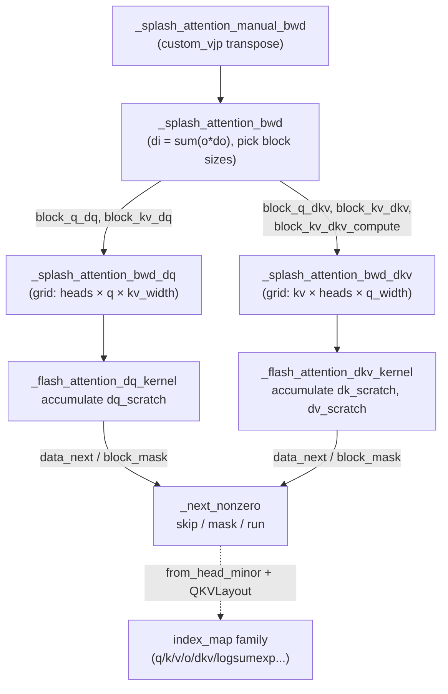

# SplashAttention backward — sparse flash-attention gradient kernels

## Overview
SplashAttention is **sparse** flash attention: it exploits the block structure of
the attention mask (causal, local, chunked) so the Pallas/Mosaic kernel only visits
KV blocks that can contribute a nonzero probability, instead of the full quadratic
grid. This page covers the **backward** half. The gradient is split into two Pallas
calls — a dQ pass ([`_splash_attention_bwd_dq`](../catalog/src/maxtext/kernels/attention/splash_attention_kernel.md#_splash_attention_bwd_dq)) and a dK/dV pass
([`_splash_attention_bwd_dkv`](../catalog/src/maxtext/kernels/attention/splash_attention_kernel.md#_splash_attention_bwd_dkv)) — orchestrated by [`_splash_attention_bwd`](../catalog/src/maxtext/kernels/attention/splash_attention_kernel.md#_splash_attention_bwd).
The single key idea that ties every piece together is a **scalar-prefetched sparsity
schedule** (`data_next` / `block_mask` / `mask_next`, read through [`_next_nonzero`](../catalog/src/maxtext/kernels/attention/splash_attention_kernel.md#_next_nonzero)):
the grid iteration space is *shrunk* to the number of live blocks, and each Pallas
program maps its shrunk index back to the true sequence coordinate on the fly. Like
flash attention, it never materializes the S×S score matrix and reuses the forward
`logsumexp` residual so softmax is never recomputed.

## Diagram

## Design rationale (why it's built this way)
The backward is deliberately **two kernels, not one**, because dQ and dKV want
opposite loop nests. `dq[i] = sum_j ds[i,j] · k[j]` accumulates over KV for a fixed
query block, so [`_splash_attention_bwd_dq`](../catalog/src/maxtext/kernels/attention/splash_attention_kernel.md#_splash_attention_bwd_dq) makes Q the outer grid axis and streams KV
into a `dq_scratch` accumulator. `dk[j], dv[j] = sum_i … ` accumulate over Q for a
fixed KV block, so [`_splash_attention_bwd_dkv`](../catalog/src/maxtext/kernels/attention/splash_attention_kernel.md#_splash_attention_bwd_dkv) transposes the grid to put KV outer and
Q inner. A **fused** variant exists behind [`use_fused_bwd_kernel`](../catalog/src/maxtext/kernels/attention/splash_attention_kernel.md#BlockSizes.use_fused_bwd_kernel), which computes
dq/dk/dv in one launch and reduces the unreduced dq over heads; when it is off, the
two dedicated `block_q_dq` / `block_kv_dq` sizes are required (that requirement is
exactly what [`has_backward_blocks`](../catalog/src/maxtext/kernels/attention/splash_attention_kernel.md#BlockSizes.has_backward_blocks) enforces before the kernel will run).

Two tile granularities exist per pass — a **memory/pipeline** block (`bkv`) and a
smaller **compute** block (`bkv_compute`) — and [`BlockSizes`](../catalog/src/maxtext/kernels/attention/splash_attention_kernel.md#BlockSizes) documents that these
"have negligible effect on numerics, but affect performance greatly." The compute
block is what the inner `fori_loop` unrolls over, so it trades register/VMEM pressure
against MXU utilization; `bkv` must be an exact multiple of `bkv_compute`, and both
must be multiples of [`NUM_LANES`](../catalog/src/maxtext/kernels/attention/splash_attention_kernel.md#NUM_LANES) (128) — the KV dimension lives in the lane axis.

The physical-layout knob [`QKVLayout`](../catalog/src/maxtext/kernels/attention/splash_attention_kernel.md#QKVLayout) (`HEAD_DIM_MINOR` vs `SEQ_MINOR`) is a pure
performance lever: [`BlockSizes`](../catalog/src/maxtext/kernels/attention/splash_attention_kernel.md#BlockSizes) notes the logical interface always keeps head-dim
minormost, and changing the layout "only influences the physical layout that the
kernel will enforce." K and V are deliberately kept possibly-transposed because they
are the RHS of `dot_general`; matching their layout to the MXU's preferred RHS
orientation avoids an explicit transpose.

> [!inferred]
> "Splash" = **spa**rse f**lash**. The sparsity payoff is proportional to how much of
> the mask is all-zero blocks: for a causal or sliding-window mask roughly half (or
> far more) of the (q_block, kv_block) pairs never run, so the shrunk grid is the
> whole point of choosing this kernel over dense flash attention on TPU.

## Entry points
- [`_splash_attention_bwd`](../catalog/src/maxtext/kernels/attention/splash_attention_kernel.md#_splash_attention_bwd) — the gradient orchestrator, reached as the VJP of the
  forward pass (via [`_splash_attention_manual_bwd`](../catalog/src/maxtext/kernels/attention/splash_attention_kernel.md#_splash_attention_manual_bwd), which unpacks the saved residual
  tuple [`SplashResidualsType`](../catalog/src/maxtext/kernels/attention/splash_attention_kernel.md#SplashResidualsType)). It first checks [`has_backward_blocks`](../catalog/src/maxtext/kernels/attention/splash_attention_kernel.md#BlockSizes.has_backward_blocks), computes
  `di = einsum("hsd,hsd->hs", o, do)`, then dispatches the dKV and dQ passes.
- [`_splash_attention_bwd_dq`](../catalog/src/maxtext/kernels/attention/splash_attention_kernel.md#_splash_attention_bwd_dq) — builds the `pallas_call` for dQ: it computes
  `grid = (num_q_heads, q_seq_len // bq, grid_width)` (with `grid_width` taken from
  the shrunk `mask_info.data_next` extent) and wires up the per-operand index maps.
- [`_splash_attention_bwd_dkv`](../catalog/src/maxtext/kernels/attention/splash_attention_kernel.md#_splash_attention_bwd_dkv) — builds the `pallas_call` for dK/dV with the
  **transposed** grid `(kv_seq_len // bkv, num_q_heads, grid_width)`; validates that
  `bkv % bkv_compute == 0` and the MHA head-count divisibility before launching.
- [`flash_attention_kernel`](../catalog/src/maxtext/kernels/attention/splash_attention_kernel.md#flash_attention_kernel) — the **forward** kernel, included here for context: it
  is the online-softmax pass whose running max `m`, denominator `l`, and final
  `logsumexp` residual the backward pass consumes.

## Mechanism (step-by-step)
1. **Save residuals, then transpose.** The forward returns `o` and `logsumexp`; the
   custom-VJP backward [`_splash_attention_manual_bwd`](../catalog/src/maxtext/kernels/attention/splash_attention_kernel.md#_splash_attention_manual_bwd) repacks `(q, k, v,
   segment_ids, o, logsumexp, dq_mask_info, dkv_mask_info)` into a
   [`SplashResidualsType`](../catalog/src/maxtext/kernels/attention/splash_attention_kernel.md#SplashResidualsType) tuple and forwards it plus the incoming cotangent `do` to
   [`_splash_attention_bwd`](../catalog/src/maxtext/kernels/attention/splash_attention_kernel.md#_splash_attention_bwd). Reusing `logsumexp` is what lets the backward avoid a
   second softmax normalization.
2. **Precompute `di` and split the work.** [`_splash_attention_bwd`](../catalog/src/maxtext/kernels/attention/splash_attention_kernel.md#_splash_attention_bwd) computes the
   per-token scalar `di = Σ_d o·do` once (`[num_heads, q_seq_len]`), reads the five
   backward block sizes off [`BlockSizes`](../catalog/src/maxtext/kernels/attention/splash_attention_kernel.md#BlockSizes) — [`block_q_dkv`](../catalog/src/maxtext/kernels/attention/splash_attention_kernel.md#BlockSizes.block_q_dkv), [`block_kv_dkv`](../catalog/src/maxtext/kernels/attention/splash_attention_kernel.md#BlockSizes.block_kv_dkv),
   [`block_kv_dkv_compute`](../catalog/src/maxtext/kernels/attention/splash_attention_kernel.md#BlockSizes.block_kv_dkv_compute), and (when unfused) [`block_q_dq`](../catalog/src/maxtext/kernels/attention/splash_attention_kernel.md#BlockSizes.block_q_dq) / [`block_kv_dq`](../catalog/src/maxtext/kernels/attention/splash_attention_kernel.md#BlockSizes.block_kv_dq)
   — and calls the dKV pass first, then dQ.
3. **dKV grid is KV-outer.** [`_splash_attention_bwd_dkv`](../catalog/src/maxtext/kernels/attention/splash_attention_kernel.md#_splash_attention_bwd_dkv) launches with grid
   `(kv//bkv, heads, q_width)`, marks all three grid dims `"arbitrary"`
   (no megacore assumption; heads and q are reduced over), and passes `mask_info`'s
   `data_next` / `block_mask` / `mask_next` as scalar-prefetch. Its `q`/`k`/`v` block
   specs run through [`from_head_minor`](../catalog/src/maxtext/kernels/attention/splash_attention_kernel.md#from_head_minor) so that a `SEQ_MINOR` [`q_layout`](../catalog/src/maxtext/kernels/attention/splash_attention_kernel.md#BlockSizes.q_layout) simply
   swaps the last two block dimensions rather than moving data.
4. **Inside the dKV kernel, skip and accumulate.** [`_flash_attention_dkv_kernel`](../catalog/src/maxtext/kernels/attention/splash_attention_kernel.md#_flash_attention_dkv_kernel)
   reads `(kv_index, q_head_index, q_index)` from `program_id`, then calls
   [`_next_nonzero`](../catalog/src/maxtext/kernels/attention/splash_attention_kernel.md#_next_nonzero) to decide `should_run` (skip fully-masked blocks entirely) and
   `should_not_mask` (skip mask application on fully-unmasked blocks). For grouped /
   multi-query attention it initializes `dk_scratch`/`dv_scratch` only on the first
   Q-head that "sees" a new KV-head and writes them out only on the last such head —
   the comment block enumerates the head-interleaving logic explicitly. It recomputes
   `p = exp(k·qᵀ − logsumexp)` and forms `ds = (dp − di)·p`, unrolling the inner loop
   over `bkv_compute` chunks.
5. **dQ grid is Q-outer.** [`_splash_attention_bwd_dq`](../catalog/src/maxtext/kernels/attention/splash_attention_kernel.md#_splash_attention_bwd_dq) mirrors the layout wiring but
   with grid `(heads, q//bq, kv_width)`, and requires `bkv % NUM_LANES == 0`
   explicitly. Its index maps (e.g. its own `k_index_map` / `v_index_map`) call
   [`_next_nonzero`](../catalog/src/maxtext/kernels/attention/splash_attention_kernel.md#_next_nonzero) to fetch the *next live* KV block, and use [`_div`](../catalog/src/maxtext/kernels/attention/splash_attention_kernel.md#_div) to map a Q-head
   index down to its KV-head for GQA weight sharing.
6. **Inside the dQ kernel, accumulate into scratch.** [`_flash_attention_dq_kernel`](../catalog/src/maxtext/kernels/attention/splash_attention_kernel.md#_flash_attention_dq_kernel)
   zero-inits `dq_scratch` at `j == 0`, and under `@pl.when(should_run)` recomputes
   `qk`, applies the mask, forms `p = exp(qk − logsumexp)` and `ds = (dp − di)·p`
   (with the tanh soft-cap chain rule when `attn_logits_soft_cap` is set), then does
   `dq_scratch += ds · k`. At `j == grid_width − 1` it flushes `dq_scratch` to `dq_ref`
   and re-zeros. The KV coordinate used for masking is the *unshrunk*
   `global_kv_index · bkv`, not the shrunk `program_id`.
7. **Optional fusion reduces dq over heads.** When [`use_fused_bwd_kernel`](../catalog/src/maxtext/kernels/attention/splash_attention_kernel.md#BlockSizes.use_fused_bwd_kernel) is set, the
   dKV pass also emits an unreduced dq that [`_splash_attention_bwd_dkv`](../catalog/src/maxtext/kernels/attention/splash_attention_kernel.md#_splash_attention_bwd_dkv) sums over its
   leading (head) axis; otherwise dq comes solely from the dedicated dQ pass.

## Key data structures
- **`mask_info` (data_next / block_mask / mask_next).** The precomputed sparsity
  schedule, consumed only through [`_next_nonzero`](../catalog/src/maxtext/kernels/attention/splash_attention_kernel.md#_next_nonzero): `block_mask[h,i,j]` is 0 (dead,
  skip), 1 (partial, apply mask) or >1 (full, run unmasked); `data_next[h,i,j]` is
  the next live block index for prefetch; `mask_next` selects which stored partial
  mask to load. These are `PrefetchScalarGridSpec` scalar-prefetch operands.
- [`BlockSizes`](../catalog/src/maxtext/kernels/attention/splash_attention_kernel.md#BlockSizes) — the frozen dataclass of all tile sizes plus the three
  [`q_layout`](../catalog/src/maxtext/kernels/attention/splash_attention_kernel.md#BlockSizes.q_layout) / [`k_layout`](../catalog/src/maxtext/kernels/attention/splash_attention_kernel.md#BlockSizes.k_layout) / [`v_layout`](../catalog/src/maxtext/kernels/attention/splash_attention_kernel.md#BlockSizes.v_layout) enums and the [`use_fused_bwd_kernel`](../catalog/src/maxtext/kernels/attention/splash_attention_kernel.md#BlockSizes.use_fused_bwd_kernel) flag.
  Its `__post_init__` defaults `block_kv_dkv_compute` to `block_kv_dkv`, and
  [`has_backward_blocks`](../catalog/src/maxtext/kernels/attention/splash_attention_kernel.md#BlockSizes.has_backward_blocks) is the gate the backward requires.
- [`QKVLayout`](../catalog/src/maxtext/kernels/attention/splash_attention_kernel.md#QKVLayout) — the `IntEnum` with [`HEAD_DIM_MINOR`](../catalog/src/maxtext/kernels/attention/splash_attention_kernel.md#QKVLayout.HEAD_DIM_MINOR) (`[…, seq, head]`) and `SEQ_MINOR`
  (`[…, head, seq]`); [`from_head_minor`](../catalog/src/maxtext/kernels/attention/splash_attention_kernel.md#from_head_minor) is the one helper that reorders block-shape /
  index-map tuples to match.
- [`SegmentIds`](../catalog/src/maxtext/kernels/attention/splash_attention_kernel.md#SegmentIds) — the `(q, kv)` id pair for packed sequences; its docstring warns that
  the segment mask AND-ed with the static mask must not produce an all-zero KV row
  (that would make the softmax denominator zero).
- **Scratch**: `dq_scratch` (dQ pass), `dk_scratch` / `dv_scratch` (dKV pass) are the
  in-VMEM accumulators; `logsumexp` and `di` are broadcast to [`NUM_SUBLANES`](../catalog/src/maxtext/kernels/attention/splash_attention_kernel.md#NUM_SUBLANES) (8) to
  work around a Mosaic retiling limitation.

## Dynamics (design intent)
The `dimension_semantics=("arbitrary", "arbitrary", "arbitrary")` on the dKV
`pallas_call` is a correctness statement, not a tuning choice: the source comment
says all axes are arbitrary because the prefetch schedule assumes no megacore
splitting on KV, heads are being reduced, and q_seq_len is reduced for dkv. The
online-softmax recurrence in [`flash_attention_kernel`](../catalog/src/maxtext/kernels/attention/splash_attention_kernel.md#flash_attention_kernel) (running `m`, `l`, rescale by
`alpha = exp(m_prev − m_next)`, `unroll=True` over `bkv_compute`) is the forward
counterpart whose `logsumexp` output makes each backward block independent — no
cross-block softmax state has to be replayed.

## Edge cases
- **Empty / all-masked blocks.** `should_run` false ⇒ the whole compute body is
  skipped via `@pl.when`, so dead blocks cost only the scalar-prefetch read in
  [`_next_nonzero`](../catalog/src/maxtext/kernels/attention/splash_attention_kernel.md#_next_nonzero).
- **Shrunk index vs true coordinate.** Because the grid is shrunk, `program_id` is
  *not* the real KV position; masks must use `global_kv_index · bkv` (the value from
  `data_next`). Getting this wrong silently corrupts local/sliding-window attention.
- **GQA/MQA head grouping.** Single-KV-head (`data_next.shape[0] == 1`) forces the
  head index to 0 inside [`_next_nonzero`](../catalog/src/maxtext/kernels/attention/splash_attention_kernel.md#_next_nonzero); grouped attention relies on [`_div`](../catalog/src/maxtext/kernels/attention/splash_attention_kernel.md#_div) and
  the first-/last-head init/write logic in the dKV kernel.
- **Divisibility.** `bq ≤ q_seq_len`, `bkv ≤ kv_seq_len`, `bkv % bkv_compute == 0`,
  and `bkv % NUM_LANES == 0` are all validated with explicit `ValueError`s; head_dim
  must be a multiple of `NUM_LANES` in the forward kernel.

## Open questions
- The exact construction of `mask_info` (how `data_next` / `block_mask` are built
  from a mask function) lives in `mask_info_lib`, outside this packet's subgraph.
- The forward `_splash_attention_forward` and the `SplashAttentionKernel` wrapper
  that selects block sizes and threads `attn_logits_soft_cap` are not in this
  subgraph; only the backward and the shared [`flash_attention_kernel`](../catalog/src/maxtext/kernels/attention/splash_attention_kernel.md#flash_attention_kernel) are covered.
- Whether `SEQ_MINOR` layouts are ever chosen in practice on v5e/v6e (vs always
  `HEAD_DIM_MINOR`) is a tuning question the source alone does not settle.

## See also
- [GMM v2 grouped-matmul kernel](maxtext-kernels-megablox-pallas_mosaic_tpu_v2_gmm_kernel.md) — the sibling Pallas/Mosaic kernel for MoE.
