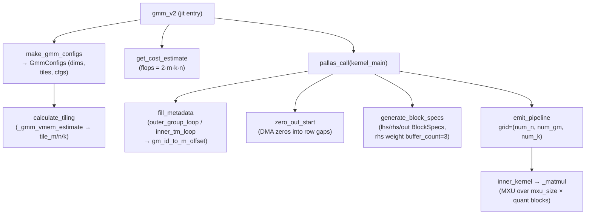

# MegaBlox GMM v2 — pipelined grouped-matmul kernel for MoE

<!-- connect:up:begin -->
> **Cross-repo concept:** part of [mosaic-kernel](../../../concepts/mosaic-kernel.md), [pallas-kernel](../../../concepts/pallas-kernel.md) across this wiki's repos.
<!-- connect:up:end -->
## Overview
GMM (grouped matmul) is the core compute of a Mixture-of-Experts layer: a stack of
tokens `lhs [size_m, size_k]`, pre-sorted by expert, is multiplied by a stack of
per-expert weight matrices `rhs [size_group, size_k, size_n]`, where `group_sizes`
says how many contiguous LHS rows belong to each expert. The output row `out[m]` is
`lhs[m] @ rhs[g(m)]`. The "v2" kernel ([`gmm_v2`](../catalog/src/maxtext/kernels/megablox/pallas_mosaic_tpu_v2_gmm_kernel.md#gmm_v2)) is built on `pltpu.emit_pipeline` — a
**manual software pipeline over a dynamically-computed grid** — rather than a static
Pallas grid, because the ragged group boundaries mean the M-tiling is data-dependent:
a metadata prepass ([`fill_metadata`](../catalog/src/maxtext/kernels/megablox/pallas_mosaic_tpu_v2_gmm_kernel.md#fill_metadata)) walks `group_sizes` and precomputes, for every
"gm tile", which rows and which expert it covers, so empty groups are skipped and no
tile straddles two experts' weights. On top of that it layers weight quantization
(int4/int8/fp8 with per-block scales), triple-buffered weight DMAs, fused SwiGLU
activation, and a dynamic zero-fill of untouched output rows.

## Diagram

## Design rationale (why it's built this way)
The hard problem GMM solves is **ragged M**: expert group sizes are runtime values
and rarely align to a tile. A naïve `cdiv(group_size, tile_m)` under-counts tiles
when a group starts mid-sublane, so [`fill_metadata`](../catalog/src/maxtext/kernels/megablox/pallas_mosaic_tpu_v2_gmm_kernel.md#fill_metadata) adds a `local_offset =
start_m_offset % size_lhs_sublane` before dividing, and its worked example in the
source (`| 0 0 0 0 | 0 0 0 1 | 1 1 0 0 |`) shows a 3-row group needing 2 tiles. The
result is a dense `gm_id → (m_offset, group_id)` map in SMEM ([`gm_id_to_m_offset`](../catalog/src/maxtext/kernels/megablox/pallas_mosaic_tpu_v2_gmm_kernel.md#MetadataRef.gm_id_to_m_offset))
that the dynamic index maps read to fetch exactly the valid rows — that is why the
kernel uses [`emit_pipeline`](../catalog/src/maxtext/kernels/megablox/pallas_mosaic_tpu_v2_gmm_kernel.md#kernel_main) with grid `(num_n, num_gm, num_k)` instead of a static
grid: `num_gm` itself is a computed value. The `gm` axis "skips over empty groups and
accounts for revisited tiles" (kernel_main docstring).

Tiling is chosen to keep the MXU fed without spilling VMEM. [`calculate_tiling`](../catalog/src/maxtext/kernels/megablox/pallas_mosaic_tpu_v2_gmm_kernel.md#calculate_tiling)
fixes [`tile_m`](../catalog/src/maxtext/kernels/megablox/pallas_mosaic_tpu_v2_gmm_kernel.md#TileSizes.tile_m) at 128 for bf16 (scaled by the low-bitwidth factor for int4/int8),
then **shrinks [`tile_n`](../catalog/src/maxtext/kernels/megablox/pallas_mosaic_tpu_v2_gmm_kernel.md#TileSizes.tile_n) first and only shrinks [`tile_k`](../catalog/src/maxtext/kernels/megablox/pallas_mosaic_tpu_v2_gmm_kernel.md#TileSizes.tile_k) as a last resort**, because
splitting K forces accumulation across k-tiles (extra passes over the accumulator).
The VMEM budget is modeled explicitly by [`_gmm_vmem_estimate`](../catalog/src/maxtext/kernels/megablox/pallas_mosaic_tpu_v2_gmm_kernel.md#calculate_tiling._gmm_vmem_estimate): double-buffered LHS
and output, **triple-buffered** weights, plus accumulator, scale, bias and
partial-sum buffers — and `tile_n` is not allowed below `2 × mxu_column_size` so the
MXU never stalls. The weight triple-buffering (`pl.Buffered(buffer_count=3)` in
[`generate_block_specs`](../catalog/src/maxtext/kernels/megablox/pallas_mosaic_tpu_v2_gmm_kernel.md#generate_block_specs)) hides the larger weight DMA latency behind two compute
steps rather than one.

Quantization is a first-class VMEM optimization, not an afterthought. Weights can be
packed sub-byte along K into `uint32` (`should_bitcast`) and unpacked inside the
kernel with `pltpu.bitcast`, so the HBM→VMEM DMA moves 4× fewer bytes for int4. The
kernel then chooses between [`should_dequantize_before_matmul`](../catalog/src/maxtext/kernels/megablox/pallas_mosaic_tpu_v2_gmm_kernel.md#InputConfigs.should_dequantize_before_matmul) (dequantize in VMEM
to avoid a tiny contracting dimension) and [`should_dequantize_after_matmul`](../catalog/src/maxtext/kernels/megablox/pallas_mosaic_tpu_v2_gmm_kernel.md#InputConfigs.should_dequantize_after_matmul) (run
the matmul in the low precision, then scale) — the latter being the fast path that
also opportunistically quantizes the LHS ([`maybe_quantize_lhs`](../catalog/src/maxtext/kernels/megablox/pallas_mosaic_tpu_v2_gmm_kernel.md#make_gmm_configs)) when the hardware has
fp8/int compute.

> [!inferred]
> The `n`-outer loop inside [`_matmul`](../catalog/src/maxtext/kernels/megablox/pallas_mosaic_tpu_v2_gmm_kernel.md#inner_kernel._matmul) (stepping in `mxu_column_size` chunks) exists
> specifically so a `[tile_m, mxu_size]` result becomes available at the end of each
> K-inner iteration, letting VPU/VST work on one column strip overlap with MXU work on
> the next — the source comment states this is the pipelining rationale. Without it,
> the whole `[tile_m, tile_n]` result would only land on the last K step.

## Entry points
- [`gmm_v2`](../catalog/src/maxtext/kernels/megablox/pallas_mosaic_tpu_v2_gmm_kernel.md#gmm_v2) — the `@jax.jit` public API. It defaults `vmem_limit_bytes` to 90% of
  device VMEM, builds the [`GmmConfigs`](../catalog/src/maxtext/kernels/megablox/pallas_mosaic_tpu_v2_gmm_kernel.md#GmmConfigs) via [`make_gmm_configs`](../catalog/src/maxtext/kernels/megablox/pallas_mosaic_tpu_v2_gmm_kernel.md#make_gmm_configs), then issues the
  `pallas_call` around [`kernel_main`](../catalog/src/maxtext/kernels/megablox/pallas_mosaic_tpu_v2_gmm_kernel.md#kernel_main) with `get_cost_estimate` and `get_scope_name`
  attached and slices the output back to `out_size_n`.
- [`kernel_main`](../catalog/src/maxtext/kernels/megablox/pallas_mosaic_tpu_v2_gmm_kernel.md#kernel_main) — the on-device entry: runs [`fill_metadata`](../catalog/src/maxtext/kernels/megablox/pallas_mosaic_tpu_v2_gmm_kernel.md#fill_metadata), optionally
  [`zero_out_start`](../catalog/src/maxtext/kernels/megablox/pallas_mosaic_tpu_v2_gmm_kernel.md#zero_out_start), calls [`generate_block_specs`](../catalog/src/maxtext/kernels/megablox/pallas_mosaic_tpu_v2_gmm_kernel.md#generate_block_specs), and drives the
  `emit_pipeline` over [`inner_kernel`](../catalog/src/maxtext/kernels/megablox/pallas_mosaic_tpu_v2_gmm_kernel.md#inner_kernel).
- [`make_gmm_configs`](../catalog/src/maxtext/kernels/megablox/pallas_mosaic_tpu_v2_gmm_kernel.md#make_gmm_configs) — reached once per trace from [`gmm_v2`](../catalog/src/maxtext/kernels/megablox/pallas_mosaic_tpu_v2_gmm_kernel.md#gmm_v2); validates shapes via
  [`validate_inputs`](../catalog/src/maxtext/kernels/megablox/pallas_mosaic_tpu_v2_gmm_kernel.md#validate_inputs), derives the RHS/LHS [`quant_dtype`](../catalog/src/maxtext/kernels/megablox/pallas_mosaic_tpu_v2_gmm_kernel.md#InputConfigs.quant_dtype) / [`quant_block_size`](../catalog/src/maxtext/kernels/megablox/pallas_mosaic_tpu_v2_gmm_kernel.md#InputConfigs.quant_block_size),
  and invokes the tile function to produce [`tiles`](../catalog/src/maxtext/kernels/megablox/pallas_mosaic_tpu_v2_gmm_kernel.md#GmmConfigs.tiles).
- [`calculate_tiling`](../catalog/src/maxtext/kernels/megablox/pallas_mosaic_tpu_v2_gmm_kernel.md#calculate_tiling) — the default [`TileFn`](../catalog/src/maxtext/kernels/megablox/pallas_mosaic_tpu_v2_gmm_kernel.md#TileFn); reached from `make_gmm_configs` to pick
  `tile_m`/`tile_n`/`tile_k` under the VMEM limit.

## Mechanism (step-by-step)
1. **Configure.** [`gmm_v2`](../catalog/src/maxtext/kernels/megablox/pallas_mosaic_tpu_v2_gmm_kernel.md#gmm_v2) calls [`make_gmm_configs`](../catalog/src/maxtext/kernels/megablox/pallas_mosaic_tpu_v2_gmm_kernel.md#make_gmm_configs), which runs [`validate_inputs`](../catalog/src/maxtext/kernels/megablox/pallas_mosaic_tpu_v2_gmm_kernel.md#validate_inputs)
   (deriving the [`Dimensions`](../catalog/src/maxtext/kernels/megablox/pallas_mosaic_tpu_v2_gmm_kernel.md#GmmConfigs.dims) — [`size_m`](../catalog/src/maxtext/kernels/megablox/pallas_mosaic_tpu_v2_gmm_kernel.md#Dimensions.size_m), [`size_k`](../catalog/src/maxtext/kernels/megablox/pallas_mosaic_tpu_v2_gmm_kernel.md#Dimensions.size_k), [`size_n`](../catalog/src/maxtext/kernels/megablox/pallas_mosaic_tpu_v2_gmm_kernel.md#Dimensions.size_n), [`size_group`](../catalog/src/maxtext/kernels/megablox/pallas_mosaic_tpu_v2_gmm_kernel.md#Dimensions.size_group),
   and the hardware [`size_lhs_sublane`](../catalog/src/maxtext/kernels/megablox/pallas_mosaic_tpu_v2_gmm_kernel.md#Dimensions.size_lhs_sublane)) and packs the RHS/LHS [`InputConfigs`](../catalog/src/maxtext/kernels/megablox/pallas_mosaic_tpu_v2_gmm_kernel.md#GmmConfigs.rhs_cfgs).
2. **Pick tiles under a VMEM model.** [`calculate_tiling`](../catalog/src/maxtext/kernels/megablox/pallas_mosaic_tpu_v2_gmm_kernel.md#calculate_tiling) sets [`tile_m`](../catalog/src/maxtext/kernels/megablox/pallas_mosaic_tpu_v2_gmm_kernel.md#TileSizes.tile_m) from the dtype
   bitwidth, then loops shrinking [`tile_n`](../catalog/src/maxtext/kernels/megablox/pallas_mosaic_tpu_v2_gmm_kernel.md#TileSizes.tile_n) (never below `2×mxu_column_size`) and only then
   [`tile_k`](../catalog/src/maxtext/kernels/megablox/pallas_mosaic_tpu_v2_gmm_kernel.md#TileSizes.tile_k), each iteration re-querying [`_gmm_vmem_estimate`](../catalog/src/maxtext/kernels/megablox/pallas_mosaic_tpu_v2_gmm_kernel.md#calculate_tiling._gmm_vmem_estimate) — which accounts for the
   triple-buffered weights and double-buffered LHS/out — against `vmem_limit_bytes`,
   using [`align_to`](../catalog/src/maxtext/kernels/megablox/pallas_mosaic_tpu_v2_gmm_kernel.md#align_to) to keep tiles lane-aligned.
3. **Attach a cost estimate.** [`gmm_v2`](../catalog/src/maxtext/kernels/megablox/pallas_mosaic_tpu_v2_gmm_kernel.md#gmm_v2) passes [`get_cost_estimate`](../catalog/src/maxtext/kernels/megablox/pallas_mosaic_tpu_v2_gmm_kernel.md#get_cost_estimate) (`flops = 2·m·k·n`
   plus byte counts) into the `pallas_call` so XLA schedules the custom call with a
   realistic cost, and names the scope via [`get_scope_name`](../catalog/src/maxtext/kernels/megablox/pallas_mosaic_tpu_v2_gmm_kernel.md#get_scope_name).
4. **Build the ragged-M map on device.** [`kernel_main`](../catalog/src/maxtext/kernels/megablox/pallas_mosaic_tpu_v2_gmm_kernel.md#kernel_main) calls [`fill_metadata`](../catalog/src/maxtext/kernels/megablox/pallas_mosaic_tpu_v2_gmm_kernel.md#fill_metadata), whose
   [`outer_group_loop`](../catalog/src/maxtext/kernels/megablox/pallas_mosaic_tpu_v2_gmm_kernel.md#fill_metadata.outer_group_loop) walks each expert, computes how many `gm` tiles it needs
   (adding `local_offset` so mid-sublane starts count correctly), and [`inner_tm_loop`](../catalog/src/maxtext/kernels/megablox/pallas_mosaic_tpu_v2_gmm_kernel.md#fill_metadata.inner_tm_loop)
   writes each tile's start offset into [`gm_id_to_m_offset`](../catalog/src/maxtext/kernels/megablox/pallas_mosaic_tpu_v2_gmm_kernel.md#MetadataRef.gm_id_to_m_offset). It returns `num_gm`, the
   pipeline's outer trip count.
5. **Zero the gaps.** When `zero_init` is set, [`zero_out_start`](../catalog/src/maxtext/kernels/megablox/pallas_mosaic_tpu_v2_gmm_kernel.md#zero_out_start) DMAs zeros into the
   output rows *before* the first computed offset and *after* the last (rows no expert
   claims), reusing a small `[tile_zero_m, num_lanes]` VMEM buffer and a DMA semaphore
   so untouched rows are defined without a full-tensor memset.
6. **Generate dynamic block specs.** [`generate_block_specs`](../catalog/src/maxtext/kernels/megablox/pallas_mosaic_tpu_v2_gmm_kernel.md#generate_block_specs) builds the LHS/RHS/out
   `BlockSpec`s whose index maps ([`lhs_index_map`](../catalog/src/maxtext/kernels/megablox/pallas_mosaic_tpu_v2_gmm_kernel.md#IndexMaps.lhs_index_map), [`out_index_map`](../catalog/src/maxtext/kernels/megablox/pallas_mosaic_tpu_v2_gmm_kernel.md#IndexMaps.out_index_map), [`ps_index_map`](../catalog/src/maxtext/kernels/megablox/pallas_mosaic_tpu_v2_gmm_kernel.md#IndexMaps.ps_index_map),
   [`rhs_weight_index_map`](../catalog/src/maxtext/kernels/megablox/pallas_mosaic_tpu_v2_gmm_kernel.md#IndexMaps.rhs_weight_index_map), [`rhs_scale_index_map`](../catalog/src/maxtext/kernels/megablox/pallas_mosaic_tpu_v2_gmm_kernel.md#IndexMaps.rhs_scale_index_map), [`rhs_bias_index_map`](../catalog/src/maxtext/kernels/megablox/pallas_mosaic_tpu_v2_gmm_kernel.md#IndexMaps.rhs_bias_index_map)) all read
   [`gm_id_to_m_offset`](../catalog/src/maxtext/kernels/megablox/pallas_mosaic_tpu_v2_gmm_kernel.md#MetadataRef.gm_id_to_m_offset) via `metadata_ref` to locate the right rows/expert; the weight
   spec is marked `pl.Buffered(buffer_count=3)`.
7. **Run the pipeline.** [`kernel_main`](../catalog/src/maxtext/kernels/megablox/pallas_mosaic_tpu_v2_gmm_kernel.md#kernel_main) constructs `emit_pipeline(inner_kernel, grid=(num_n,
   num_gm, num_k))`. For [`fuse_act`](../catalog/src/maxtext/kernels/megablox/pallas_mosaic_tpu_v2_gmm_kernel.md#GmmConfigs.fuse_act) (SwiGLU) it splits the RHS into a [`gate`](../catalog/src/maxtext/kernels/megablox/pallas_mosaic_tpu_v2_gmm_kernel.md#FusedWeightsRef.gate) and an
   [`up`](../catalog/src/maxtext/kernels/megablox/pallas_mosaic_tpu_v2_gmm_kernel.md#FusedWeightsRef.up) [`WeightsRef`](../catalog/src/maxtext/kernels/megablox/pallas_mosaic_tpu_v2_gmm_kernel.md#WeightsRef) concatenated along N, so [`out_size_n`](../catalog/src/maxtext/kernels/megablox/pallas_mosaic_tpu_v2_gmm_kernel.md#GmmConfigs.out_size_n) is half the physical N.
8. **Matmul per tile.** [`inner_kernel`](../catalog/src/maxtext/kernels/megablox/pallas_mosaic_tpu_v2_gmm_kernel.md#inner_kernel) calls [`_matmul`](../catalog/src/maxtext/kernels/megablox/pallas_mosaic_tpu_v2_gmm_kernel.md#inner_kernel._matmul), which unpacks bitcast-packed
   weights, optionally dequantizes in VMEM ([`should_dequantize_before_matmul`](../catalog/src/maxtext/kernels/megablox/pallas_mosaic_tpu_v2_gmm_kernel.md#InputConfigs.should_dequantize_before_matmul) using
   [`get_scale`](../catalog/src/maxtext/kernels/megablox/pallas_mosaic_tpu_v2_gmm_kernel.md#RhsRef.get_scale) and [`num_quant_blocks_per_tile_k`](../catalog/src/maxtext/kernels/megablox/pallas_mosaic_tpu_v2_gmm_kernel.md#GmmConfigs.num_quant_blocks_per_tile_k)), masks the invalid tail on the last
   K-step, and loops the MXU over `mxu_size` column strips × quant blocks, applying
   the [`should_dequantize_after_matmul`](../catalog/src/maxtext/kernels/megablox/pallas_mosaic_tpu_v2_gmm_kernel.md#InputConfigs.should_dequantize_after_matmul) scale post-matmul on the fast path.

## Key data structures
- [`GmmConfigs`](../catalog/src/maxtext/kernels/megablox/pallas_mosaic_tpu_v2_gmm_kernel.md#GmmConfigs) — the frozen config threaded everywhere: [`dims`](../catalog/src/maxtext/kernels/megablox/pallas_mosaic_tpu_v2_gmm_kernel.md#GmmConfigs.dims) (Dimensions),
  [`tiles`](../catalog/src/maxtext/kernels/megablox/pallas_mosaic_tpu_v2_gmm_kernel.md#GmmConfigs.tiles) ([`TileSizes`](../catalog/src/maxtext/kernels/megablox/pallas_mosaic_tpu_v2_gmm_kernel.md#TileSizes)), [`lhs_cfgs`](../catalog/src/maxtext/kernels/megablox/pallas_mosaic_tpu_v2_gmm_kernel.md#GmmConfigs.lhs_cfgs) / [`rhs_cfgs`](../catalog/src/maxtext/kernels/megablox/pallas_mosaic_tpu_v2_gmm_kernel.md#GmmConfigs.rhs_cfgs) (InputConfigs), [`out_dtype`](../catalog/src/maxtext/kernels/megablox/pallas_mosaic_tpu_v2_gmm_kernel.md#GmmConfigs.out_dtype),
  and [`fuse_act`](../catalog/src/maxtext/kernels/megablox/pallas_mosaic_tpu_v2_gmm_kernel.md#GmmConfigs.fuse_act). Its [`out_size_n`](../catalog/src/maxtext/kernels/megablox/pallas_mosaic_tpu_v2_gmm_kernel.md#GmmConfigs.out_size_n) and [`num_quant_blocks_per_tile_k`](../catalog/src/maxtext/kernels/megablox/pallas_mosaic_tpu_v2_gmm_kernel.md#GmmConfigs.num_quant_blocks_per_tile_k) are derived
  properties.
- [`MetadataRef`](../catalog/src/maxtext/kernels/megablox/pallas_mosaic_tpu_v2_gmm_kernel.md#MetadataRef) — the SMEM scratch holding [`gm_id_to_m_offset`](../catalog/src/maxtext/kernels/megablox/pallas_mosaic_tpu_v2_gmm_kernel.md#MetadataRef.gm_id_to_m_offset) (`gm_id →` row offset,
  length `size_group + cdiv(size_m, tile_m)`) plus the group-id map; it is the bridge
  from the ragged group layout to the index maps.
- [`WeightsRef`](../catalog/src/maxtext/kernels/megablox/pallas_mosaic_tpu_v2_gmm_kernel.md#WeightsRef) — a registered dataclass bundling the RHS [`weight`](../catalog/src/maxtext/kernels/megablox/pallas_mosaic_tpu_v2_gmm_kernel.md#WeightsRef.weight), [`scale`](../catalog/src/maxtext/kernels/megablox/pallas_mosaic_tpu_v2_gmm_kernel.md#WeightsRef.scale) and
  [`bias`](../catalog/src/maxtext/kernels/megablox/pallas_mosaic_tpu_v2_gmm_kernel.md#WeightsRef.bias) refs behind the [`get_weight`](../catalog/src/maxtext/kernels/megablox/pallas_mosaic_tpu_v2_gmm_kernel.md#RhsRef.get_weight) / [`get_scale`](../catalog/src/maxtext/kernels/megablox/pallas_mosaic_tpu_v2_gmm_kernel.md#RhsRef.get_scale) / [`get_bias`](../catalog/src/maxtext/kernels/megablox/pallas_mosaic_tpu_v2_gmm_kernel.md#RhsRef.get_bias) accessors so quantized
  and plain weights share one interface.
- [`InputConfigs`](../catalog/src/maxtext/kernels/megablox/pallas_mosaic_tpu_v2_gmm_kernel.md#GmmConfigs.lhs_cfgs) fields — [`dtype`](../catalog/src/maxtext/kernels/megablox/pallas_mosaic_tpu_v2_gmm_kernel.md#InputConfigs.dtype), [`quant_dtype`](../catalog/src/maxtext/kernels/megablox/pallas_mosaic_tpu_v2_gmm_kernel.md#InputConfigs.quant_dtype), [`quant_block_size`](../catalog/src/maxtext/kernels/megablox/pallas_mosaic_tpu_v2_gmm_kernel.md#InputConfigs.quant_block_size), [`has_scale`](../catalog/src/maxtext/kernels/megablox/pallas_mosaic_tpu_v2_gmm_kernel.md#InputConfigs.has_scale)
  — plus the [`should_dequantize_before_matmul`](../catalog/src/maxtext/kernels/megablox/pallas_mosaic_tpu_v2_gmm_kernel.md#InputConfigs.should_dequantize_before_matmul) / [`should_dequantize_after_matmul`](../catalog/src/maxtext/kernels/megablox/pallas_mosaic_tpu_v2_gmm_kernel.md#InputConfigs.should_dequantize_after_matmul) predicates
  that pick the quantization path.

## Dynamics (design intent)
The pipeline grid `(num_n, num_gm, num_k)` puts N outermost and K innermost, so a
full K-reduction completes before advancing N, and `num_gm` (the ragged M axis) sits
between. Weight buffering is triple (`buffer_count=3`) while LHS/out are double —
asymmetric on purpose, since the weight tile is the largest DMA and its latency needs
two compute steps of cover. The `partial_sum` input threads a per-token running sum
through [`ps_index_map`](../catalog/src/maxtext/kernels/megablox/pallas_mosaic_tpu_v2_gmm_kernel.md#IndexMaps.ps_index_map), letting a caller accumulate GMM output across shards without a
separate add kernel.

## Edge cases
- **Groups not tile-aligned.** The `local_offset` correction in [`fill_metadata`](../catalog/src/maxtext/kernels/megablox/pallas_mosaic_tpu_v2_gmm_kernel.md#fill_metadata) is
  mandatory; without it a group straddling a sublane boundary loses a tile and drops
  rows.
- **Empty groups / group_offset.** `should_process` guards zero-size groups and groups
  before `group_offset`; `size_k % tile_k != 0` triggers the last-K-step mask in
  [`_matmul`](../catalog/src/maxtext/kernels/megablox/pallas_mosaic_tpu_v2_gmm_kernel.md#inner_kernel._matmul).
- **Untouched output rows.** Only [`zero_out_start`](../catalog/src/maxtext/kernels/megablox/pallas_mosaic_tpu_v2_gmm_kernel.md#zero_out_start) (when `zero_init`) defines rows no
  expert writes; with it off, gap rows are left undefined by design.
- **fuse_act shape constraint.** [`validate_inputs`](../catalog/src/maxtext/kernels/megablox/pallas_mosaic_tpu_v2_gmm_kernel.md#validate_inputs) requires `size_n` divisible by
  `2 × num_lanes` when [`fuse_act`](../catalog/src/maxtext/kernels/megablox/pallas_mosaic_tpu_v2_gmm_kernel.md#GmmConfigs.fuse_act) is set, since N is split into gate and up halves.

## Open questions
- The `emit_pipeline` prefetch scheduler and how it interleaves the triple-buffered
  weight DMAs with MXU steps live in `pltpu`, outside this subgraph.
- The exact LHS-quantization dtype selection (int8 vs fp8) inside [`make_gmm_configs`](../catalog/src/maxtext/kernels/megablox/pallas_mosaic_tpu_v2_gmm_kernel.md#make_gmm_configs)
  depends on `pltpu.get_tpu_info()` hardware flags that vary by TPU generation and are
  not fully enumerable from the source alone.
- Whether `zero_init` can be safely disabled depends on the caller's downstream
  reduction, which this kernel does not see.

## See also
- [SplashAttention backward kernels](maxtext-kernels-attention-splash_attention_kernel.md) — the sibling Pallas/Mosaic kernel for sparse attention.
