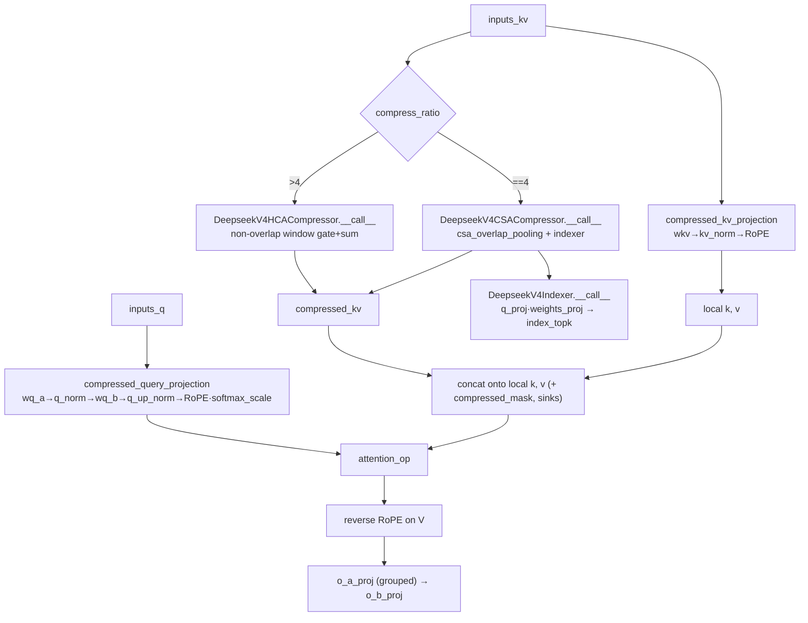

# Compressed Attention — DeepSeek-V4 HCA / CSA KV compression

## Overview
`CompressedAttention` is MaxText's DeepSeek-V4 attention layer. Its central idea is
that most of a long context does not need full-resolution keys and values: it keeps
a **local** window of ordinary K/V and, for the long range, **pools every
`compress_rate` source tokens into a single compressed KV entry**, then attends over
`local ⧺ compressed`. Two pooling regimes exist behind one interface — Heavily
Compressed Attention (HCA, non-overlapping windows, ratios like 128×) and Compressed
Sparse Attention (CSA, overlapping windows at 4× plus a learned Indexer that
top-k-selects which compressed blocks each query sees). The KV-cache and
attention-cost reduction is roughly the compression ratio; the price is the extra
compressor projections, a softmax gate per window, and (for CSA) an indexer scoring
pass. The dispatcher is
[`__call__`](../catalog/src/maxtext/layers/attention_compressed.md#CompressedAttention.__call__).

## Diagram

## Design rationale (why it's built this way)
The routing on
[`compress_ratio`](../catalog/src/maxtext/layers/attention_compressed.md#CompressedAttention.compress_ratio)
is the top-level design decision: `0` degrades the layer to plain local sliding-window
attention (the `__init__` sets `attention_type = LOCAL_SLIDING`, source `:701`), `4`
picks the overlapping CSA path via
[`csa_compressor`](../catalog/src/maxtext/layers/attention_compressed.md#CompressedAttention.csa_compressor),
and anything larger picks the heavy non-overlapping HCA path via
[`hca_compressor`](../catalog/src/maxtext/layers/attention_compressed.md#CompressedAttention.hca_compressor).
This lets a single class express three distinct attention modes (sliding-window
prefix, 128× HCA, 4× CSA) so a model can mix them per layer.

The two compressors share machinery through
[`BaseDeepseekCompressor`](../catalog/src/maxtext/layers/attention_compressed.md#BaseDeepseekCompressor),
whose docstring states it "encapsulates the shared infrastructure for both the
Heavily Compressed Attention (HCA) and Compressed Sparse Attention (CSA) paradigms" —
it owns the [`kv_proj`](../catalog/src/maxtext/layers/attention_compressed.md#BaseDeepseekCompressor.kv_proj),
[`gate_proj`](../catalog/src/maxtext/layers/attention_compressed.md#BaseDeepseekCompressor.gate_proj)
and [`kv_norm`](../catalog/src/maxtext/layers/attention_compressed.md#BaseDeepseekCompressor.kv_norm).
The only structural difference the subclasses declare is the `proj_multiplier`
passed to the base: HCA uses `1` (source `:1095`) and CSA uses `2` (source `:1040`),
because CSA's overlap pooling splits each projection into a Ca/Cb pair while HCA
pools a single contiguous window.

> [!inferred]
> The perf story is memory + attention FLOPs. A dense KV cache holds one K/V per
> token; the compressors emit `n_windows ≈ seq_len / compress_rate` entries, so for
> HCA at 128× the long-range cache is ~two orders of magnitude smaller, and the
> attention matrix over `local ⧺ compressed` is correspondingly narrower. The class
> docstring's "Dual RoPE Theta: 10000 for standard tokens, 160000 for compressed"
> and "MQA used alongside heavy KV compression" (source `:686-690`) both serve this
> — MQA shares one K/V head across query heads so the compressed cache is
> single-head. These are read from source; the `theta`/MQA config knobs are not
> separate subgraph symbols.

The DeepSeek-V4 **attention sink** is a second non-obvious choice:
[`sinks`](../catalog/src/maxtext/layers/attention_compressed.md#CompressedAttention.sinks)
is a learnable per-head scalar added to the logits before softmax (a *mathematical*
sink), not a physical key/value token — so it costs no cache slot and no extra
matmul, only a bias add.

## Entry points
- [`__call__`](../catalog/src/maxtext/layers/attention_compressed.md#CompressedAttention.__call__)
  — the layer forward, hit once per decoder layer. It projects Q and K/V, builds a
  downsampled segment mask, routes to the configured compressor, concatenates the
  compressed blocks onto the local K/V, runs the attention op with the sink bias, and
  does the grouped output projection.
- [`compressed_query_projection`](../catalog/src/maxtext/layers/attention_compressed.md#CompressedAttention.compressed_query_projection)
  and [`compressed_kv_projection`](../catalog/src/maxtext/layers/attention_compressed.md#CompressedAttention.compressed_kv_projection)
  — the LoRA-style Q and the K/V projections; reached first from the layer forward,
  before any compression, and they also produce the `q_normed` latent the compressors
  reuse.
- [`__call__`](../catalog/src/maxtext/layers/attention_compressed.md#DeepseekV4HCACompressor.__call__)
  / [`__call__`](../catalog/src/maxtext/layers/attention_compressed.md#DeepseekV4CSACompressor.__call__)
  — the two compressor forwards, selected by `compress_ratio`. HCA pools closed
  windows; CSA pools overlapping windows and additionally consults its Indexer.
- [`__call__`](../catalog/src/maxtext/layers/attention_compressed.md#DeepseekV4Indexer.__call__)
  — the CSA-only sparse selector: it scores queries against compressed blocks and
  returns top-k block indices per query.

## Mechanism (step-by-step)
1. **Query projection.**
   [`compressed_query_projection`](../catalog/src/maxtext/layers/attention_compressed.md#CompressedAttention.compressed_query_projection)
   down-projects to a latent with
   [`wq_a`](../catalog/src/maxtext/layers/attention_compressed.md#CompressedAttention.wq_a),
   normalises via [`q_norm`](../catalog/src/maxtext/layers/attention_compressed.md#CompressedAttention.q_norm),
   up-projects with [`wq_b`](../catalog/src/maxtext/layers/attention_compressed.md#CompressedAttention.wq_b),
   applies a second RMSNorm
   [`q_up_norm`](../catalog/src/maxtext/layers/attention_compressed.md#CompressedAttention.q_up_norm)
   over the head dim, then RoPE via
   [`rotary_embedding`](../catalog/src/maxtext/layers/attention_compressed.md#CompressedAttention.rotary_embedding)
   and scales by
   [`softmax_scale`](../catalog/src/maxtext/layers/attention_compressed.md#CompressedAttention.softmax_scale).
   It returns both the per-head query **and** the `q_normed` latent, which the CSA
   compressor/indexer reuse (rank set by
   [`q_lora_rank`](../catalog/src/maxtext/layers/attention_compressed.md#CompressedAttention.q_lora_rank)).
2. **Local K/V projection.**
   [`compressed_kv_projection`](../catalog/src/maxtext/layers/attention_compressed.md#CompressedAttention.compressed_kv_projection)
   projects K/V with
   [`wkv`](../catalog/src/maxtext/layers/attention_compressed.md#CompressedAttention.wkv),
   normalises with
   [`kv_norm`](../catalog/src/maxtext/layers/attention_compressed.md#CompressedAttention.kv_norm),
   and applies RoPE — returning symmetric key==value tensors that form the *local*
   (uncompressed) window before compressed blocks are appended.
3. **Route on compression ratio.** The layer forward branches on
   [`compress_ratio`](../catalog/src/maxtext/layers/attention_compressed.md#CompressedAttention.compress_ratio):
   `>4` calls the
   [`hca_compressor`](../catalog/src/maxtext/layers/attention_compressed.md#CompressedAttention.hca_compressor),
   `==4` calls the
   [`csa_compressor`](../catalog/src/maxtext/layers/attention_compressed.md#CompressedAttention.csa_compressor),
   `0` produces no compressed blocks at all. It also downsamples the segment mask by
   `::compress_ratio` so the mask lines up with the compressed block axis.
4. **HCA pooling (non-overlapping).**
   [`__call__`](../catalog/src/maxtext/layers/attention_compressed.md#DeepseekV4HCACompressor.__call__)
   truncates the sequence to a multiple of
   [`compress_rate`](../catalog/src/maxtext/layers/attention_compressed.md#BaseDeepseekCompressor.compress_rate),
   reshapes into `[batch, n_windows, compress_rate, head_dim]` blocks, adds
   [`position_bias`](../catalog/src/maxtext/layers/attention_compressed.md#BaseDeepseekCompressor.position_bias)
   to the [`gate_proj`](../catalog/src/maxtext/layers/attention_compressed.md#BaseDeepseekCompressor.gate_proj)
   output, softmaxes the gate over the window axis, and sums the gated
   [`kv_proj`](../catalog/src/maxtext/layers/attention_compressed.md#BaseDeepseekCompressor.kv_proj)
   values into one entry per window (then RoPE). Each closed window becomes exactly
   one compressed KV token — this is the 128× cache shrink.
5. **CSA pooling + sparse indexing (overlapping).**
   [`__call__`](../catalog/src/maxtext/layers/attention_compressed.md#DeepseekV4CSACompressor.__call__)
   first asks its
   [`indexer`](../catalog/src/maxtext/layers/attention_compressed.md#DeepseekV4CSACompressor.indexer)
   for top-k relevant blocks, then pools with
   [`csa_overlap_pooling`](../catalog/src/maxtext/layers/attention_compressed.md#csa_overlap_pooling)
   over its own [`head_dim`](../catalog/src/maxtext/layers/attention_compressed.md#BaseDeepseekCompressor.head_dim).
   The overlap util (step 6) is the difference from HCA.
6. **Overlap pooling internals.**
   [`csa_overlap_pooling`](../catalog/src/maxtext/layers/attention_compressed.md#csa_overlap_pooling)
   projects to `2·head_dim`, reshapes into windows, splits into a Ca/Cb pair, shifts
   Ca forward by one window (padding the first window's gate with `-inf` so the shift
   contributes nothing there), concatenates Ca⧺Cb into a `2·compress_rate`-wide
   overlapping window, softmax-gates and sums, then normalises. Overlapping windows
   let a query near a window boundary still see a smoothly-pooled neighbourhood.
7. **Indexer scoring (CSA).**
   [`__call__`](../catalog/src/maxtext/layers/attention_compressed.md#DeepseekV4Indexer.__call__)
   pools KV with its own overlap pass, projects the latent query with
   [`q_proj`](../catalog/src/maxtext/layers/attention_compressed.md#DeepseekV4Indexer.q_proj)
   into [`index_n_heads`](../catalog/src/maxtext/layers/attention_compressed.md#DeepseekV4Indexer.index_n_heads)
   ×[`index_head_dim`](../catalog/src/maxtext/layers/attention_compressed.md#DeepseekV4Indexer.index_head_dim),
   broadcasts the compressed KV across all indexer heads (MQA), scores in float32
   scaled by
   [`softmax_scale`](../catalog/src/maxtext/layers/attention_compressed.md#DeepseekV4Indexer.softmax_scale)
   and head-aggregated through
   [`weights_proj`](../catalog/src/maxtext/layers/attention_compressed.md#DeepseekV4Indexer.weights_proj)
   /[`weights_scaling`](../catalog/src/maxtext/layers/attention_compressed.md#DeepseekV4Indexer.weights_scaling),
   and returns the top-[`index_topk`](../catalog/src/maxtext/layers/attention_compressed.md#DeepseekV4Indexer.index_topk)
   block indices per query. If the sequence is too short to form windows it returns
   an empty selection.
8. **Concatenate, attend, project out.** Back in
   [`__call__`](../catalog/src/maxtext/layers/attention_compressed.md#CompressedAttention.__call__),
   the compressed blocks are concatenated onto the local `k`/`v` along the sequence
   axis, the `compressed_mask` (indexer/causal) is combined with the segment mask,
   and `attention_op` runs with the per-head
   [`sinks`](../catalog/src/maxtext/layers/attention_compressed.md#CompressedAttention.sinks)
   bias. Finally the output has its value RoPE reversed, is reshaped into `o_groups`
   and passed through the grouped
   [`o_a_proj`](../catalog/src/maxtext/layers/attention_compressed.md#CompressedAttention.o_a_proj)
   then flattened into
   [`o_b_proj`](../catalog/src/maxtext/layers/attention_compressed.md#CompressedAttention.o_b_proj)
   to return `[batch, len, emb_dim]`.

## Key data structures
- **Compressed KV blocks** — one entry per window, shape `[batch, n_windows, 1,
  head_dim]`, produced by either compressor and concatenated onto the local K/V. The
  `1` head axis is the MQA broadcast that keeps the compressed cache single-head.
- **`position_bias`** — a learnable per-window bias added to the gate before softmax,
  present both on the base compressor
  ([`position_bias`](../catalog/src/maxtext/layers/attention_compressed.md#BaseDeepseekCompressor.position_bias))
  and, sized on `2·index_head_dim`, on the indexer
  ([`position_bias`](../catalog/src/maxtext/layers/attention_compressed.md#DeepseekV4Indexer.position_bias)).
- **Shared base projections** —
  [`kv_proj`](../catalog/src/maxtext/layers/attention_compressed.md#BaseDeepseekCompressor.kv_proj),
  [`gate_proj`](../catalog/src/maxtext/layers/attention_compressed.md#BaseDeepseekCompressor.gate_proj),
  [`kv_norm`](../catalog/src/maxtext/layers/attention_compressed.md#BaseDeepseekCompressor.kv_norm)
  sized on `proj_multiplier · head_dim`, plus the indexer's own
  [`kv_proj`](../catalog/src/maxtext/layers/attention_compressed.md#DeepseekV4Indexer.kv_proj)/[`gate_proj`](../catalog/src/maxtext/layers/attention_compressed.md#DeepseekV4Indexer.gate_proj)/[`kv_norm`](../catalog/src/maxtext/layers/attention_compressed.md#DeepseekV4Indexer.kv_norm)
  sized on `index_head_dim`.
- **`sinks`** — learnable per-head logit bias
  ([`sinks`](../catalog/src/maxtext/layers/attention_compressed.md#CompressedAttention.sinks)),
  the DeepSeek-V4 mathematical attention sink.

## Dynamics (design intent)
The class docstrings fix the contract. `BaseDeepseekCompressor`'s docstring
enumerates its three responsibilities (shared linear projections, the KV RMSNorm,
common hyperparameters), and
[`DeepseekV4CSACompressor`](../catalog/src/maxtext/layers/attention_compressed.md#DeepseekV4CSACompressor)
vs.
[`DeepseekV4HCACompressor`](../catalog/src/maxtext/layers/attention_compressed.md#DeepseekV4HCACompressor)
document their shape pipelines — CSA "uses overlapping windows … dynamically
selected by the Indexer for long-range sparse attention", HCA "compresses every
`compress_rate_hca` source tokens into a single compressed KV entry using closed,
non-overlapping windows". The
[`DeepseekV4Indexer`](../catalog/src/maxtext/layers/attention_compressed.md#DeepseekV4Indexer)
is documented as the CSA §2.3.1 module. On TPU the cost profile is: extra
projection matmuls (compressor + indexer + grouped output), one softmax-gate reduction
per window, and a top-k — traded against a much shorter attention key axis.

## Edge cases
- **`compress_ratio == 0`** — the layer is plain local sliding-window attention; no
  compressor is instantiated and no compressed blocks are appended.
- **Sequence shorter than a window** — both
  [`csa_overlap_pooling`](../catalog/src/maxtext/layers/attention_compressed.md#csa_overlap_pooling)
  and the [`DeepseekV4Indexer`](../catalog/src/maxtext/layers/attention_compressed.md#DeepseekV4Indexer)
  guard `compressed_len == 0`/`n_windows == 0` and return empty tensors, so the layer
  falls back to local-only attention.
- **First window shift (CSA)** — the Ca-shift in overlap pooling pads the first
  window's gate with `-inf`, guaranteeing the (nonexistent) previous window is fully
  masked out of the softmax.
- **Precision** — the indexer casts queries and compressed KV to float32 before
  scoring (source `:554-555`) to keep the ReLU/top-k similarity numerically stable
  even when the model runs in bf16.

## Open questions
- How the concatenated `local ⧺ compressed` mask maps onto `attention_op`'s TPU
  kernel — whether the compressed axis is handled as an ordinary (shorter) key axis
  or needs a specialised sparse/ragged path — is not visible in this packet and
  governs whether the compression translates into real device-time savings.
- The exact `o_groups` grouped-projection sizing and its sharding are set from
  `config` outside this subgraph.

## See also
- [MLA — Multi-head Latent Attention (with Lightning Indexer)](maxtext-layers-attention_mla.md)
