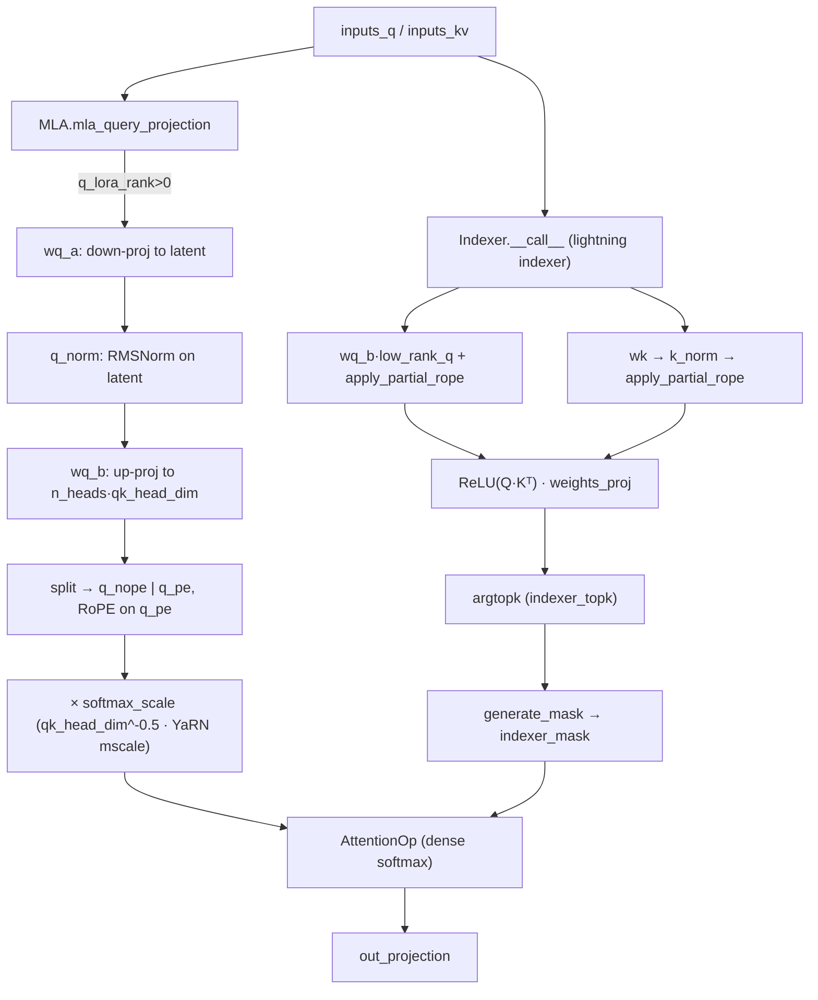

# MLA — Multi-head Latent Attention (with Lightning Indexer)

## Overview
MLA is MaxText's DeepSeek-style attention: instead of materialising full-width
per-head Q/K/V, it routes both queries and keys/values through **low-rank latent
bottlenecks**, then re-expands them per head. The payoff is memory — the KV cache
stores a single small latent vector per token rather than `n_heads × head_dim`
floats — paid for with two extra matmuls per projection (a down-projection into
the latent and an up-projection back out). Layered on top is an optional
**Indexer** (the DeepSeek "lightning indexer"): a cheap secondary attention pass
that scores token pairs and selects the top-k most relevant keys, turning the
`O(s²)` dense attention into a sparse one for long sequences. The MLA module owns
the query/KV projections and delegates the actual softmax attention to a reused
`AttentionOp`; see [`__call__`](../catalog/src/maxtext/layers/attention_mla.md#MLA.__call__).

## Diagram

## Design rationale (why it's built this way)
The latent bottleneck is the whole point. A standard attention layer caches a key
and value of width `n_heads × head_dim` per token; MLA instead caches only the
shared low-rank latent plus a small rotary carrier, so the KV cache shrinks by
roughly the ratio of full head width to latent rank. The
[`mla_query_projection`](../catalog/src/maxtext/layers/attention_mla.md#MLA.mla_query_projection)
mirrors this on the query side with a LoRA-style down/up pair
([`wq_a`](../catalog/src/maxtext/layers/attention_mla.md#MLA.wq_a) →
[`q_norm`](../catalog/src/maxtext/layers/attention_mla.md#MLA.q_norm) →
[`wq_b`](../catalog/src/maxtext/layers/attention_mla.md#MLA.wq_b)), gated on
[`q_lora_rank`](../catalog/src/maxtext/layers/attention_mla.md#MLA.q_lora_rank): when
the rank is 0 a single dense [`query`](../catalog/src/maxtext/layers/attention_mla.md#MLA.query)
projection is used instead, trading the memory win back for one fewer matmul.

> [!inferred]
> The KV-side latent (the module's `wkv_a`/`wkv_b`/`kv_norm` projections and its
> `MlaKVCache`, read at `attention_mla.py:787-823` and `:927-942`) is what actually
> delivers the cache reduction — the cache is configured with
> `key_head_size = kv_lora_rank` (default 512) and `value_head_size = qk_rope_head_dim`,
> i.e. one latent + one rotary carrier per token instead of full per-head K/V. Those
> symbols are **not in this packet's subgraph**, so they are cited here only as read
> from source, not as catalog links.

The **partial RoPE split** is a second deliberate decision: only
[`qk_rope_head_dim`](../catalog/src/maxtext/layers/attention_mla.md#MLA.qk_rope_head_dim)
of each head's width carries rotary position, while
[`qk_nope_head_dim`](../catalog/src/maxtext/layers/attention_mla.md#MLA.qk_nope_head_dim)
is position-free. Only the rope part must be recomputed against absolute
positions, and only it must be cached uncompressed — the nope part can live inside
the shared latent. The Indexer is designed for **gradient isolation**: its inputs
are `stop_gradient`-ed (source `:319-321`) so the sparse-selection head trains on
its own indexer loss without perturbing the main model, and vice-versa. That is a
correctness/semantics decision, not a perf one — but it means the indexer's extra
matmuls appear in both forward and backward graphs.

## Entry points
- [`__call__`](../catalog/src/maxtext/layers/attention_mla.md#MLA.__call__) — the MLA
  forward pass, hit once per decoder layer. It shards inputs, calls the query
  projection, builds keys/values, optionally runs the Indexer to produce a sparse
  `indexer_mask`, then hands everything to the reused `AttentionOp` and the output
  projection. Its docstring states it is "reusing `AttentionOp` for the actual
  attention" — MLA is a *projection* layer, not a new attention kernel.
- [`mla_query_projection`](../catalog/src/maxtext/layers/attention_mla.md#MLA.mla_query_projection)
  — reached from `MLA.__call__` to produce the per-head query and, importantly, the
  reusable `low_rank_q` latent that the Indexer also consumes (so the latent is
  computed once and shared).
- [`__call__`](../catalog/src/maxtext/layers/attention_mla.md#Indexer.__call__) — the
  lightning-indexer forward, reached only when `use_indexer` is set. It scores every
  query/key pair with a ReLU similarity and returns a sparse mask over the top-k
  keys.

## Mechanism (step-by-step)
1. **Enter and shard.** [`__call__`](../catalog/src/maxtext/layers/attention_mla.md#MLA.__call__)
   applies logical-axis sharding to `inputs_q`/`inputs_kv` (prefill vs. train/AR
   pick different axis-name tuples), then calls the query projection. This is where
   the layout for the whole attention block is fixed; the optional
   `config.force_q_layout` path additionally pins a major-to-minor query layout for
   the kernel.
2. **Query down/up projection.**
   [`mla_query_projection`](../catalog/src/maxtext/layers/attention_mla.md#MLA.mla_query_projection)
   branches on [`q_lora_rank`](../catalog/src/maxtext/layers/attention_mla.md#MLA.q_lora_rank):
   for rank 0 it runs the dense
   [`query`](../catalog/src/maxtext/layers/attention_mla.md#MLA.query) projection; otherwise
   it does [`wq_a`](../catalog/src/maxtext/layers/attention_mla.md#MLA.wq_a) (embed → latent),
   normalises with [`q_norm`](../catalog/src/maxtext/layers/attention_mla.md#MLA.q_norm),
   and up-projects with [`wq_b`](../catalog/src/maxtext/layers/attention_mla.md#MLA.wq_b) to
   `[B, L, n_heads, qk_head_dim]`. The intermediate `low_rank_q` is checkpointed and
   returned for the Indexer to reuse.
3. **Partial RoPE + softmax scaling.** The head vector is split at
   [`qk_nope_head_dim`](../catalog/src/maxtext/layers/attention_mla.md#MLA.qk_nope_head_dim)
   into a position-free part and a
   [`qk_rope_head_dim`](../catalog/src/maxtext/layers/attention_mla.md#MLA.qk_rope_head_dim)
   rotary part; rotary is applied only to the latter, then the two are re-concatenated
   to width [`qk_head_dim`](../catalog/src/maxtext/layers/attention_mla.md#MLA.qk_head_dim).
   The query is multiplied by
   [`softmax_scale`](../catalog/src/maxtext/layers/attention_mla.md#MLA.softmax_scale) here
   (MaxText folds the `qk_head_dim^-0.5` scale into the query rather than into the
   score, per the source comment). When
   [`max_position_embeddings`](../catalog/src/maxtext/layers/attention_mla.md#MLA.max_position_embeddings)
   exceeds
   [`original_max_position_embeddings`](../catalog/src/maxtext/layers/attention_mla.md#MLA.original_max_position_embeddings),
   a YaRN correction scales it by `mscale²`, computed from
   [`mscale`](../catalog/src/maxtext/layers/attention_mla.md#MLA.mscale) and
   [`rope_factor`](../catalog/src/maxtext/layers/attention_mla.md#MLA.rope_factor) — this is
   the long-context extrapolation knob.
4. **Indexer query/key scoring.** Inside
   [`__call__`](../catalog/src/maxtext/layers/attention_mla.md#Indexer.__call__), the query is
   up-projected from the shared latent by the indexer's own
   [`wq_b`](../catalog/src/maxtext/layers/attention_mla.md#Indexer.wq_b) and given partial
   RoPE via [`apply_partial_rope`](../catalog/src/maxtext/layers/attention_mla.md#Indexer.apply_partial_rope)
   (note: the indexer splits `[rope, nope]` in the opposite order to MLA, per its
   docstring). The key path is
   [`wk`](../catalog/src/maxtext/layers/attention_mla.md#Indexer.wk) →
   [`k_norm`](../catalog/src/maxtext/layers/attention_mla.md#Indexer.k_norm) → the same
   partial RoPE, and the key is kept single-head (MQA-style broadcast, one shared K
   across all [`n_heads`](../catalog/src/maxtext/layers/attention_mla.md#Indexer.n_heads)).
   Logits are `ReLU(Q·Kᵀ)` and are aggregated across heads by dynamic weights from
   [`weights_proj`](../catalog/src/maxtext/layers/attention_mla.md#Indexer.weights_proj),
   stabilised by the indexer's
   [`softmax_scale`](../catalog/src/maxtext/layers/attention_mla.md#Indexer.softmax_scale)
   (`head_dim^-0.5`).
5. **Top-k selection and sparse mask.** The aggregated per-token score is reduced to
   the [`indexer_topk`](../catalog/src/maxtext/layers/attention_mla.md#Indexer.indexer_topk)
   most relevant keys, and
   [`generate_mask`](../catalog/src/maxtext/layers/attention_mla.md#Indexer.generate_mask)
   turns those indices into a dense additive mask (`0.0` at kept positions,
   `DEFAULT_MASK_VALUE` elsewhere) that `AttentionOp` consumes as `indexer_mask`.
   The short-circuit `if k.shape[1] <= indexer_topk: return None` (source `:342`)
   makes the layer fall back to dense attention when the sequence is shorter than
   the budget — there is nothing to prune.
6. **Serving-mode cache update.** Outside training,
   [`update_indexer_cache`](../catalog/src/maxtext/layers/attention_mla.md#Indexer.update_indexer_cache)
   folds the freshly-computed indexer keys into a dedicated single-head indexer KV
   cache and stitches prefill + autoregressive slices back together, so the indexer
   can score against the whole history without recomputing past keys.

## Key data structures
- **Shared query latent (`low_rank_q`)** — produced once in
  [`mla_query_projection`](../catalog/src/maxtext/layers/attention_mla.md#MLA.mla_query_projection)
  and reused by the Indexer; this is why the indexer is "lightning" cheap — it
  piggybacks on the query down-projection instead of running its own.
- **Indexer projections** — [`wq_b`](../catalog/src/maxtext/layers/attention_mla.md#Indexer.wq_b),
  [`wk`](../catalog/src/maxtext/layers/attention_mla.md#Indexer.wk),
  [`weights_proj`](../catalog/src/maxtext/layers/attention_mla.md#Indexer.weights_proj) plus
  the [`k_norm`](../catalog/src/maxtext/layers/attention_mla.md#Indexer.k_norm) LayerNorm,
  all sized on the small indexer dims
  ([`head_dim`](../catalog/src/maxtext/layers/attention_mla.md#Indexer.head_dim),
  [`n_heads`](../catalog/src/maxtext/layers/attention_mla.md#Indexer.n_heads),
  [`emb_dim`](../catalog/src/maxtext/layers/attention_mla.md#Indexer.emb_dim)).
- **Config-derived scalars** — the head-dim split
  ([`qk_head_dim`](../catalog/src/maxtext/layers/attention_mla.md#MLA.qk_head_dim) =
  nope + rope) and the YaRN scaling inputs
  ([`max_position_embeddings`](../catalog/src/maxtext/layers/attention_mla.md#MLA.max_position_embeddings),
  [`mscale`](../catalog/src/maxtext/layers/attention_mla.md#MLA.mscale),
  [`rope_factor`](../catalog/src/maxtext/layers/attention_mla.md#MLA.rope_factor)) are pure
  hyperparameters read from
  [`config`](../catalog/src/maxtext/layers/attention_mla.md#Indexer.config).

## Dynamics (design intent)
The Indexer docstring lays out its six-step contract explicitly
([`__call__`](../catalog/src/maxtext/layers/attention_mla.md#Indexer.__call__)):
`Q = RoPE(Wq·q_lora)`, `K = RoPE(Norm(Wk·X))`, `Logits = ReLU(Q·Kᵀ)`,
`Head_Weights = (W_proj·X)·scale`, `Score = Logits·Head_Weights`,
`Indices = ArgTopk(Score)`. The `stop_gradient` wall on all three inputs is a
stated design intent: the main model optimises on LM loss only, the indexer on its
own indexer loss, and neither leaks gradient into the other. On TPU this means the
indexer is a genuinely separate compute path — its matmuls and topk add to step
time even though they don't change the main attention's arithmetic.

## Edge cases
- **Sequence ≤ topk** — the indexer returns `None` and attention stays dense
  (source `:342`); no sparsity benefit but no correctness issue.
- **`q_lora_rank == 0`** — the LoRA down/up pair is skipped for a single dense
  [`query`](../catalog/src/maxtext/layers/attention_mla.md#MLA.query) projection; the
  memory/compute trade flips.
- **Long context (YaRN)** — the `mscale²` correction on
  [`softmax_scale`](../catalog/src/maxtext/layers/attention_mla.md#MLA.softmax_scale) only
  fires when the target length exceeds
  [`original_max_position_embeddings`](../catalog/src/maxtext/layers/attention_mla.md#MLA.original_max_position_embeddings);
  otherwise the plain `qk_head_dim^-0.5` scale is used.

## Open questions
- The KV-side latent projections and `MlaKVCache` (the actual source of the
  cache-memory win) are **outside this packet's subgraph** — they need their own
  concept page before the memory-reduction claim can be catalog-grounded rather than
  read-from-source.
- The precise interaction between the sparse `indexer_mask` and `AttentionOp`'s
  kernel selection (splash/flash) is not visible here — whether the mask lets the
  kernel actually skip pruned blocks or is applied as a dense additive bias
  determines whether the topk sparsity yields real FLOP savings on TPU.

## See also
- [Compressed Attention (DeepSeek-V4 HCA/CSA)](maxtext-layers-attention_compressed.md)
