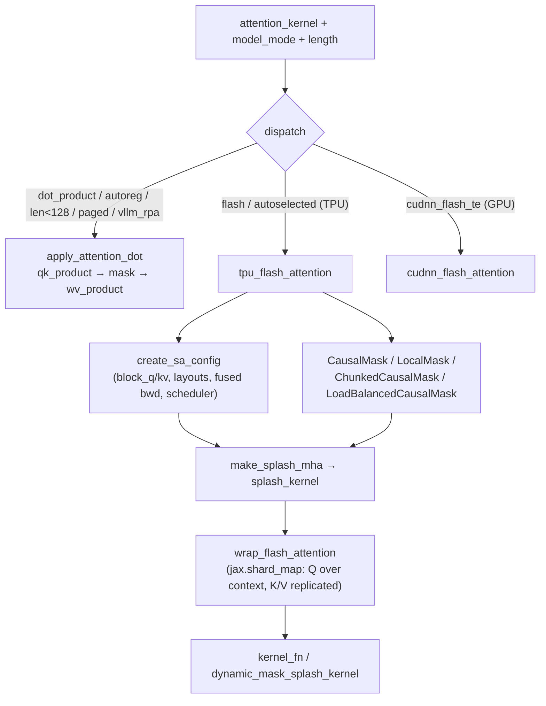

# MaxText AttentionOp — kernel selection, Splash config, masking, sharding

## Overview
`AttentionOp` is the module the [`Attention`](maxtext-layers-attentions.md) layer delegates
the actual softmax(QKᵀ)V to. It is a *dispatcher*: a single string
[`attention_kernel`](../catalog/src/maxtext/layers/attention_op.md#AttentionOp.attention_kernel)
(plus the model mode and sequence length) chooses among a hand-written dot-product path
([`apply_attention_dot`](../catalog/src/maxtext/layers/attention_op.md#AttentionOp.apply_attention_dot)),
the TPU Splash/Flash Pallas kernel
([`tpu_flash_attention`](../catalog/src/maxtext/layers/attention_op.md#AttentionOp.tpu_flash_attention)),
and the GPU cuDNN kernel
([`cudnn_flash_attention`](../catalog/src/maxtext/layers/attention_op.md#AttentionOp.cudnn_flash_attention)).
The single design idea for TPU perf: the flash path builds a *Splash* kernel object whose
block sizes, layouts, and scheduler are fully parameterized by `local_sa_*` config fields
via [`create_sa_config`](../catalog/src/maxtext/layers/attention_op.md#AttentionOp.create_sa_config),
wraps it in a `jax.shard_map` (`wrap_flash_attention`) that shards Q over the sequence/context
axis while replicating K/V, and expresses masking *lazily* through composable Splash mask
objects rather than materializing an `O(seq²)` mask. This module is where nearly all
attention-side TPU tuning knobs live.

## Diagram

## Design rationale (why it's built this way)
The dispatch is intentionally coarse and *mode-aware*, not just kernel-name-aware: the
dot-product path is selected not only for `attention_kernel == "dot_product"` but also
whenever the mode is autoregressive decode or the query length is `< 128`, because the
Splash/flash kernel is a poor fit for tiny single-token or very short sequences. This is
grounded in the fact that
[`tpu_flash_attention`](../catalog/src/maxtext/layers/attention_op.md#AttentionOp.tpu_flash_attention)
raises `"Decode not supported with flash attention"` for autoregressive mode — so the
dispatcher must route decode to the dot path. The dot path is also the only one that
supports KV-cache quantization end-to-end and the DeepSeek indexer / MoBA sparse masks.

The Splash configuration is split from the kernel construction on purpose.
[`create_sa_config`](../catalog/src/maxtext/layers/attention_op.md#AttentionOp.create_sa_config)
builds either a Tokamax `SplashConfig` or a stock `BlockSizes`, clamping every block size to
the actual Q/K sequence length (`min(self.block_q, query.shape[2])`, etc.) so an
over-large configured block never exceeds the tensor. It threads the fused-backward flag
[`use_fused_bwd_kernel`](../catalog/src/maxtext/layers/attention_op.md#AttentionOp.use_fused_bwd_kernel)
(which, when true, sets `block_q_dq`/`block_kv_dq` to `None` — the separate dQ blocks are
unused), the QKV memory layouts
[`q_layout`](../catalog/src/maxtext/layers/attention_op.md#AttentionOp.q_layout) /
[`k_layout`](../catalog/src/maxtext/layers/attention_op.md#AttentionOp.k_layout) /
[`v_layout`](../catalog/src/maxtext/layers/attention_op.md#AttentionOp.v_layout), and the
Tokamax-only knobs [`fuse_reciprocal`](../catalog/src/maxtext/layers/attention_op.md#AttentionOp.fuse_reciprocal),
[`use_base2_exp`](../catalog/src/maxtext/layers/attention_op.md#AttentionOp.use_base2_exp),
and [`use_splash_scheduler`](../catalog/src/maxtext/layers/attention_op.md#AttentionOp.use_splash_scheduler)
(mapped to `use_experimental_scheduler`). These are exactly the surfaces a TPU tuning
experiment sweeps.

> [!inferred]
> The `block_*` fields are read from `config.local_sa_*` (e.g. `self.block_q =
> config.local_sa_block_q`), so the `local_sa_` config namespace is the canonical place to
> tune Splash block sizes for a run. That mapping is visible in each field's initializer
> source but is not stated in a docstring.

## Entry points
- [`__init__`](../catalog/src/maxtext/layers/attention_op.md#AttentionOp.__init__) —
  constructed once per `Attention` layer. It captures the
  [`mesh`](../catalog/src/maxtext/layers/attention_op.md#AttentionOp.mesh),
  [`attention_kernel`](../catalog/src/maxtext/layers/attention_op.md#AttentionOp.attention_kernel)
  string, [`attention_type`](../catalog/src/maxtext/layers/attention_op.md#AttentionOp.attention_type)
  (GLOBAL / LOCAL_SLIDING / CHUNK / FULL), head counts, quant, and the three flash axis-name
  defaults ([`flash_axis_names_q`](../catalog/src/maxtext/layers/attention_op.md#AttentionOp.flash_axis_names_q),
  [`flash_axis_names_kv`](../catalog/src/maxtext/layers/attention_op.md#AttentionOp.flash_axis_names_kv),
  [`flash_axis_names_splash_kernel`](../catalog/src/maxtext/layers/attention_op.md#AttentionOp.flash_axis_names_splash_kernel))
  that drive the shard_map partitioning.
- [`tpu_flash_attention`](../catalog/src/maxtext/layers/attention_op.md#AttentionOp.tpu_flash_attention)
  — the TPU flash/splash entry, reached from the dispatcher for `flash`/`autoselected` on
  TPU when not decoding. Its docstring is terse ("TPU Flash Attention.") but its body builds
  the mask, the Splash kernel, and the sharded wrapper.
- [`apply_attention_dot`](../catalog/src/maxtext/layers/attention_op.md#AttentionOp.apply_attention_dot)
  — the reference dot-product path, reached for decode, short sequences, paged, vLLM, and
  explicit `dot_product`. It is the only path that materializes attention logits and thus
  the only one that supports the indexer/MoBA additive masks and KV-quant.
- [`cudnn_flash_attention`](../catalog/src/maxtext/layers/attention_op.md#AttentionOp.cudnn_flash_attention)
  — the GPU/Transformer-Engine path (out of scope for TPU but part of the same dispatch).

## Mechanism (step-by-step)
1. **Select the kernel.** The dispatcher keys off
   [`attention_kernel`](../catalog/src/maxtext/layers/attention_op.md#AttentionOp.attention_kernel):
   `dot_product`, or `autoselected` with decode/`length < 128`, or `paged`/`vllm_rpa`, route
   to the dot path; `flash`/`autoselected` on TPU route to the flash path; `cudnn_flash_te`
   to GPU. The three targets are exactly the methods reachable from
   [`max_logits`](../catalog/src/maxtext/layers/attention_op.md#AttentionOp.max_logits) —
   `apply_attention_dot`, `tpu_flash_attention`, and `cudnn_flash_attention` — which each
   record the softmax max-logit intermediate for QK-clip.
2. **(Flash) Transpose and derive mesh axes.**
   [`tpu_flash_attention`](../catalog/src/maxtext/layers/attention_op.md#AttentionOp.tpu_flash_attention)
   transposes Q/K/V to `(batch, heads, length, kv)` and resolves logical axis names to mesh
   `PartitionSpec`s through
   [`_logical_to_mesh_axes`](../catalog/src/maxtext/layers/attention_op.md#AttentionOp._logical_to_mesh_axes)
   (which disables logical rules under pipeline parallelism). It also asserts the batch is
   divisible across the `data`×`fsdp` device count — a sharding precondition for the kernel.
3. **Build the Splash block config.**
   [`create_sa_config`](../catalog/src/maxtext/layers/attention_op.md#AttentionOp.create_sa_config)
   assembles a `SplashConfig` (Tokamax) or `BlockSizes` (stock) from the clamped
   [`block_q`](../catalog/src/maxtext/layers/attention_op.md#AttentionOp.block_q),
   [`block_kv`](../catalog/src/maxtext/layers/attention_op.md#AttentionOp.block_kv),
   [`block_kv_compute`](../catalog/src/maxtext/layers/attention_op.md#AttentionOp.block_kv_compute),
   the backward blocks
   [`block_q_dkv`](../catalog/src/maxtext/layers/attention_op.md#AttentionOp.block_q_dkv),
   [`block_kv_dkv`](../catalog/src/maxtext/layers/attention_op.md#AttentionOp.block_kv_dkv),
   [`block_kv_dkv_compute`](../catalog/src/maxtext/layers/attention_op.md#AttentionOp.block_kv_dkv_compute),
   [`block_q_dq`](../catalog/src/maxtext/layers/attention_op.md#AttentionOp.block_q_dq),
   [`block_kv_dq`](../catalog/src/maxtext/layers/attention_op.md#AttentionOp.block_kv_dq),
   plus the layouts and the fused-backward / scheduler flags. This object is the primary
   Pallas-kernel tuning surface.
4. **Build the mask lazily.** Still in `tpu_flash_attention`, a `CausalMask`/`FullMask` is
   ANDed with a `LocalMask` when
   [`sliding_window_size`](../catalog/src/maxtext/layers/attention_op.md#AttentionOp.sliding_window_size)
   is set (LOCAL_SLIDING type), or with
   [`ChunkedCausalMask`](../catalog/src/maxtext/layers/attention_op.md#ChunkedCausalMask) when
   [`chunk_attn_window_size`](../catalog/src/maxtext/layers/attention_op.md#AttentionOp.chunk_attn_window_size)
   is set (CHUNK type). Under load-balanced context parallelism the causal/local masks are
   swapped for [`LoadBalancedCausalMask`](../catalog/src/maxtext/layers/attention_op.md#LoadBalancedCausalMask)
   and [`LoadBalancedLocalMask`](../catalog/src/maxtext/layers/attention_op.md#LoadBalancedLocalMask),
   which renumber positions so each CP shard does equal work. These are Splash
   `_ComputableMask` subclasses — evaluated inside the kernel, never materialized as a dense
   tensor.
5. **Construct and shard the Splash kernel.** `make_splash_mha` is jitted (Tokamax path via
   [`wrap_splash_kernel`](../catalog/src/maxtext/layers/attention_op.md#AttentionOp.wrap_splash_kernel))
   with `q_seq_shards=cp_size`, then each kernel leaf is sharded with
   [`_maybe_shard_with_pspec`](../catalog/src/maxtext/layers/attention_op.md#AttentionOp._maybe_shard_with_pspec)
   along the splash-kernel axes. This is how the kernel's internal state is placed on the
   mesh consistently with Q's head/sequence sharding.
6. **Run under shard_map with Q sequence-sharded, K/V replicated.**
   [`wrap_flash_attention`](../catalog/src/maxtext/layers/attention_op.md#AttentionOp.wrap_flash_attention)
   is a `jax.shard_map` whose `in_specs` shard Q on the context axis but pass K/V with the
   kv-axis spec (unsharded over sequence); its comment states "q will be sharded over
   sequence aka context length but K and V will be duplicated." Under load-balanced CP it
   first `reorder_sequence`s K/V to contiguous order and packs `SegmentIds`. The innermost
   call is [`kernel_fn`](../catalog/src/maxtext/layers/attention_op.md#AttentionOp.kernel_fn)
   (or [`dynamic_mask_splash_kernel`](../catalog/src/maxtext/layers/attention_op.md#AttentionOp.dynamic_mask_splash_kernel)
   for the DeepSeek indexer), `jax.vmap`-ed over the batch, optionally returning
   `stats["max_logits"]`.
7. **(Dot path) Shard, QKᵀ, mask, softmax, ·V.**
   [`apply_attention_dot`](../catalog/src/maxtext/layers/attention_op.md#AttentionOp.apply_attention_dot)
   applies decode/prefill-specific sharding constraints (gated by
   [`is_partition_in_decode`](../catalog/src/maxtext/layers/attention_op.md#AttentionOp.is_partition_in_decode),
   true only for `ici_context_autoregressive_parallelism > 0` and `seq_len == 1`), computes
   logits with [`qk_product`](../catalog/src/maxtext/layers/attention_op.md#AttentionOp.qk_product),
   adds the generated additive mask (and, if enabled, the MoBA sparse mask from
   [`generate_moba_mask_single_item`](../catalog/src/maxtext/layers/attention_op.md#AttentionOp.generate_moba_mask_single_item)
   /[`calculate_moba_gate_logic`](../catalog/src/maxtext/layers/attention_op.md#AttentionOp.calculate_moba_gate_logic)),
   records [`max_logits`](../catalog/src/maxtext/layers/attention_op.md#AttentionOp.max_logits),
   and finishes with the softmax-weighted value product
   [`wv_product`](../catalog/src/maxtext/layers/attention_op.md#AttentionOp.wv_product).
8. **GQA is handled in the einsums.** Both
   [`qk_product`](../catalog/src/maxtext/layers/attention_op.md#AttentionOp.qk_product) and
   [`wv_product`](../catalog/src/maxtext/layers/attention_op.md#AttentionOp.wv_product) reshape
   query heads to `(n_kv, n // n_kv, ...)` and use grouped einsums (`btkgd,bskd->bkgts`),
   so grouped-query attention never physically replicates K/V in the dot path — the group
   dimension `g` rides in the contraction. The `compute_axis_order` field selects between two
   einsum orderings (`(0,1,2,3)` vs `(0,2,1,3)`).

## Key data structures
- **`attention_kernel` + `attention_type`** — the two strings/enums that fully determine the
  path and mask: [`attention_kernel`](../catalog/src/maxtext/layers/attention_op.md#AttentionOp.attention_kernel)
  and [`attention_type`](../catalog/src/maxtext/layers/attention_op.md#AttentionOp.attention_type).
- **The Splash block-size set** — `block_q/block_kv/block_kv_compute` and the dkv/dq
  variants above, all clamped in
  [`create_sa_config`](../catalog/src/maxtext/layers/attention_op.md#AttentionOp.create_sa_config);
  the dominant knobs for flash-kernel occupancy and spill.
- **QKV layouts + scheduler flags** —
  [`q_layout`](../catalog/src/maxtext/layers/attention_op.md#AttentionOp.q_layout),
  [`k_layout`](../catalog/src/maxtext/layers/attention_op.md#AttentionOp.k_layout),
  [`v_layout`](../catalog/src/maxtext/layers/attention_op.md#AttentionOp.v_layout),
  [`use_fused_bwd_kernel`](../catalog/src/maxtext/layers/attention_op.md#AttentionOp.use_fused_bwd_kernel),
  [`use_splash_scheduler`](../catalog/src/maxtext/layers/attention_op.md#AttentionOp.use_splash_scheduler),
  [`fuse_reciprocal`](../catalog/src/maxtext/layers/attention_op.md#AttentionOp.fuse_reciprocal),
  [`use_base2_exp`](../catalog/src/maxtext/layers/attention_op.md#AttentionOp.use_base2_exp).
- **Mesh + flash axis names** — [`mesh`](../catalog/src/maxtext/layers/attention_op.md#AttentionOp.mesh)
  and the `flash_axis_names_*` control Q/K/V and kernel sharding for the shard_map.
- **`config`** — the [`config`](../catalog/src/maxtext/layers/attention_op.md#AttentionOp.config)
  object backing every field above and the `use_tokamax_splash`/`use_jax_splash`/`use_indexer`
  branch switches.

## Dynamics (design intent)
Sharding is expressed structurally through the `jax.shard_map` on
[`wrap_flash_attention`](../catalog/src/maxtext/layers/attention_op.md#AttentionOp.wrap_flash_attention):
the design intent (per its inline comment) is Q sharded over the context/sequence axis and
K/V replicated, with the Splash kernel state sharded over `(HEAD, LENGTH)`. Context
parallelism is load-balanced by reordering the sequence into contiguous shards *inside* the
shard_map, so the kernel sees contiguous K/V. The masks are all lazy `_ComputableMask`
objects composed with `&`, which keeps the flash path free of an `O(seq²)` mask tensor; the
dot path, by contrast, deliberately materializes logits so it can add arbitrary additive
masks (indexer, MoBA) and record exact max-logits "AFTER soft-capping and masking to match
Flash/Splash attention behavior" (source comment in `apply_attention_dot`).

## Edge cases
- Autoregressive decode with `flash` raises inside
  [`tpu_flash_attention`](../catalog/src/maxtext/layers/attention_op.md#AttentionOp.tpu_flash_attention)
  ("Decode not supported with flash attention"); callers must use `dot_product`. The
  dispatcher pre-empts this by routing `autoselected` decode to the dot path.
- LOCAL_SLIDING requires a non-`None`
  [`sliding_window_size`](../catalog/src/maxtext/layers/attention_op.md#AttentionOp.sliding_window_size)
  and CHUNK requires
  [`chunk_attn_window_size`](../catalog/src/maxtext/layers/attention_op.md#AttentionOp.chunk_attn_window_size);
  both raise otherwise.
- `use_fused_bwd_kernel` forces the separate dQ blocks to `None`; Tokamax's `SplashConfig`
  *only* supports the fused backward kernel (set unconditionally to `True` there).
- [`is_partition_in_decode`](../catalog/src/maxtext/layers/attention_op.md#AttentionOp.is_partition_in_decode)
  applies the decode sharding only when `seq_len == 1`, so a length-1 prefill and a decode
  step shard differently from a normal prefill.

## Open questions
- The `apply_attention` dispatcher method that contains the kernel-selection `if/elif`
  ladder is not itself in this packet's subgraph (only the target methods and
  [`attention_kernel`](../catalog/src/maxtext/layers/attention_op.md#AttentionOp.attention_kernel)
  are); the selection logic above is read from source at `attention_op.py:922-1070`.
- Ragged/paged attention (`tpu_ragged_attention`, paged-cache kernels) and the
  `generate_attention_mask` helper are referenced by the dot path but sit outside this
  subgraph.
- The internal numerics of `make_splash_mha` / `SplashAttentionKernel` (Pallas/Mosaic) are
  external to MaxText and not covered here.

## See also
- [MaxText Attention layer](maxtext-layers-attentions.md) — the module that projects,
  norms, RoPEs, and shards Q/K/V before handing them to this dispatcher.
