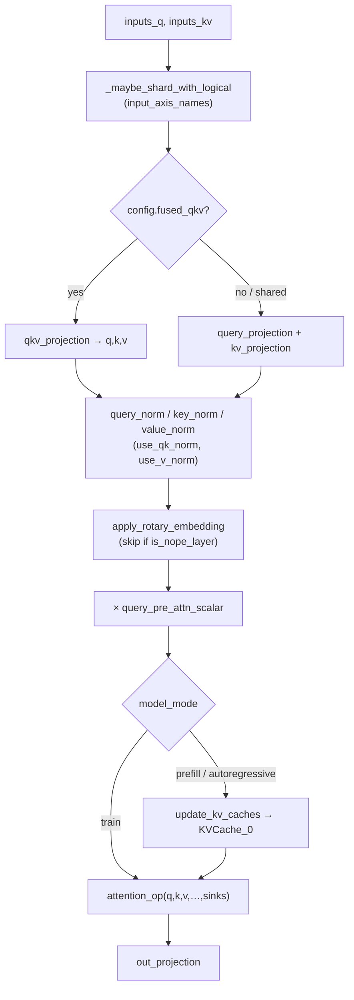

# MaxText Attention layer (projection → norm → RoPE → KV-cache → op dispatch)

<!-- connect:up:begin -->
> **Cross-repo concept:** part of [kv-cache](../../../concepts/kv-cache.md), [layer-norm](../../../concepts/layer-norm.md) across this wiki's repos.
<!-- connect:up:end -->
## Overview
`Attention` is the nnx module that turns hidden states into an attention output: it
owns the Q/K/V/out projection weights, the rotary embedding, optional Q/K/V norms, an
optional per-head `sinks` bias, and a `KVCache`, then hands the shaped Q/K/V to a
separate [`attention_op`](maxtext-layers-attention_op.md)
module that actually runs the kernel (see the sibling page for kernel selection). The
single design idea is *separation of concerns*: this file is responsible for **producing
correctly-projected, rotated, normed, and sharded Q/K/V** (plus writing the cache), and
delegates the softmax(QKᵀ)V numerics entirely to `AttentionOp`. Almost every branch in
[`__call__`](../catalog/src/maxtext/layers/attentions.md#Attention.__call__) exists to
support one architecture family (Llama 4, Gemma, Qwen2/Qwen3-hybrid, MLA, vision) or one
serving mode (train / prefill / autoregressive / vLLM) off the *same* code path — the
perf-relevant knobs are which projections are fused, how heads are grouped (GQA), whether
K/V are shared across layers, and how each tensor is sharded.

## Diagram

## Design rationale (why it's built this way)
The projections are built lazily and conditionally by
[`_init_projections`](../catalog/src/maxtext/layers/attentions.md#Attention._init_projections):
`fused_qkv` picks a single `(3, num_query_heads, head_dim)` kernel
([`init_qkv_w`](../catalog/src/maxtext/layers/attentions.md#Attention.init_qkv_w)) versus
separate Q and K/V kernels, and the K/V kernels are *skipped entirely* when
[`share_kv_layer`](../catalog/src/maxtext/layers/attentions.md#Attention.share_kv_layer)
is set. This is the cross-layer-KV-sharing optimization (Gemma 4 small, Qwen3): a "donor"
layer computes K/V once via
[`compute_shared_kv`](../catalog/src/maxtext/layers/attentions.md#Attention.compute_shared_kv)
and downstream layers reuse the tensors, so those layers carry no K/V weights and do no
K/V matmul — a real FLOP and HBM saving that this module encodes structurally rather than
as a runtime flag.

The query kernel folds the `1/sqrt(head_dim)` softmax scale into the initializer via
[`init_query_w`](../catalog/src/maxtext/layers/attentions.md#Attention.init_query_w)'s
`depth_scaling`, but *disables* that folding when
[`use_qk_norm`](../catalog/src/maxtext/layers/attentions.md#Attention.use_qk_norm) or a
[`query_pre_attn_scalar`](../catalog/src/maxtext/layers/attentions.md#Attention.query_pre_attn_scalar)
is present — the code comment notes this avoids "applying scaling twice." GQA is enforced
structurally in [`init_kv_w`](../catalog/src/maxtext/layers/attentions.md#Attention.init_kv_w),
which requires `num_query_heads % num_kv_heads == 0` and emits only
[`num_kv_heads`](../catalog/src/maxtext/layers/attentions.md#Attention.num_kv_heads) K/V
heads — the head-group expansion happens later inside the op, not here.

> [!inferred]
> The `kernel_axes` in each `init_*_w` (e.g. `("embed", "q_heads", "kv")`) collapse to
> `(None, None, None)` when `ici_context_autoregressive_parallelism > 1`. This is a
> deliberate sharding trade-off: under context-autoregressive parallelism the projection
> weights are left unsharded on the head/embed axes so the sequence axis can carry the
> parallelism. This reading is from the source branch, not a docstring.

## Entry points
- [`__call__`](../catalog/src/maxtext/layers/attentions.md#Attention.__call__) — the layer
  forward, hit once per decoder block per step. Its docstring states it "handles three
  modes": **train** (KV cache ignored), **prefill** (cache filled), and **autoregressive
  decode** (cache read). It runs projection → norm → RoPE → optional cache write →
  `attention_op` → out projection, and returns `(out, kv_cache)`.
- [`compute_shared_kv`](../catalog/src/maxtext/layers/attentions.md#Attention.compute_shared_kv)
  — the donor-side helper for cross-layer KV sharing. Its docstring: "Computes the
  rotated, normed K / V for this layer … the donor calls this once, passes the result into
  its own `__call__` as `shared_key` / `shared_value`." It raises if called on a
  `share_kv_layer=True` layer or under `fused_qkv`.
- [`forward_serve_vllm`](../catalog/src/maxtext/layers/attentions.md#Attention.forward_serve_vllm)
  — the vLLM/TPU serving path, reached when `config.attention == "vllm_rpa"` and not in
  train mode. It flattens Q/K/V to ragged `[tokens, heads, dim]` and calls the external
  `sharded_ragged_paged_attention` op; only non-`share_kv_layer` layers write the paged
  cache.

## Mechanism (step-by-step)
1. **Shard the inputs by mode.** [`__call__`](../catalog/src/maxtext/layers/attentions.md#Attention.__call__)
   first picks a logical axis set from the model mode (prefill / train / decode) and applies
   it through [`_maybe_shard_with_logical`](../catalog/src/maxtext/layers/attentions.md#Attention._maybe_shard_with_logical),
   a `functools.partial` bound at init that inserts `with_sharding_constraint` on the hidden
   states. This is where the sequence/batch sharding of the activation entering attention is
   pinned before any matmul.
2. **Project to Q/K/V.** With `config.fused_qkv`,
   [`qkv_projection`](../catalog/src/maxtext/layers/attentions.md#Attention.qkv_projection)
   runs one `DenseGeneral` and slices the `qkv` axis into three; otherwise
   [`query_projection`](../catalog/src/maxtext/layers/attentions.md#Attention.query_projection)
   and [`kv_projection`](../catalog/src/maxtext/layers/attentions.md#Attention.kv_projection)
   run separately, and K/V may be aliased (`value = key`) when
   [`share_kv_projections`](../catalog/src/maxtext/layers/attentions.md#Attention.share_kv_projections)
   is set. If `shared_key`/`shared_value` were passed in (KV-sharing consumer layer), the
   K/V projections are skipped and the donor tensors are used directly.
3. **Apply Q/K (and optionally V) norms.** When
   [`use_qk_norm`](../catalog/src/maxtext/layers/attentions.md#Attention.use_qk_norm) is on
   (and not a Llama-4 block) or the layer
   [`is_qwen3_hybrid`](../catalog/src/maxtext/layers/attentions.md#Attention.is_qwen3_hybrid),
   [`query_norm`](../catalog/src/maxtext/layers/attentions.md#Attention.query_norm) and
   [`key_norm`](../catalog/src/maxtext/layers/attentions.md#Attention.key_norm) are applied;
   [`use_v_norm`](../catalog/src/maxtext/layers/attentions.md#Attention.use_v_norm) gates
   [`value_norm`](../catalog/src/maxtext/layers/attentions.md#Attention.value_norm). Llama 4
   is special-cased to L2-normalize *after* RoPE using
   [`L2Norm`](../catalog/src/maxtext/layers/attentions.md#L2Norm) (a rsqrt-of-mean-square
   normalizer with [`eps`](../catalog/src/maxtext/layers/attentions.md#L2Norm.eps)).
4. **Apply rotary embedding, unless NoPE.** RoPE is applied to Q and K via
   [`apply_rotary_embedding`](../catalog/src/maxtext/layers/attentions.md#Attention.apply_rotary_embedding)
   only when the layer is not a
   [`is_nope_layer`](../catalog/src/maxtext/layers/attentions.md#Attention.is_nope_layer).
   The concrete embedding object is chosen once at init by
   [`init_rotary_embedding`](../catalog/src/maxtext/layers/attentions.md#Attention.init_rotary_embedding)
   (Llama3.1 / YaRN / Gemma partial / Qwen vision / MLA-partial variants), so the hot path
   just calls the pre-selected module.
5. **Scale the query.** If a
   [`query_pre_attn_scalar`](../catalog/src/maxtext/layers/attentions.md#Attention.query_pre_attn_scalar)
   is set and ≠ 1.0, Q is multiplied by it here (this is the softmax-temperature knob used
   by Gemma), complementing the depth-scaling that was folded into the query initializer.
6. **Write the KV cache (non-train modes only).** For prefill/decode,
   [`update_kv_caches`](../catalog/src/maxtext/layers/attentions.md#Attention.update_kv_caches)
   calls the layer's [`KVCache_0`](../catalog/src/maxtext/layers/attentions.md#Attention.KVCache_0)
   module and returns `[prefill_kv_cache, ar_kv_cache]`. The cache module itself is built by
   [`init_kv_caches`](../catalog/src/maxtext/layers/attentions.md#Attention.init_kv_caches),
   which fixes its shapes from
   [`max_prefill_predict_length`](../catalog/src/maxtext/layers/attentions.md#Attention.max_prefill_predict_length),
   [`max_target_length`](../catalog/src/maxtext/layers/attentions.md#Attention.max_target_length),
   [`num_kv_heads`](../catalog/src/maxtext/layers/attentions.md#Attention.num_kv_heads),
   [`head_dim`](../catalog/src/maxtext/layers/attentions.md#Attention.head_dim) and the KV
   quantization ([`kv_quant`](../catalog/src/maxtext/layers/attentions.md#Attention.kv_quant)) —
   the KV-cache HBM footprint is entirely determined by these fields.
7. **Dispatch to the attention op.** In train (and the non-vLLM path), the shaped Q/K/V,
   segment ids, positions, cached values, and the per-head
   [`sinks`](../catalog/src/maxtext/layers/attentions.md#Attention.sinks) bias are passed to
   [`attention_op`](../catalog/src/maxtext/layers/attentions.md#Attention.attention_op) — an
   `AttentionOp` instance constructed at line 445 with this layer's
   [`attention_type`](../catalog/src/maxtext/layers/attentions.md#Attention.attention_type),
   head counts, [`mesh`](../catalog/src/maxtext/layers/attentions.md#Attention.mesh),
   [`quant`](../catalog/src/maxtext/layers/attentions.md#Attention.quant), and
   [`use_ragged_attention`](../catalog/src/maxtext/layers/attentions.md#Attention.use_ragged_attention)
   flag. That module owns kernel selection (see sibling page).
8. **Project the output.** The op result is re-sharded by mode and, for Qwen3-hybrid,
   gated by `sigmoid(gate)` (the query was split into value+gate halves), then
   [`out_projection`](../catalog/src/maxtext/layers/attentions.md#Attention.out_projection)
   maps `[batch, len, heads, head_dim]` back to model width via the
   [`out`](../catalog/src/maxtext/layers/attentions.md#Attention.out) `DenseGeneral` built by
   [`init_out_w`](../catalog/src/maxtext/layers/attentions.md#Attention.init_out_w).

## Key data structures
- **Projection modules** —
  [`query`](../catalog/src/maxtext/layers/attentions.md#Attention.query),
  [`key`](../catalog/src/maxtext/layers/attentions.md#Attention.key),
  [`value`](../catalog/src/maxtext/layers/attentions.md#Attention.value),
  [`out`](../catalog/src/maxtext/layers/attentions.md#Attention.out), and (fused case)
  [`qkv_proj`](../catalog/src/maxtext/layers/attentions.md#Attention.qkv_proj). Each is a
  `DenseGeneral` whose `kernel_axes` are the primary perf lever for weight sharding; their
  dtypes come from [`dtype`](../catalog/src/maxtext/layers/attentions.md#Attention.dtype) /
  [`weight_dtype`](../catalog/src/maxtext/layers/attentions.md#Attention.weight_dtype) and
  init from [`kernel_init`](../catalog/src/maxtext/layers/attentions.md#Attention.kernel_init).
- **`KVCache_0`** — the [`KVCache`](../catalog/src/maxtext/layers/attentions.md#Attention.KVCache_0)
  module; its axis order and quantization set the decode-time memory-bandwidth cost.
- **`rotary_embedding`** — the pre-selected
  [`rotary_embedding`](../catalog/src/maxtext/layers/attentions.md#Attention.rotary_embedding)
  object, parameterized by
  [`rope_max_timescale`](../catalog/src/maxtext/layers/attentions.md#Attention.rope_max_timescale)
  and [`partial_rotary_factor`](../catalog/src/maxtext/layers/attentions.md#Attention.partial_rotary_factor).
- **`sinks`** — an optional `nnx.Param` of shape derived from head counts
  ([`sinks`](../catalog/src/maxtext/layers/attentions.md#Attention.sinks)), an additive
  per-head "attention sink" logit forwarded into the op.
- **`config`** — the [`config`](../catalog/src/maxtext/layers/attentions.md#Attention.config)
  object; nearly every branch above reads a field of it, so it is the single source of the
  architecture/perf switches.

## Dynamics (design intent)
The three modes share one traced function; the docstring on
[`__call__`](../catalog/src/maxtext/layers/attentions.md#Attention.__call__) is explicit
that train ignores the cache while prefill fills and decode reads it, and the mode is a
Python-level branch so each mode compiles to its own HLO. Rematerialization boundaries are
placed with `checkpoint_name` on `query_proj`/`key_proj`/`value_proj`/`attention_out`/
`out_proj` inside `__call__` — a deliberate choice about what the compiler may recompute in
the backward pass rather than keep in HBM. KV-sharing is a *static* property: a
`share_kv_layer=True` layer physically has no K/V weights (built by
[`_init_projections`](../catalog/src/maxtext/layers/attentions.md#Attention._init_projections)),
so the saving is compiled in, not decided at runtime.

## Edge cases
- `share_kv_layer=True` requires both `shared_key` and `shared_value` at call time, and is
  incompatible with `fused_qkv`; [`compute_shared_kv`](../catalog/src/maxtext/layers/attentions.md#Attention.compute_shared_kv)
  raises on both violations.
- GQA validity is checked in [`init_kv_w`](../catalog/src/maxtext/layers/attentions.md#Attention.init_kv_w):
  `num_kv_heads == -1` or a non-divisible `num_query_heads / num_kv_heads` raises.
- Qwen3-hybrid doubles the query out-features (value+gate) in
  [`init_query_w`](../catalog/src/maxtext/layers/attentions.md#Attention.init_query_w) and
  reshapes the out projection in [`init_out_w`](../catalog/src/maxtext/layers/attentions.md#Attention.init_out_w),
  so head/axis assumptions differ from the standard block.
- `is_qwen2` forces `use_bias=False` on the output projection in
  [`init_out_w`](../catalog/src/maxtext/layers/attentions.md#Attention.init_out_w) regardless
  of [`use_bias_in_projections`](../catalog/src/maxtext/layers/attentions.md#Attention.use_bias_in_projections).

## Open questions
- The head-group expansion for GQA (repeating `num_kv_heads` into `num_query_heads`) is not
  in this module's subgraph — it lives in the op's `qk_product`/`wv_product`. Documented on
  the sibling page.
- `init_rotary_embedding` returns model-specific embedding classes (`YarnRotaryEmbedding`,
  `Gemma4PartialRotaryEmbedding`, …) that are outside this subgraph; their internal RoPE
  math is not covered here.
- The exact `KVCache` layout (`prefill_cache_axis_order` / `ar_cache_axis_order`) is passed
  through [`init_kv_caches`](../catalog/src/maxtext/layers/attentions.md#Attention.init_kv_caches)
  but defined in the `kvcache` module, not here.

## See also
- [MaxText AttentionOp kernel dispatch](maxtext-layers-attention_op.md) — where the shaped
  Q/K/V from this layer get routed to dot-product / flash / splash / cuDNN kernels.
