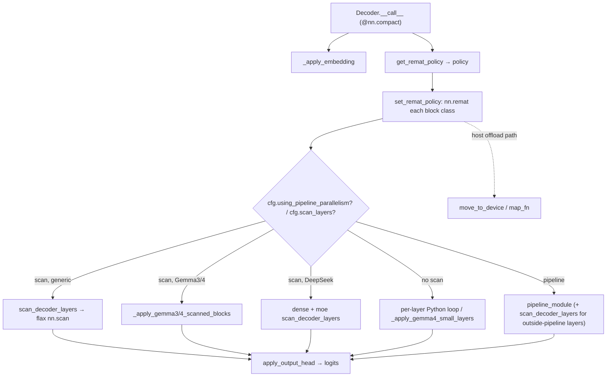

# MaxText Linen decoder stack — layer scan, remat, and pipeline wiring

<!-- connect:up:begin -->
> **Cross-repo concept:** part of [rematerialization](../../../concepts/rematerialization.md) across this wiki's repos.
<!-- connect:up:end -->
## Overview
`decoders.py` is the Flax **Linen** implementation of MaxText's decoder: the module that turns token ids into logits by stacking N transformer blocks. The single load-bearing idea is that the N identical blocks are **not** unrolled into N sub-modules — they are compiled once and replayed with [`scan_decoder_layers`](../catalog/src/maxtext/layers/decoders.md#Decoder.scan_decoder_layers), a thin wrapper over `flax.linen.transforms.scan` that stacks the per-layer parameters along a leading "layers" axis. Wrapped around that scan is a rematerialization policy chosen by [`get_remat_policy`](../catalog/src/maxtext/layers/decoders.md#Decoder.get_remat_policy) and applied by [`set_remat_policy`](../catalog/src/maxtext/layers/decoders.md#Decoder.set_remat_policy). Everything else in the file — the DeepSeek/Gemma3/Gemma4/pipeline branches inside [`__call__`](../catalog/src/maxtext/layers/decoders.md#Decoder.__call__) — is variation on *how many* scan calls to issue and *which* block class each scans. These three surfaces (scan axis, remat policy, pipeline partition) are the decoder's entire TPU-perf envelope.

## Diagram

## Design rationale (why it's built this way)
The decoder is dominated by one decision: **compile-time cost and activation memory both scale with the number of unrolled layers, so MaxText refuses to unroll.** `scan_decoder_layers`' docstring is terse — "scan decoder layers, calls `flax.linen.transforms.scan`" — but the body reveals the intent: it stacks `params` along `cfg.param_scan_axis`, and crucially chooses `ScanIn(cfg.param_scan_axis)` when *not* initializing versus a bare axis when initializing ([`scan_decoder_layers`](../catalog/src/maxtext/layers/decoders.md#Decoder.scan_decoder_layers)). That distinction lets Flax lay out the stacked weight tensor without a second copy during init. One `nn.scan` means one compiled block body regardless of depth — the reason a 100-layer model compiles in roughly the time of a 1-layer model.

Remat is deliberately *policy-driven rather than boolean*. [`get_remat_policy`](../catalog/src/maxtext/layers/decoders.md#Decoder.get_remat_policy) is a large dispatch over `cfg.remat_policy` strings that map to named-tensor save/offload sets built by [`minimal_policy`](../catalog/src/maxtext/layers/decoders.md#Decoder.minimal_policy) and `jax.checkpoint_policies`. The granularity — `save_qkv_proj`, `save_dot_except_mlpwi`, `qkv_proj_offloaded`, `minimal_offloaded` — exists because the optimal recompute/HBM trade-off differs per model size and hardware. The code even carries an inline warning that with `cfg.scan_layers`, checkpointing quantization can be *slower* than not checkpointing, and tells the reader to benchmark both — an explicit admission that the scan+remat interaction is non-monotone.

> [!inferred]
> The `static_argnums=(4, 5)` in [`set_remat_policy`](../catalog/src/maxtext/layers/decoders.md#Decoder.set_remat_policy) (deterministic, model_mode) exist because `nn.remat`/`jax.checkpoint` must treat those as Python constants — they change the graph (train vs decode, dropout on/off) and cannot be traced values. Getting this wrong would silently recompile per step or break the checkpoint.

## Entry points
- [`__call__`](../catalog/src/maxtext/layers/decoders.md#Decoder.__call__) — the `@nn.compact` forward pass and the sole dispatcher. Control reaches it once per training/inference step from the enclosing Transformer. It embeds, picks and applies the remat policy, packs `broadcast_args = (decoder_segment_ids, decoder_positions, deterministic, model_mode)`, then branches on `cfg.using_pipeline_parallelism`, `cfg.scan_layers`, and `cfg.decoder_block` to select one of the scan strategies below.
- [`get_pipeline_stage_module`](../catalog/src/maxtext/layers/decoders.md#Decoder.get_pipeline_stage_module) — reached from `setup()` (via [`build_pipeline_stage_layers`](../catalog/src/maxtext/layers/decoders.md#Decoder.build_pipeline_stage_layers)) when pipeline parallelism is on; it builds the per-stage module, using [`get_layer_to_pipeline`](../catalog/src/maxtext/layers/decoders.md#Decoder.get_layer_to_pipeline) to pick the DeepSeek *sparse* block (index 1) vs the generic block (index 0), then wraps it as a single layer, a `scan_decoder_layers` stack, or a [`SequentialBlockDecoderLayers`](../catalog/src/maxtext/layers/decoders.md#SequentialBlockDecoderLayers) depending on `num_layers_per_pipeline_stage` and `scan_layers_per_stage`.
- [`apply_output_head`](../catalog/src/maxtext/layers/decoders.md#Decoder.apply_output_head) — reached at the end of `__call__`; applies the final norm ([`get_norm_layer`](../catalog/src/maxtext/layers/decoders.md#Decoder.get_norm_layer)), dropout, and projects to vocab logits, choosing an explicit output sharding over `activation_vocab` and, for `logits_via_embedding`, attending on the shared embedding table.

## Mechanism (step-by-step)
1. **Embed.** `__call__` first calls [`_apply_embedding`](../catalog/src/maxtext/layers/decoders.md#Decoder._apply_embedding), which runs the `shared_embedding` on int32 token ids and, for multimodal models, merges image/video/audio embeddings into the text stream at masked positions. The result `y` is `[batch, length, emb_dim]`. Optional MHC expansion widens it to `[batch, length, mhc_expansion_rate, emb_dim]`.
2. **Choose the remat policy.** [`get_remat_policy`](../catalog/src/maxtext/layers/decoders.md#Decoder.get_remat_policy) translates the `cfg.remat_policy` string into a concrete `jax.checkpoint` policy object (or `None` for `full`). The "minimal" family routes through [`minimal_policy`](../catalog/src/maxtext/layers/decoders.md#Decoder.minimal_policy), which builds a `save_only_these_names` set over the attention/MLP projection tensors, optionally adding `context` and `quantization`. Offloaded variants instead build `save_and_offload_only_these_names` with `offload_dst="pinned_host"` — the HBM-relief lever.
3. **Wrap the block class in remat.** [`set_remat_policy`](../catalog/src/maxtext/layers/decoders.md#Decoder.set_remat_policy) takes each decoder block *class* (not instance) and returns `nn.remat(block, prevent_cse=should_prevent_cse_in_remat(cfg), policy=policy, static_argnums=(4,5))`. If `cfg.parameter_memory_host_offload` is set, it first wraps the class with `nn.map_variables(..., move_to_device)` so parameters are `jax.device_put` back to device space on entry ([`move_to_device`](../catalog/src/maxtext/layers/decoders.md#Decoder.move_to_device) / [`map_fn`](../catalog/src/maxtext/layers/decoders.md#Decoder.map_fn)). The class-level wrapping matters: it must happen before the scan so every scanned iteration shares one remat'd body.
4. **Scan the stack.** For the generic non-pipeline path, `__call__` calls [`scan_decoder_layers`](../catalog/src/maxtext/layers/decoders.md#Decoder.scan_decoder_layers) once with `length = num_decoder_layers / inhomogeneous_layer_cycle_interval`. That method calls `nn.scan` with `variable_axes={"params": params_spec, "cache": 0, "intermediates": 0, ...}`, `split_rngs={"params": True, "dropout": cfg.enable_dropout}`, `in_axes=in_axes_tuple`, and `metadata_params={nn.PARTITION_NAME: metadata_axis_name}`. The `metadata_axis_name` (e.g. `"layers"`, `"dense_layers"`, `"moe_layers"`) is the **logical sharding axis name** stamped onto the stacked-layer dimension — this is how the decoder stack participates in logical-axis sharding. `broadcast_args` are threaded with `nn.broadcast` in_axes so per-step inputs are not scanned.
5. **Architecture-specific scan shapes.** When `cfg.decoder_block` is Gemma3/Gemma4, `__call__` delegates to [`_apply_gemma3_scanned_blocks`](../catalog/src/maxtext/layers/decoders.md#Decoder._apply_gemma3_scanned_blocks) / [`_apply_gemma4_scanned_blocks`](../catalog/src/maxtext/layers/decoders.md#Decoder._apply_gemma4_scanned_blocks), which scan over `num_decoder_layers // len(ATTENTION_PATTERN)` *blocks* (each block bundling the repeating sliding/global attention pattern) and then handle the leftover remainder layers separately. DeepSeek splits into two scans — a dense-layer scan of length `first_num_dense_layers` and a MoE scan of the remainder — because the two block classes differ; [`_apply_deepseek4_scanned_blocks`](../catalog/src/maxtext/layers/decoders.md#Decoder._apply_deepseek4_scanned_blocks) additionally *unrolls* the first `first_num_hash_layers` prefix layers before scanning the uniform tail, since those layers use heterogeneous attention and static hash routing that `nn.scan`'s identical-graph requirement forbids.
6. **Engram interleaving.** When `cfg.engram_layers` is set, [`_apply_interleaved_scanned_layers`](../catalog/src/maxtext/layers/decoders.md#Decoder._apply_interleaved_scanned_layers) walks the index range, emitting a single unscanned Engram layer at each engram index via [`_apply_single_engram_layer`](../catalog/src/maxtext/layers/decoders.md#Decoder._apply_single_engram_layer) and a scanned chunk of the contiguous run between engram indices via [`_apply_scanned_chunk`](../catalog/src/maxtext/layers/decoders.md#Decoder._apply_scanned_chunk) (which calls `scan_decoder_layers` on that sub-range). [`_find_next_boundary`](../catalog/src/maxtext/layers/decoders.md#Decoder._find_next_boundary) computes each chunk's end. This is how MaxText mixes scanned and unscanned layers in one stack.
7. **Non-scan / small-model paths.** With `cfg.scan_layers = False`, `__call__` runs a plain Python `for` loop instantiating each `RemattedBlockLayers[0]` per index — legible but O(N) compile time. Gemma4-small (E2B/E4B) always uses [`_apply_gemma4_small_layers`](../catalog/src/maxtext/layers/decoders.md#Decoder._apply_gemma4_small_layers), which threads per-layer PLE inputs and a KV-share donor map through an explicit loop and, per its docstring, does **not** support scan-over-layers or pipeline parallelism.
8. **Pipeline path.** When `cfg.using_pipeline_parallelism`, `__call__` computes a `logical_partition_spec` from `pipeline_module.get_weight_sharding(...)` and runs [`pipeline_module`](../catalog/src/maxtext/layers/decoders.md#Decoder.pipeline_module); any layers beyond `pipeline_parallel_layers` are scanned "outside the pipeline" under a `logical_axis_rules_pp_act_as_dp` context so the pipeline axis is reinterpreted as data-parallel for those residual layers.
9. **Output head.** Finally [`apply_output_head`](../catalog/src/maxtext/layers/decoders.md#Decoder.apply_output_head) normalizes, applies dropout, and projects to `[batch, length, vocab_size]` — either by attending on the shared embedding table (`logits_via_embedding`, with optional soft-cap `tanh`) or a `dense_general`, each with an explicit `activation_vocab` output sharding.

## Key data structures
- **Module fields** `config`, `mesh`, `quant`, `model_mode` ([`config`](../catalog/src/maxtext/layers/decoders.md#Decoder.config), [`mesh`](../catalog/src/maxtext/layers/decoders.md#Decoder.mesh), [`quant`](../catalog/src/maxtext/layers/decoders.md#Decoder.quant), [`model_mode`](../catalog/src/maxtext/layers/decoders.md#Decoder.model_mode)) — the Linen dataclass fields carried into every sub-call; `mesh` is the device mesh used for all logical-axis sharding, `quant` the optional AQT quantization handle.
- **`decoder_layer`** ([`decoder_layer`](../catalog/src/maxtext/layers/decoders.md#Decoder.decoder_layer)) — the list of block *classes* returned by [`get_decoder_layers`](../catalog/src/maxtext/layers/decoders.md#Decoder.get_decoder_layers) (one class for most models, two for DeepSeek dense/MoE). `set_remat_policy` transforms this list; the scan consumes it. The base block type is [`DecoderLayer`](../catalog/src/maxtext/layers/decoders.md#DecoderLayer).
- **`norm_layer` / `pipeline_module`** ([`norm_layer`](../catalog/src/maxtext/layers/decoders.md#Decoder.norm_layer), [`pipeline_module`](../catalog/src/maxtext/layers/decoders.md#Decoder.pipeline_module)) — built in `setup()`; the pipeline module is only constructed when pipeline parallelism is enabled, via the [`build_pipeline_stage_layers`](../catalog/src/maxtext/layers/decoders.md#Decoder.build_pipeline_stage_layers) closure and [`_build_nnx_pipeline_stage`](../catalog/src/maxtext/layers/decoders.md#Decoder._build_nnx_pipeline_stage) / [`_get_nnx_decoder_block_classes`](../catalog/src/maxtext/layers/decoders.md#Decoder._get_nnx_decoder_block_classes).
- **`SequentialBlockDecoderLayers`** ([`SequentialBlockDecoderLayers`](../catalog/src/maxtext/layers/decoders.md#SequentialBlockDecoderLayers)) — a small `nn.Module` holding `decoder_layer`, `num_decoder_layers`, `config`, `mesh`, `quant`, `model_mode` ([fields](../catalog/src/maxtext/layers/decoders.md#SequentialBlockDecoderLayers.num_decoder_layers)); used to run an *unscanned* sequential run of layers inside one pipeline stage.

## Dynamics (design intent)
The scan is the concurrency story: because `nn.scan` compiles one block body, the XLA scheduler overlaps that body's collectives (FSDP all-gather of the next layer's params, all-reduce of the current layer's grads) across the scanned iterations, and the `metadata_axis_name` on the layers dimension is what tells the partitioner how the stacked weights shard. The remat policy names determine which activations survive into the backward pass; `qkv_proj_offloaded` / `minimal_offloaded` push those to pinned host memory, trading PCIe bandwidth for HBM headroom. [`deepstack_process`](../catalog/src/maxtext/layers/decoders.md#deepstack_process) adds visual embeddings at token positions when deepstack inputs are present — orthogonal to the scan.

## Edge cases
- **DeepSeek must have exactly two block classes** — `__call__` asserts `len(RemattedBlockLayers) == 2` on every DeepSeek branch.
- **DeepSeek-V4 prefix layers cannot be scanned** — heterogeneous attention (`compress_ratios [0,0,4]`) and static hash routing force per-layer unrolling before the uniform `[128, 4]` tail is scanned ([`_apply_deepseek4_scanned_blocks`](../catalog/src/maxtext/layers/decoders.md#Decoder._apply_deepseek4_scanned_blocks)).
- **Gemma4-small forbids scan and pipeline** — its per-layer KV-sharing and per-index attention types are inexpressible under `nn.scan` ([`_apply_gemma4_small_layers`](../catalog/src/maxtext/layers/decoders.md#Decoder._apply_gemma4_small_layers)).
- **Remainder layers** — Gemma3/Gemma4 scans cover only `num_decoder_layers // pattern_len` full blocks; a `% pattern_len` remainder is applied outside the scan and is easy to overlook when reasoning about parameter counts.
- **Scan + quantization checkpointing may regress** — the code itself warns to benchmark ([`get_remat_policy`](../catalog/src/maxtext/layers/decoders.md#Decoder.get_remat_policy)).

## Open questions
- The exact `param_scan_axis` value and how `ScanIn` vs bare-axis selection interacts with FSDP sharding of the stacked weight tensor is only visible in `scan_decoder_layers`; the downstream partitioner behavior is not in this subgraph.
- `should_prevent_cse_in_remat` gates `prevent_cse` in `set_remat_policy` but lives in `maxtext_utils` (out of subgraph) — the precise condition under which CSE is prevented is unresolved here.
- Whether `pipeline_module.get_weight_sharding` overlaps the FSDP all-gather once vs per-repeat (`pipeline_fsdp_ag_once` / `pipeline_fsdp_ag_per_repeat`) is decided by config flags whose perf trade-off is not documented in-file.

## See also
- [MaxText NNX decoder stack](maxtext-layers-nnx_decoders.md) — the Flax NNX port of this same decoder, which builds layers eagerly and applies remat via `jax.checkpoint` instead of `nn.remat`.

## Sources
- raw/code/maxtext/src/maxtext/layers/decoders.py @ `fcb7ebeba9ecfc67d79e471f50c16c9d89b3263d`
