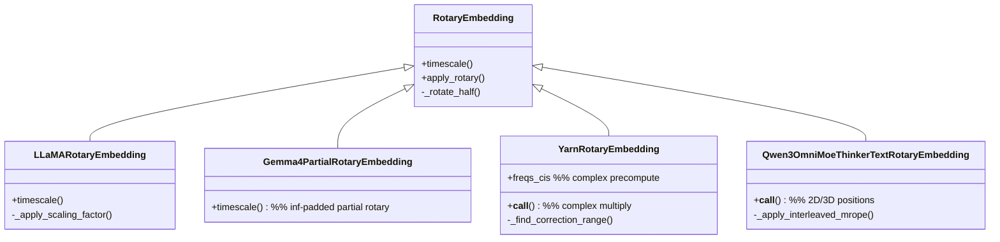
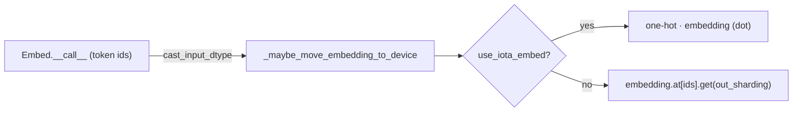

# MaxText embeddings: token lookup & rotary position

This subsystem covers the two ways position and identity enter a MaxText transformer: the `Embed` table that turns token ids into vectors, and a family of rotary position embeddings (RoPE) that inject position by rotating query/key vectors. The organizing idea for RoPE is a base `RotaryEmbedding` that owns the *rotation math* (`apply_rotary`, `_rotate_half`) while each model family overrides only how inverse frequencies — the `timescale` — are computed: plain geometric (base), llama3 wavelength scaling (`LLaMARotaryEmbedding`), partial-rotary with inf-padding (`Gemma4PartialRotaryEmbedding`), YaRN NTK-by-parts (`YarnRotaryEmbedding`), and interleaved multimodal MRoPE (`Qwen3OmniMoeThinkerTextRotaryEmbedding`). For a TPU perf loop the load-bearing surfaces are the embedding-table host offload, the iota-vs-gather lookup choice, the one-time `freqs_cis` precompute cost of YaRN, and the `shard_mode`/`freqs_sharding` output-partitioning gates.

## Diagram

## Design rationale (why it's built this way)

The RoPE hierarchy is a *template-method* split: [`apply_rotary`](../catalog/src/maxtext/layers/embeddings.md#RotaryEmbedding.apply_rotary) (*"Applies the rotary transformation logic."*) and [`_rotate_half`](../catalog/src/maxtext/layers/embeddings.md#RotaryEmbedding._rotate_half) (*"Rotates half the hidden dims of the input: (x1, x2) -> (-x2, x1)."*) are identical across every model, so they live once on the base; only the frequency schedule differs and it is isolated behind the [`timescale`](../catalog/src/maxtext/layers/embeddings.md#RotaryEmbedding.timescale) property, dispatched virtually to the subclass. The base geometric schedule reads directly off `min_timescale`/`max_timescale`, and the constructor [`__init__`](../catalog/src/maxtext/layers/embeddings.md#RotaryEmbedding.__init__) enforces an even `embedding_dims` because the rotation pairs dimensions.

The variants exist because long-context and multimodal models need different frequency treatments. Gemma-4's [`timescale`](../catalog/src/maxtext/layers/embeddings.md#Gemma4PartialRotaryEmbedding.timescale) documents its trick in-source: it rotates only `rotary_dim = head_dim · partial_rotary_factor` dimensions and **pads the rest with `jnp.inf`** — *"When position is divided by inf, the angle becomes 0. sin(0)=0 and cos(0)=1, which acts as a passthrough for unrotated dims."* That is a zero-cost way to express partial rotary without a separate concat/slice code path.

YaRN is the expensive outlier. [`freqs_cis`](../catalog/src/maxtext/layers/embeddings.md#YarnRotaryEmbedding.freqs_cis) precomputes a full `[max_position_embeddings, half_dim]` **complex** table once (`jnp.exp(1j·freqs)`) and blends base and rope-factor-scaled frequencies through an NTK-by-parts ramp. Its `__call__` then applies rotation by *complex multiplication* rather than the real cos/sin path — a deliberately different, and heavier, mechanism justified by extrapolation quality at long context.

> [!inferred]
> The `Embed` table and the RoPE modules are independent — token identity and position are injected at different points (embedding at the input, RoPE inside attention on Q/K). They share this file and the same host-offload / `ShardMode` conventions, which is why they are packeted together, but there is no call edge between them.

## Entry points

- [`__call__`](../catalog/src/maxtext/layers/embeddings.md#Embed.__call__) — the token-embedding forward (*"Embeds the inputs along the last dimension."*). Hit once at the model input to map integer ids to vectors; it chooses between an iota one-hot matmul and a gather.
- [`__call__`](../catalog/src/maxtext/layers/embeddings.md#YarnRotaryEmbedding.__call__) — the YaRN rotary forward (*"Applies the rotary positional embedding using the precomputed complex frequencies."*). Hit on Q and K inside attention for YaRN-configured models; it indexes `freqs_cis` by position and rotates via complex multiply.
- [`__call__`](../catalog/src/maxtext/layers/embeddings.md#Qwen3OmniMoeThinkerTextRotaryEmbedding.__call__) — the multimodal MRoPE forward (*"Generates rotary position embeddings for multimodal sequences."*). Hit for Qwen omni text with 2D (text) or 3D (temporal/height/width) position ids.
- [`apply_rotary`](../catalog/src/maxtext/layers/embeddings.md#RotaryEmbedding.apply_rotary) — the shared `x·cos + rotate_half(x)·sin` kernel that every real-valued RoPE variant (Gemma/Qwen/LLaMA) funnels into.

## Mechanism (step-by-step)

1. **Token lookup.** [`Embed.__call__`](../catalog/src/maxtext/layers/embeddings.md#Embed.__call__) optionally casts ids via [`cast_input_dtype`](../catalog/src/maxtext/layers/embeddings.md#Embed.cast_input_dtype), asserts an integer dtype, then materializes the table through [`_maybe_move_embedding_to_device`](../catalog/src/maxtext/layers/embeddings.md#_maybe_move_embedding_to_device) — which `jax.device_put`s the [`embedding`](../catalog/src/maxtext/layers/embeddings.md#Embed.embedding) param from host to device space *only when `parameter_memory_host_offload` is set*. The vocab table is one of the largest params, so this offload is a direct HBM lever.

2. **Choose iota-matmul vs gather.** Still in [`Embed.__call__`](../catalog/src/maxtext/layers/embeddings.md#Embed.__call__), `use_iota_embed` picks the lookup: build an iota of length [`num_embeddings`](../catalog/src/maxtext/layers/embeddings.md#Embed.num_embeddings), one-hot the ids against it, and `jnp.dot` into the table (a dense matmul — TPU-friendly, avoids a gather); otherwise `embedding.at[ids].get(...)` does a direct gather. The output width is [`num_features`](../catalog/src/maxtext/layers/embeddings.md#Embed.num_features) and the result is cast to [`dtype`](../catalog/src/maxtext/layers/embeddings.md#Embed.dtype).

3. **Embed output sharding.** The output logical axes are picked by `model_mode` (`prefill_activation_length` vs `activation_length`) and mapped to a `NamedSharding` through the [`mesh`](../catalog/src/maxtext/layers/embeddings.md#Embed.mesh); the sharding is only attached when [`config`](../catalog/src/maxtext/layers/embeddings.md#Embed.config)'s `shard_mode == EXPLICIT`, otherwise `out_sharding` is `None` and XLA auto-shards.

4. **Base frequency schedule.** [`RotaryEmbedding.timescale`](../catalog/src/maxtext/layers/embeddings.md#RotaryEmbedding.timescale) builds a geometric progression over the half dimension using [`min_timescale`](../catalog/src/maxtext/layers/embeddings.md#RotaryEmbedding.min_timescale), [`max_timescale`](../catalog/src/maxtext/layers/embeddings.md#RotaryEmbedding.max_timescale) and [`embedding_dims`](../catalog/src/maxtext/layers/embeddings.md#RotaryEmbedding.embedding_dims), optionally stretched by [`rope_linear_scaling_factor`](../catalog/src/maxtext/layers/embeddings.md#RotaryEmbedding.rope_linear_scaling_factor). This is the inverse-frequency vector every real-valued variant starts from.

5. **LLaMA wavelength scaling.** [`LLaMARotaryEmbedding.timescale`](../catalog/src/maxtext/layers/embeddings.md#LLaMARotaryEmbedding.timescale) repeats each fraction twice (interleaved layout) and, when [`use_scale`](../catalog/src/maxtext/layers/embeddings.md#LLaMARotaryEmbedding.use_scale) is on, remaps frequencies through [`_apply_scaling_factor`](../catalog/src/maxtext/layers/embeddings.md#LLaMARotaryEmbedding._apply_scaling_factor) — the llama3 rule that leaves short wavelengths ([`lower_wavelen`](../catalog/src/maxtext/layers/embeddings.md#LLaMARotaryEmbedding.lower_wavelen)) untouched, divides long ones by 8, and smooth-interpolates the middle band ([`bigger_or_equal_wavelen`](../catalog/src/maxtext/layers/embeddings.md#LLaMARotaryEmbedding.bigger_or_equal_wavelen)), all via `jax.lax.cond`.

6. **Gemma partial rotary with inf-padding.** [`Gemma4PartialRotaryEmbedding.timescale`](../catalog/src/maxtext/layers/embeddings.md#Gemma4PartialRotaryEmbedding.timescale) computes angles only for [`rotary_dim`](../catalog/src/maxtext/layers/embeddings.md#Gemma4PartialRotaryEmbedding.rotary_dim) (= [`head_dim`](../catalog/src/maxtext/layers/embeddings.md#Gemma4PartialRotaryEmbedding.head_dim) × [`partial_rotary_factor`](../catalog/src/maxtext/layers/embeddings.md#Gemma4PartialRotaryEmbedding.partial_rotary_factor)) and pads the remaining angles with `jnp.inf` so those dimensions pass through unrotated. Note it divides by the full `head_dim`, not the rotary sub-dim — a Gemma-specific denominator called out in the source comment.

7. **YaRN correction band + complex table.** [`freqs_cis`](../catalog/src/maxtext/layers/embeddings.md#YarnRotaryEmbedding.freqs_cis) blends the base frequencies with rope-factor-scaled ones using a smooth ramp: [`_find_correction_range`](../catalog/src/maxtext/layers/embeddings.md#YarnRotaryEmbedding._find_correction_range) (built on [`_find_correction_dim`](../catalog/src/maxtext/layers/embeddings.md#YarnRotaryEmbedding._find_correction_dim)) locates the dimension band between [`beta_fast`](../catalog/src/maxtext/layers/embeddings.md#YarnRotaryEmbedding.beta_fast) and [`beta_slow`](../catalog/src/maxtext/layers/embeddings.md#YarnRotaryEmbedding.beta_slow) rotations given [`rope_theta`](../catalog/src/maxtext/layers/embeddings.md#YarnRotaryEmbedding.rope_theta) and [`original_max_position_embeddings`](../catalog/src/maxtext/layers/embeddings.md#YarnRotaryEmbedding.original_max_position_embeddings), and [`_linear_ramp_factor`](../catalog/src/maxtext/layers/embeddings.md#YarnRotaryEmbedding._linear_ramp_factor) produces the 0→1 interpolation weights. The result is exponentiated to a complex table of shape `[max_position_embeddings, half_dim]` — a one-time precompute proportional to [`max_position_embeddings`](../catalog/src/maxtext/layers/embeddings.md#YarnRotaryEmbedding.max_position_embeddings).

8. **YaRN application via complex multiply.** [`YarnRotaryEmbedding.__call__`](../catalog/src/maxtext/layers/embeddings.md#YarnRotaryEmbedding.__call__) indexes the complex table by position (`freqs_cis.at[position].get(out_sharding=`[`freqs_sharding`](../catalog/src/maxtext/layers/embeddings.md#YarnRotaryEmbedding.freqs_sharding)`)`), forms a complex view of the input — respecting the [`interleave`](../catalog/src/maxtext/layers/embeddings.md#YarnRotaryEmbedding.interleave) flag (interleaved real/imag pairs vs concatenated halves) — and rotates by complex multiplication, broadcasting the frequencies under an explicit rotated sharding when [`shard_mode`](../catalog/src/maxtext/layers/embeddings.md#YarnRotaryEmbedding.shard_mode) is EXPLICIT on its [`mesh`](../catalog/src/maxtext/layers/embeddings.md#YarnRotaryEmbedding.mesh). The `[max_position_embeddings, half_dim]` gather is where `freqs_sharding` matters for placement.

9. **Qwen MRoPE.** [`Qwen3OmniMoeThinkerTextRotaryEmbedding.__call__`](../catalog/src/maxtext/layers/embeddings.md#Qwen3OmniMoeThinkerTextRotaryEmbedding.__call__) accepts 2D text positions or 3D (temporal/height/width) positions, forms `position ⊗ (1/timescale)`, then reorders the per-axis frequencies from chunked to interleaved with [`_apply_interleaved_mrope`](../catalog/src/maxtext/layers/embeddings.md#Qwen3OmniMoeThinkerTextRotaryEmbedding._apply_interleaved_mrope) driven by [`mrope_section`](../catalog/src/maxtext/layers/embeddings.md#Qwen3OmniMoeThinkerTextRotaryEmbedding.mrope_section). Its cos/sin are scaled by [`attention_scaling`](../catalog/src/maxtext/layers/embeddings.md#Qwen3OmniMoeThinkerTextRotaryEmbedding.attention_scaling) before feeding the shared rotation.

10. **Shared rotation and output cast.** The real-valued variants converge on [`apply_rotary`](../catalog/src/maxtext/layers/embeddings.md#RotaryEmbedding.apply_rotary) = `inputs·cos + `[`_rotate_half`](../catalog/src/maxtext/layers/embeddings.md#RotaryEmbedding._rotate_half)`(inputs)·sin`. Whether the rotated result is downcast to the forward dtype is governed by [`cast_as_fprop_dtype`](../catalog/src/maxtext/layers/embeddings.md#RotaryEmbedding.cast_as_fprop_dtype) / [`fprop_dtype`](../catalog/src/maxtext/layers/embeddings.md#RotaryEmbedding.fprop_dtype) — RoPE math runs in fp32 for stability and the output is cast back to bf16, a precision knob that affects both accuracy and bandwidth.

## Key data structures

- **Embedding table** — [`embedding`](../catalog/src/maxtext/layers/embeddings.md#Embed.embedding), an `nnx.Param` of shape `[num_embeddings, num_features]`; the object `_maybe_move_embedding_to_device` may stream host→device.
- **`freqs_cis`** — YaRN's precomputed complex frequency table ([`freqs_cis`](../catalog/src/maxtext/layers/embeddings.md#YarnRotaryEmbedding.freqs_cis)), sized by [`max_position_embeddings`](../catalog/src/maxtext/layers/embeddings.md#YarnRotaryEmbedding.max_position_embeddings) × half-dim, placed by [`freqs_sharding`](../catalog/src/maxtext/layers/embeddings.md#YarnRotaryEmbedding.freqs_sharding).
- **Frequency parameters** — base `RotaryEmbedding` holds [`min_timescale`](../catalog/src/maxtext/layers/embeddings.md#RotaryEmbedding.min_timescale)/[`max_timescale`](../catalog/src/maxtext/layers/embeddings.md#RotaryEmbedding.max_timescale)/[`embedding_dims`](../catalog/src/maxtext/layers/embeddings.md#RotaryEmbedding.embedding_dims); YaRN adds [`rope_theta`](../catalog/src/maxtext/layers/embeddings.md#YarnRotaryEmbedding.rope_theta), [`rope_factor`](../catalog/src/maxtext/layers/embeddings.md#YarnRotaryEmbedding.rope_factor), [`beta_fast`](../catalog/src/maxtext/layers/embeddings.md#YarnRotaryEmbedding.beta_fast)/[`beta_slow`](../catalog/src/maxtext/layers/embeddings.md#YarnRotaryEmbedding.beta_slow), [`truncate`](../catalog/src/maxtext/layers/embeddings.md#YarnRotaryEmbedding.truncate); Qwen adds [`mrope_section`](../catalog/src/maxtext/layers/embeddings.md#Qwen3OmniMoeThinkerTextRotaryEmbedding.mrope_section).
- **Dtype/precision flags** — [`cast_as_fprop_dtype`](../catalog/src/maxtext/layers/embeddings.md#RotaryEmbedding.cast_as_fprop_dtype), [`fprop_dtype`](../catalog/src/maxtext/layers/embeddings.md#RotaryEmbedding.fprop_dtype) (and YaRN's own [`cast_as_fprop_dtype`](../catalog/src/maxtext/layers/embeddings.md#YarnRotaryEmbedding.cast_as_fprop_dtype)/[`fprop_dtype`](../catalog/src/maxtext/layers/embeddings.md#YarnRotaryEmbedding.fprop_dtype)); [`attention_scaling`](../catalog/src/maxtext/layers/embeddings.md#YarnRotaryEmbedding.attention_scaling).

## Dynamics (design intent)

The `timescale` dispatch is *virtual*: [`RotaryEmbedding.timescale`](../catalog/src/maxtext/layers/embeddings.md#RotaryEmbedding.timescale)'s subgraph records `timescale (virtual)` edges to the [`LLaMARotaryEmbedding.timescale`](../catalog/src/maxtext/layers/embeddings.md#LLaMARotaryEmbedding.timescale) and [`Gemma4PartialRotaryEmbedding.timescale`](../catalog/src/maxtext/layers/embeddings.md#Gemma4PartialRotaryEmbedding.timescale) overrides — i.e. the base rotation code calls whichever schedule the concrete subclass supplies. The intent is a single rotation implementation with a swappable frequency policy.

The YaRN table is built in `freqs_cis` as a *property*, so it is recomputed as part of the traced graph rather than stored as a param; the `[max_position_embeddings, half_dim]` gather in `__call__` is the recurring per-step cost, while the ramp/correction-range math folds into constants at trace time.

## Edge cases

- **`YarnRotaryEmbedding.__call__` requires rank-4 inputs** `[B,S,N,H]` with `H == embedding_dims`, and reads `interleave` to decide whether the last dim is `[real,imag,real,imag,…]` or `[reals…, imags…]`; the wrong flag silently mis-pairs dimensions.
- **Gemma inf-padding** relies on `position / inf → 0` giving `sin=0, cos=1`; if a downstream op does not treat `inf` timescales as passthrough the unrotated dims break.
- **Qwen positions** must be 2D `[B,S]` or 3D `[3,B,S]`; a 2D input is broadcast to 3 identical position planes before MRoPE interleaving.
- **Even `embedding_dims`** is enforced in [`RotaryEmbedding.__init__`](../catalog/src/maxtext/layers/embeddings.md#RotaryEmbedding.__init__) — an odd head dim raises at construction because rotation pairs dimensions.
- **Explicit-sharding gate**: neither `Embed` output sharding nor YaRN's rotated-activation sharding is applied unless `shard_mode == EXPLICIT`.

## Open questions

- The `create_sharding` / `logical_to_mesh_axes` helpers that turn logical axis names into the concrete `NamedSharding` for `Embed` and YaRN are outside this packet's subgraph, so the exact logical→mesh rule mapping is not verifiable here.
- The `LLaMARotaryEmbedding.__call__` and `Gemma4PartialRotaryEmbedding.__call__` bodies are not in this subgraph; only their `timescale` overrides are, so how they feed `apply_rotary` (cos/sin construction) is inferred from the base pattern rather than read directly for those two classes.

## See also

- [MaxText linear layers: DenseGeneral & MlpBlock](maxtext-layers-linears.md) — the matmul primitive that consumes these embeddings; shares the `parameter_memory_host_offload` device-space pattern and `ShardMode` output-sharding gate.
