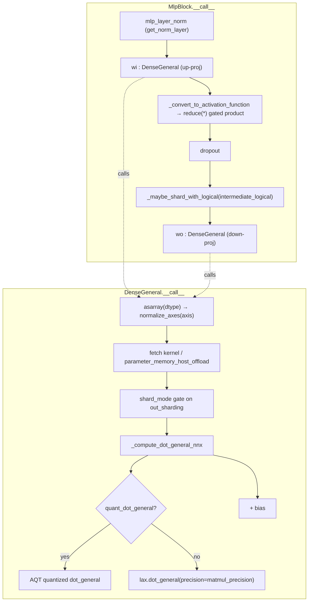

# MaxText linear layers: DenseGeneral & MlpBlock

Every dense matmul in a MaxText transformer — QKV/attention-output projections, MLP up/down projections, the final logits head — is one `DenseGeneral` layer, and the feed-forward network is one `MlpBlock` built from two or more of them. The design idea is a *single, axis-general* linear primitive that contracts over an arbitrary tuple of input axes against a kernel whose logical axes are annotated for sharding, so the same class serves a `[B,S,E] → [B,S,N,H]` fused-head projection and a plain `[·,E] → [·,F]` MLP layer without special-casing. Everything a TPU perf loop cares about — matmul precision, AQT quantization, kernel/output sharding, weight-vs-compute dtype, and host-offload of the weight — is a constructor knob on `DenseGeneral` that flows into a single `lax.dot_general` call.

## Diagram

## Design rationale (why it's built this way)

The class docstring for [`DenseGeneral`](../catalog/src/maxtext/layers/linears.md#DenseGeneral) is deliberately terse — *"A linear transformation with flexible axes"* — and that flexibility is the whole point. Rather than a `Dense` for MLPs and a separate `DenseHeads` for attention, MaxText parameterizes one layer by an `axis` tuple of input dims to contract and an `out_features_shape` tuple of output dims to materialize. The kernel is simply `in_features_shape + out_features_shape` ([`kernel`](../catalog/src/maxtext/layers/linears.md#DenseGeneral.kernel)), so a projection that maps embedding → (heads, head_dim) is expressed by an `out_features_shape` of length 2, and the contraction still resolves to a single `dot_general`.

Weight storage dtype and compute dtype are split into two fields — [`weight_dtype`](../catalog/src/maxtext/layers/linears.md#DenseGeneral.weight_dtype) and [`dtype`](../catalog/src/maxtext/layers/linears.md#DenseGeneral.dtype) — so a model can keep master weights in fp32/bf16 while casting inputs and kernel to the compute dtype at call time. This is a perf lever: it decouples HBM footprint of the parameter from the matmul's arithmetic width.

> [!inferred]
> `DenseGeneral` reads as a hard fork of Flax's `linen.DenseGeneral`, reworked to (a) be an `nnx.Module`, (b) carry MaxText's logical-axis sharding metadata on the kernel, and (c) route through an AQT-aware dot_general. The forked [`Dropout`](../catalog/src/maxtext/layers/linears.md#Dropout) in the same module (*"Forked nnx.Dropout that is easier to use with bridge"*) confirms the file's pattern of forking Flax primitives to interoperate with the nnx↔linen bridge.

## Entry points

- [`__call__`](../catalog/src/maxtext/layers/linears.md#DenseGeneral.__call__) — the `DenseGeneral` forward. Control reaches it once per projection every forward step; it validates input-feature shapes, fetches the kernel, resolves output sharding, and dispatches the matmul. This is the single choke point where `matmul_precision`, `quant`, `shard_mode`, and `parameter_memory_host_offload` all take effect.
- [`__call__`](../catalog/src/maxtext/layers/linears.md#MlpBlock.__call__) — the transformer FFN forward (*"Applies Transformer MlpBlock module."*). Reached once per decoder layer; it wires optional pre-norm, one or more up-projections, a gated activation, dropout, an intermediate re-shard, and the down-projection.
- [`_compute_dot_general_nnx`](../catalog/src/maxtext/layers/linears.md#_compute_dot_general_nnx) — the free function that actually issues the contraction (*"Computes a dot_general operation that may be quantized."*). It is the fork in the road between plain `lax.dot_general` and the AQT quantized path, and where `lax.Precision` is applied.

## Mechanism (step-by-step)

1. **Assemble the block once at construction.** `MlpBlock` decides its shape from config: with `fused_mlp` it builds a single up-projection [`wi`](../catalog/src/maxtext/layers/linears.md#MlpBlock.wi) whose `out_features_shape` is `(num_activations, intermediate_dim)`; otherwise it builds one `DenseGeneral` per activation (`wi`, `wi_1`, …). The down-projection [`wo`](../catalog/src/maxtext/layers/linears.md#MlpBlock.wo) maps `intermediate_dim → in_features`. Each carries logical `kernel_axes` (`("embed","mlp")` for `wi`, `("mlp","embed")` for `wo`) so the two matmuls shard complementarily across the mesh.

2. **Optional pre-norm.** On entry to [`__call__`](../catalog/src/maxtext/layers/linears.md#MlpBlock.__call__), if a norm was configured the input is normalized by [`mlp_layer_norm`](../catalog/src/maxtext/layers/linears.md#MlpBlock.mlp_layer_norm). Which norm class is chosen is decided at build time by [`get_norm_layer`](../catalog/src/maxtext/layers/linears.md#MlpBlock.get_norm_layer): RMSNorm for the Llama/Mistral/Gemma/Qwen/DeepSeek decoder families, `Gpt3LayerNorm` for the GPT-3 block. This is a `use_pre_norm`-gated ([`use_pre_norm`](../catalog/src/maxtext/layers/linears.md#MlpBlock.use_pre_norm)) branch, so `mlp_layer_norm` is `None` when the surrounding decoder already normalizes.

3. **Up-projection and gated activation.** For each entry in [`activations`](../catalog/src/maxtext/layers/linears.md#MlpBlock.activations) the block runs the corresponding up-projection and applies the activation resolved by [`_convert_to_activation_function`](../catalog/src/maxtext/layers/linears.md#_convert_to_activation_function) — which special-cases `"linear"` (identity) and DeepSeek's `"sqrtsoftplus"`, else looks the name up on `flax.linen`. The intermediate activations are then combined by an elementwise product (`reduce(operator.mul, …)`), which is how gated-GELU / SwiGLU is expressed; a single-activation MLP degenerates to one factor. The intermediate is optionally upcast to fp32 (`activations_in_float32`) before the activation for numerical headroom.

4. **Dropout, re-shard, down-projection.** The gated intermediate is passed through [`dropout`](../catalog/src/maxtext/layers/linears.md#MlpBlock.dropout) (the forked [`Dropout`](../catalog/src/maxtext/layers/linears.md#Dropout), broadcasting along the length axis via `broadcast_dims=(-2,)`), then re-annotated to the logical layout [`intermediate_logical`](../catalog/src/maxtext/layers/linears.md#MlpBlock.intermediate_logical) — `("activation_batch", "activation_length"/"prefill_activation_length", "activation_mlp")` depending on [`model_mode`](../catalog/src/maxtext/layers/linears.md#MlpBlock.model_mode) — by [`_maybe_shard_with_logical`](../catalog/src/maxtext/layers/linears.md#MlpBlock._maybe_shard_with_logical). Finally [`wo`](../catalog/src/maxtext/layers/linears.md#MlpBlock.wo) contracts the intermediate back to model width. (The source wraps `wi`/`wo` outputs in `checkpoint_name("mlpwi"/"mlpwo")` markers so the rematerialization policy can name these tensors.)

5. **Inside DenseGeneral: cast, validate, canonicalize axes.** [`__call__`](../catalog/src/maxtext/layers/linears.md#DenseGeneral.__call__) first casts the input to [`dtype`](../catalog/src/maxtext/layers/linears.md#DenseGeneral.dtype), then converts the possibly-negative contraction [`axis`](../catalog/src/maxtext/layers/linears.md#DenseGeneral.axis) to non-negative indices via [`normalize_axes`](../catalog/src/maxtext/layers/linears.md#normalize_axes) and checks each contracted input dim against [`in_features_shape`](../catalog/src/maxtext/layers/linears.md#DenseGeneral.in_features_shape). Both `axis` and the feature-shape tuples were normalized to tuples at construction by [`canonicalize_tuple`](../catalog/src/maxtext/layers/linears.md#canonicalize_tuple), which is what lets a scalar `axis=-1` and a multi-axis tuple share one code path.

6. **Fetch the kernel — with host-offload and serve-mode branches.** In AQT serve mode the kernel is replaced by a zeros placeholder of shape `in_features_shape + out_features_shape` (the real weights live in the quantized dot_general). Otherwise the kernel [`kernel`](../catalog/src/maxtext/layers/linears.md#DenseGeneral.kernel) is read, and if [`parameter_memory_host_offload`](../catalog/src/maxtext/layers/linears.md#DenseGeneral.parameter_memory_host_offload) is set it is `jax.device_put` back to device space on demand — the mechanism that lets a large weight (e.g. the logits head) live in host memory between steps and stream to HBM only for its matmul. The kernel is then cast to `dtype`, realizing the weight-dtype/compute-dtype split.

7. **Resolve output sharding by shard_mode.** [`shard_mode`](../catalog/src/maxtext/layers/linears.md#DenseGeneral.shard_mode) gates the caller-supplied `out_sharding`: unless it is `ShardMode.EXPLICIT`, `out_sharding` is forced to `None` so XLA's auto-sharding chooses the output layout. Only in explicit mode does the `NamedSharding` reach `dot_general`, giving hand-placed output partitioning where wanted.

8. **Dispatch the matmul.** The contraction is issued by [`_compute_dot_general_nnx`](../catalog/src/maxtext/layers/linears.md#_compute_dot_general_nnx) with dimension numbers `((norm_axis, contract_ind), ((), ()))` — contract the input's `axis` against the kernel's leading dims, no batch dims. If a quantized dot_general is present ([`quant_dot_general`](../catalog/src/maxtext/layers/linears.md#DenseGeneral.quant_dot_general), resolved from the AQT wrapper named by [`_quant_dot_general_name`](../catalog/src/maxtext/layers/linears.md#DenseGeneral._quant_dot_general_name)) it runs the AQT path (mutating the `"aqt"` collection, `precision=None`); otherwise it calls `lax.dot_general` with `precision=lax.Precision(matmul_precision)` from [`matmul_precision`](../catalog/src/maxtext/layers/linears.md#DenseGeneral.matmul_precision). This is the exact line where bf16-vs-fp32 matmul precision and int8/fp8 quantization are decided per layer.

9. **Add bias.** If [`bias`](../catalog/src/maxtext/layers/linears.md#DenseGeneral.bias) exists (built only when [`use_bias`](../catalog/src/maxtext/layers/linears.md#DenseGeneral.use_bias) is set), it is cast to `dtype` and added. Most decoder MLPs run bias-free, so this is usually a no-op branch.

## Key data structures

- **Kernel** ([`kernel`](../catalog/src/maxtext/layers/linears.md#DenseGeneral.kernel)) — an `nnx.Param` of shape `in_features_shape + out_features_shape`, tagged with logical [`kernel_axes`](../catalog/src/maxtext/layers/linears.md#DenseGeneral.kernel_axes) (`sharding=self.kernel_axes`). The logical names, not raw mesh axes, are what make a technique transfer across the variant matrix.
- **Quant handle** — [`quant`](../catalog/src/maxtext/layers/linears.md#DenseGeneral.quant) (an `AqtQuantization | None`) plus the lazily-built AQT module reachable through [`quant_dot_general`](../catalog/src/maxtext/layers/linears.md#DenseGeneral.quant_dot_general) / [`_quant_dot_general_name`](../catalog/src/maxtext/layers/linears.md#DenseGeneral._quant_dot_general_name). `None` means the plain `lax.dot_general` path.
- **Precision & dtype triple** — [`matmul_precision`](../catalog/src/maxtext/layers/linears.md#DenseGeneral.matmul_precision) (string → `lax.Precision`), [`weight_dtype`](../catalog/src/maxtext/layers/linears.md#DenseGeneral.weight_dtype), [`dtype`](../catalog/src/maxtext/layers/linears.md#DenseGeneral.dtype). Together they set arithmetic width independent of storage width.
- **MlpBlock shape** — [`intermediate_dim`](../catalog/src/maxtext/layers/linears.md#MlpBlock.intermediate_dim), [`activations`](../catalog/src/maxtext/layers/linears.md#MlpBlock.activations), [`intermediate_dropout_rate`](../catalog/src/maxtext/layers/linears.md#MlpBlock.intermediate_dropout_rate), and the [`config`](../catalog/src/maxtext/layers/linears.md#MlpBlock.config) that decides `fused_mlp` and dtypes.

## Dynamics (design intent)

The AQT wrapper is *initialized eagerly* at construction: when `quant` is set, the `__init__` runs the layer once on dummy inputs with `_initializing=True` so the quantized dot_general can allocate its calibration/scale state. Correspondingly, [`_compute_dot_general_nnx`](../catalog/src/maxtext/layers/linears.md#_compute_dot_general_nnx) branches on `initializing` to call `lazy_init` before the first real quantized call. So the quantization state is provisioned before step 0, not on the hot path.

The two MLP kernels carry mirror-image logical axes (`("embed","mlp")` on `wi`, `("mlp","embed")` on `wo`); the intent, readable from [`intermediate_logical`](../catalog/src/maxtext/layers/linears.md#MlpBlock.intermediate_logical) and the `_maybe_shard_with_logical` re-annotation, is that the intermediate is sharded on the `mlp` axis between the two matmuls so the up- and down-projections tile the same way and the reduction happens where the data already lives.

## Edge cases

- **AQT serve mode** takes a distinct path in `DenseGeneral.__call__`: no real `kernel` is read; a zeros placeholder stands in while the quantized dot_general holds the weights. A reader tracing memory should not expect the fp kernel to be resident in serve mode.
- **Auto vs explicit sharding**: passing an `out_sharding` has *no effect* unless [`shard_mode`](../catalog/src/maxtext/layers/linears.md#DenseGeneral.shard_mode) is `EXPLICIT` — it is silently nulled otherwise. Same gate applies inside `MlpBlock` for `intermediate_sharding`/`out_sharding`.
- **Fused vs unfused MLP** change the parameter tree: `fused_mlp` yields a single rank-extended `wi`; otherwise separate `wi`/`wi_1` modules. Checkpoints and sharding rules must match the chosen form.
- **Bias axes** are sliced from the tail of `kernel_axes` (`bias_axes = kernel_axes[-len(out_features_shape):]`), so a mismatched `kernel_axes` length silently mis-shards the bias.

## Open questions

- The `maybe_shard_with_logical` target of [`_maybe_shard_with_logical`](../catalog/src/maxtext/layers/linears.md#MlpBlock._maybe_shard_with_logical) and the `checkpoint_name`/`variable_to_logically_partitioned` helpers used around the matmuls are outside this packet's subgraph — their exact remat and logical→mesh mapping behavior would need the sharding/quantization modules to confirm.
- The concrete AQT `dot_general_cls` (int8 vs fp8/MXFP8 block scaling) is chosen inside the quantization module, not here; the `block_size` hint (`get_block_size`) suggests TE MXFP8 support but the packet does not expose that class.

## See also

- [MaxText embeddings: token lookup & rotary position](maxtext-layers-embeddings.md) — the other half of the pre-attention path; shares the `parameter_memory_host_offload` / device-space pattern and `ShardMode` gating.
