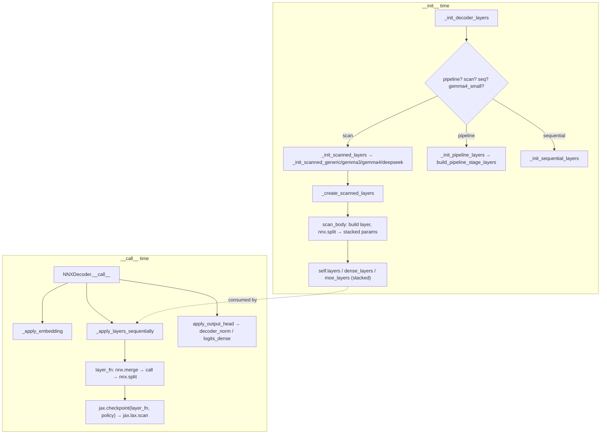

# MaxText NNX decoder stack — eager layer build, scanned init, and jax.checkpoint remat

## Overview
`nnx_decoders.py` is the **Flax NNX** port of the same decoder documented in [the Linen stack](maxtext-layers-decoders.md). It computes the identical function but inverts *when* work happens: because NNX is stateful and eager, the layer stack is constructed at `__init__` time by [`_init_decoder_layers`](../catalog/src/maxtext/layers/nnx_decoders.md#NNXDecoder._init_decoder_layers) — not lazily inside `__call__`. The key idea unique to NNX is [`_create_scanned_layers`](../catalog/src/maxtext/layers/nnx_decoders.md#NNXDecoder._create_scanned_layers): rather than instantiating N layer objects (which would blow up host memory and init time), it builds *one* reference layer, then uses `jax.lax.scan` over per-layer RNG states to produce a single **stacked** parameter pytree with a leading layers axis. At forward time, [`_apply_layers_sequentially`](../catalog/src/maxtext/layers/nnx_decoders.md#NNXDecoder._apply_layers_sequentially) splits that stacked module and replays it with a second `jax.lax.scan`, wrapping the per-iteration body in `jax.checkpoint` for rematerialization. So the Linen `nn.scan` + `nn.remat` module transforms become two explicit, hand-rolled `jax.lax.scan` passes — one for init, one for apply — which is the central Linen↔NNX divergence.

## Diagram

## Design rationale (why it's built this way)
NNX has no `nn.compact`: a module's submodules must exist as real Python attributes before `__call__` runs. Naively that means N layer instances for an N-layer model — unacceptable for a 100-layer model at init. [`_create_scanned_layers`](../catalog/src/maxtext/layers/nnx_decoders.md#NNXDecoder._create_scanned_layers) solves this exactly as its docstring states — "Creates a scanned stack of layers using jax.lax.scan for memory-efficient initialization." It builds one `ref_layer` to capture the `graphdef`, deletes it, then runs [`scan_body`](../catalog/src/maxtext/layers/nnx_decoders.md#NNXDecoder.scan_body) inside `jax.lax.scan` over forked RNG states; each iteration constructs a layer, `nnx.split`s out its `Param`s, and returns only the params. The result is a stacked param tensor `[num_layers, ...]` produced without ever holding N live modules — the NNX analogue of what `nn.scan` does implicitly at init in Linen.

The apply side mirrors this. [`_apply_layers_sequentially`](../catalog/src/maxtext/layers/nnx_decoders.md#NNXDecoder._apply_layers_sequentially) `nnx.split`s the stacked module into `graphdef` + stacked `params`/`state`, defines [`layer_fn`](../catalog/src/maxtext/layers/nnx_decoders.md#NNXDecoder.layer_fn) which `nnx.merge`s the graphdef with a *single slice* of params back into a live layer, calls it, and `nnx.split`s the mutated state back out. That closure is then wrapped: `layer_fn_wrapped = jax.checkpoint(layer_fn, policy=policy, prevent_cse=prevent_cse)` before being handed to `jax.lax.scan`. This is the deliberate divergence from Linen: **remat is applied to a plain function via `jax.checkpoint`, not to a module class via `nn.remat`.** The policy itself, however, is chosen identically — [`get_remat_policy`](../catalog/src/maxtext/layers/nnx_decoders.md#NNXDecoder.get_remat_policy) and [`minimal_policy`](../catalog/src/maxtext/layers/nnx_decoders.md#NNXDecoder.minimal_policy) are line-for-line ports of the Linen versions.

> [!inferred]
> The manual `nnx.split`/`nnx.merge` dance in `layer_fn` exists because `jax.lax.scan` requires pure functions over arrays, but NNX modules are stateful objects. Splitting to a `graphdef` (static) + `State` (arrays) is the bridge that makes a stateful NNX layer scannable — the moral equivalent of Flax's variable-collection machinery, done by hand.

## Entry points
- [`__call__`](../catalog/src/maxtext/layers/nnx_decoders.md#NNXDecoder.__call__) — the forward pass. Unlike Linen it does **not** build or remat layers here (they already exist as `self.layers` etc.); it embeds via [`_apply_embedding`](../catalog/src/maxtext/layers/nnx_decoders.md#NNXDecoder._apply_embedding), picks the policy via [`get_remat_policy`](../catalog/src/maxtext/layers/nnx_decoders.md#NNXDecoder.get_remat_policy), then dispatches on `is_gemma4_small` / `is_gemma4` / `is_deepseek` / `cfg.scan_layers` / `pipeline_module` to run the pre-built stack, and ends in [`apply_output_head`](../catalog/src/maxtext/layers/nnx_decoders.md#NNXDecoder.apply_output_head).
- [`_init_decoder_layers`](../catalog/src/maxtext/layers/nnx_decoders.md#NNXDecoder._init_decoder_layers) — reached once from `__init__`. Its docstring names the three routes exactly: "pipeline, scanned non-pipeline, sequential" (plus a gemma4-small special case). It reads `is_gemma4_small`, `using_pipeline_parallelism`, and `scan_layers` off config to pick [`_init_pipeline_layers`](../catalog/src/maxtext/layers/nnx_decoders.md#NNXDecoder._init_pipeline_layers), [`_init_scanned_layers`](../catalog/src/maxtext/layers/nnx_decoders.md#NNXDecoder._init_scanned_layers), [`_init_sequential_layers`](../catalog/src/maxtext/layers/nnx_decoders.md#NNXDecoder._init_sequential_layers), or [`_init_gemma4_small_layers`](../catalog/src/maxtext/layers/nnx_decoders.md#NNXDecoder._init_gemma4_small_layers).
- [`_get_pipeline_stage_module`](../catalog/src/maxtext/layers/nnx_decoders.md#NNXDecoder._get_pipeline_stage_module) — reached via [`build_pipeline_stage_layers`](../catalog/src/maxtext/layers/nnx_decoders.md#NNXDecoder.build_pipeline_stage_layers) during pipeline init; returns a single [`_create_single_layer`](../catalog/src/maxtext/layers/nnx_decoders.md#NNXDecoder._create_single_layer), an `NNXScannedPipelineStage`, or an `NNXSequentialPipelineStage` per `num_layers_per_pipeline_stage` / `scan_layers_per_stage`, using [`is_deepseek`](../catalog/src/maxtext/layers/nnx_decoders.md#NNXDecoder.is_deepseek) to select the sparse block.

## Mechanism (step-by-step)
1. **Route the build (`__init__`).** [`_init_decoder_layers`](../catalog/src/maxtext/layers/nnx_decoders.md#NNXDecoder._init_decoder_layers) picks one of four construction paths. `is_gemma4_small` short-circuits first and *raises* if pipeline or scan is requested, since its per-layer KV-donor threading is inexpressible under scan.
2. **Scanned init (memory-efficient).** For the common scan path, [`_init_scanned_layers`](../catalog/src/maxtext/layers/nnx_decoders.md#NNXDecoder._init_scanned_layers) fans out by architecture — [`_init_scanned_generic`](../catalog/src/maxtext/layers/nnx_decoders.md#NNXDecoder._init_scanned_generic), [`_init_scanned_gemma3`](../catalog/src/maxtext/layers/nnx_decoders.md#NNXDecoder._init_scanned_gemma3), [`_init_scanned_gemma4`](../catalog/src/maxtext/layers/nnx_decoders.md#NNXDecoder._init_scanned_gemma4), [`_init_scanned_deepseek`](../catalog/src/maxtext/layers/nnx_decoders.md#NNXDecoder._init_scanned_deepseek) — each of which calls [`_create_scanned_layers`](../catalog/src/maxtext/layers/nnx_decoders.md#NNXDecoder._create_scanned_layers) to produce the stacked module(s) it stores. DeepSeek splits into [`dense_layers`](../catalog/src/maxtext/layers/nnx_decoders.md#NNXDecoder.dense_layers) and [`moe_layers`](../catalog/src/maxtext/layers/nnx_decoders.md#NNXDecoder.moe_layers) ([`_init_scanned_deepseek_standard`](../catalog/src/maxtext/layers/nnx_decoders.md#NNXDecoder._init_scanned_deepseek_standard)); Gemma3/Gemma4 store both a scanned [`layers`](../catalog/src/maxtext/layers/nnx_decoders.md#NNXDecoder.layers) stack and a separate [`layers_remainder`](../catalog/src/maxtext/layers/nnx_decoders.md#NNXDecoder.layers_remainder) for the `% pattern_len` tail.
3. **Build the stacked params.** Inside [`_create_scanned_layers`](../catalog/src/maxtext/layers/nnx_decoders.md#NNXDecoder._create_scanned_layers), RNGs are `fork(split=length)`, a `ref_layer` yields the reusable `graphdef`, and [`scan_body`](../catalog/src/maxtext/layers/nnx_decoders.md#NNXDecoder.scan_body) is scanned over the per-layer RNG states: each call constructs a layer with `config`/`mesh`/`quant`/`model_mode`, `nnx.split`s out its `Param`s, and returns them, so `jax.lax.scan` collects a `[length, ...]` stacked param pytree. If `param_scan_axis != 0` the axis is moved afterward.
4. **Sequential / pipeline init (the other paths).** [`_init_sequential_layers`](../catalog/src/maxtext/layers/nnx_decoders.md#NNXDecoder._init_sequential_layers) ([`_init_sequential_generic`](../catalog/src/maxtext/layers/nnx_decoders.md#NNXDecoder._init_sequential_generic) / [`_init_sequential_deepseek`](../catalog/src/maxtext/layers/nnx_decoders.md#NNXDecoder._init_sequential_deepseek)) creates real per-index layers for the unscanned case. [`_init_pipeline_layers`](../catalog/src/maxtext/layers/nnx_decoders.md#NNXDecoder._init_pipeline_layers) builds the pipeline module and any outside-pipeline residual layers ([`layers_outside_pipeline`](../catalog/src/maxtext/layers/nnx_decoders.md#NNXDecoder.layers_outside_pipeline) / [`moe_layers_outside_pipeline`](../catalog/src/maxtext/layers/nnx_decoders.md#NNXDecoder.moe_layers_outside_pipeline)), registering unscanned ones by name via [`_create_and_register_named_layer`](../catalog/src/maxtext/layers/nnx_decoders.md#NNXDecoder._create_and_register_named_layer) and counting them in [`num_layers_outside_pipeline`](../catalog/src/maxtext/layers/nnx_decoders.md#NNXDecoder.num_layers_outside_pipeline).
5. **Embed (`__call__`).** [`_apply_embedding`](../catalog/src/maxtext/layers/nnx_decoders.md#NNXDecoder._apply_embedding) runs the shared embedding and (via the pre-built [`position_embedder`](../catalog/src/maxtext/layers/nnx_decoders.md#NNXDecoder.position_embedder) and [`dropout`](../catalog/src/maxtext/layers/nnx_decoders.md#NNXDecoder.dropout)) produces `y`, merging multimodal embeddings when present.
6. **Apply the scanned stack.** [`_apply_layers_sequentially`](../catalog/src/maxtext/layers/nnx_decoders.md#NNXDecoder._apply_layers_sequentially) is the workhorse. It `nnx.split`s the stacked module, chooses the policy from [`get_remat_policy`](../catalog/src/maxtext/layers/nnx_decoders.md#NNXDecoder.get_remat_policy), filters kwargs against the layer signature, defines [`layer_fn`](../catalog/src/maxtext/layers/nnx_decoders.md#NNXDecoder.layer_fn) (merge one param slice → call → split state back), wraps it as `jax.checkpoint(layer_fn, policy=policy, prevent_cse=...)`, and runs `jax.lax.scan(layer_fn_wrapped, x_in, (params, state))`. Scan metadata is added/removed around the boundary (see [`_add_scan_metadata`](../catalog/src/maxtext/layers/nnx_decoders.md#NNXDecoder._add_scan_metadata)) so the stacked layers dimension carries its logical sharding name.
7. **Gemma block application.** [`_apply_gemma3_scanned_blocks`](../catalog/src/maxtext/layers/nnx_decoders.md#NNXDecoder._apply_gemma3_scanned_blocks) / [`_apply_gemma4_scanned_blocks`](../catalog/src/maxtext/layers/nnx_decoders.md#NNXDecoder._apply_gemma4_scanned_blocks) drive `_apply_layers_sequentially` over the `layers` stack for the `scan_length = num_decoder_layers // pattern_len` full blocks, then handle the remainder layers with a hand-written pure closure [`pure_gemma_fn`](../catalog/src/maxtext/layers/nnx_decoders.md#NNXDecoder.pure_gemma_fn) over [`layers_remainder`](../catalog/src/maxtext/layers/nnx_decoders.md#NNXDecoder.layers_remainder).
8. **Engram interleaving.** [`_apply_interleaved_scanned_layers`](../catalog/src/maxtext/layers/nnx_decoders.md#NNXDecoder._apply_interleaved_scanned_layers) alternates scanned chunks and single Engram layers using [`_find_next_boundary`](../catalog/src/maxtext/layers/nnx_decoders.md#NNXDecoder._find_next_boundary) and [`_apply_scanned_chunk`](../catalog/src/maxtext/layers/nnx_decoders.md#NNXDecoder._apply_scanned_chunk) (which slices a sub-range of the stacked state and feeds it to `_apply_layers_sequentially`); the init-side counterpart is [`_init_scanned_deepseek_engram`](../catalog/src/maxtext/layers/nnx_decoders.md#NNXDecoder._init_scanned_deepseek_engram).
9. **Gemma4-small path.** [`_apply_gemma4_small_layers`](../catalog/src/maxtext/layers/nnx_decoders.md#NNXDecoder._apply_gemma4_small_layers) runs the pre-built [`per_layer_embedder`](../catalog/src/maxtext/layers/nnx_decoders.md#NNXDecoder.per_layer_embedder) and its distinct per-index layers ([`layers`](../catalog/src/maxtext/layers/nnx_decoders.md#NNXDecoder.layers)) in an explicit loop (pure-NNX, no scan/pipeline).
10. **Output head.** [`apply_output_head`](../catalog/src/maxtext/layers/nnx_decoders.md#NNXDecoder.apply_output_head) applies the pre-instantiated [`decoder_norm`](../catalog/src/maxtext/layers/nnx_decoders.md#NNXDecoder.decoder_norm) and [`dropout`](../catalog/src/maxtext/layers/nnx_decoders.md#NNXDecoder.dropout), then projects with the shared embedding table or the pre-built [`logits_dense`](../catalog/src/maxtext/layers/nnx_decoders.md#NNXDecoder.logits_dense), with explicit `activation_vocab` sharding — where Linen instead builds these modules inline inside the `@nn.compact` head.

## Key data structures
- **Module fields** [`config`](../catalog/src/maxtext/layers/nnx_decoders.md#NNXDecoder.config), [`mesh`](../catalog/src/maxtext/layers/nnx_decoders.md#NNXDecoder.mesh), [`quant`](../catalog/src/maxtext/layers/nnx_decoders.md#NNXDecoder.quant), [`model_mode`](../catalog/src/maxtext/layers/nnx_decoders.md#NNXDecoder.model_mode) — assigned in `__init__` and threaded into every layer construction.
- **Cached architecture predicates** [`is_deepseek`](../catalog/src/maxtext/layers/nnx_decoders.md#NNXDecoder.is_deepseek), [`is_gemma3`](../catalog/src/maxtext/layers/nnx_decoders.md#NNXDecoder.is_gemma3), [`is_gemma4`](../catalog/src/maxtext/layers/nnx_decoders.md#NNXDecoder.is_gemma4), [`is_gemma4_small`](../catalog/src/maxtext/layers/nnx_decoders.md#NNXDecoder.is_gemma4_small) — precomputed booleans that drive both init-time and call-time dispatch, so the same branch decision is reused rather than re-derived from config.
- **Stacked layer attributes** [`layers`](../catalog/src/maxtext/layers/nnx_decoders.md#NNXDecoder.layers), [`layers_remainder`](../catalog/src/maxtext/layers/nnx_decoders.md#NNXDecoder.layers_remainder), [`dense_layers`](../catalog/src/maxtext/layers/nnx_decoders.md#NNXDecoder.dense_layers), [`moe_layers`](../catalog/src/maxtext/layers/nnx_decoders.md#NNXDecoder.moe_layers), [`layers_outside_pipeline`](../catalog/src/maxtext/layers/nnx_decoders.md#NNXDecoder.layers_outside_pipeline), [`moe_layers_outside_pipeline`](../catalog/src/maxtext/layers/nnx_decoders.md#NNXDecoder.moe_layers_outside_pipeline) — each is a single NNX module whose params carry a leading `[num_layers, ...]` axis; these are what `_apply_layers_sequentially` scans over.
- **Pre-built head modules** [`decoder_norm`](../catalog/src/maxtext/layers/nnx_decoders.md#NNXDecoder.decoder_norm), [`logits_dense`](../catalog/src/maxtext/layers/nnx_decoders.md#NNXDecoder.logits_dense), [`position_embedder`](../catalog/src/maxtext/layers/nnx_decoders.md#NNXDecoder.position_embedder), [`dropout`](../catalog/src/maxtext/layers/nnx_decoders.md#NNXDecoder.dropout) — constructed once at init (contrast Linen's inline construction), reflecting NNX's eager-submodule model.

## Dynamics (design intent)
Two `jax.lax.scan`s bracket a layer's life: one at init to *materialize* stacked params without N live modules, one at apply to *run* them with `jax.checkpoint` rematerialization. This split is the reason NNX init can be as cheap as Linen's despite eager submodules. The `param_scan_axis` handling (moveaxis on both split and merge) keeps the stacked weight tensor's layout consistent for the partitioner. The `prevent_cse` flag passed into `jax.checkpoint` guards against XLA common-subexpression-eliminating the recompute away — the same concern as Linen's `nn.remat(prevent_cse=...)`.

## Edge cases
- **vLLM KV caches force loop unrolling.** [`_apply_layers_sequentially`](../catalog/src/maxtext/layers/nnx_decoders.md#NNXDecoder._apply_layers_sequentially) contains an explicit non-scan branch: when `kv_caches_stacked` is provided it runs a Python `for` loop instead of `jax.lax.scan`, because stacking the KV list creates a copy and breaks the in-place memory updates PagedAttention requires. This is a perf-relevant fork with no Linen analogue in this subgraph.
- **Gemma4-small raises under scan/pipeline** — [`_init_decoder_layers`](../catalog/src/maxtext/layers/nnx_decoders.md#NNXDecoder._init_decoder_layers) rejects the combination outright.
- **DeepSeek + Engram + pipeline is unsupported** — asserted in [`_init_pipeline_layers`](../catalog/src/maxtext/layers/nnx_decoders.md#NNXDecoder._init_pipeline_layers); engram interleaving is only implemented on the non-pipeline path.
- **`length == 0` fast paths** — both [`_create_scanned_layers`](../catalog/src/maxtext/layers/nnx_decoders.md#NNXDecoder._create_scanned_layers) (returns `None`) and `_apply_layers_sequentially` short-circuit empty stacks; downstream code must null-check the stacked attribute (`hasattr`/`is not None`).
- **`dynamic_graph_init`** — when quant-stat updates are disabled, `layer_fn` re-splits with a fresh graphdef each iteration; the stacked-state reconstruction path differs, a subtle correctness fork.

## Open questions
- The precise semantics of `nnx_remove_scan_axis` / `nnx_add_scan_axis` / `nnx_ensure_scan_leading_axis` (in `maxtext_utils_nnx`, out of subgraph) that reconcile metadata rank around the scan boundary are not resolvable from this file alone.
- Whether the eager init's stacked-param build materializes params on device or host before sharding — and how that interacts with `parameter_memory_host_offload`'s per-slice `device_put` inside `layer_fn` — is not fully determined here.
- The exact equivalence guarantee between this NNX stack and the Linen stack (bit-identical logits) is asserted by tests outside this subgraph, not provable from the source shown.

## See also
- [MaxText Linen decoder stack](maxtext-layers-decoders.md) — the `nn.compact` original: lazy layer build, `nn.scan` + `nn.remat` module transforms, inline output head. The two files share `get_remat_policy`/`minimal_policy` verbatim but diverge on where layers are built and how scan/remat are expressed.

## Sources
- raw/code/maxtext/src/maxtext/layers/nnx_decoders.py @ `fcb7ebeba9ecfc67d79e471f50c16c9d89b3263d`
