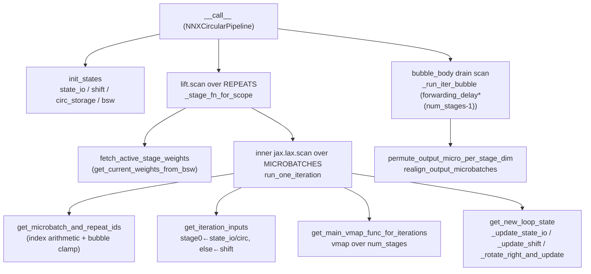

# MaxText pipeline parallelism (NNX)

## Overview
`src/maxtext/layers/pipeline.py` is MaxText's active (flax **NNX**) pipeline-parallelism layer. It takes a single decoder-layer body and turns it into a **GPipe/circular pipeline**: the global batch is reshaped into `num_pipeline_microbatches` microbatches, the model's layers are split into `num_stages` pipeline stages sharded along a `"stage"` mesh axis, and a software loop pushes microbatches through the stages one hop per iteration. Every loop iteration is `vmap`ped over the stage axis so all stages run *the same code* on different microbatches simultaneously — a real pipeline emerges only because the `"stage"` axis is physically sharded across devices. The file ships two implementations sharing a common [`PipelineBase`](../catalog/src/maxtext/layers/pipeline.md#PipelineBase.__init__): the simple [`NNXPipeline`](../catalog/src/maxtext/layers/pipeline.md#NNXPipeline.__call__) (one flat scan, weights resident) and the performance-oriented [`NNXCircularPipeline`](../catalog/src/maxtext/layers/pipeline.md#NNXCircularPipeline.__call__), which adds a **Buffer Sliding Window (BSW)** that all-gathers the *next* repeat's FSDP-sharded weights while the *current* repeat computes, hiding the collective behind matmul time.

The single hardest idea to hold: the schedule is a *buffer-rotation* machine, not an explicit stage graph. Which microbatch a stage works on, and where its output lands, is entirely determined by index arithmetic over `loop_iteration` plus a fixed set of `ppermute`-based buffer rotations. The "bubble" is not special-cased inside the loop — it falls out of the arithmetic (`get_microbatch_and_repeat_ids` clamps at 0 for not-yet-started stages) and is drained by running `forwarding_delay * (num_stages - 1)` extra iterations at the end.

## Diagram

## Design rationale (why it's built this way)

**Vmap-over-stages instead of an explicit per-stage graph.** All stages execute identical traced code; the only thing that differs is the data slice each holds. [`get_main_vmap_func_for_iterations`](../catalog/src/maxtext/layers/pipeline.md#NNXCircularPipeline.get_main_vmap_func_for_iterations) vmaps the body over `num_stages` and passes [`spmd_axis_name`](../catalog/src/maxtext/layers/pipeline.md#PipelineBase.spmd_axis_name) = `"stage"` so XLA maps the vmapped axis onto the sharded mesh axis. This keeps a single compiled kernel for the whole pipeline and lets XLA overlap the cross-stage `ppermute` (the "shift") with the stage matmuls.

**The bubble is arithmetic, not a branch.** [`get_microbatch_and_repeat_ids`](../catalog/src/maxtext/layers/pipeline.md#PipelineBase.get_microbatch_and_repeat_ids) computes `microbatches_processed = max(loop_iteration - forwarding_delay*arange(num_stages), 0)`. Stage `s` is `forwarding_delay*s` iterations behind stage 0, so early in the run the trailing stages clamp to microbatch 0 (they are in the fill bubble) and late in the run they run past the real work (drain bubble). No stage is ever idle in the SPMD sense — it just recomputes microbatch 0's slice — but those results are discarded, which is the throughput cost of the bubble. [`forwarding_delay`](../catalog/src/maxtext/layers/pipeline.md#PipelineBase.forwarding_delay) is `2` when `pipeline_delay_activation_forwarding` is set (one extra hop to let the activation send overlap), doubling the bubble; else `1`.

**Circular (interleaved) stages shrink the bubble.** With `num_pipeline_repeats > 1`, each physical stage owns *several* non-contiguous layer groups, and a microbatch traverses the whole device set `num_repeats` times. The bubble `forwarding_delay*(num_stages-1)` is fixed regardless of repeats, so amortizing it over `num_microbatches * num_repeats` real iterations drives the bubble fraction down — the core reason [`NNXCircularPipeline`](../catalog/src/maxtext/layers/pipeline.md#NNXCircularPipeline.__call__) exists.

**BSW async weight prefetch hides the FSDP all-gather.** Under FSDP the per-stage weights are sharded and must be all-gathered before use. Rather than gather on the critical path each repeat, the circular pipeline keeps a two-slot buffer (`w_curr`, `w_next`) and, inside [`_stage_fn_for_scope`](../catalog/src/maxtext/layers/pipeline.md#NNXCircularPipeline._stage_fn_for_scope), prefetches the *next* repeat's gathered weights while the current repeat's microbatch scan runs — [`fetch_active_stage_weights`](../catalog/src/maxtext/layers/pipeline.md#NNXCircularPipeline.fetch_active_stage_weights) reads from that buffer. This is the pipeline's most perf-load-bearing surface: the all-gather collective overlaps compute instead of stalling it.

> [!inferred]
> The three nested `jax.custom_vjp` wrappers inside `_stage_fn_for_scope` (per-iteration, per-microbatch-scan, per-stage) exist to control backward-pass memory. The inline comments state the intent: the microbatch-level wrapper implements an explicit "d + g" gradient accumulation so JAX holds two weight copies (weights + accumulator) instead of three, and the stage-level wrapper lets the weight-prefetch all-gather transpose to a reduce-scatter in the backward pass without materializing forward intermediates. The `weight_prefetching`/BSW helper lives in `pipeline_utils` and is outside this packet's subgraph.

## Entry points

- [`NNXCircularPipeline.__call__`](../catalog/src/maxtext/layers/pipeline.md#NNXCircularPipeline.__call__) — the circular-schedule entry ("Sets up microbatch schedules and executes scans"). Reached once per decoder forward when the model is configured with pipeline parallelism and `num_pipeline_repeats > 1`. It reshapes `[global_batch]` → `[num_microbatches, microbatch_size, seq, embed]`, builds initial buffers via [`init_states`](../catalog/src/maxtext/layers/pipeline.md#PipelineBase.init_states), then runs the repeat scan + bubble drain and un-permutes the output.
- [`NNXPipeline.__call__`](../catalog/src/maxtext/layers/pipeline.md#NNXPipeline.__call__) — the simple entry: a single flat [`jax.lax.scan`](../catalog/src/maxtext/layers/pipeline.md#NNXPipeline.scan_body) over `total_iterations = num_micro*repeats + bubble`, with weights resident (optionally all-gathered once via [`all_gather_over_fsdp`](../catalog/src/maxtext/layers/pipeline.md#PipelineBase.all_gather_over_fsdp) when `pipeline_fsdp_ag_once`). No async prefetch; used when the BSW machinery isn't warranted.
- [`run_one_iteration`](../catalog/src/maxtext/layers/pipeline.md#NNXCircularPipeline.run_one_iteration) — the body of *one* pipeline hop, shared shape across both classes. Control reaches it once per microbatch iteration (and once per bubble iteration). It gathers this iteration's inputs and weights, runs the vmapped stage forward, and advances the buffers.

## Mechanism (step-by-step)

1. **Reshape and seed buffers.** [`__call__`](../catalog/src/maxtext/layers/pipeline.md#NNXCircularPipeline.__call__) reshapes the incoming activations to `[num_pipeline_microbatches, pipeline_microbatch_size, max_target_length, emb_dim]` under [`input_sharding`](../catalog/src/maxtext/layers/pipeline.md#PipelineBase.input_sharding), then [`init_states`](../catalog/src/maxtext/layers/pipeline.md#PipelineBase.init_states) allocates the rotating state: `shift` `[num_stages, micro, seq, embed]` (the inter-stage conveyor), `state_io` `[num_stages, microbatches_per_stage, micro, seq, embed]` (holds all inputs, later all outputs), and, only when [`use_circ_storage`](../catalog/src/maxtext/layers/pipeline.md#PipelineBase.use_circ_storage) is set, a `circ_storage` buffer. `state_io` is sharded so the microbatch/data axis is split by data/FSDP while the looped-over microbatch index stays replicated ([`state_io_sharding`](../catalog/src/maxtext/layers/pipeline.md#PipelineBase.state_io_sharding)).

2. **Decide whether circular storage is needed.** [`need_circ_storage`](../catalog/src/maxtext/layers/pipeline.md#PipelineBase.need_circ_storage) (feeding [`use_circ_storage`](../catalog/src/maxtext/layers/pipeline.md#PipelineBase.use_circ_storage)) returns true only when `num_pipeline_microbatches > num_stages` on a circular schedule: then the last stage's output cannot flow straight back into stage 0 (there are more microbatches in flight than stages), so a per-microbatch circular buffer parks outputs until their next repeat is due. When `#micro == #stages`, the last→first hop is immediate and no extra storage is allocated — a direct HBM saving.

3. **Compute per-stage microbatch/repeat indices.** Each iteration [`get_microbatch_and_repeat_ids`](../catalog/src/maxtext/layers/pipeline.md#PipelineBase.get_microbatch_and_repeat_ids) derives, per stage, `microbatch_id = microbatches_processed % num_microbatches` and `repeat_id = microbatches_processed // num_microbatches`, with the `max(..., 0)` clamp that *is* the fill bubble. The vector is sharded along `"stage"` so each device reads only its own index.

4. **Assemble this iteration's stage inputs.** [`get_iteration_inputs`](../catalog/src/maxtext/layers/pipeline.md#PipelineBase.get_iteration_inputs) builds the `[num_stages, micro, seq, embed]` slab: stage 0 pulls a fresh microbatch from `state_io` (index `loop_iteration % microbatches_per_stage`) while `loop_iteration < num_microbatches`, and afterwards pulls a recirculated one from `circ_storage` (or directly from `shift` when circ storage is off); every other stage receives the rotated previous output already sitting in `shift`. The stage-0-vs-rest choice is a single `jnp.where` on a broadcast iota, so it stays one fused select rather than a gather.

5. **Fetch the stage weights (BSW).** For the circular pipeline [`run_one_iteration`](../catalog/src/maxtext/layers/pipeline.md#NNXCircularPipeline.run_one_iteration) calls [`fetch_active_stage_weights`](../catalog/src/maxtext/layers/pipeline.md#NNXCircularPipeline.fetch_active_stage_weights) → [`get_current_weights_from_bsw`](../catalog/src/maxtext/layers/pipeline.md#NNXCircularPipeline.get_current_weights_from_bsw), which slices the already-prefetched, already-all-gathered parameters for the current `repeat_id` out of the two-slot BSW. Metrics and RNG mutables for the current repeat are gathered separately with [`gather_weights_across_stages_vmap`](../catalog/src/maxtext/layers/pipeline.md#NNXCircularPipeline.gather_weights_across_stages_vmap); when there is a single repeat they are passed through unchanged via [`_stamp_at_current_trace`](../catalog/src/maxtext/layers/pipeline.md#PipelineBase._stamp_at_current_trace) (a no-op `dynamic_slice` that forces fresh arrays so XLA doesn't alias them).

6. **Run all stages in parallel (the vmap).** [`get_main_vmap_func_for_iterations`](../catalog/src/maxtext/layers/pipeline.md#NNXCircularPipeline.get_main_vmap_func_for_iterations) applies the decoder body vmapped over `num_stages` with `spmd_axis_name="stage"`, consuming the per-stage inputs, positions and segment_ids (the latter two sliced per-stage by [`gather_microbatch_inputs_vmap`](../catalog/src/maxtext/layers/pipeline.md#NNXCircularPipeline.gather_microbatch_inputs_vmap)). This is the one place real FLOPs happen; the surrounding machinery only routes data to it.

7. **Scatter mutable state back, advance buffers.** With multiple repeats, updated RNG/metric mutables are written back to the correct repeat slot by [`_scatter_update_mutables`](../catalog/src/maxtext/layers/pipeline.md#NNXCircularPipeline._scatter_update_mutables) (a vmapped `dynamic_update_slice` re-sharded by [`shard_dim_by_stages`](../catalog/src/maxtext/layers/pipeline.md#PipelineBase.shard_dim_by_stages)). Then [`get_new_loop_state`](../catalog/src/maxtext/layers/pipeline.md#PipelineBase.get_new_loop_state) rotates every buffer: [`_update_state_io`](../catalog/src/maxtext/layers/pipeline.md#PipelineBase._update_state_io) shifts `state_io` left and drops the final stage's output into the bottom slot; [`_update_shift`](../catalog/src/maxtext/layers/pipeline.md#PipelineBase._update_shift) `ppermute`-rotates the conveyor right (rotate when last→first is immediate, shift-with-zero otherwise); and [`_rotate_right_and_update`](../catalog/src/maxtext/layers/pipeline.md#PipelineBase._rotate_right_and_update) pushes the delayed output into `circ_storage`. `loop_iteration` increments; all buffer moves are `shard_map`ped `ppermute`s along `"stage"`, i.e. nearest-neighbour device sends.

8. **Nest the scans and prefetch across repeats.** The circular entry wraps [`run_one_iteration`](../catalog/src/maxtext/layers/pipeline.md#NNXCircularPipeline.run_one_iteration) in an inner `jax.lax.scan` over `num_microbatches`, and wraps *that* in a `flax_lift.scan` over `num_repeats` whose body is [`_stage_fn_for_scope`](../catalog/src/maxtext/layers/pipeline.md#NNXCircularPipeline._stage_fn_for_scope) — "one repeat: prefetch w_next, run microbatch scan, return updated carry". Params ride in a broadcast Linen collection (loop-invariant), RNG mutables ride the scan carry, and metrics come out as stacked `ys`; this split is deliberate so the weights are not carried (which would OOM). [`NNXPipeline`](../catalog/src/maxtext/layers/pipeline.md#NNXPipeline.__call__) instead uses one flat scan via [`scan_body`](../catalog/src/maxtext/layers/pipeline.md#NNXPipeline.scan_body).

9. **Drain the bubble, then un-permute.** After the repeat scan, [`__call__`](../catalog/src/maxtext/layers/pipeline.md#NNXCircularPipeline.__call__) runs `bubble_iterations = forwarding_delay*(num_stages-1)` extra hops via [`bubble_body`](../catalog/src/maxtext/layers/pipeline.md#NNXCircularPipeline.bubble_body) → [`_run_iter_bubble`](../catalog/src/maxtext/layers/pipeline.md#NNXCircularPipeline._run_iter_bubble) (a `custom_vjp` whose forward is [`_run_iter_bubble_fwd`](../catalog/src/maxtext/layers/pipeline.md#NNXCircularPipeline._run_iter_bubble_fwd)), feeding a frozen `(final_w_curr, final_w_curr)` BSW since no more prefetch is needed. Because outputs land in `state_io` shifted by the pipeline delay, [`permute_output_micro_per_stage_dim`](../catalog/src/maxtext/layers/pipeline.md#PipelineBase.permute_output_micro_per_stage_dim) (and [`realign_output_microbatches`](../catalog/src/maxtext/layers/pipeline.md#PipelineBase.realign_output_microbatches) for the cross-repeat shift) reorders them so microbatch 0 is at index 0 before the final reshape back to `[micro_batch_size_to_train_on, seq, embed]`.

## Key data structures

- **`loop_state` dict** — the scan carry: `state_io` (all inputs, becomes all outputs), `shift` (the inter-stage conveyor, one microbatch per stage), `circ_storage`/`circ_storage_mover` (recirculation buffers, only when [`use_circ_storage`](../catalog/src/maxtext/layers/pipeline.md#PipelineBase.use_circ_storage)), `prev_outputs` (only under activation-forwarding delay), and the scalar `loop_iteration`. Everything the schedule needs is in this dict; see [`init_states`](../catalog/src/maxtext/layers/pipeline.md#PipelineBase.init_states) for shapes.
- **BSW two-slot weight buffer** — `(w_curr, w_next)`, holding the current and next repeat's fully all-gathered params. Consumed by [`get_current_weights_from_bsw`](../catalog/src/maxtext/layers/pipeline.md#NNXCircularPipeline.get_current_weights_from_bsw); its purpose is to keep exactly one all-gathered copy live plus one in-flight prefetch, rather than gathering on the critical path.
- **Sharding descriptors** — [`stages_in_logical`](../catalog/src/maxtext/layers/pipeline.md#PipelineBase.stages_in_logical)/[`stages_in_spec`](../catalog/src/maxtext/layers/pipeline.md#PipelineBase.stages_in_spec) and [`state_io_logical`](../catalog/src/maxtext/layers/pipeline.md#PipelineBase.state_io_logical)/[`state_io_spec`](../catalog/src/maxtext/layers/pipeline.md#PipelineBase.state_io_spec) pin the leading `activation_stage` axis onto the mesh `"stage"` axis; [`shard_dim_by_stages`](../catalog/src/maxtext/layers/pipeline.md#PipelineBase.shard_dim_by_stages) adds the stage axis to any weight/index tensor's existing sharding. [`num_stages`](../catalog/src/maxtext/layers/pipeline.md#PipelineBase.num_stages) = `ici_pipeline_parallelism * dcn_pipeline_parallelism`.

## Dynamics (design intent)

The whole design targets **collective/compute overlap**. Buffer rotations are `jax.shard_map` `ppermute`s along `"stage"` — physically nearest-neighbour sends that XLA can overlap with the stage matmuls fired by the vmap. Async FSDP weight prefetch through the BSW (step 5/8) is the second overlap lever: the all-gather for repeat *r+1* is issued while repeat *r* computes. `pipeline_delay_activation_forwarding` ([`forwarding_delay`](../catalog/src/maxtext/layers/pipeline.md#PipelineBase.forwarding_delay) = 2) adds a one-iteration slack so activation sends fully overlap, at the cost of a doubled bubble — a latency-vs-bubble trade the config exposes. `set_remat_policy_on_pipeline_iterations` and [`get_pipeline_remat_policy`](../catalog/src/maxtext/layers/pipeline.md#PipelineBase.get_pipeline_remat_policy) wrap each stage in `flax_lift.checkpoint`, and `scan_pipeline_iterations` toggles between a real `jax.lax.scan` (small compile, rolled loop) and an unrolled Python loop (bigger compile, more scheduling freedom).

## Edge cases

- **`#micro == #stages`**: no circ storage; last stage feeds first directly via a rotate (not a shift). [`_update_shift`](../catalog/src/maxtext/layers/pipeline.md#PipelineBase._update_shift) picks rotate-vs-shift on exactly this condition.
- **Single repeat (`num_pipeline_repeats == 1`)**: the per-repeat weight gather and [`_scatter_update_mutables`](../catalog/src/maxtext/layers/pipeline.md#NNXCircularPipeline._scatter_update_mutables) scatter are skipped; metrics/mutables pass through via [`_stamp_at_current_trace`](../catalog/src/maxtext/layers/pipeline.md#PipelineBase._stamp_at_current_trace).
- **Linen init pass**: `is_linen_initializing()` short-circuits [`__call__`](../catalog/src/maxtext/layers/pipeline.md#NNXCircularPipeline.__call__) to a zeros placeholder of the output shape — no pipeline compute during shape inference.
- **Bubble outputs are garbage**: inputs assembled during drain iterations sit in `shift` and are never written back to `state_io`, so [`get_iteration_inputs`](../catalog/src/maxtext/layers/pipeline.md#PipelineBase.get_iteration_inputs)'s late-iteration slices are computed-then-discarded; only `state_io` (sized `num_microbatches`) survives.
- **`layers_mutables` must be RNG-only**: both `__call__`s assert the catch-all mutables partition contains only `RngState`; a stray `BatchStat` there would mean non-trainable state is being carried through the scan instead of broadcast.

## Open questions

- The BSW prefetch primitive itself (`weight_prefetching` / the `_execute_stage` linear-transpose backward) lives in `pipeline_utils` and is outside this packet's subgraph, so the exact all-gather scheduling and its reduce-scatter transpose can't be cited here — only its consumers ([`fetch_active_stage_weights`](../catalog/src/maxtext/layers/pipeline.md#NNXCircularPipeline.fetch_active_stage_weights)) are in view.
- How the three nested `custom_vjp` levels interact with `scan_pipeline_iterations=False` (fully unrolled) versus the `lax.scan` path — the memory/latency trade-off is asserted in comments but not measured here.

## See also
- [MaxText pipeline parallelism — deprecated Linen implementation](maxtext-layers-pipeline_deprecated.md)
