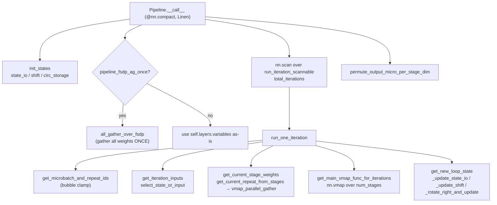

# MaxText pipeline parallelism — deprecated Linen implementation

<!-- connect:up:begin -->
> **Cross-repo concept:** part of [pipeline-parallelism](../../../concepts/pipeline-parallelism.md) across this wiki's repos.
<!-- connect:up:end -->
> **Superseded.** `src/maxtext/layers/pipeline_deprecated.py` is the **old flax Linen** (`nn.Module` / `@nn.compact`) pipeline layer, kept for reference and retired in favour of the NNX rewrite in [`pipeline.py`](maxtext-layers-pipeline.md). It implements the same GPipe/circular microbatch schedule and the same buffer-rotation math, but with a **single flat scan**, **synchronous per-iteration weight gathering**, and **no Buffer Sliding Window / async FSDP prefetch** — the overlap lever that the NNX `NNXCircularPipeline` was built to add. Read this page to understand what the schedule did and *why* the new version replaced it; do not build new hypotheses against this code path.

## Overview
The single [`Pipeline`](../catalog/src/maxtext/layers/pipeline_deprecated.md#Pipeline.__call__) Linen module reshapes the global batch into `num_pipeline_microbatches` microbatches, splits the decoder body into `num_stages` stages sharded along a `"stage"` mesh axis, and drives one flat loop of `total_iterations = num_micro*repeats + forwarding_delay*(num_stages-1)` iterations. Each iteration is `nn.vmap`ped over the stage axis so all stages run the same body on different microbatches; the pipeline only materializes because the stage axis is physically sharded. The buffer-rotation core — `state_io`, `shift`, `circ_storage` and their `ppermute` moves — is essentially identical to the NNX version; what differs is *framework* (Linen `nn.vmap`/`nn.scan` and `meta.remove_axis` metadata plumbing vs NNX `nnx.split`/`lift.scan`) and, critically, that **weights are gathered on the critical path each iteration** rather than prefetched a repeat ahead.

The key takeaway for a perf reader: this implementation exposes `pipeline_fsdp_ag_once` (all-gather every stage's weights *once* up front) as its only FSDP-collective optimization. It has no mechanism to overlap the all-gather of repeat *r+1*'s weights with the compute of repeat *r*; closing that gap is the reason the NNX `NNXCircularPipeline` with its BSW two-slot buffer superseded it.

## Diagram

## Design rationale (why it's built this way, and why it was replaced)

**Linen `nn.vmap` + `nn.scan` over a module instance.** Because Linen transforms attach to `nn.Module` classes/instances, the loop body is wrapped in [`run_iteration_scannable`](../catalog/src/maxtext/layers/pipeline_deprecated.md#Pipeline.run_iteration_scannable) whose first argument is the module `self`, and stage parallelism goes through [`get_main_vmap_func_for_iterations`](../catalog/src/maxtext/layers/pipeline_deprecated.md#Pipeline.get_main_vmap_func_for_iterations) building an `nn.vmap` with `spmd_axis_name` = `"stage"`. A separate [`get_vmap_func_for_init`](../catalog/src/maxtext/layers/pipeline_deprecated.md#Pipeline.get_vmap_func_for_init) exists purely to initialize weights (one set of stages, no loop). This dual init/run vmap split and the `meta.remove_axis` metadata dance are exactly the Linen-era complexity the NNX rewrite flattens with `nnx.split`.

**Synchronous per-iteration weight gather — the retired bottleneck.** Each iteration [`run_one_iteration`](../catalog/src/maxtext/layers/pipeline_deprecated.md#Pipeline.run_one_iteration) calls [`get_current_stage_weights`](../catalog/src/maxtext/layers/pipeline_deprecated.md#Pipeline.get_current_stage_weights) → [`get_current_repeat_from_stages`](../catalog/src/maxtext/layers/pipeline_deprecated.md#Pipeline.get_current_repeat_from_stages) → [`gather_weights_for_stages_in`](../catalog/src/maxtext/layers/pipeline_deprecated.md#Pipeline.gather_weights_for_stages_in) → [`vmap_parallel_gather`](../catalog/src/maxtext/layers/pipeline_deprecated.md#Pipeline.vmap_parallel_gather), which `vmap`-slices the right repeat's weights out of the stacked `[num_repeats, num_stages, …]` parameter tensor. There is no double-buffer: the gather is on the forward critical path. `pipeline_fsdp_ag_once` mitigates *only* the FSDP shard collect (do it once via [`all_gather_over_fsdp`](../catalog/src/maxtext/layers/pipeline_deprecated.md#Pipeline.all_gather_over_fsdp)), not the per-repeat re-slicing overlap.

**Same bubble arithmetic as the successor.** [`get_microbatch_and_repeat_ids`](../catalog/src/maxtext/layers/pipeline_deprecated.md#Pipeline.get_microbatch_and_repeat_ids) uses the identical `forwarding_delay`-based clamp, and [`forwarding_delay`](../catalog/src/maxtext/layers/pipeline_deprecated.md#Pipeline.forwarding_delay) is `2` under `pipeline_delay_activation_forwarding` else `1`. So the *schedule shape* and bubble fraction are unchanged across the two implementations — the migration was about framework and weight-prefetch, not the pipeline geometry.

## Entry points

- [`Pipeline.__call__`](../catalog/src/maxtext/layers/pipeline_deprecated.md#Pipeline.__call__) — the sole entry, decorated `@nn.compact`. Reached once per decoder forward. It reshapes `[global_batch]` → `[num_microbatches, microbatch_size, seq, embed]`, has a dedicated `is_initializing()` branch (using [`get_vmap_func_for_init`](../catalog/src/maxtext/layers/pipeline_deprecated.md#Pipeline.get_vmap_func_for_init)) to build sharded weights of shape `[num_repeats, num_stages, …]`, optionally all-gathers weights once, then runs the flat scan and un-permutes the output.
- [`run_one_iteration`](../catalog/src/maxtext/layers/pipeline_deprecated.md#Pipeline.run_one_iteration) — the body of one pipeline hop, invoked once per scan iteration through [`run_iteration_scannable`](../catalog/src/maxtext/layers/pipeline_deprecated.md#Pipeline.run_iteration_scannable). It gathers this iteration's inputs and (synchronously) weights, runs the vmapped stage forward, and advances the buffers via [`get_new_loop_state`](../catalog/src/maxtext/layers/pipeline_deprecated.md#Pipeline.get_new_loop_state).

## Mechanism (step-by-step)

1. **Reshape, seed buffers, handle init.** [`__call__`](../catalog/src/maxtext/layers/pipeline_deprecated.md#Pipeline.__call__) reshapes activations under [`input_sharding`](../catalog/src/maxtext/layers/pipeline_deprecated.md#Pipeline.input_sharding) and calls [`init_states`](../catalog/src/maxtext/layers/pipeline_deprecated.md#Pipeline.init_states) to allocate `shift` `[num_stages, micro, seq, embed]`, `state_io` `[num_stages, microbatches_per_stage, micro, seq, embed]`, and (only if [`use_circ_storage`](../catalog/src/maxtext/layers/pipeline_deprecated.md#Pipeline.use_circ_storage)) `circ_storage`. On the Linen init pass a separate vmap ([`get_vmap_func_for_init`](../catalog/src/maxtext/layers/pipeline_deprecated.md#Pipeline.get_vmap_func_for_init)) runs a single stage set — wrapped in an extra `circular_repeats` vmap when `num_pipeline_repeats > 1` to generate the `[num_repeats, num_stages, …]` weight layout — and returns a correctly-shaped zeros placeholder.

2. **Optionally all-gather FSDP weights once.** When `pipeline_fsdp_ag_once` is set, [`all_gather_over_fsdp`](../catalog/src/maxtext/layers/pipeline_deprecated.md#Pipeline.all_gather_over_fsdp) gathers every stage's sharded params up front (dropping `fsdp`/`fsdp_transpose` from the physical spec) so the loop reads resident weights; otherwise the loop reads `self.layers.variables` and pays the FSDP collect inside the gather. This one flag is the *entire* FSDP-overlap story here — contrast the successor's per-repeat prefetch.

3. **Compute per-stage indices.** [`get_microbatch_and_repeat_ids`](../catalog/src/maxtext/layers/pipeline_deprecated.md#Pipeline.get_microbatch_and_repeat_ids) yields `microbatch_id` and `repeat_id` per stage from `max(loop_iteration - forwarding_delay*arange(num_stages), 0)`; the clamp is the fill bubble, using [`num_stages`](../catalog/src/maxtext/layers/pipeline_deprecated.md#Pipeline.num_stages) = `ici_pipeline_parallelism * dcn_pipeline_parallelism`.

4. **Assemble stage inputs.** [`get_iteration_inputs`](../catalog/src/maxtext/layers/pipeline_deprecated.md#Pipeline.get_iteration_inputs) builds the `[num_stages, micro, seq, embed]` slab: stage 0 draws a fresh microbatch from `state_io` while `loop_iteration < num_microbatches`, else a recirculated one from `circ_storage` (or `shift` when circ storage is off); other stages take the rotated previous output in `shift`. The stage-0-vs-rest choice is [`select_state_or_input`](../catalog/src/maxtext/layers/pipeline_deprecated.md#Pipeline.select_state_or_input), a `jnp.where` on a broadcast iota over [`stages_in_sharding`](../catalog/src/maxtext/layers/pipeline_deprecated.md#Pipeline.stages_in_sharding).

5. **Gather this iteration's weights synchronously.** [`run_one_iteration`](../catalog/src/maxtext/layers/pipeline_deprecated.md#Pipeline.run_one_iteration) slices per-stage positions/segment_ids with [`vmap_gather`](../catalog/src/maxtext/layers/pipeline_deprecated.md#Pipeline.vmap_gather) and, when `num_pipeline_repeats > 1`, strips the circular metadata axis in [`prepare_vars_for_main_vmap`](../catalog/src/maxtext/layers/pipeline_deprecated.md#Pipeline.prepare_vars_for_main_vmap) and selects the current repeat's weights via [`get_current_stage_weights`](../catalog/src/maxtext/layers/pipeline_deprecated.md#Pipeline.get_current_stage_weights). The gather ([`vmap_parallel_gather`](../catalog/src/maxtext/layers/pipeline_deprecated.md#Pipeline.vmap_parallel_gather) using [`_gather_one`](../catalog/src/maxtext/layers/pipeline_deprecated.md#Pipeline._gather_one)) runs *in the iteration*, on the critical path — the structural reason this version cannot hide the collective.

6. **Run all stages (the vmap).** [`get_main_vmap_func_for_iterations`](../catalog/src/maxtext/layers/pipeline_deprecated.md#Pipeline.get_main_vmap_func_for_iterations) builds an `nn.vmap` over `num_stages` (with `variable_axes={"params":0}`, split RNGs for dropout, `spmd_axis_name` = [`spmd_axis_name`](../catalog/src/maxtext/layers/pipeline_deprecated.md#Pipeline.spmd_axis_name)) and applies the decoder body to the per-stage inputs. This is where the FLOPs are.

7. **Advance the buffers.** [`get_new_loop_state`](../catalog/src/maxtext/layers/pipeline_deprecated.md#Pipeline.get_new_loop_state) rotates state: [`_update_state_io`](../catalog/src/maxtext/layers/pipeline_deprecated.md#Pipeline._update_state_io) shifts `state_io` left and inserts the last stage's output ([`_shift_left`](../catalog/src/maxtext/layers/pipeline_deprecated.md#Pipeline._shift_left)); [`_update_shift`](../catalog/src/maxtext/layers/pipeline_deprecated.md#Pipeline._update_shift) rotates the conveyor right via [`_rotate_right`](../catalog/src/maxtext/layers/pipeline_deprecated.md#Pipeline._rotate_right) (last→first immediate) or [`_shift_right`](../catalog/src/maxtext/layers/pipeline_deprecated.md#Pipeline._shift_right) (zero the first stage) depending on whether circ storage is used; and [`_rotate_right_and_update`](../catalog/src/maxtext/layers/pipeline_deprecated.md#Pipeline._rotate_right_and_update) pushes the delayed output into `circ_storage` at a rotating index. All moves are `jax.shard_map` `ppermute`s along `"stage"`. `loop_iteration` increments.

8. **Scan and finalize.** [`__call__`](../catalog/src/maxtext/layers/pipeline_deprecated.md#Pipeline.__call__) drives the whole thing with one `nn.scan` over [`run_iteration_scannable`](../catalog/src/maxtext/layers/pipeline_deprecated.md#Pipeline.run_iteration_scannable) for `total_iterations`. Because outputs land in `state_io` shifted by the pipeline delay, [`permute_output_micro_per_stage_dim`](../catalog/src/maxtext/layers/pipeline_deprecated.md#Pipeline.permute_output_micro_per_stage_dim) — using [`iterations_to_complete_first_microbatch`](../catalog/src/maxtext/layers/pipeline_deprecated.md#Pipeline.iterations_to_complete_first_microbatch) — reorders them to input order before the final reshape under [`output_sharding`](../catalog/src/maxtext/layers/pipeline_deprecated.md#Pipeline.output_sharding).

## Key data structures

- **`loop_state` dict** — the scan carry from [`init_states`](../catalog/src/maxtext/layers/pipeline_deprecated.md#Pipeline.init_states): `state_io`, `shift`, `circ_storage`, `circ_storage_mover`, `prev_outputs` (only under activation-forwarding delay), and scalar `loop_iteration`. Same shape and role as in the NNX version.
- **Stacked weights `[num_repeats, num_stages, …]`** — the circular-pipeline parameter layout, produced at init and sliced per-iteration by [`get_current_repeat_from_stages`](../catalog/src/maxtext/layers/pipeline_deprecated.md#Pipeline.get_current_repeat_from_stages). Unlike the successor there is no separate two-slot prefetch buffer — the slice is taken live from this full tensor.
- **Sharding descriptors** — [`stages_in_logical`](../catalog/src/maxtext/layers/pipeline_deprecated.md#Pipeline.stages_in_logical)/[`stages_in_spec`](../catalog/src/maxtext/layers/pipeline_deprecated.md#Pipeline.stages_in_spec) and [`state_io_logical`](../catalog/src/maxtext/layers/pipeline_deprecated.md#Pipeline.state_io_logical)/[`state_io_spec`](../catalog/src/maxtext/layers/pipeline_deprecated.md#Pipeline.state_io_spec) pin the leading `activation_stage` axis to the mesh `"stage"` axis; [`shard_dim_by_stages`](../catalog/src/maxtext/layers/pipeline_deprecated.md#Pipeline.shard_dim_by_stages) injects the stage axis into weight/index tensors. Axis names come from [`batch_axis_name`](../catalog/src/maxtext/layers/pipeline_deprecated.md#Pipeline.batch_axis_name) and [`seq_len_axis_name`](../catalog/src/maxtext/layers/pipeline_deprecated.md#Pipeline.seq_len_axis_name).

## Dynamics (design intent)

Overlap here is limited to what the buffer `ppermute`s and a single up-front FSDP all-gather give. Inter-stage sends are nearest-neighbour `ppermute`s along `"stage"` (via [`_rotate_right`](../catalog/src/maxtext/layers/pipeline_deprecated.md#Pipeline._rotate_right)/[`_shift_right`](../catalog/src/maxtext/layers/pipeline_deprecated.md#Pipeline._shift_right)) that XLA can overlap with stage matmuls, and `pipeline_delay_activation_forwarding` adds one iteration of slack (doubling the bubble) so those sends fully hide. But the per-repeat weight re-slice/gather sits on the critical path with no double buffer, so at FSDP scale the collective is exposed — precisely the deficiency the NNX BSW async prefetch was written to remove. Remat is applied via [`get_pipeline_remat_policy`](../catalog/src/maxtext/layers/pipeline_deprecated.md#Pipeline.get_pipeline_remat_policy) / [`remat_policy`](../catalog/src/maxtext/layers/pipeline_deprecated.md#Pipeline.remat_policy).

## Edge cases

- **`#micro == #stages`**: no circ storage; last stage rotates straight into first. [`_update_shift`](../catalog/src/maxtext/layers/pipeline_deprecated.md#Pipeline._update_shift) branches on `num_pipeline_repeats == 1 or use_circ_storage` to pick shift-vs-rotate; [`need_circ_storage`](../catalog/src/maxtext/layers/pipeline_deprecated.md#Pipeline.need_circ_storage) gates the buffer.
- **Init vs run**: the Linen `is_initializing()` path uses a *different* vmap ([`get_vmap_func_for_init`](../catalog/src/maxtext/layers/pipeline_deprecated.md#Pipeline.get_vmap_func_for_init)) and only runs one stage set — a source of init/run skew the NNX rewrite avoids by not carrying an init-only vmap.
- **Single repeat**: [`prepare_vars_for_main_vmap`](../catalog/src/maxtext/layers/pipeline_deprecated.md#Pipeline.prepare_vars_for_main_vmap)'s `circular_repeats` metadata stripping and the repeat-slice in [`get_current_stage_weights`](../catalog/src/maxtext/layers/pipeline_deprecated.md#Pipeline.get_current_stage_weights) are only taken when `num_pipeline_repeats > 1`.
- **Bubble outputs discarded**: as in the successor, drain-iteration inputs live in `shift` and never return to `state_io`; only `state_io` (sized `num_microbatches`) survives to the output.

## Open questions

- The exact retirement commit / migration PR is not in this packet; the "deprecated" status is taken from the module filename and the presence of the parallel NNX implementation in [`pipeline.py`](maxtext-layers-pipeline.md).
- Whether `pipeline_fsdp_ag_once` here achieves any compute overlap or merely deduplicates the all-gather cannot be settled statically — it removes the per-iteration re-gather but the initial collective is still synchronous.

## See also
- [MaxText pipeline parallelism (NNX)](maxtext-layers-pipeline.md) — the active replacement with BSW async weight prefetch.
