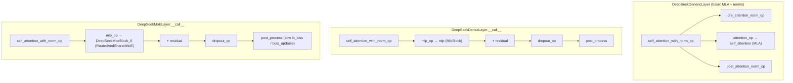

# MaxText DeepSeek decoder layers — MLA attention + dense/MoE MLP split

DeepSeek-v3-style decoder layers in MaxText: a shared Multi-Head-Latent-Attention base
(`DeepSeekGenericLayer`) specialized into two body types — the early **dense** layers
(`DeepSeekDenseLayer`) and the later **routed-MoE** layers (`DeepSeekMoELayer`) — using a
"build modules in `__init__`, run them in named ops" pattern so the two subclasses share
attention/norm/residual plumbing and differ only in the MLP.

## Diagram

## Entry points
- [`DeepSeekDenseLayer.__call__`](../catalog/src/maxtext/models/deepseek.md#DeepSeekDenseLayer.__call__) — one early decoder layer. Runs attention-with-norm, then a plain dense MLP, adds the residual, applies dropout, and returns via `post_process`. Reached once per dense layer per forward. DeepSeek uses dense MLPs for its first `first_k_dense` layers before the MoE layers begin.
- [`DeepSeekMoELayer.__call__`](../catalog/src/maxtext/models/deepseek.md#DeepSeekMoELayer.__call__) — one MoE decoder layer; the same attention/residual skeleton but the MLP is the routed+shared MoE block. Its extra job is threading the MoE's `load_balance_loss` and `moe_bias_updates` out to `post_process`. It also holds the (init-only) batch-split-schedule branch used when `use_batch_split_schedule` is set.
- [`self_attention_with_norm_op`](../catalog/src/maxtext/models/deepseek.md#DeepSeekGenericLayer.self_attention_with_norm_op) — the shared attention front-half both subclasses call first: pre-norm → MLA attention → residual add → post-norm, returning both the post-normed `hidden_states` (input to the MLP) and the `intermediate_inputs` (the residual branch).

## Mechanism (step-by-step)

1. **Module construction, not computation.** The base [`config`](../catalog/src/maxtext/models/deepseek.md#DeepSeekGenericLayer.config)/[`mesh`](../catalog/src/maxtext/models/deepseek.md#DeepSeekGenericLayer.mesh)/[`rngs`](../catalog/src/maxtext/models/deepseek.md#DeepSeekGenericLayer.rngs)/[`quant`](../catalog/src/maxtext/models/deepseek.md#DeepSeekGenericLayer.quant)/[`layer_idx`](../catalog/src/maxtext/models/deepseek.md#DeepSeekGenericLayer.layer_idx) are stored and every sublayer is instantiated up front against a [`dummy_inputs_shape`](../catalog/src/maxtext/models/deepseek.md#DeepSeekGenericLayer.dummy_inputs_shape): the RMSNorms ([`pre_self_attention_layer_norm`](../catalog/src/maxtext/models/deepseek.md#DeepSeekGenericLayer.pre_self_attention_layer_norm), [`post_self_attention_layer_norm`](../catalog/src/maxtext/models/deepseek.md#DeepSeekGenericLayer.post_self_attention_layer_norm)) and the attention module. This is the "separate creation from execution" pattern the docstring calls out — subclasses add only their MLP in `__init__`.

2. **MLA attention.** [`self_attention`](../catalog/src/maxtext/models/deepseek.md#DeepSeekGenericLayer.self_attention) is an `attention_mla.MLA` instance — DeepSeek's Multi-Head Latent Attention, which compresses K/V into a low-rank latent to shrink the KV cache. [`attention_op`](../catalog/src/maxtext/models/deepseek.md#DeepSeekGenericLayer.attention_op) invokes it with self-attention inputs (`x, x`), the layer's [`model_mode`](../catalog/src/maxtext/models/deepseek.md#DeepSeekGenericLayer.model_mode) and [`out_sharding`](../catalog/src/maxtext/models/deepseek.md#DeepSeekGenericLayer.out_sharding), then reapplies a logical sharding constraint to the result.

3. **Attention with norms + residual.** [`self_attention_with_norm_op`](../catalog/src/maxtext/models/deepseek.md#DeepSeekGenericLayer.self_attention_with_norm_op) applies [`pre_attention_norm_op`](../catalog/src/maxtext/models/deepseek.md#DeepSeekGenericLayer.pre_attention_norm_op), runs [`attention_op`](../catalog/src/maxtext/models/deepseek.md#DeepSeekGenericLayer.attention_op), forms `intermediate_inputs = inputs + attention_lnx` (the residual), then [`post_attention_norm_op`](../catalog/src/maxtext/models/deepseek.md#DeepSeekGenericLayer.post_attention_norm_op) normalizes it. It returns *both* the normed `hidden_states` (fed to the MLP) and the un-normed `intermediate_inputs` (the residual the MLP output is added back to). This double return is what lets the MLP branch and the residual branch stay separate.

4. **MLP — dense vs MoE, the only real divergence.** In [`DeepSeekDenseLayer.__call__`](../catalog/src/maxtext/models/deepseek.md#DeepSeekDenseLayer.__call__), [`mlp_op`](../catalog/src/maxtext/models/deepseek.md#DeepSeekDenseLayer.mlp_op) runs the dense [`mlp`](../catalog/src/maxtext/models/deepseek.md#DeepSeekDenseLayer.mlp) (`linears.MlpBlock`) and returns a single activation. In [`DeepSeekMoELayer.__call__`](../catalog/src/maxtext/models/deepseek.md#DeepSeekMoELayer.__call__), [`mlp_op`](../catalog/src/maxtext/models/deepseek.md#DeepSeekMoELayer.mlp_op) runs [`DeepSeekMoeBlock_0`](../catalog/src/maxtext/models/deepseek.md#DeepSeekMoELayer.DeepSeekMoeBlock_0) — a `moe.RoutedAndSharedMoE` combining routed experts with always-on shared experts — and returns *three* values: the MLP output plus the routing `load_balance_loss` and `moe_bias_updates`. Both `mlp_op`s pass [`mlp_intermediate_sharding`](../catalog/src/maxtext/models/deepseek.md#DeepSeekGenericLayer.mlp_intermediate_sharding) and [`out_sharding`](../catalog/src/maxtext/models/deepseek.md#DeepSeekGenericLayer.out_sharding) down to constrain the intermediate/output layouts.

5. **Residual, dropout, post-process.** Both subclasses form `layer_output = mlp_lnx + intermediate_inputs`, apply [`dropout_op`](../catalog/src/maxtext/models/deepseek.md#DeepSeekGenericLayer.dropout_op) (which wraps the [`dropout`](../catalog/src/maxtext/models/deepseek.md#DeepSeekGenericLayer.dropout) module), and finish in [`post_process`](../catalog/src/maxtext/models/deepseek.md#DeepSeekGenericLayer.post_process). `post_process` is where the MoE layer's auxiliary signals get `sow`n as `nnx.Intermediate` (`moe_lb_loss`, `moe_bias_updates`) so the training loop can pick them up; the dense layer passes `None` for both. It also returns `(layer_output, None)` under `scan_layers` vs `(layer_output, kv_cache)` otherwise.

6. **Optional pre-MLP branches: engram and hyper-connections.** When [`is_engram_enabled`](../catalog/src/maxtext/models/deepseek.md#DeepSeekGenericLayer.is_engram_enabled) (layer index is in `config.engram_layers`), [`engram_op`](../catalog/src/maxtext/models/deepseek.md#DeepSeekGenericLayer.engram_op) adds an n-gram memory contribution before attention: it norms `x` with [`engram_layer_norm`](../catalog/src/maxtext/models/deepseek.md#DeepSeekGenericLayer.engram_layer_norm), maps `decoder_input_tokens` through [`ngram_hash_mapping`](../catalog/src/maxtext/models/deepseek.md#DeepSeekGenericLayer.ngram_hash_mapping) at this [`layer_idx`](../catalog/src/maxtext/models/deepseek.md#DeepSeekGenericLayer.layer_idx), and looks up the [`engram`](../catalog/src/maxtext/models/deepseek.md#DeepSeekGenericLayer.engram) table. When [`is_mhc_enabled`](../catalog/src/maxtext/models/deepseek.md#DeepSeekGenericLayer.is_mhc_enabled) (`mhc_expansion_rate > 1`), the plain residual adds are replaced by manifold-constrained hyper-connections [`mhc_attention`](../catalog/src/maxtext/models/deepseek.md#DeepSeekGenericLayer.mhc_attention)/[`mhc_mlp`](../catalog/src/maxtext/models/deepseek.md#DeepSeekGenericLayer.mhc_mlp), which wrap the norm+sublayer and return the combined output (the MoE variant threads its lb_loss/bias out of the hyper-connection metadata).

## Key data structures
- **Two-branch return of attention** — `(hidden_states, intermediate_inputs)`: normed MLP input and un-normed residual, kept distinct so the MLP output is added to the *pre-norm* residual.
- **MoE triple** — `(mlp_lnx, load_balance_loss, moe_bias_updates)` from [`DeepSeekMoELayer.mlp_op`](../catalog/src/maxtext/models/deepseek.md#DeepSeekMoELayer.mlp_op); the two aux tensors are `None` on dense layers, which is why `post_process` takes them as optional.
- **`DeepSeekMoeBlock_0`** — a `RoutedAndSharedMoE` (routed experts + shared experts); the field name is fixed for checkpoint back-compat.
- **Shardings** — [`out_sharding`](../catalog/src/maxtext/models/deepseek.md#DeepSeekGenericLayer.out_sharding) and [`mlp_intermediate_sharding`](../catalog/src/maxtext/models/deepseek.md#DeepSeekGenericLayer.mlp_intermediate_sharding) are precomputed `NamedSharding`s from [`logical_axis_names`](../catalog/src/maxtext/models/deepseek.md#DeepSeekGenericLayer.logical_axis_names)/[`mlp_logical_axis_names`](../catalog/src/maxtext/models/deepseek.md#DeepSeekGenericLayer.mlp_logical_axis_names), which pick `activation_norm_length` vs `prefill_activation_norm_length` by [`model_mode`](../catalog/src/maxtext/models/deepseek.md#DeepSeekGenericLayer.model_mode).

## Dynamics (design intent)
Every intermediate activation is pinned to a logical layout through [`with_logical_constraint`](../catalog/src/maxtext/models/deepseek.md#DeepSeekGenericLayer.with_logical_constraint) (a `maybe_shard_with_logical` wrapper over [`logical_axis_names`](../catalog/src/maxtext/models/deepseek.md#DeepSeekGenericLayer.logical_axis_names)), so sharding intent is explicit at layer boundaries rather than left to XLA propagation. The MLP-specific [`mlp_logical_axis_names`](../catalog/src/maxtext/models/deepseek.md#DeepSeekGenericLayer.mlp_logical_axis_names) uses `activation_mlp` on the last axis so the MLP intermediate can be sharded differently from the residual stream. The layer input is marked with `checkpoint_name("decoder_layer_input")` for rematerialization.

> [!inferred]
> No tests reference this subgraph, so the above is read from source/docstrings only; the actual
> perf impact of MLA's KV compression, the dense→MoE layer boundary, and the shared-vs-routed expert
> split belongs in the MoE concept page and in experiments, not asserted here.

## Edge cases
- **Batch-split schedule** — [`DeepSeekMoELayer.__call__`](../catalog/src/maxtext/models/deepseek.md#DeepSeekMoELayer.__call__) contains a large `use_batch_split_schedule` branch (with a separate qwix-fp8 sub-branch) that shard-maps a micro-batch split→schedule→merge. Its own comment states this branch is traced **only at init**; execution goes straight through `Decoder`'s `batch_split_schedule`. Reading the layer body alone overstates what runs.
- **Scan layers** — [`post_process`](../catalog/src/maxtext/models/deepseek.md#DeepSeekGenericLayer.post_process) drops the KV cache (`return layer_output, None`) when `config.scan_layers` is set; callers must not rely on the second return under scan.
- **`inputs` may be a tuple** — both `__call__`s unpack `inputs[0]` when a previous layer returned `(hidden_states, kv_cache)`.
- **Aux-loss gating** — the load-balance loss is only `sow`n when `load_balance_loss_weight > 0` and the value is non-`None`; a dense layer or hash-routed MoE layer produces neither.

## Open questions
- `attention_mla.MLA`, `linears.MlpBlock`, and `moe.RoutedAndSharedMoE` are instantiated here but their internals live in other modules/packets ([MoE concept](maxtext-layers-moe.md) covers the routed block); the MLA compression ratio and RoPE handling are not visible in this subgraph.
- The `deepseek_batchsplit` / `deepseek_batchsplit_fp8` schedule (split/merge, yarn freqs, splash kernel) is referenced but out-of-subgraph — see the deepseek_batchsplit packet for the actually-executed micro-batch pipeline.
- `ManifoldConstrainedHyperConnections` and `Engram`/`NgramHashMapping` are constructed via [`mhc_mlp`](../catalog/src/maxtext/models/deepseek.md#DeepSeekGenericLayer.mhc_mlp)/[`engram`](../catalog/src/maxtext/models/deepseek.md#DeepSeekGenericLayer.engram) but their math is defined elsewhere.

## See also
- [MaxText RoutedMoE](maxtext-layers-moe.md) — the routed-expert block wired in as `DeepSeekMoeBlock_0`; where routing cost, dispatch/combine all-to-all, and the megablox gmm path actually live.
