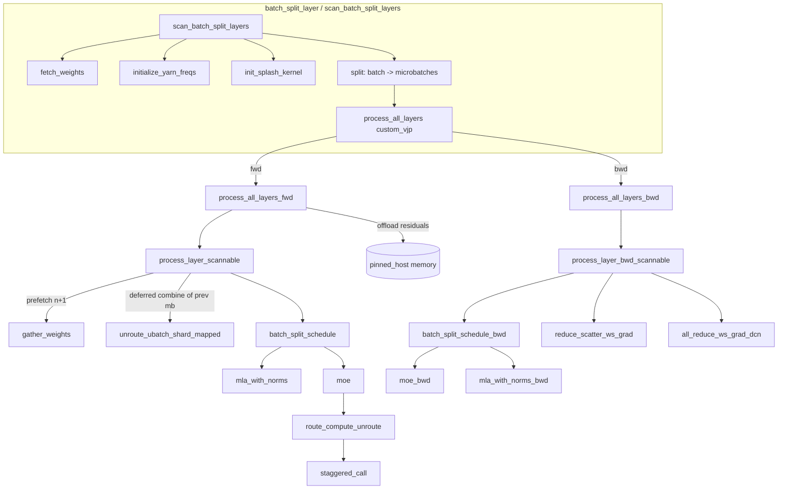

# DeepSeek batch-split schedule

An alternative, hand-scheduled DeepSeek-V3 forward/backward for TPU that splits the global batch into `split_factor` microbatches and *interleaves* their communication and compute so that FSDP weight all-gathers, expert-parallel all-to-all dispatch, and MoE expert matmuls overlap instead of running serially. Every collective, remat boundary, and host-memory offload is written out explicitly rather than left to XLA — the module docstring calls this out: "The model logic and optimizations are very explicit in this implementation."

## Overview

Ordinary MoE training on TPU alternates between *communication* phases (all-gather this layer's sharded weights, all-to-all dispatch tokens to their experts, all-to-all combine them back) and *compute* phases (attention, expert FFNs). On a single microbatch these phases are serially dependent, so the TPU sits idle during each collective. The batch-split schedule breaks that dependency by cutting the batch into two microbatches ([`split`](../catalog/src/maxtext/models/deepseek_batchsplit.md#split)) and running them one stage out of phase, driven by [`staggered_call`](../catalog/src/maxtext/models/deepseek_batchsplit.md#staggered_call): while microbatch 0 is inside the expert matmul, microbatch 1's routing all-to-all is in flight, and vice-versa. The whole layer stack is a `jax.lax.scan` with a hand-written custom-VJP ([`process_all_layers`](../catalog/src/maxtext/models/deepseek_batchsplit.md#scan_batch_split_layers.process_all_layers)) so the author controls exactly which residuals survive to the backward pass and which are recomputed. Two further TPU-specific levers ride on top: FSDP weights for layer *n+1* are all-gathered ([`gather_weights`](../catalog/src/maxtext/models/deepseek_batchsplit.md#gather_weights)) one layer ahead of when they are needed, and large forward residuals are pushed to pinned host memory during the forward pass and pulled back in the backward pass.

## Diagram

## Design rationale (why it's built this way)

**Batch splitting exists to overlap collectives with compute.** [`split`](../catalog/src/maxtext/models/deepseek_batchsplit.md#split) reshapes the leading batch dim into `(-1, split_factor, …)` and returns a Python list of microbatch tensors; [`merge`](../catalog/src/maxtext/models/deepseek_batchsplit.md#merge) reverses it by stacking and reshaping. Both are wrapped in `@jax.named_scope` so they are visible in the xprof trace. The list-of-microbatches representation is what lets [`staggered_call`](../catalog/src/maxtext/models/deepseek_batchsplit.md#staggered_call) drive them independently through a stage: it applies `fn` to each microbatch and, for all but the last, forces a `jax.lax.optimization_barrier` between the just-produced output and the *next* microbatch's input, which is how the schedule pins one microbatch's collective against the other's math. Note the memory tradeoff: doubling the number of in-flight activations is the cost paid for the overlap.

> [!inferred]
> `split_factor` is `cfg.batch_split_factor` (used at the `jax.shard_map` call sites in [`batch_split_layer`](../catalog/src/maxtext/models/deepseek_batchsplit.md#batch_split_layer)); the shipped configuration effectively assumes 2 microbatches, and the schedule's prologue/epilogue reasoning below is written for that case. A larger factor would deepen the software pipeline at further activation-memory cost.

**Explicit scheduling groups replace reliance on the XLA latency-hiding scheduler's own heuristics.** [`scheduling_group`](../catalog/src/maxtext/models/deepseek_batchsplit.md#scheduling_group) is a one-line context manager that sets `_scheduling_group_id` XLA metadata via `jax.experimental.xla_metadata.set_xla_metadata`. Every prefetch all-gather and post-scatter is tagged with a group id (40, 41, 42, 43, 44, 55, …), which tells the compiler which collective may be co-scheduled with which compute block. This is the mechanism that makes "prefetch weights for the next layer" actually overlap rather than serialize.

**A custom VJP over the whole layer scan is the only way to get this precise remat + offload control.** Standard autodiff would decide rematerialization for you and would not know to stage residuals through host memory. Instead [`process_all_layers`](../catalog/src/maxtext/models/deepseek_batchsplit.md#scan_batch_split_layers.process_all_layers) is a `@jax.custom_vjp` whose forward ([`process_all_layers_fwd`](../catalog/src/maxtext/models/deepseek_batchsplit.md#scan_batch_split_layers.process_all_layers_fwd)) hand-picks the residual set to return, and whose backward ([`process_all_layers_bwd`](../catalog/src/maxtext/models/deepseek_batchsplit.md#scan_batch_split_layers.process_all_layers_bwd)) recomputes the rest via the `*_remat` functions. The docstring: "In order to control remat, residuals from the forward pass are explicitly stored and passed to the backward pass in a custom VJP over the entire layer scan."

## Entry points

- [`scan_batch_split_layers`](../catalog/src/maxtext/models/deepseek_batchsplit.md#scan_batch_split_layers) — the production entry, used when the decoder stack is scanned. It asserts `num_layers >= 4` (the schedule needs a 2-layer prologue and 2-layer epilogue around the scanned middle), fetches and reshapes weights via [`fetch_weights`](../catalog/src/maxtext/models/deepseek_batchsplit.md#fetch_weights), reshards inputs to the `("data","fsdp","expert")` activation spec, builds YaRN RoPE frequencies/mask and the Splash attention kernel once, then defines and calls the custom-VJP `process_all_layers`. Reached once per decoder forward.
- [`batch_split_layer`](../catalog/src/maxtext/models/deepseek_batchsplit.md#batch_split_layer) — the single-layer sibling (no scan) with the same setup but a per-layer custom VJP [`process_layer`](../catalog/src/maxtext/models/deepseek_batchsplit.md#batch_split_layer.process_layer). Useful for debugging/unrolled configs; it exercises the identical [`batch_split_schedule`](../catalog/src/maxtext/models/deepseek_batchsplit.md#batch_split_schedule) forward and [`process_layer_bwd`](../catalog/src/maxtext/models/deepseek_batchsplit.md#batch_split_layer.process_layer_bwd) backward.
- [`batch_split_schedule`](../catalog/src/maxtext/models/deepseek_batchsplit.md#batch_split_schedule) — the actual per-layer math: MLA-with-norms then the DeepSeek MoE block. This is what both entries call for every layer, and its residual dict (`layer_inputs`, `attn_out`, `mlpwi_0`, `mlpwi_1`, …) is the contract with the backward pass.

## Mechanism (step-by-step)

1. **Setup and reshard.** [`scan_batch_split_layers`](../catalog/src/maxtext/models/deepseek_batchsplit.md#scan_batch_split_layers) flattens the parameter pytree into the exact nested tuple the schedule expects through [`fetch_weights`](../catalog/src/maxtext/models/deepseek_batchsplit.md#fetch_weights) (which also casts to `cfg.dtype` and unwraps `LogicallyPartitioned` values), then `jax.reshard`s activations to `PartitionSpec(("data","fsdp","expert"), None, None)`. Precomputed once here: YaRN frequencies ([`initialize_yarn_freqs`](../catalog/src/maxtext/models/deepseek_batchsplit.md#initialize_yarn_freqs)), the pairwise swap/negate mask ([`initialize_yarn_mask`](../catalog/src/maxtext/models/deepseek_batchsplit.md#initialize_yarn_mask)), and the Splash attention kernel ([`init_splash_kernel`](../catalog/src/maxtext/models/deepseek_batchsplit.md#init_splash_kernel)) — hoisting these out of the layer loop keeps them off the per-layer critical path.

2. **Split the batch under a shard_map.** The input is passed through a `jax.shard_map` wrapping [`split`](../catalog/src/maxtext/models/deepseek_batchsplit.md#split) with `out_specs=[activation_pspec]*batch_split_factor`, turning one sharded activation into a list of microbatch activations; the YaRN freqs are split the same way. From here on the "value" flowing through the layers is a *list*, one entry per microbatch, which is what enables staggering.

3. **Forward prologue — two layers, weights prefetched one ahead.** Inside [`process_all_layers_fwd`](../catalog/src/maxtext/models/deepseek_batchsplit.md#scan_batch_split_layers.process_all_layers_fwd) the first two layers are done explicitly (groups 40/41): layer 0 and 1 weights are all-gathered via [`gather_weights`](../catalog/src/maxtext/models/deepseek_batchsplit.md#gather_weights) on [`extract_layer_weights`](../catalog/src/maxtext/models/deepseek_batchsplit.md#extract_layer_weights) slices, then [`batch_split_schedule`](../catalog/src/maxtext/models/deepseek_batchsplit.md#batch_split_schedule) runs. The prologue is what primes the pipeline so the scanned body always has next-layer weights available.

4. **Forward scan body — prefetch, deferred combine, compute, offload.** [`process_layer_scannable`](../catalog/src/maxtext/models/deepseek_batchsplit.md#scan_batch_split_layers.process_all_layers_fwd.process_layer_scannable) is the repeated unit. Under a [`scheduling_group`](../catalog/src/maxtext/models/deepseek_batchsplit.md#scheduling_group) it (a) all-gathers the *next* layer's weights, (b) finishes the *previous* layer's second microbatch by running its deferred combine through [`unroute_ubatch_shard_mapped`](../catalog/src/maxtext/models/deepseek_batchsplit.md#unroute_ubatch_shard_mapped) — this deferral is the crux: the second microbatch's all-to-all combine is pushed into the next layer so it overlaps that layer's attention — then (c) runs [`batch_split_schedule`](../catalog/src/maxtext/models/deepseek_batchsplit.md#batch_split_schedule) for the current layer, and (d) `jax.device_put`s the bulky residuals (`mlpwi_0`, `mlpwi_1`, `attn_out`, `layer_inputs`) to `pinned_host` memory to free HBM.

5. **Inside a layer — MLA then MoE.** [`batch_split_schedule`](../catalog/src/maxtext/models/deepseek_batchsplit.md#batch_split_schedule) first runs [`mla_with_norms`](../catalog/src/maxtext/models/deepseek_batchsplit.md#mla_with_norms) (RMSNorm via [`rms_norm`](../catalog/src/maxtext/models/deepseek_batchsplit.md#rms_norm), the DeepSeek low-rank Q/KV projections, YaRN RoPE, and Splash attention) then [`moe`](../catalog/src/maxtext/models/deepseek_batchsplit.md#moe). It returns the layer output *plus* a residual dict merged from `layer_inputs` and the attention/MoE residuals — the exact set the custom-VJP backward will consume.

6. **MoE as three staggered stages.** [`moe`](../catalog/src/maxtext/models/deepseek_batchsplit.md#moe) is a `jax.shard_map` (expert weights sharded on the `expert` axis, `reduced` over `data`/`fsdp`) around [`route_compute_unroute`](../catalog/src/maxtext/models/deepseek_batchsplit.md#route_compute_unroute), which runs `route_fn`, then `compute_fn`, then `unroute_fn` each through [`staggered_call`](../catalog/src/maxtext/models/deepseek_batchsplit.md#staggered_call). Routing all-to-all of one microbatch thus overlaps the expert matmul of the other. Note `capacity_factor=2` here does *not* drop tokens (dropless MoE) — it only bounds how many `mlpwi_*` activations are checkpointed; only microbatch 0's unroute is materialized in-layer, microbatch 1's is the deferred combine from step 4.

7. **Forward epilogue.** The last two layers run without prefetching (there is nothing after them to prefetch), and the trailing microbatch's combines are flushed via two more [`unroute_ubatch_shard_mapped`](../catalog/src/maxtext/models/deepseek_batchsplit.md#unroute_ubatch_shard_mapped) calls before results are returned alongside the full residual tuple that becomes the VJP's saved state.

8. **Backward — mirror image with grad reduction.** [`process_all_layers_bwd`](../catalog/src/maxtext/models/deepseek_batchsplit.md#scan_batch_split_layers.process_all_layers_bwd) walks the saved residuals in reverse via [`process_layer_bwd_scannable`](../catalog/src/maxtext/models/deepseek_batchsplit.md#scan_batch_split_layers.process_all_layers_bwd.process_layer_bwd_scannable). Each step prefetches the *previous* layer's weights, pulls the offloaded residuals back from host to `device` memory, then runs [`batch_split_schedule_bwd`](../catalog/src/maxtext/models/deepseek_batchsplit.md#batch_split_schedule_bwd) (which calls [`mla_with_norms_remat`](../catalog/src/maxtext/models/deepseek_batchsplit.md#mla_with_norms_remat) to recompute MLA activations, [`moe_bwd`](../catalog/src/maxtext/models/deepseek_batchsplit.md#moe_bwd), then [`mla_with_norms_bwd`](../catalog/src/maxtext/models/deepseek_batchsplit.md#mla_with_norms_bwd)) and the deferred [`unroute_ubatch_remat_and_bwd_shard_mapped`](../catalog/src/maxtext/models/deepseek_batchsplit.md#unroute_ubatch_remat_and_bwd_shard_mapped).

9. **Weight-gradient reduction is itself pipelined across two collectives.** A layer's raw weight gradient is FSDP-sharded by [`reduce_scatter_ws_grad`](../catalog/src/maxtext/models/deepseek_batchsplit.md#reduce_scatter_ws_grad) and then summed across data-center-network slices by [`all_reduce_ws_grad_dcn`](../catalog/src/maxtext/models/deepseek_batchsplit.md#all_reduce_ws_grad_dcn). In the scan these are staggered by two layers (`next_ws_grad` is reduce-scattered while `next_next_ws_grad` is all-reduced) and written into the full gradient pytree with [`insert_layer_ws_grad`](../catalog/src/maxtext/models/deepseek_batchsplit.md#insert_layer_ws_grad), so the ICI reduce-scatter and the slow DCN all-reduce overlap each other and the backward math.

10. **MoE backward re-derives everything it did not save.** [`moe_bwd`](../catalog/src/maxtext/models/deepseek_batchsplit.md#moe_bwd) delegates to [`route_compute_unroute_bwd`](../catalog/src/maxtext/models/deepseek_batchsplit.md#route_compute_unroute_bwd), which rebuilds forward intermediates through `*_remat` closures ([`route_fn_remat`](../catalog/src/maxtext/models/deepseek_batchsplit.md#route_compute_unroute_bwd.route_fn_remat), [`compute_fn_remat`](../catalog/src/maxtext/models/deepseek_batchsplit.md#route_compute_unroute_bwd.compute_fn_remat), [`unroute_fn_remat`](../catalog/src/maxtext/models/deepseek_batchsplit.md#route_compute_unroute_bwd.unroute_fn_remat)) and then runs their paired `*_bwd` closures ([`compute_fn_bwd`](../catalog/src/maxtext/models/deepseek_batchsplit.md#route_compute_unroute_bwd.compute_fn_bwd)), summing partial gradients with [`sum_grads`](../catalog/src/maxtext/models/deepseek_batchsplit.md#sum_grads). This is where the remat/recompute-vs-store tradeoff for the expert FFN is actually spent.

## Key data structures

- **The microbatch list.** After [`split`](../catalog/src/maxtext/models/deepseek_batchsplit.md#split), activations are a Python `list` of length `batch_split_factor`. The list is mutated in place (`inputs[1] = …`) inside the scan body to install the deferred combine — the scheduling depends on entry 0 and entry 1 being at different pipeline stages.
- **The nested weight pytree.** [`fetch_weights`](../catalog/src/maxtext/models/deepseek_batchsplit.md#fetch_weights) produces a fixed `((pre_attn_norm, (wq_a, wq_b, q_norm, wkv_a, wkv_b, kv_norm, out)), (post_attn_norm, (gate_kernel, gate_bias), (routed_wi_0, routed_wi_1, routed_wo), (shared_wi_0, shared_wi_1, shared_wo)))` shape. [`extract_layer_weights`](../catalog/src/maxtext/models/deepseek_batchsplit.md#extract_layer_weights) / [`insert_layer_ws_grad`](../catalog/src/maxtext/models/deepseek_batchsplit.md#insert_layer_ws_grad) index this pytree along `cfg.param_scan_axis`.
- **The residual dict.** Keys `layer_inputs`, `attn_out`, `mlpwi_0`, `mlpwi_1` are the tensors offloaded to pinned host memory; the rest of MLA's residuals stay resident. This dict is the sole channel between forward and the custom-VJP backward.
- **`selected_experts` / unroute residuals.** Carried out of the forward MoE so the backward combine ([`unroute_ubatch_remat_and_bwd_shard_mapped`](../catalog/src/maxtext/models/deepseek_batchsplit.md#unroute_ubatch_remat_and_bwd_shard_mapped)) can reproduce the exact token→expert permutation without re-running routing.

## Dynamics (design intent)

The intended concurrency, per the module docstring and the `scheduling_group`/`optimization_barrier` structure, is a two-microbatch software pipeline: at steady state one microbatch is in a collective (weight AG, expert dispatch/combine all-to-all, or grad reduce-scatter/all-reduce) while the other is in dense math (attention, expert FFN). Weight all-gathers are issued one layer ahead in the forward and one layer behind in the backward; DCN gradient all-reduce is issued two layers ahead of where the gradient is consumed. Residual lifetime is deliberately shortened by offloading `mlpwi_*`/`attn_out`/`layer_inputs` to `pinned_host` on the way down and staging them back to `device` on the way up. These are all *design-intent* statements grounded in the source structure; the actual overlap achieved is a profiling question.

## Edge cases

- **`num_layers >= 4` is asserted** in [`scan_batch_split_layers`](../catalog/src/maxtext/models/deepseek_batchsplit.md#scan_batch_split_layers): the schedule is a fixed prologue(2)+scan+epilogue(2) and degenerates below four layers.
- **`data` mesh axis kept in the spec even when size 1** — the comment notes this is to keep multi-slice runs working; the `PartitionSpec(("data","fsdp","expert"),…)` always names all three.
- **`capacity_factor=2` is not token dropping.** The in-code comment stresses it only bounds checkpointed MoE activations; this is dropless MoE and differs from the config-level `capacity_factor` that does drop.
- **First microbatch vs. deferred second.** In [`route_compute_unroute`](../catalog/src/maxtext/models/deepseek_batchsplit.md#route_compute_unroute) only `xs[0]`'s unroute is done in-layer ("we don't need the residuals from unroute for the first microbatch since they are calculated earlier"); microbatch 1's combine is intentionally left for the next layer.

## Open questions

- The exact `batch_split_factor` values validated in production and the HBM headroom the host offload buys are not visible in this module (they live in configs/profiles, outside the subgraph).
- Whether `use_gather_mosaic_kernel` (threaded into route/unroute) is on by default, and its perf delta versus the pure-XLA all-to-all, is not determinable from source here.
- The MLA numerics (low-rank Q/KV factorization, `mscale`, YaRN scaling) are only referenced through [`mla_with_norms`](../catalog/src/maxtext/models/deepseek_batchsplit.md#mla_with_norms) / [`mla_remat`](../catalog/src/maxtext/models/deepseek_batchsplit.md#mla_remat); a dedicated MLA page should own that detail.

## See also

- [maxtext-models-deepseek](./maxtext-models-deepseek.md) — the standard (non-batch-split) DeepSeek definition.
- [maxtext-layers-attention_mla](./maxtext-layers-attention_mla.md) — Multi-head Latent Attention internals.
- [maxtext-layers-moe](./maxtext-layers-moe.md) — the reusable MoE routing/expert layer.
- [maxtext-kernels-attention-splash_attention_kernel](./maxtext-kernels-attention-splash_attention_kernel.md) — the Splash kernel built by `init_splash_kernel`.
- [maxtext-kernels-megablox-pallas_mosaic_tpu_v2_gmm_kernel](./maxtext-kernels-megablox-pallas_mosaic_tpu_v2_gmm_kernel.md) — grouped-matmul kernel underlying expert compute.

## Sources

- `raw/code/maxtext/src/maxtext/models/deepseek_batchsplit.py` (repo maxtext @ `fcb7ebeba9ecfc67d79e471f50c16c9d89b3263d`)
