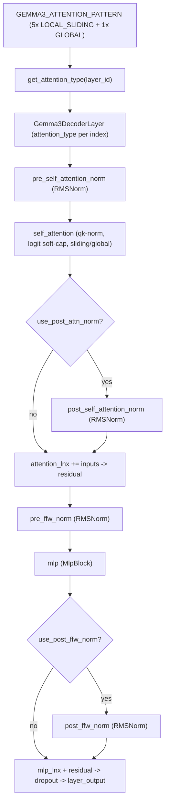

# MaxText Gemma 3 model — 5:1 local-sliding/global attention, sandwich norms, qk-norm, and the SigLIP vision tower

Scope: the Flax NNX definition of Gemma 3 in `src/maxtext/models/gemma3.py` — the decoder layer with its distinctive sandwich normalization and query/key norm, the fixed 5-local-then-1-global attention pattern, and the SigLIP-style vision encoder.

## Overview
Gemma 3's decoder is a standard two-residual transformer layer made distinctive by three choices that all live in this file: a **fixed repeating attention pattern** (five local-sliding layers then one global, cycled by [`get_attention_type`](../catalog/src/maxtext/models/gemma3.md#get_attention_type) over [`GEMMA3_ATTENTION_PATTERN`](../catalog/src/maxtext/models/gemma3.md#GEMMA3_ATTENTION_PATTERN)), **sandwich norms** (optional post-attention and post-FFN RMSNorms wrapping the usual pre-norms), and **always-on query/key normalization** with logit soft-capping inside attention. [`Gemma3ScannableBlock`](../catalog/src/maxtext/models/gemma3.md#Gemma3ScannableBlock.num_of_layers) builds the layers and stamps each one's attention type from its index. The 5:1 pattern is the perf-defining fact: five of every six layers attend only within a sliding window, so both attention FLOPs and KV-cache footprint are dominated by the sparse global layers rather than the sequence length.

## Diagram

## Design rationale (why it's built this way)
The attention schedule is a *constant tuple*, not a config knob: [`GEMMA3_ATTENTION_PATTERN`](../catalog/src/maxtext/models/gemma3.md#GEMMA3_ATTENTION_PATTERN) is literally `(LOCAL_SLIDING × 5, GLOBAL × 1)`, and [`get_attention_type`](../catalog/src/maxtext/models/gemma3.md#get_attention_type) resolves a layer's type with `layer_id %= len(pattern)`. Encoding the 5:1 ratio as a wrapped index means the pattern is period-6 and repeats cleanly regardless of depth — a scanned stack only needs its layer count to be a multiple of the period to be homogeneous under `scan`.

The double normalization ("sandwich norm") is Gemma's signature: [`Gemma3DecoderLayer`](../catalog/src/maxtext/models/gemma3.md#Gemma3DecoderLayer) always builds [`pre_self_attention_norm`](../catalog/src/maxtext/models/gemma3.md#Gemma3DecoderLayer.pre_self_attention_norm) and [`pre_ffw_norm`](../catalog/src/maxtext/models/gemma3.md#Gemma3DecoderLayer.pre_ffw_norm), and *conditionally* builds [`post_self_attention_norm`](../catalog/src/maxtext/models/gemma3.md#Gemma3DecoderLayer.post_self_attention_norm) and [`post_ffw_norm`](../catalog/src/maxtext/models/gemma3.md#Gemma3DecoderLayer.post_ffw_norm) (gated on `use_post_attn_norm` / `use_post_ffw_norm`, else set to `None`). Wrapping each sub-block's output in an extra RMSNorm before the residual add is a training-stability choice; leaving them optional keeps the same code able to load non-sandwiched variants.

Query/key norm is forced on: the attention module is constructed with a literal `use_qk_norm=True` and the source comment states "Gemma 3 models use query, key normalizations." The per-query scaling is model-size-dependent — [`get_query_pre_attn_scalar`](../catalog/src/maxtext/models/gemma3.md#get_query_pre_attn_scalar) ("Returns the scalar to multiply the query by before attention") returns `head_dim**-0.5` for gemma3-4b/12b but `(base_emb_dim // base_num_query_heads)**-0.5` for gemma3-27b, and raises on any other model name — so the 27B variant deliberately uses a different query normalization than its smaller siblings.

## Entry points
- [`Gemma3DecoderLayer.__call__`](../catalog/src/maxtext/models/gemma3.md#Gemma3DecoderLayer.__call__) — the per-layer forward, hit once per decoder layer (or scan step). Runs pre-norm → attention → optional post-norm → residual → pre-FFN-norm → MLP → optional post-FFN-norm → residual, and accepts a `bidirectional_mask` for multimodal image spans.
- [`num_of_layers`](../catalog/src/maxtext/models/gemma3.md#Gemma3ScannableBlock.num_of_layers) — the [`Gemma3ScannableBlock`](../catalog/src/maxtext/models/gemma3.md#Gemma3ScannableBlock.__call__) build-time field. The block loops `range(num_of_layers)`, calls [`get_attention_type`](../catalog/src/maxtext/models/gemma3.md#get_attention_type) per index, and constructs a [`Gemma3DecoderLayer`](../catalog/src/maxtext/models/gemma3.md#Gemma3DecoderLayer) with that attention type.
- [`Gemma3ScannableBlock.__call__`](../catalog/src/maxtext/models/gemma3.md#Gemma3ScannableBlock.__call__) — the block forward, which drives the stack of layers sequentially and threads the kv-cache list.

## Mechanism (step-by-step)
1. **Resolve each layer's attention type from its index.** During [`Gemma3ScannableBlock`](../catalog/src/maxtext/models/gemma3.md#Gemma3ScannableBlock.num_of_layers) construction, [`get_attention_type`](../catalog/src/maxtext/models/gemma3.md#get_attention_type) indexes into [`GEMMA3_ATTENTION_PATTERN`](../catalog/src/maxtext/models/gemma3.md#GEMMA3_ATTENTION_PATTERN) modulo 6, so layer indices 0–4 become `LOCAL_SLIDING` and index 5 becomes `GLOBAL`, repeating. The chosen [`attention_type`](../catalog/src/maxtext/models/gemma3.md#Gemma3DecoderLayer.attention_type) is stored on the layer and passed to its attention module. This is the point where five-sixths of the stack is committed to cheap windowed attention.

2. **Build attention with qk-norm, sliding window, and soft-cap.** In [`Gemma3DecoderLayer`](../catalog/src/maxtext/models/gemma3.md#Gemma3DecoderLayer), [`self_attention`](../catalog/src/maxtext/models/gemma3.md#Gemma3DecoderLayer.self_attention) is constructed from [`attention_type`](../catalog/src/maxtext/models/gemma3.md#Gemma3DecoderLayer.attention_type) plus `sliding_window_size`, `attn_logits_soft_cap`, `use_qk_norm=True`, and the size-dependent scalar from [`get_query_pre_attn_scalar`](../catalog/src/maxtext/models/gemma3.md#get_query_pre_attn_scalar). For local-sliding layers the window bounds the attended keys; for global layers it is unbounded. The soft-cap and qk-norm are the same on every layer.

3. **Pre-norm and attend.** [`Gemma3DecoderLayer.__call__`](../catalog/src/maxtext/models/gemma3.md#Gemma3DecoderLayer.__call__) applies [`pre_self_attention_norm`](../catalog/src/maxtext/models/gemma3.md#Gemma3DecoderLayer.pre_self_attention_norm) (RMSNorm), then calls [`self_attention`](../catalog/src/maxtext/models/gemma3.md#Gemma3DecoderLayer.self_attention) passing `bidirectional_mask` through — the mask lets image tokens attend bidirectionally within a multimodal sequence while text stays causal.

4. **Optional post-attention norm, then the first residual.** If `use_post_attn_norm`, the attention output is wrapped by [`post_self_attention_norm`](../catalog/src/maxtext/models/gemma3.md#Gemma3DecoderLayer.post_self_attention_norm) *before* the residual add; then `attention_lnx += inputs` and `residual = attention_lnx` capture the running stream. Sandwiching the norm inside the residual (rather than only pre-norming) is the stability trick that distinguishes Gemma from a vanilla pre-norm transformer. Activations are constrained to [`activation_axis_names`](../catalog/src/maxtext/models/gemma3.md#Gemma3DecoderLayer.activation_axis_names) throughout.

5. **Pre-FFN norm, MLP, optional post-FFN norm.** The layer applies [`pre_ffw_norm`](../catalog/src/maxtext/models/gemma3.md#Gemma3DecoderLayer.pre_ffw_norm), runs the dense [`mlp`](../catalog/src/maxtext/models/gemma3.md#Gemma3DecoderLayer.mlp) (a `MlpBlock`, no MoE in Gemma 3), and if `use_post_ffw_norm` wraps the result in [`post_ffw_norm`](../catalog/src/maxtext/models/gemma3.md#Gemma3DecoderLayer.post_ffw_norm) before the second residual. The FFN output is added to `residual`, passed through [`dropout`](../catalog/src/maxtext/models/gemma3.md#Gemma3DecoderLayer.dropout), and re-constrained to the activation axes to form `layer_output`.

6. **Return for scan or cache.** Like its Llama 4 sibling, [`Gemma3DecoderLayer.__call__`](../catalog/src/maxtext/models/gemma3.md#Gemma3DecoderLayer.__call__) detects a 3-tuple scan carry `(hidden_states, stacked_kv_cache, layer_idx)`, updates the stacked cache with [`update_cache`](../catalog/src/maxtext/models/gemma3.md#Gemma3DecoderLayer.update_cache) (`cache.at[layer_idx].set(val)` guarded by `jnp.size(val) > 0`), and returns `((layer_output, stacked_kv_cache, layer_idx+1), None)`; otherwise returns `(layer_output, kv_cache)`.

7. **Block-level sequential drive.** [`Gemma3ScannableBlock.__call__`](../catalog/src/maxtext/models/gemma3.md#Gemma3ScannableBlock.__call__) constrains the input to `(activation_batch, activation_norm_length, activation_embed)`, then loops `layer_id in range(num_of_layers)` calling each `layers_{id}` in turn, slicing `kv_cache[layer_id]` per layer and collecting `updated_kvs`. It returns `(y, tuple(updated_kvs))` when a cache is present, `(y, None)` under `scan_layers`, else bare `y` — the three shapes matching the same three usage modes.

8. **Vision tower (SigLIP-style).** The multimodal path builds a [`Gemma3VisionEncoderLayer`](../catalog/src/maxtext/models/gemma3.md#Gemma3VisionEncoderLayer.config) whose Conv [`embedding`](../catalog/src/maxtext/models/gemma3.md#Gemma3VisionEncoderLayer.embedding) patchifies the image, whose [`pos_embedding`](../catalog/src/maxtext/models/gemma3.md#Gemma3VisionEncoderLayer.pos_embedding) is produced by [`_get_posemb`](../catalog/src/maxtext/models/gemma3.md#Gemma3VisionEncoderLayer._get_posemb) ("Returns the position embedding" — either a learned `nnx.Param` or a `sincos2d` grid), and whose [`Transformer`](../catalog/src/maxtext/models/gemma3.md#Gemma3VisionEncoderLayer.Transformer) is an `Encoder` of [`Encoder1DBlock`](../catalog/src/maxtext/models/gemma3.md#Encoder1DBlock.config) layers. Each block is a classic LayerNorm-pre → full attention → LayerNorm → MLP residual pair: [`LayerNorm_0`](../catalog/src/maxtext/models/gemma3.md#Encoder1DBlock.LayerNorm_0) → [`MultiHeadDotProductAttention_0`](../catalog/src/maxtext/models/gemma3.md#Encoder1DBlock.MultiHeadDotProductAttention_0) → [`Dropout_0`](../catalog/src/maxtext/models/gemma3.md#Encoder1DBlock.Dropout_0) → residual → [`LayerNorm_1`](../catalog/src/maxtext/models/gemma3.md#Encoder1DBlock.LayerNorm_1) → [`MlpBlockViT_0`](../catalog/src/maxtext/models/gemma3.md#Encoder1DBlock.MlpBlockViT_0) → residual, over a sequence of [`seq_len`](../catalog/src/maxtext/models/gemma3.md#Encoder1DBlock.seq_len) = `(image_size/patch_size)²` patches.

## Key data structures
- **[`GEMMA3_ATTENTION_PATTERN`](../catalog/src/maxtext/models/gemma3.md#GEMMA3_ATTENTION_PATTERN)** — the period-6 tuple `(LOCAL_SLIDING×5, GLOBAL×1)` that is the single source of truth for the local/global schedule; changing it changes every layer's attention cost.
- **Per-layer [`attention_type`](../catalog/src/maxtext/models/gemma3.md#Gemma3DecoderLayer.attention_type)** — frozen at construction, selects sliding-window vs. global inside the attention module.
- **The four norms** — [`pre_self_attention_norm`](../catalog/src/maxtext/models/gemma3.md#Gemma3DecoderLayer.pre_self_attention_norm), [`post_self_attention_norm`](../catalog/src/maxtext/models/gemma3.md#Gemma3DecoderLayer.post_self_attention_norm), [`pre_ffw_norm`](../catalog/src/maxtext/models/gemma3.md#Gemma3DecoderLayer.pre_ffw_norm), [`post_ffw_norm`](../catalog/src/maxtext/models/gemma3.md#Gemma3DecoderLayer.post_ffw_norm) — with the two post-norms possibly `None`; their presence is the sandwich-norm switch.
- **[`activation_axis_names`](../catalog/src/maxtext/models/gemma3.md#Gemma3DecoderLayer.activation_axis_names)** — the `(batch, norm_length, embed)` logical sharding tuple applied to every activation (prefill swaps in `prefill_activation_norm_length`).

## Dynamics (design intent)
[`Gemma3DecoderLayer`](../catalog/src/maxtext/models/gemma3.md#Gemma3DecoderLayer)'s docstring is "Transformer decoder layer for Gemma3", and its constructor documents the three `model_mode` values (`TRAIN`/`PREFILL`/`AUTOREGRESSIVE`) and an `attention_type` default of `LOCAL_SLIDING`. [`Gemma3ScannableBlock`](../catalog/src/maxtext/models/gemma3.md#Gemma3ScannableBlock.__call__) is "A repeatable block of Gemma3 decoder layers" whose [`num_of_layers`](../catalog/src/maxtext/models/gemma3.md#Gemma3ScannableBlock.num_of_layers) sets how many attention-typed layers it stamps. [`quant`](../catalog/src/maxtext/models/gemma3.md#Gemma3DecoderLayer.quant) is optional and forwarded into attention and MLP unchanged.

## Edge cases
- **`get_query_pre_attn_scalar` raises on unknown models.** [`get_query_pre_attn_scalar`](../catalog/src/maxtext/models/gemma3.md#get_query_pre_attn_scalar) only handles `gemma3-4b`, `gemma3-12b`, and `gemma3-27b` (with 27B using a different formula) — any other `model_name` raises `ValueError`. New Gemma 3 sizes must extend this function.
- **Post-norms may be `None`.** Both [`post_self_attention_norm`](../catalog/src/maxtext/models/gemma3.md#Gemma3DecoderLayer.post_self_attention_norm) and [`post_ffw_norm`](../catalog/src/maxtext/models/gemma3.md#Gemma3DecoderLayer.post_ffw_norm) are set to `None` when their config flag is off; the forward pass guards on `cfg.use_post_attn_norm` / `cfg.use_post_ffw_norm` before applying them.
- **Vision attention is full, no qk-norm.** The [`MultiHeadDotProductAttention_0`](../catalog/src/maxtext/models/gemma3.md#Encoder1DBlock.MultiHeadDotProductAttention_0) in the SigLIP encoder uses `AttentionType.FULL` with `use_qk_norm=False` — the text-decoder's sliding-window/qk-norm tuning does not apply to the tower, which processes a fixed [`seq_len`](../catalog/src/maxtext/models/gemma3.md#Encoder1DBlock.seq_len) of patches in one pass.
- **`bidirectional_mask` is optional.** It is threaded through [`Gemma3ScannableBlock.__call__`](../catalog/src/maxtext/models/gemma3.md#Gemma3ScannableBlock.__call__) into every [`self_attention`](../catalog/src/maxtext/models/gemma3.md#Gemma3DecoderLayer.self_attention); text-only runs pass `None` and attention stays purely causal.

## Open questions
- How `sliding_window_size` and `attn_logits_soft_cap` are actually applied (mask construction, cap arithmetic) lives inside the shared `Attention` module, not this file — the layer only supplies the values.
- The `sincos2d` position-embedding branch of [`_get_posemb`](../catalog/src/maxtext/models/gemma3.md#Gemma3VisionEncoderLayer._get_posemb) delegates to a `_posemb_sincos_2d` helper outside this subgraph; its exact frequency layout is not visible here.
- Whether the vision encoder participates in `scan` is explicitly deferred — the source `Encoder` carries a TODO to "add if-scan branch to enable scan support for vision encoder," so today it is an unrolled loop.

## See also
- [MaxText Llama 4 model](maxtext-models-llama4.md) — the sibling interleaved-attention model (chunked-local vs. global NoPE, iRoPE) that additionally interleaves dense and MoE FFNs.
