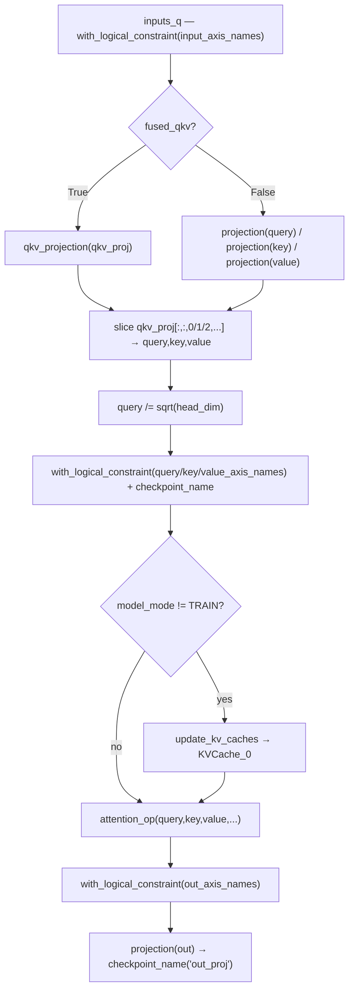

# GPT-3 multi-head attention (fused QKV, sharded projections)
MaxText's `Gpt3MultiHeadAttention` — the GPT-3-flavoured attention block whose defining perf choices are a single fused QKV matmul, biased dense projections, and logical-axis sharding constraints on every intermediate tensor.

## Overview
This module is the attention core of MaxText's GPT-3 decoder. Its whole shape is set at construction time in `__init__`: it decides once whether Q/K/V come from one fused projection or three separate ones, builds the `DenseGeneral` projection layers, and instantiates a single [`attention_op`](../catalog/src/maxtext/models/gpt3.md#Gpt3MultiHeadAttention.attention_op) that does the actual scaled-dot-product work. The forward pass ([`__call__`](../catalog/src/maxtext/models/gpt3.md#Gpt3MultiHeadAttention.__call__)) is then a thin sequence: project → scale query → annotate sharding → (optionally cache) → attention → output-project. The single key design idea for the perf loop is **fusion + explicit sharding**: one matmul emits all three projections stacked on a `qkv` axis, and every tensor that crosses a mesh boundary is pinned with `nn.with_logical_constraint` so XLA's SPMD partitioner places it deterministically rather than guessing.

GPT-3 here is plain multi-head attention (not GQA): [`num_heads`](../catalog/src/maxtext/models/gpt3.md#Gpt3MultiHeadAttention.num_heads) is used for both query and KV head counts, projections carry a bias ([`use_bias`](../catalog/src/maxtext/models/gpt3.md#Gpt3MultiHeadAttention.use_bias)), and the query is pre-divided by √[`head_dim`](../catalog/src/maxtext/models/gpt3.md#Gpt3MultiHeadAttention.head_dim) before attention rather than inside the kernel.

## Diagram

## Design rationale (why it's built this way)
The fused QKV path exists for MXU efficiency. When [`fused_qkv`](../catalog/src/maxtext/models/gpt3.md#Gpt3MultiHeadAttention.fused_qkv) is true (the constructor default), the block allocates one projection whose output shape is `(3, num_heads, head_dim)` with kernel axes `("embed", "qkv", "heads", "kv")`, so a single large matmul produces all of Q, K, and V, which are then split by a cheap slice inside [`qkv_projection`](../catalog/src/maxtext/models/gpt3.md#Gpt3MultiHeadAttention.qkv_projection). One big matmul keeps the systolic array busier and cuts kernel-launch and layout-transition overhead versus three narrow matmuls; the separate-projection branch ([`query`](../catalog/src/maxtext/models/gpt3.md#Gpt3MultiHeadAttention.query)/[`key`](../catalog/src/maxtext/models/gpt3.md#Gpt3MultiHeadAttention.key)/[`value`](../catalog/src/maxtext/models/gpt3.md#Gpt3MultiHeadAttention.value)) is kept only as a fallback for configs that need it.

Sharding is declarative, not incidental. Each projection is built through [`create_projection_layer`](../catalog/src/maxtext/models/gpt3.md#Gpt3MultiHeadAttention.create_projection_layer), whose docstring states its purpose — *"Create projection layer for Key, Value, Query and Output"* — and which threads `kernel_axes` into `DenseGeneral`, while `__call__` re-asserts the *activation* layout with `nn.with_logical_constraint` against [`query_axis_names`](../catalog/src/maxtext/models/gpt3.md#Gpt3MultiHeadAttention.query_axis_names), [`key_axis_names`](../catalog/src/maxtext/models/gpt3.md#Gpt3MultiHeadAttention.key_axis_names), [`value_axis_names`](../catalog/src/maxtext/models/gpt3.md#Gpt3MultiHeadAttention.value_axis_names), and [`out_axis_names`](../catalog/src/maxtext/models/gpt3.md#Gpt3MultiHeadAttention.out_axis_names). Both the weights *and* the activations are pinned, which is what lets the same code run at any mesh shape without XLA silently choosing an expensive partition.

Numerical-stability knobs are surfaced as flags rather than hard-coded: [`float32_qk_product`](../catalog/src/maxtext/models/gpt3.md#Gpt3MultiHeadAttention.float32_qk_product) and [`float32_logits`](../catalog/src/maxtext/models/gpt3.md#Gpt3MultiHeadAttention.float32_logits) let the QK product and softmax logits run in fp32 for stability while the rest of the block stays in [`dtype`](../catalog/src/maxtext/models/gpt3.md#Gpt3MultiHeadAttention.dtype). These trade a little bandwidth for stability inside [`attention_op`](../catalog/src/maxtext/models/gpt3.md#Gpt3MultiHeadAttention.attention_op) and are perf-relevant because fp32 logits widen the attention intermediates.

> [!inferred]
> Dividing the query by √head_dim *before* the attention op (rather than scaling logits inside the kernel) is the classic GPT-3 formulation and means the scale is folded into a tensor XLA can fuse with the preceding projection; the source does this unconditionally, but the packet does not expose the attention kernel internals to confirm the kernel does not re-scale.

## Entry points
- [`__call__`](../catalog/src/maxtext/models/gpt3.md#Gpt3MultiHeadAttention.__call__) — the forward pass, hit once per layer per step. It orchestrates projection → scaling → sharding annotation → optional KV-cache update → [`attention_op`](../catalog/src/maxtext/models/gpt3.md#Gpt3MultiHeadAttention.attention_op) → output projection, returning `(out, kv_cache)`.
- [`create_projection_layer`](../catalog/src/maxtext/models/gpt3.md#Gpt3MultiHeadAttention.create_projection_layer) — construction-time factory reached from `__init__` for each of the fused-QKV weight, the separate Q/K/V weights, and the output weight [`out`](../catalog/src/maxtext/models/gpt3.md#Gpt3MultiHeadAttention.out). It fixes the sharded weight layout (`kernel_axes`) and precision (`dtype`, [`weight_dtype`](../catalog/src/maxtext/models/gpt3.md#Gpt3MultiHeadAttention.weight_dtype), [`quant`](../catalog/src/maxtext/models/gpt3.md#Gpt3MultiHeadAttention.quant)).
- [`init_kv_caches`](../catalog/src/maxtext/models/gpt3.md#Gpt3MultiHeadAttention.init_kv_caches) — reached from `__init__` only when [`model_mode`](../catalog/src/maxtext/models/gpt3.md#Gpt3MultiHeadAttention.model_mode) is not training; it builds the `KVCache` that [`update_kv_caches`](../catalog/src/maxtext/models/gpt3.md#Gpt3MultiHeadAttention.update_kv_caches) later fills. In a training run it is never called and [`KVCache_0`](../catalog/src/maxtext/models/gpt3.md#Gpt3MultiHeadAttention.KVCache_0) stays `None`.

## Mechanism (step-by-step)
1. **Construction fixes the projection topology.** `__init__` stores [`config`](../catalog/src/maxtext/models/gpt3.md#Gpt3MultiHeadAttention.config), [`num_heads`](../catalog/src/maxtext/models/gpt3.md#Gpt3MultiHeadAttention.num_heads), [`head_dim`](../catalog/src/maxtext/models/gpt3.md#Gpt3MultiHeadAttention.head_dim), the axis-name tuples, and precision knobs, then — when [`fused_qkv`](../catalog/src/maxtext/models/gpt3.md#Gpt3MultiHeadAttention.fused_qkv) is set — builds a single `qkv_proj` of output shape `(3, num_heads, head_dim)`; otherwise it builds three separate [`query`](../catalog/src/maxtext/models/gpt3.md#Gpt3MultiHeadAttention.query)/[`key`](../catalog/src/maxtext/models/gpt3.md#Gpt3MultiHeadAttention.key)/[`value`](../catalog/src/maxtext/models/gpt3.md#Gpt3MultiHeadAttention.value) layers. The output projection [`out`](../catalog/src/maxtext/models/gpt3.md#Gpt3MultiHeadAttention.out) contracts over `(-2, -1)` = `(heads, kv)` back to the embedding dim.
2. **Each projection layer is a sharded, biased `DenseGeneral`.** [`create_projection_layer`](../catalog/src/maxtext/models/gpt3.md#Gpt3MultiHeadAttention.create_projection_layer) canonicalizes the contraction axis, computes the in-features shape, and hands `kernel_axes`, [`kernel_init`](../catalog/src/maxtext/models/gpt3.md#Gpt3MultiHeadAttention.kernel_init), [`dtype`](../catalog/src/maxtext/models/gpt3.md#Gpt3MultiHeadAttention.dtype)/[`weight_dtype`](../catalog/src/maxtext/models/gpt3.md#Gpt3MultiHeadAttention.weight_dtype), [`quant`](../catalog/src/maxtext/models/gpt3.md#Gpt3MultiHeadAttention.quant), [`use_bias`](../catalog/src/maxtext/models/gpt3.md#Gpt3MultiHeadAttention.use_bias), and `config.matmul_precision` to `DenseGeneral`. This is where weight sharding and matmul precision are decided for all four projections at once.
3. **The forward pass projects and splits.** `__call__` first pins the input with `nn.with_logical_constraint` against [`input_axis_names`](../catalog/src/maxtext/models/gpt3.md#Gpt3MultiHeadAttention.input_axis_names). On the fused path it calls [`qkv_projection`](../catalog/src/maxtext/models/gpt3.md#Gpt3MultiHeadAttention.qkv_projection), which runs the one matmul, tags the result with `checkpoint_name("qkv_proj")` for rematerialization, then slices `qkv_proj[:, :, 0/1/2, ...]` into query, key, value. On the fallback path it calls [`projection`](../catalog/src/maxtext/models/gpt3.md#Gpt3MultiHeadAttention.projection) three times — its docstring: *"individual projection for one of q, k and v."*
4. **Query is pre-scaled and every tensor is re-pinned.** `__call__` divides the query by `sqrt(head_dim)` cast to [`dtype`](../catalog/src/maxtext/models/gpt3.md#Gpt3MultiHeadAttention.dtype), then re-asserts the sharding of query/key/value against [`query_axis_names`](../catalog/src/maxtext/models/gpt3.md#Gpt3MultiHeadAttention.query_axis_names)/[`key_axis_names`](../catalog/src/maxtext/models/gpt3.md#Gpt3MultiHeadAttention.key_axis_names)/[`value_axis_names`](../catalog/src/maxtext/models/gpt3.md#Gpt3MultiHeadAttention.value_axis_names) and checkpoints each for remat. Re-pinning after the slice matters because the slice can lose the partition spec that the fused matmul produced.
5. **KV cache is updated only outside training.** When [`model_mode`](../catalog/src/maxtext/models/gpt3.md#Gpt3MultiHeadAttention.model_mode) differs from train, [`update_kv_caches`](../catalog/src/maxtext/models/gpt3.md#Gpt3MultiHeadAttention.update_kv_caches) calls the pre-built [`KVCache_0`](../catalog/src/maxtext/models/gpt3.md#Gpt3MultiHeadAttention.KVCache_0) with `use_ragged_attention=`[`use_ragged_attention`](../catalog/src/maxtext/models/gpt3.md#Gpt3MultiHeadAttention.use_ragged_attention) (hard-`False` here) and returns `[prefill_kv_cache, ar_kv_cache]`. In training this branch is skipped entirely and `cached_values` stays `[None, None]`, so the cache adds no cost to the training step.
6. **Attention then output projection.** `__call__` invokes [`attention_op`](../catalog/src/maxtext/models/gpt3.md#Gpt3MultiHeadAttention.attention_op) — an `AttentionOp` configured at build time with [`attention_kernel`](../catalog/src/maxtext/models/gpt3.md#Gpt3MultiHeadAttention.attention_kernel), the fp32 flags, [`kv_quant`](../catalog/src/maxtext/models/gpt3.md#Gpt3MultiHeadAttention.kv_quant), [`mesh`](../catalog/src/maxtext/models/gpt3.md#Gpt3MultiHeadAttention.mesh), and `num_query_heads = num_kv_heads = num_heads` — pins the result with `out_axis_names`, then runs it through the output [`projection`](../catalog/src/maxtext/models/gpt3.md#Gpt3MultiHeadAttention.projection) using [`out`](../catalog/src/maxtext/models/gpt3.md#Gpt3MultiHeadAttention.out), checkpointing as `"out_proj"`.

## Key data structures
- **The four `DenseGeneral` projections** — [`qkv_proj`](../catalog/src/maxtext/models/gpt3.md#Gpt3MultiHeadAttention.qkv_proj) (or the split [`query`](../catalog/src/maxtext/models/gpt3.md#Gpt3MultiHeadAttention.query)/[`key`](../catalog/src/maxtext/models/gpt3.md#Gpt3MultiHeadAttention.key)/[`value`](../catalog/src/maxtext/models/gpt3.md#Gpt3MultiHeadAttention.value)) plus [`out`](../catalog/src/maxtext/models/gpt3.md#Gpt3MultiHeadAttention.out). These hold the sharded weights; their `kernel_axes` are the perf-load-bearing part.
- **`attention_op`** — the single [`attention_op`](../catalog/src/maxtext/models/gpt3.md#Gpt3MultiHeadAttention.attention_op) `AttentionOp` instance carrying kernel selection, precision, quantization, and mesh; the block owns exactly one.
- **KV cache state** — [`KVCache_0`](../catalog/src/maxtext/models/gpt3.md#Gpt3MultiHeadAttention.KVCache_0), built by [`init_kv_caches`](../catalog/src/maxtext/models/gpt3.md#Gpt3MultiHeadAttention.init_kv_caches) with the cache layout orders [`prefill_cache_axis_order`](../catalog/src/maxtext/models/gpt3.md#Gpt3MultiHeadAttention.prefill_cache_axis_order) and [`ar_cache_axis_order`](../catalog/src/maxtext/models/gpt3.md#Gpt3MultiHeadAttention.ar_cache_axis_order) (both `(1, 2, 0, 3)`) and bounded by [`max_prefill_predict_length`](../catalog/src/maxtext/models/gpt3.md#Gpt3MultiHeadAttention.max_prefill_predict_length) / [`max_target_length`](../catalog/src/maxtext/models/gpt3.md#Gpt3MultiHeadAttention.max_target_length). Inference-only.

## Dynamics (design intent)
The projection topology and the attention op are decided **once at construction** and captured into the traced graph; the branch on [`fused_qkv`](../catalog/src/maxtext/models/gpt3.md#Gpt3MultiHeadAttention.fused_qkv) in `__init__` means only one matmul shape ever appears in the compiled program, and the branch on [`model_mode`](../catalog/src/maxtext/models/gpt3.md#Gpt3MultiHeadAttention.model_mode) means the training graph contains no KV-cache ops at all. Because [`rngs`](../catalog/src/maxtext/models/gpt3.md#Gpt3MultiHeadAttention.rngs) and precision are threaded through [`create_projection_layer`](../catalog/src/maxtext/models/gpt3.md#Gpt3MultiHeadAttention.create_projection_layer), all four projections share one precision/quantization policy rather than diverging per-tensor.

## Edge cases
- **Separate-projection fallback:** if [`fused_qkv`](../catalog/src/maxtext/models/gpt3.md#Gpt3MultiHeadAttention.fused_qkv) is false the three-matmul path via [`projection`](../catalog/src/maxtext/models/gpt3.md#Gpt3MultiHeadAttention.projection) is used; the rest of `__call__` is identical, so this is the axis to flip when comparing fused-vs-unfused perf.
- **Ragged attention is disabled:** [`use_ragged_attention`](../catalog/src/maxtext/models/gpt3.md#Gpt3MultiHeadAttention.use_ragged_attention) is hard-coded `False`, so the KV-cache path never takes the ragged branch even in inference.
- **Cache absent in training:** [`KVCache_0`](../catalog/src/maxtext/models/gpt3.md#Gpt3MultiHeadAttention.KVCache_0) is `None` under `MODEL_MODE_TRAIN`; calling [`update_kv_caches`](../catalog/src/maxtext/models/gpt3.md#Gpt3MultiHeadAttention.update_kv_caches) in that mode would dereference `None`, but `__call__` guards it behind the mode check.

## Open questions
- The `AttentionOp` implementation (how [`attention_kernel`](../catalog/src/maxtext/models/gpt3.md#Gpt3MultiHeadAttention.attention_kernel) selects flash/splash vs a dense kernel, and whether it re-scales the query) is outside this packet's subgraph; resolving the actual TPU attention kernel requires the `AttentionOp` module.
- `DenseGeneral`'s exact sharding realization of `kernel_axes` (which mesh axis each of `embed`/`qkv`/`heads`/`kv` maps to) lives in the layers module, not here.

## See also
- [`maxtext-input_pipeline-olmo_data`](maxtext-input_pipeline-olmo_data.md) — the host-side input pipeline that must keep this attention block fed.
