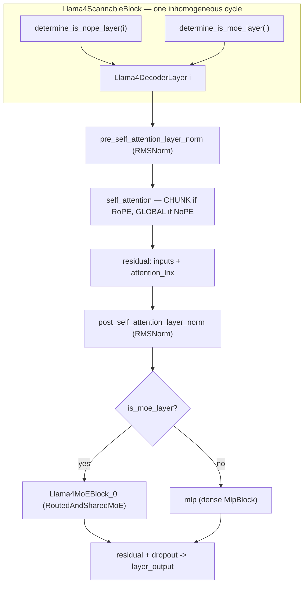

# MaxText Llama 4 model — interleaved MoE, chunked/global attention (iRoPE), and the vision tower

Scope: the Flax NNX definition of Llama 4 in `src/maxtext/models/llama4.py` — the heterogeneous decoder stack (dense/MoE and chunked-local/global-NoPE layers interleaved by stride) plus the Llama4 vision encoder that patchifies images and feeds the multimodal projector.

## Overview
Llama 4 is not a homogeneous transformer: within one repeatable cycle, each decoder layer is independently *dense or MoE* and *chunked-local (RoPE) or global (NoPE)*, chosen purely by its index. Two tiny stride predicates — [`determine_is_moe_layer`](../catalog/src/maxtext/models/llama4.md#determine_is_moe_layer) and [`determine_is_nope_layer`](../catalog/src/maxtext/models/llama4.md#determine_is_nope_layer) — decide the personality of layer *i*, and [`Llama4ScannableBlock`](../catalog/src/maxtext/models/llama4.md#Llama4ScannableBlock.interleave_moe_layer_step) materializes exactly one cycle of these heterogeneous [`Llama4DecoderLayer`](../catalog/src/maxtext/models/llama4.md#Llama4DecoderLayer) instances for `scan` to repeat. This "iRoPE" design (interleaved RoPE) is the perf-defining fact of the model: most layers attend only within a fixed chunk window, and only the sparse NoPE layers pay full global-attention cost. A separate, self-contained vision tower ([`Llama4VisionModel.__call__`](../catalog/src/maxtext/models/llama4.md#Llama4VisionModel.__call__)) turns image tiles into embeddings.

## Diagram

## Design rationale (why it's built this way)
The heterogeneity is expressed as *per-index predicates over a single cycle length* rather than a hand-written list of layer types. [`determine_is_moe_layer`](../catalog/src/maxtext/models/llama4.md#determine_is_moe_layer) is a strict-stride rule — its docstring: "If moe_layer_stride is 2, layers with index 1, 3, 5, ... are MoE layers" — using `(layer_id + 1) % interleave_moe_layer_step == 0`. [`determine_is_nope_layer`](../catalog/src/maxtext/models/llama4.md#determine_is_nope_layer) is the same shape ("whether the given layer should use RoPE or not (NoPE)"). Keeping both as pure functions of `(layer_id, interval)` means the whole stack is described by two integers, and the `scan`-friendly cycle only needs to be as long as the least-common repeat.

> [!inferred]
> The perf motive for iRoPE: chunked-local layers (the majority) cap attention cost per query to a fixed window regardless of sequence length, so the stack scales near-linearly in context; the sparse global NoPE layers restore full long-range mixing but are the only ones paying O(seq²). Interleaving is what lets Llama 4 claim very long context without quadratic blow-up on every layer.

The naming of the second norm is a deliberate compatibility choice, not a description: [`post_self_attention_layer_norm`](../catalog/src/maxtext/models/llama4.md#Llama4DecoderLayer.post_self_attention_layer_norm) is applied *before* the feed-forward block (it is the pre-FFN norm in a standard two-residual layer), and [`Llama4MoEBlock_0`](../catalog/src/maxtext/models/llama4.md#Llama4DecoderLayer.Llama4MoEBlock_0) carries a comment that its attribute name is fixed "to ensure reverse compatibility with existing checkpoints." The query scaling is likewise done in the forward pass rather than baked into the checkpoint — the source note explains the `query_pre_attn_scalar = config.head_dim**-0.5` is applied dynamically "instead of scaling the query values in the checkpoint conversion."

## Entry points
- [`Llama4DecoderLayer.__call__`](../catalog/src/maxtext/models/llama4.md#Llama4DecoderLayer.__call__) — the per-layer forward. Reached once per decoder layer (or once per `scan` step). It runs the norm → attention → residual → norm → (MoE or dense MLP) → residual pipeline and returns `(layer_output, kv_cache)`, adapting its return shape for scan-carry vs. cache modes.
- [`interleave_moe_layer_step`](../catalog/src/maxtext/models/llama4.md#Llama4ScannableBlock.interleave_moe_layer_step) — the [`Llama4ScannableBlock`](../catalog/src/maxtext/models/llama4.md#Llama4DecoderLayer) constructor field. Reached at build time; the block loops over `inhomogeneous_layer_cycle_interval`, calls the two stride predicates per index, and constructs a [`Llama4DecoderLayer`](../catalog/src/maxtext/models/llama4.md#Llama4DecoderLayer) with the resulting `is_nope_layer` / `is_moe_layer` flags.
- [`Llama4VisionModel.__call__`](../catalog/src/maxtext/models/llama4.md#Llama4VisionModel.__call__) — the vision tower forward, hit once per image batch. Its docstring: "Forward pass of the Llama4 vision model." Independent of the text decoder and cacheless.

## Mechanism (step-by-step)
1. **Assign each layer its personality.** As [`Llama4ScannableBlock`](../catalog/src/maxtext/models/llama4.md#Llama4ScannableBlock.interleave_moe_layer_step) is constructed, it iterates the cycle and calls [`determine_is_nope_layer`](../catalog/src/maxtext/models/llama4.md#determine_is_nope_layer) and [`determine_is_moe_layer`](../catalog/src/maxtext/models/llama4.md#determine_is_moe_layer) for each `layer_id`, driven by [`nope_layer_interval`](../catalog/src/maxtext/models/llama4.md#Llama4ScannableBlock.nope_layer_interval) and [`interleave_moe_layer_step`](../catalog/src/maxtext/models/llama4.md#Llama4ScannableBlock.interleave_moe_layer_step). The booleans flow into each [`Llama4DecoderLayer`](../catalog/src/maxtext/models/llama4.md#Llama4DecoderLayer)'s `is_nope_layer` / `is_moe_layer`. This is where a token's attention window and its FFN type are decided — before any activations exist.

2. **Pick attention type from the NoPE flag.** In the layer constructor, [`self_attention`](../catalog/src/maxtext/models/llama4.md#Llama4DecoderLayer.self_attention) is built with `attention_type = AttentionType.GLOBAL if self.is_nope_layer else AttentionType.CHUNK`, keyed off [`is_nope_layer`](../catalog/src/maxtext/models/llama4.md#Llama4DecoderLayer.is_nope_layer). NoPE layers drop rotary embeddings and attend globally; RoPE layers use chunked-local attention bounded by `chunk_attn_window_size`. This single ternary is the entire perf lever of iRoPE — the majority (chunked) layers are cheap, the sparse global layers are expensive. `use_qk_norm` and long-context `temperature_tuning` are also wired here from config.

3. **Norm, attend, residual (first sub-block).** [`Llama4DecoderLayer.__call__`](../catalog/src/maxtext/models/llama4.md#Llama4DecoderLayer.__call__) applies [`pre_self_attention_layer_norm`](../catalog/src/maxtext/models/llama4.md#Llama4DecoderLayer.pre_self_attention_layer_norm) (RMSNorm), runs [`self_attention`](../catalog/src/maxtext/models/llama4.md#Llama4DecoderLayer.self_attention) with the segment ids/positions/kv-cache, then forms `intermediate_inputs = inputs + attention_lnx`. Every intermediate is pinned to [`activation_axis_names`](../catalog/src/maxtext/models/llama4.md#Llama4DecoderLayer.activation_axis_names) via `nn.with_logical_constraint`, which is how the layer's activation sharding is expressed to the compiler.

4. **Second norm, then dense-or-MoE FFN.** The layer applies [`post_self_attention_layer_norm`](../catalog/src/maxtext/models/llama4.md#Llama4DecoderLayer.post_self_attention_layer_norm) (the pre-FFN RMSNorm) and branches on [`is_moe_layer`](../catalog/src/maxtext/models/llama4.md#Llama4DecoderLayer.is_moe_layer): MoE layers call [`moe_block`](../catalog/src/maxtext/models/llama4.md#Llama4DecoderLayer.moe_block) (a property returning [`Llama4MoEBlock_0`](../catalog/src/maxtext/models/llama4.md#Llama4DecoderLayer.Llama4MoEBlock_0), a `RoutedAndSharedMoE` that combines routed experts with a shared expert) and also produce a `load_balance_loss`; dense layers call [`mlp`](../catalog/src/maxtext/models/llama4.md#Llama4DecoderLayer.mlp). The two paths are mutually exclusive per layer — only one of the two modules is even constructed — which keeps parameter count and the compiled graph tight.

5. **Second residual, dropout, and metric sowing.** The FFN output is added back (`layer_output = mlp_lnx + intermediate_inputs`) and passed through [`dropout`](../catalog/src/maxtext/models/llama4.md#Llama4DecoderLayer.dropout). When the MoE path ran and `load_balance_loss_weight > 0`, the load-balance loss is `sow`n as an intermediate so the trainer can add it to the objective — this is the only cross-layer signal a MoE layer emits.

6. **Return in the right shape for scan or cache.** The layer inspects whether `inputs` arrived as a 3-tuple scan carry `(hidden_states, stacked_kv_cache, layer_idx)`. If so it writes the new kv into the stacked cache via [`update_cache`](../catalog/src/maxtext/models/llama4.md#Llama4DecoderLayer.update_cache) (`cache.at[layer_idx].set(val)` guarded by `jnp.size(val) > 0`) and returns `((layer_output, stacked_kv_cache, layer_idx + 1), None)`; under `scan_layers` it returns `(layer_output, None)`; otherwise `(layer_output, kv_cache)`. This tri-modal return is what lets the same layer body be reused under `nnx.scan`, plain unrolling, or autoregressive decode.

7. **Vision tower: patchify → encode → pixel-shuffle.** [`Llama4VisionModel.__call__`](../catalog/src/maxtext/models/llama4.md#Llama4VisionModel.__call__) reshapes `[b, t, c, h, w]` tiles, extracts patches with [`Llama4UnfoldConvolution_0`](../catalog/src/maxtext/models/llama4.md#Llama4VisionModel.Llama4UnfoldConvolution_0) (a `lax.conv_general_dilated_patches` unfold, see [`Llama4UnfoldConvolution`](../catalog/src/maxtext/models/llama4.md#Llama4UnfoldConvolution)), prepends a learned [`class_embedding`](../catalog/src/maxtext/models/llama4.md#Llama4VisionModel.class_embedding), adds [`positional_embedding_vlm`](../catalog/src/maxtext/models/llama4.md#Llama4VisionModel.positional_embedding_vlm), applies [`layernorm_pre`](../catalog/src/maxtext/models/llama4.md#Llama4VisionModel.layernorm_pre), runs the transformer [`Llama4VisionEncoder_0`](../catalog/src/maxtext/models/llama4.md#Llama4VisionModel.Llama4VisionEncoder_0), applies [`layernorm_post`](../catalog/src/maxtext/models/llama4.md#Llama4VisionModel.layernorm_post), drops the class token, and downsamples with [`Llama4VisionPixelShuffleMLP_0`](../catalog/src/maxtext/models/llama4.md#Llama4VisionModel.Llama4VisionPixelShuffleMLP_0). The encoder layers use **full** attention, not chunked — see Edge cases.

## Key data structures
- **The two stride intervals** — [`nope_layer_interval`](../catalog/src/maxtext/models/llama4.md#Llama4ScannableBlock.nope_layer_interval) and [`interleave_moe_layer_step`](../catalog/src/maxtext/models/llama4.md#Llama4ScannableBlock.interleave_moe_layer_step) — are the entire specification of the stack's heterogeneity; everything else in the cycle is derived from them plus `inhomogeneous_layer_cycle_interval`.
- **Per-layer personality flags** [`is_nope_layer`](../catalog/src/maxtext/models/llama4.md#Llama4DecoderLayer.is_nope_layer) and [`is_moe_layer`](../catalog/src/maxtext/models/llama4.md#Llama4DecoderLayer.is_moe_layer) are frozen at construction and select both the attention type and which FFN module exists.
- **The stacked kv cache** threaded through [`update_cache`](../catalog/src/maxtext/models/llama4.md#Llama4DecoderLayer.update_cache) is a per-layer-indexed array (`cache.at[layer_idx]`), so a scanned stack shares one cache tensor addressed by the carried `layer_idx`.
- **[`activation_axis_names`](../catalog/src/maxtext/models/llama4.md#Llama4DecoderLayer.activation_axis_names)** — the `(batch, norm_length, embed)` logical axis tuple (prefill uses `prefill_activation_norm_length`) that names how every activation is sharded across the mesh.

## Dynamics (design intent)
[`Llama4DecoderLayer`](../catalog/src/maxtext/models/llama4.md#Llama4DecoderLayer)'s docstring — "Transformer decoder layer for Llama4" — and the constructor args document three [`model_mode`](../catalog/src/maxtext/models/llama4.md#Llama4ScannableBlock.model_mode) values (`TRAIN`, `PREFILL`, `AUTOREGRESSIVE`); the mode changes only the activation-length axis name and the dummy shapes, not the layer logic. [`quant`](../catalog/src/maxtext/models/llama4.md#Llama4DecoderLayer.quant) is optional and passed unchanged into both attention and the FFN. The vision encoder [`Llama4VisionEncoder`](../catalog/src/maxtext/models/llama4.md#Llama4VisionEncoder) — "Transformer encoder consisting of multiple Llama4VisionEncoderLayer layers" — is built as a fixed unrolled loop of layers, with no scan and no kv cache (the tower is a single forward pass).

## Edge cases
- **Vision attention is full and un-normed on q/k.** [`self_attention_vision`](../catalog/src/maxtext/models/llama4.md#Llama4VisionEncoderLayer.self_attention_vision) is built with `attention_type = AttentionType.FULL`, `use_qk_norm=False`, and bias-in-projections — the opposite of the text stack's chunked/global iRoPE with qk-norm. Do not assume text-side attention tuning transfers to the tower.
- **MoE emits a side loss only conditionally.** The `load_balance_loss` from [`moe_block`](../catalog/src/maxtext/models/llama4.md#Llama4DecoderLayer.moe_block) is sown only when `load_balance_loss_weight > 0`; dense layers never produce it. A per-layer profile that expects a uniform op set will see MoE layers as structurally different.
- **`num_experts >= 1` is asserted** at the top of [`Llama4DecoderLayer.__call__`](../catalog/src/maxtext/models/llama4.md#Llama4DecoderLayer.__call__): the Llama 4 config path assumes an MoE-capable config even for dense layers.
- **`update_cache` no-ops on empty vals.** [`update_cache`](../catalog/src/maxtext/models/llama4.md#Llama4DecoderLayer.update_cache) guards with `jnp.size(val) > 0`, so a layer producing an empty kv (e.g. training with no cache) leaves the stacked cache untouched.

## Open questions
- The exact value of `chunk_attn_window_size` and how CHUNK attention is masked live inside the `Attention` module and the config, not in this subgraph — the layer only selects the type. Confirm the window size and its interaction with `sequence` sharding from the attention module.
- The `RoutedAndSharedMoE` internals (router, expert count, shared-vs-routed split, capacity factor) are outside this packet; [`Llama4MoEBlock_0`](../catalog/src/maxtext/models/llama4.md#Llama4DecoderLayer.Llama4MoEBlock_0) only names the module.
- `temperature_tuning` (long-context attention temperature scaling) is passed into [`self_attention`](../catalog/src/maxtext/models/llama4.md#Llama4DecoderLayer.self_attention) but its runtime effect is not visible in this file.

## See also
- [MaxText Gemma 3 model](maxtext-models-gemma3.md) — the sibling interleaved-attention model (5:1 local-sliding/global) with sandwich norms and qk-norm.
