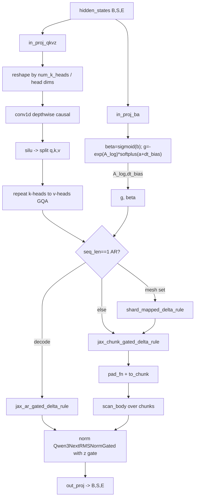

# Qwen3-Next Gated DeltaNet & Omni audio encoder

The perf-critical heart of MaxText's Qwen3 family is not softmax attention but a **linear-attention** block, `Qwen3NextGatedDeltaNet`, that replaces the quadratic QK^T with a *gated delta-rule recurrence* over a running state matrix. This page explains that block — its projections, depthwise causal conv, and the two hand-written delta-rule kernels (chunked-parallel for training/prefill, single-step for decode) — plus the separate `Qwen3OmniAudioEncoder` conv+transformer front end that shares this module.

## Overview

A Gated DeltaNet layer is a linear-attention recurrence: instead of forming an `S×S` attention matrix, it maintains a per-head state `h` of shape `(K_dim, V_dim)` and, for each token, applies a *delta rule* update (write `value` into `h` keyed by `key`, gated by a data-dependent decay `g` and a write strength `beta`). Because the recurrence is associative under the gating, it can be run two ways: token-by-token for autoregressive decode ([`jax_ar_gated_delta_rule`](../catalog/src/maxtext/models/qwen3.md#jax_ar_gated_delta_rule)), or chunked so that within a chunk the math is a dense parallel matmul and only the *inter-chunk* state is carried by a `jax.lax.scan` ([`jax_chunk_gated_delta_rule`](../catalog/src/maxtext/models/qwen3.md#jax_chunk_gated_delta_rule)). The chunked form is what makes this efficient on TPU — it turns an inherently sequential recurrence into a short scan over `S/chunk_size` steps, each of which is MXU-friendly matmuls. The block's forward ([`__call__`](../catalog/src/maxtext/models/qwen3.md#Qwen3NextGatedDeltaNet.__call__)) wraps the chunked kernel in a `jax.shard_map` ([`shard_mapped_delta_rule`](../catalog/src/maxtext/models/qwen3.md#Qwen3NextGatedDeltaNet.shard_mapped_delta_rule)) so the batch/head recurrence is sharded across the mesh with no cross-device communication inside the kernel.

## Diagram

## Design rationale (why it's built this way)

**Two kernels, chosen by regime.** The chunked kernel amortizes the recurrence into `num_chunks` scan steps of dense matmuls, which is the right shape for a full training sequence or prefill; the autoregressive kernel is a specialized `seq_len==1` step whose docstring is explicit — "Highly optimized step for Autoregressive Decoding (seq_len == 1)" — and which `.squeeze(1)`s away the sequence axis to avoid broadcast overhead ([`jax_ar_gated_delta_rule`](../catalog/src/maxtext/models/qwen3.md#jax_ar_gated_delta_rule)). Picking the wrong one at decode would pay full-chunk cost per token.

**Mixed precision is deliberate: state in f32, projections in bf16.** Inside both kernels the compute tensors (`query`, `key`, `value`, `beta`) are cast to `compute_dtype` (bf16) while `g` and the running state `h` are kept in `jnp.float32` — the recurrence accumulates over the whole sequence, so the state is the numerically sensitive quantity. [`scan_body`](../catalog/src/maxtext/models/qwen3.md#jax_chunk_gated_delta_rule.scan_body) does every matmul at `Precision.HIGHEST`. This is a speed/stability tradeoff a TPU perf pass must respect: the f32 state and HIGHEST matmuls are load-bearing, not incidental.

**Depthwise causal conv before the recurrence.** [`conv1d`](../catalog/src/maxtext/models/qwen3.md#Qwen3NextGatedDeltaNet.conv1d) is an `nnx.Conv` with `feature_group_count=conv_dim` (fully depthwise) and `padding="CAUSAL"`, applied to the concatenated q|k|v channels. It gives each channel a small local receptive field cheaply (one weight per channel per tap) before the global delta-rule mixing.

> [!inferred]
> The gating parametrization `g = -exp(A_log) * softplus(a + dt_bias)` with `A_log` initialized as `log(Uniform(1e-9, 16))` ([`a_log_init`](../catalog/src/maxtext/models/qwen3.md#Qwen3NextGatedDeltaNet.a_log_init)) mirrors the Mamba/SSM-style negative log-decay so the per-head forget rate is a learned positive number; this reading comes from the init range and the sign, not from an in-file docstring.

**GQA-style head sharing.** `num_v_heads` can exceed `num_k_heads`; [`v_heads_per_k_head`](../catalog/src/maxtext/models/qwen3.md#Qwen3NextGatedDeltaNet.v_heads_per_k_head) is their ratio and the forward `jnp.repeat`s the k-heads up to the v-head count so each value head reuses a key head — fewer key/query params for the same value capacity.

## Entry points

- [`__call__`](../catalog/src/maxtext/models/qwen3.md#Qwen3NextGatedDeltaNet.__call__) — the GatedDeltaNet layer forward. Reached once per Qwen3-Next decoder layer of this type. Takes `hidden_states (B,S,E)` and a `model_mode`; branches between the AR kernel, the sharded chunked kernel, and a plain chunked call depending on `seq_len`, `model_mode`, and whether a `mesh` is present.
- [`shard_mapped_delta_rule`](../catalog/src/maxtext/models/qwen3.md#Qwen3NextGatedDeltaNet.shard_mapped_delta_rule) — the `jax.shard_map` wrapper (closed over per-call `qkv_pspec`/`state_pspec`) that runs [`jax_chunk_gated_delta_rule`](../catalog/src/maxtext/models/qwen3.md#jax_chunk_gated_delta_rule) with `check_vma=False`. This is the entry hit in distributed training/prefill and defines how the batch/head recurrence is partitioned.
- [`init_kv_caches`](../catalog/src/maxtext/models/qwen3.md#Qwen3NextGatedDeltaNet.init_kv_caches) — builds the GDN `kvcache.KVCache` (`is_gdn=True`) sized from `conv_dim = 2*key_dim + value_dim` and `conv_kernel_size`, using the traced runtime batch. Reached at cache setup for inference, not training.
- [`Qwen3OmniAudioEncoder.__call__`](../catalog/src/maxtext/models/qwen3.md#Qwen3OmniAudioEncoder.__call__) — the audio front end: chunks mel features, runs three `gelu`-separated conv2d stages, projects, adds positional embeddings, then a stack of encoder layers. Reached when audio inputs are present; independent of the GDN text path.

## Mechanism (step-by-step)

1. **Input projections.** [`__call__`](../catalog/src/maxtext/models/qwen3.md#Qwen3NextGatedDeltaNet.__call__) applies [`in_proj_qkvz`](../catalog/src/maxtext/models/qwen3.md#Qwen3NextGatedDeltaNet.in_proj_qkvz) to produce the fused `q|k|v|z` channels (width `2*key_dim + 2*value_dim`, the `z` half being the output gate) and [`in_proj_ba`](../catalog/src/maxtext/models/qwen3.md#Qwen3NextGatedDeltaNet.in_proj_ba) to produce the `b|a` scalars (width `2*num_v_heads`) that become `beta` and the decay input. Both are `DenseGeneral` with `kernel_axes=("embed","gdn_head")`.

2. **Reshape by head geometry.** The `qkvz` output is reshaped using [`num_k_heads`](../catalog/src/maxtext/models/qwen3.md#Qwen3NextGatedDeltaNet.num_k_heads), [`head_k_dim`](../catalog/src/maxtext/models/qwen3.md#Qwen3NextGatedDeltaNet.head_k_dim), [`head_v_dim`](../catalog/src/maxtext/models/qwen3.md#Qwen3NextGatedDeltaNet.head_v_dim) and [`v_heads_per_k_head`](../catalog/src/maxtext/models/qwen3.md#Qwen3NextGatedDeltaNet.v_heads_per_k_head); q/k carry `key_dim` channels, v carries `value_dim` = [`head_v_dim`](../catalog/src/maxtext/models/qwen3.md#Qwen3NextGatedDeltaNet.head_v_dim)×[`num_v_heads`](../catalog/src/maxtext/models/qwen3.md#Qwen3NextGatedDeltaNet.num_v_heads). The sharding of `mixed_qkvz` is derived from `self.mesh` and the config's logical axis rules.

3. **Depthwise causal conv.** q, k, v are flattened, concatenated, and passed through [`conv1d`](../catalog/src/maxtext/models/qwen3.md#Qwen3NextGatedDeltaNet.conv1d); the output is `silu`-activated (in f32 then cast back) and split back into `q_conv/k_conv/v_conv`. This is a short local mixer applied per channel before the recurrence.

4. **Compute the gates.** `beta = sigmoid(b)` and `g = -exp(A_log) * softplus(a + dt_bias)`, where [`A_log`](../catalog/src/maxtext/models/qwen3.md#Qwen3NextGatedDeltaNet.A_log) and [`dt_bias`](../catalog/src/maxtext/models/qwen3.md#Qwen3NextGatedDeltaNet.dt_bias) are per-`num_v_heads` learned parameters. If `decoder_segment_ids` are given, keys/values/`g` are masked to zero at padding positions so cross-document leakage cannot enter the state.

5. **GQA head expansion.** When [`num_v_heads`](../catalog/src/maxtext/models/qwen3.md#Qwen3NextGatedDeltaNet.num_v_heads) > [`num_k_heads`](../catalog/src/maxtext/models/qwen3.md#Qwen3NextGatedDeltaNet.num_k_heads), query and key are `jnp.repeat`ed along the head axis by [`v_heads_per_k_head`](../catalog/src/maxtext/models/qwen3.md#Qwen3NextGatedDeltaNet.v_heads_per_k_head) so every value head has a matching q/k head.

6. **Kernel selection.** If `seq_len==1` and decoding, the single-step [`jax_ar_gated_delta_rule`](../catalog/src/maxtext/models/qwen3.md#jax_ar_gated_delta_rule) runs; otherwise if a [`mesh`](../catalog/src/maxtext/models/qwen3.md#Qwen3NextGatedDeltaNet.mesh) is present the chunked kernel runs inside [`shard_mapped_delta_rule`](../catalog/src/maxtext/models/qwen3.md#Qwen3NextGatedDeltaNet.shard_mapped_delta_rule); with no mesh it calls [`jax_chunk_gated_delta_rule`](../catalog/src/maxtext/models/qwen3.md#jax_chunk_gated_delta_rule) directly. The state argument defaults to zeros `(B, num_v_heads, head_k_dim, head_v_dim)`.

7. **Chunked recurrence.** [`jax_chunk_gated_delta_rule`](../catalog/src/maxtext/models/qwen3.md#jax_chunk_gated_delta_rule) L2-normalizes q/k if `use_qk_norm_in_gdn`, scales q by `1/sqrt(K_dim)`, right-pads the sequence to a multiple of `chunk_size` via [`pad_fn`](../catalog/src/maxtext/models/qwen3.md#jax_chunk_gated_delta_rule.pad_fn), then folds the sequence into chunks with [`to_chunk`](../catalog/src/maxtext/models/qwen3.md#jax_chunk_gated_delta_rule.to_chunk) / [`to_chunk_scalar`](../catalog/src/maxtext/models/qwen3.md#jax_chunk_gated_delta_rule.to_chunk_scalar) and runs [`scan_body`](../catalog/src/maxtext/models/qwen3.md#jax_chunk_gated_delta_rule.scan_body) over the chunk axis. Inside a chunk, `scan_body` computes an *inter-chunk* term `q·exp(g)·h` against the carried state, an *intra-chunk* causal term with a `tril` mask over the `g` differences, combines them, then decays and rank-updates the state `h_new = h·exp(g_last) + k^T·v_new`. All matmuls use `Precision.HIGHEST`; the delta rule "absorbs beta inside v_new" so beta is not re-applied on the output.

8. **Autoregressive step.** For decode, [`jax_ar_gated_delta_rule`](../catalog/src/maxtext/models/qwen3.md#jax_ar_gated_delta_rule) squeezes the length-1 axis, forms `v_prime = (k_beta·exp(g)) @ state`, `v_new = v_beta − v_prime`, and emits the single-token output plus the updated f32 state — the same recurrence math as one `scan_body` step but with no chunk machinery.

9. **Gated norm and output.** The core attention output is normalized and gated by `z` through [`norm`](../catalog/src/maxtext/models/qwen3.md#Qwen3NextGatedDeltaNet.norm) (a `Qwen3NextRMSNormGated` over [`head_v_dim`](../catalog/src/maxtext/models/qwen3.md#Qwen3NextGatedDeltaNet.head_v_dim)), reshaped back to `value_dim`, and projected to `E` by [`out_proj`](../catalog/src/maxtext/models/qwen3.md#Qwen3NextGatedDeltaNet.out_proj). During inference the updated recurrent and conv states are written to [`cache`](../catalog/src/maxtext/models/qwen3.md#Qwen3NextGatedDeltaNet.cache) (or the paged state), using [`extract_state`](../catalog/src/maxtext/models/qwen3.md#Qwen3NextGatedDeltaNet.extract_state) to carry the trailing `conv_kernel_size−1` conv taps forward.

10. **Audio front end (separate path).** [`Qwen3OmniAudioEncoder.__call__`](../catalog/src/maxtext/models/qwen3.md#Qwen3OmniAudioEncoder.__call__) chunks mel features, runs [`conv2d1`](../catalog/src/maxtext/models/qwen3.md#Qwen3OmniAudioEncoder.conv2d1)/[`conv2d2`](../catalog/src/maxtext/models/qwen3.md#Qwen3OmniAudioEncoder.conv2d2)/[`conv2d3`](../catalog/src/maxtext/models/qwen3.md#Qwen3OmniAudioEncoder.conv2d3) with `gelu` between them, projects via [`conv_out`](../catalog/src/maxtext/models/qwen3.md#Qwen3OmniAudioEncoder.conv_out), adds [`positional_embedding`](../catalog/src/maxtext/models/qwen3.md#Qwen3OmniAudioEncoder.positional_embedding), and runs `encoder_layers_for_audio` transformer layers whose blocks are [`self_attention_audio`](../catalog/src/maxtext/models/qwen3.md#Qwen3OmniAudioEncoderLayer.self_attention_audio) + [`AudioMLP`](../catalog/src/maxtext/models/qwen3.md#Qwen3OmniAudioEncoderLayer.AudioMLP) with [`input_layer_norm`](../catalog/src/maxtext/models/qwen3.md#Qwen3OmniAudioEncoderLayer.input_layer_norm) / [`post_attention_layer_norm`](../catalog/src/maxtext/models/qwen3.md#Qwen3OmniAudioEncoderLayer.post_attention_layer_norm), finishing with [`layernorm_post`](../catalog/src/maxtext/models/qwen3.md#Qwen3OmniAudioEncoder.layernorm_post). This is standard softmax attention, unlike the GDN text path.

## Key data structures

- **Recurrent state `h`** — per (batch, v-head) matrix of shape `(head_k_dim, head_v_dim)`, kept in f32, carried by the chunk scan and by the decode step; the linear-attention analogue of a KV cache.
- **Head-geometry scalars** — [`key_dim`](../catalog/src/maxtext/models/qwen3.md#Qwen3NextGatedDeltaNet.key_dim) = head_k_dim·num_k_heads, [`value_dim`](../catalog/src/maxtext/models/qwen3.md#Qwen3NextGatedDeltaNet.value_dim) = head_v_dim·num_v_heads, and `conv_dim = 2*key_dim + value_dim`; these set the projection and conv widths and the cache layout.
- **GDN `KVCache`** — built by [`init_kv_caches`](../catalog/src/maxtext/models/qwen3.md#Qwen3NextGatedDeltaNet.init_kv_caches) / [`cache`](../catalog/src/maxtext/models/qwen3.md#Qwen3NextGatedDeltaNet.cache) with `is_gdn=True`, holding both the recurrent state and the rolling conv state (last `conv_kernel_size−1` inputs).
- **Learned gate params** — [`A_log`](../catalog/src/maxtext/models/qwen3.md#Qwen3NextGatedDeltaNet.A_log) and [`dt_bias`](../catalog/src/maxtext/models/qwen3.md#Qwen3NextGatedDeltaNet.dt_bias), each length `num_v_heads`, define the per-head decay.

## Dynamics (design intent)

The shard-map partitioning ([`shard_mapped_delta_rule`](../catalog/src/maxtext/models/qwen3.md#Qwen3NextGatedDeltaNet.shard_mapped_delta_rule)) uses logical specs `(KV_BATCH, None, KV_HEAD, None)` for q/k/v and `(KV_BATCH, KV_HEAD, None, None)` for the state, so the recurrence is sharded over batch and head with the chunk scan running independently per shard and `check_vma=False` (the kernel is communication-free internally). The chunked-vs-AR split is a static `seq_len`/`model_mode` decision, so the compiler sees one kernel per regime. All state accumulation is f32 by construction. These are intent statements from the source; realized overlap/occupancy is a profiling matter.

## Edge cases

- **Padding to `chunk_size`.** [`jax_chunk_gated_delta_rule`](../catalog/src/maxtext/models/qwen3.md#jax_chunk_gated_delta_rule) right-pads via [`pad_fn`](../catalog/src/maxtext/models/qwen3.md#jax_chunk_gated_delta_rule.pad_fn) when `seq_len % chunk_size != 0`; padded positions must not corrupt the state.
- **Batch mismatch on cache reload.** The inference path broadcasts/pads/truncates `conv_state` and `recurrent_state` when the cached batch differs from the incoming batch (e.g. 16→1), and [`extract_state`](../catalog/src/maxtext/models/qwen3.md#Qwen3NextGatedDeltaNet.extract_state) handles variable valid lengths under segment ids.
- **`_gdn_replicate_expert` env override.** [`_gdn_replicate_expert`](../catalog/src/maxtext/models/qwen3.md#Qwen3NextGatedDeltaNet._gdn_replicate_expert) is read from `MAXTEXT_GDN_REPLICATE_EXPERT` at construction, changing how the GDN block is sharded relative to MoE experts — a sharding knob set outside the config.
- **Paged vLLM state.** When `kv_cache` is a 2-tuple of paged mamba arrays with `mamba_state_indices`, the forward diverts to a REF (pure-JAX) ragged GDN path "to avoid Mosaic kernel compilation issues" rather than the shard-mapped kernel.

## Open questions

- `Qwen3NextRMSNormGated`, `DenseGeneral`, `run_jax_gdn_attention`, and the RoPE/MoE parts of the broader Qwen3 model are referenced but not in this subgraph; their internals belong on their own pages.
- The default `gdn_chunk_size` and whether `use_qk_norm_in_gdn` is on by default are config values not visible here; they materially affect the scan depth and numerics.
- The external `flax` `Conv#kernel` used by the paged path is outside the catalog and intentionally not cited.

## See also

- [maxtext-layers-attentions](./maxtext-layers-attentions.md) — the standard softmax attention the audio encoder reuses.
- [maxtext-layers-attention_op](./maxtext-layers-attention_op.md) — attention op/kernel dispatch.
- [maxtext-layers-embeddings](./maxtext-layers-embeddings.md) — RoPE and positional embedding building blocks.
- [maxtext-layers-moe](./maxtext-layers-moe.md) — the MoE layer for Qwen3 MoE variants.
- [maxtext-models-deepseek_batchsplit](./maxtext-models-deepseek_batchsplit.md) — another hand-scheduled TPU model forward in this repo.

## Sources

- `raw/code/maxtext/src/maxtext/models/qwen3.py` (repo maxtext @ `fcb7ebeba9ecfc67d79e471f50c16c9d89b3263d`)
