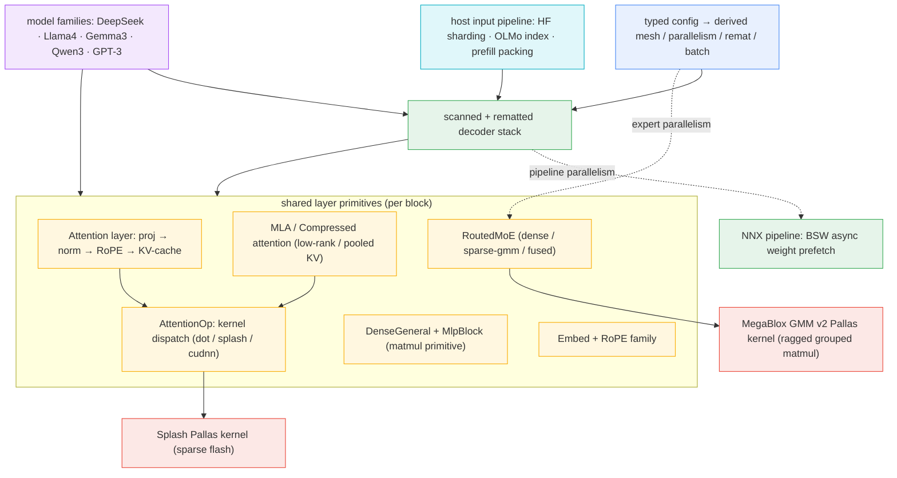

# maxtext — what it is and how it fits together

## In one paragraph
MaxText is a JAX/Flax LLM training-and-inference stack whose entire design is organized around one idea: **describe the model and its parallelism declaratively, then let one compiled step run at any mesh shape.** A single typed config object is validated and *derived* into device counts, batch sizes, model dimensions, sharding rules, and a rematerialization plan; that config then drives a decoder built from a small set of shared primitives — one axis-general linear layer, one embedding/RoPE family, an attention *layer* that projects/norms/RoPEs Q/K/V and an attention *op* that dispatches to the right kernel — replicated across N transformer blocks by a single `scan` so a 100-layer model compiles like a 1-layer model. On top of that spine sit the expensive, perf-defining subsystems: mixture-of-experts with three interchangeable compute paths and expert-parallel all-to-all, pipeline parallelism that overlaps FSDP weight all-gathers with stage compute, two hand-written Pallas/Mosaic kernels (sparse Splash attention and a ragged grouped-matmul), and low-rank/compressed attention variants (MLA, DeepSeek-V4 HCA/CSA) that shrink the KV cache. Concrete model families (DeepSeek, Llama 4, Gemma 3, Qwen3-Next, GPT-3) are thin definitions that wire these shared pieces into a specific layer schedule. A host-side input pipeline keeps the accelerator fed with fixed-shape, packed batches. Every subsystem exposes its knobs — remat policy, block sizes, layouts, precision, capacity vs. dropless routing, prefetch overlap — as config surfaces, which is exactly what a TPU perf-optimization loop tunes.

## Core architecture

Node → concept page: [typed config](concepts/maxtext-configs-types.md) · [decoder stack](concepts/maxtext-layers-decoders.md) · [Attention layer](concepts/maxtext-layers-attentions.md) · [AttentionOp](concepts/maxtext-layers-attention_op.md) · [MLA](concepts/maxtext-layers-attention_mla.md) / [Compressed](concepts/maxtext-layers-attention_compressed.md) · [linears](concepts/maxtext-layers-linears.md) · [embeddings](concepts/maxtext-layers-embeddings.md) · [MoE](concepts/maxtext-layers-moe.md) · [Splash kernel](concepts/maxtext-kernels-attention-splash_attention_kernel.md) · [GMM kernel](concepts/maxtext-kernels-megablox-pallas_mosaic_tpu_v2_gmm_kernel.md) · [pipeline](concepts/maxtext-layers-pipeline.md) · [input pipeline](concepts/maxtext-input_pipeline-input_pipeline_utils.md).

## Performance-relevant surfaces
The TPU-perf entry point: every knob a perf-optimization loop tunes, where it lives, and what it trades. Each row grounds in the concept page that explains the mechanism; the deeper walkthrough follows under *Main concepts*.

| Surface (config knob) | Where | What it trades |
|---|---|---|
| **Remat policy** — `remat_policy` = `minimal`/`save_*`/`*_offloaded`, plus per-tensor `RematLocation` → `tensors_on_device`/`tensors_to_offload` | [config types](concepts/maxtext-configs-types.md), [decoders](concepts/maxtext-layers-decoders.md) | activation HBM ↔ recompute FLOPs (+ host-offload bandwidth). The single most-tuned lever. |
| **Scan axis / FSDP overlap** — logical sharding name stamped on the stacked-layer dim | [Linen](concepts/maxtext-layers-decoders.md) / [NNX decoders](concepts/maxtext-layers-nnx_decoders.md) | lets XLA overlap FSDP weight all-gathers across `scan` iterations; decouples compile time from depth. |
| **Attention kernel dispatch** — `attention` = `autoselected`/`dot_product`/`flash`(splash)/`cudnn_flash_te`/`paged`/`vllm_rpa` | [AttentionOp](concepts/maxtext-layers-attention_op.md) | a decision tree over (model, hardware, regime); decode→dot-product (KV-quant/mask), train/prefill→splash. |
| **Splash `BlockSizes`** — `block_q`, `block_kv`, `block_kv_compute`, `block_q_dkv`…, `use_fused_bwd_kernel`, `QKVLayout` | [Splash kernel](concepts/maxtext-kernels-attention-splash_attention_kernel.md) | grid/VMEM occupancy vs. recompute; the 8-field autotune surface. Fused backward reuses fwd `logsumexp`. |
| **MoE compute path** — dense/capacity vs. sparse-GMM (dropless) vs. fused; `use_tokamax_backend`, `use_megablox` | [RoutedMoE](concepts/maxtext-layers-moe.md), [GMM v2 kernel](concepts/maxtext-kernels-megablox-pallas_mosaic_tpu_v2_gmm_kernel.md) | token-dropping padding ↔ ragged-GEMM sort cost; expert-parallel `ragged_all_to_all` schedule. |
| **Pipeline schedule + BSW** — microbatch count, circular/interleaved repeats, Buffer Sliding Window | [NNX pipeline](concepts/maxtext-layers-pipeline.md) | bubble amortization; two-slot buffer all-gathers next repeat's FSDP weights behind current matmul. |
| **Matmul precision / quant** — AQT int8/fp8, weight-vs-compute dtype split, host-offload of weights, explicit output sharding | [linears](concepts/maxtext-layers-linears.md), [embeddings](concepts/maxtext-layers-embeddings.md) | MXU throughput / HBM ↔ numerics; applied at the single `lax.dot_general`. |
| **KV-cache reduction** — MLA low-rank latent, DeepSeek-V4 HCA/CSA pooling, cross-layer KV sharing, KV-quant | [MLA](concepts/maxtext-layers-attention_mla.md), [Compressed](concepts/maxtext-layers-attention_compressed.md), [Attention layer](concepts/maxtext-layers-attentions.md) | extra down/up matmuls + compressor/indexer ↔ shorter key axis / smaller cache. |
| **SparseCore MoE unroute** — MLIR-dialect kernel (`gather_reduce_sc`); `col_chunk_size`, `row_chunk_size`, `loop_unroll_factor_*`, `reduce_group_size` | [MoE](concepts/maxtext-layers-moe.md) (see [`catalog/`](catalog/)) | drops below `pallas_call` to raw dialects for v5p/v7x SparseCore; large autotune surface. |
| **Host input throughput** — fixed-shape packing, Grain shard assignment, OLMo index, prefill bin-packing | [input utils](concepts/maxtext-input_pipeline-input_pipeline_utils.md), [OLMo](concepts/maxtext-input_pipeline-olmo_data.md), [prefill packing](concepts/maxtext-input_pipeline-packing-prefill_packing.md) | keeps the accelerator fed at fixed shapes (never recompiles); n-gram filter is the real host bottleneck. |

> [!inferred] Cross-repo perf verdicts and this wiki's own experiment backlinks (e.g. which `BlockSizes` the gemma4 loop accepted) live in the thin on-demand hand page [`../maxtext.md`](../maxtext.md), not here — this overview is regenerated from code and stays a pure map of the repo's tunable surfaces.

## Main concepts

### Typed config → derived mesh, parallelism, and remat plan
Everything downstream reads one object. `MaxTextConfig` is a Pydantic model assembled from ~60 topical mixins with `extra="forbid"`, and one monolithic `@model_validator` *derives* the run: it resolves device count via a priority ladder (AOT topology → single-controller subslice → `jax.devices()`), computes global/micro batch sizes, scales `base_*` dims by a single `global_parameter_scale`, reorders mesh axes so `stage` precedes `data` for pipelining, and turns the per-tensor `RematLocation` fields into `tensors_on_device` / `tensors_to_offload` lists — the memory-vs-recompute knob the loop tunes most. The ordering is a deliberate line-for-line port of the legacy dict-based loader, kept for behavioral parity. See [config type system](concepts/maxtext-configs-types.md) and the [legacy pyconfig loader](concepts/maxtext-configs-pyconfig_deprecated.md) it supersedes.

### The scanned, rematted decoder stack
The decoder refuses to unroll: N identical blocks compile once and replay under `scan`, so compile time and activation memory are decoupled from depth. Its whole TPU-perf envelope is three surfaces — the scan axis (which stamps the logical sharding name on the stacked-layer dimension, letting XLA overlap FSDP all-gathers across iterations), the remat policy (`minimal`/`save_*`/`*_offloaded`, chosen by string and applied as `jax.checkpoint`), and pipeline partition. Two ports coexist: the Flax **Linen** stack uses `nn.scan` + `nn.remat` module transforms; the **NNX** stack hand-rolls two `jax.lax.scan`s (one to materialize stacked params without N live modules, one to run them under `jax.checkpoint`). Architecture branches (Gemma 3/4 block patterns, DeepSeek dense+MoE double-scan, Engram interleaving, Gemma4-small no-scan) are variations on *how many* scans and *which* block each scans. See [Linen decoders](concepts/maxtext-layers-decoders.md) and [NNX decoders](concepts/maxtext-layers-nnx_decoders.md).

### Attention layer vs. attention-op kernel dispatch
Attention is split into two responsibilities. The **Attention layer** produces correctly projected, normed, RoPE'd, and sharded Q/K/V and writes the KV cache — it owns fused-vs-separate QKV, GQA head grouping, cross-layer KV sharing (donor layers carry no K/V weights, a compiled-in FLOP/HBM saving), and per-model RoPE selection. It then hands the shaped tensors to **AttentionOp**, a mode-aware dispatcher: decode and very short sequences route to a hand-written dot-product path (the only one supporting KV-quant and additive indexer/MoBA masks), while training/prefill on TPU route to the Splash/flash path, which builds a fully parameterized Splash kernel (block sizes, layouts, fused-backward, scheduler from `local_sa_*` config), wraps it in a `shard_map` that shards Q over the context axis while replicating K/V, and expresses masking through lazy composable Splash mask objects instead of an O(seq²) tensor. This op is where nearly every attention-side TPU tuning knob lives. See [Attention layer](concepts/maxtext-layers-attentions.md) and [AttentionOp](concepts/maxtext-layers-attention_op.md).

### Low-rank and compressed attention (MLA, HCA/CSA)
DeepSeek-family attention shrinks the KV cache instead of the score matrix. **MLA** routes Q and K/V through low-rank latent bottlenecks and caches one small latent + rotary carrier per token rather than `n_heads × head_dim`, adding a down/up matmul pair and a partial-RoPE split; an optional gradient-isolated Lightning Indexer top-k-selects keys to sparsify long-context attention. **CompressedAttention** (DeepSeek-V4) keeps a local K/V window and pools every `compress_rate` tokens into one compressed entry — non-overlapping HCA at ~128× or overlapping CSA at 4× with a learned block-selecting Indexer — trading extra compressor/indexer matmuls for a much shorter key axis. Both delegate the actual softmax to the reused AttentionOp. See [MLA](concepts/maxtext-layers-attention_mla.md) and [Compressed Attention](concepts/maxtext-layers-attention_compressed.md).

### Pallas/Mosaic kernels: Splash attention and MegaBlox GMM
Two hand-written kernels carry the heaviest compute. **Splash** ("sparse flash") exploits the block structure of causal/local/chunked masks via a scalar-prefetched sparsity schedule (`data_next`/`block_mask`) that shrinks the grid to only live KV blocks; its backward is two kernels (dQ-outer and dKV-outer loop nests, optionally fused) reusing the forward `logsumexp` so softmax is never recomputed, with block sizes and QKV layout as pure perf levers. **MegaBlox GMM v2** is the grouped matmul under MoE: a metadata prepass walks runtime `group_sizes` to handle ragged, non-tile-aligned expert boundaries, then drives a manual `emit_pipeline` over a dynamically-sized grid with triple-buffered weight DMAs, sub-byte weight quantization unpacked in-VMEM, and fused SwiGLU. Both are the kernel-replacement targets a Pallas hypothesis would touch. See [Splash backward](concepts/maxtext-kernels-attention-splash_attention_kernel.md) and [GMM v2](concepts/maxtext-kernels-megablox-pallas_mosaic_tpu_v2_gmm_kernel.md).

### Mixture-of-experts and expert parallelism
`RoutedMoE` realizes one MoE block through three physically different paths with wildly different cost profiles: a **dense/capacity** path (every expert over a padded, token-dropping buffer as clean einsums — Switch-Transformer trade), a **sparse grouped-matmul** path (sort tokens by expert, one ragged GEMM, no padding/dropping — dropless trade), and a **fused inference** path. Under expert parallelism the sparse path's dominant cost is a `ragged_all_to_all` that dispatches tokens to the shard owning their expert and its dual on the way back, all placed by hand inside one `shard_map`. Which path and which collective schedule wins on a given TPU config is exactly an empirical experiment question. See [RoutedMoE](concepts/maxtext-layers-moe.md); its grouped GEMM is the [GMM kernel](concepts/maxtext-kernels-megablox-pallas_mosaic_tpu_v2_gmm_kernel.md).

### Pipeline parallelism with async weight prefetch
The active NNX pipeline turns one decoder-layer body into a GPipe/circular schedule: the batch becomes microbatches, layers split into `stage`-sharded stages, and a loop pushes microbatches one hop per iteration, every iteration `vmap`ped over the stage axis so all stages run identical code on different data. The bubble is arithmetic (index clamping), not a branch, and circular/interleaved repeats amortize it. The perf-load-bearing surface is the **Buffer Sliding Window**: a two-slot buffer all-gathers the *next* repeat's FSDP-sharded weights while the current repeat computes, hiding the collective behind matmul time — precisely the overlap the [deprecated Linen version](concepts/maxtext-layers-pipeline_deprecated.md), which gathered weights synchronously on the critical path, could not do. See [NNX pipeline](concepts/maxtext-layers-pipeline.md).

### Shared linear and embedding primitives
Every matmul in the stack is one axis-general `DenseGeneral` (contract an arbitrary input-axis tuple against a logical-axis-annotated kernel), and the FFN is one `MlpBlock` of two-plus of them with a gated activation. The single `lax.dot_general` call is where per-layer matmul precision, AQT int8/fp8 quantization, weight-vs-compute dtype split, explicit-vs-auto output sharding, and host-offload of the weight all take effect. Embeddings cover token lookup (iota-matmul vs. gather, with optional host offload of the large vocab table) and a template-method RoPE hierarchy — one shared rotation with a swappable frequency schedule per model (LLaMA wavelength scaling, Gemma partial inf-padded rotary, YaRN complex-table long-context, Qwen multimodal MRoPE). See [linears](concepts/maxtext-layers-linears.md) and [embeddings](concepts/maxtext-layers-embeddings.md).

### Model families as thin definitions over shared layers
Concrete models are mostly *schedules*, not new math. DeepSeek splits early dense layers from later routed+shared MoE layers over an MLA base; its [batch-split variant](concepts/maxtext-models-deepseek_batchsplit.md) hand-schedules two microbatches out of phase, with explicit FSDP prefetch, expert all-to-all, custom-VJP remat, and host-memory residual offload, to overlap collectives with compute. Llama 4 interleaves dense/MoE and chunked-local(RoPE)/global(NoPE) layers by stride ("iRoPE") so most layers cap attention cost per query. Gemma 3 fixes a 5:1 local-sliding/global pattern with sandwich norms and qk-norm. Qwen3-Next replaces softmax attention with a chunked gated-delta-rule linear-attention recurrence (f32 state, bf16 projections). GPT-3 is plain fused-QKV multi-head attention with declarative sharding. See [DeepSeek](concepts/maxtext-models-deepseek.md), [Llama 4](concepts/maxtext-models-llama4.md), [Gemma 3](concepts/maxtext-models-gemma3.md), [Qwen3](concepts/maxtext-models-qwen3.md), [GPT-3](concepts/maxtext-models-gpt3.md).

### Host-side input pipeline and packing
The accelerator sees identical tensor shapes every step so it never recompiles; keeping it fed is the host's job. HF `IterableDataset` streams are adapted to Grain's random-access protocol with disjoint per-thread shard assignment, and every example is padded/trimmed to a fixed `max_length` with derived segmentation and position tensors the attention kernel needs. The OLMo path builds a header-only, fingerprinted index mapping global instance → `(file, offset)` for deterministic restart, and runs an n-gram repetition filter that is the realistic per-token host bottleneck. For inference, prefill packing bin-packs several short prompts into one fixed-length prefill using `i*2+1` segment ids so one attention call treats the window as N independent sequences. See [input-pipeline utils](concepts/maxtext-input_pipeline-input_pipeline_utils.md), [OLMo indexing](concepts/maxtext-input_pipeline-olmo_data.md), and [prefill packing](concepts/maxtext-input_pipeline-packing-prefill_packing.md).

## How a request flows
A training step runs down one spine. The [typed config](concepts/maxtext-configs-types.md) is constructed and derived (mesh, batch, remat lists, pipeline schedule); the host [input pipeline](concepts/maxtext-input_pipeline-input_pipeline_utils.md) delivers a fixed-shape, segmented batch; the [decoder stack](concepts/maxtext-layers-decoders.md) embeds tokens, then `scan`s one rematted block body over the layer axis (or, under pipeline parallelism, hands stages to the [NNX pipeline](concepts/maxtext-layers-pipeline.md) with BSW weight prefetch). Inside each block, the [Attention layer](concepts/maxtext-layers-attentions.md) projects/norms/RoPEs Q/K/V (or [MLA](concepts/maxtext-layers-attention_mla.md)/[Compressed](concepts/maxtext-layers-attention_compressed.md) for DeepSeek) and dispatches through [AttentionOp](concepts/maxtext-layers-attention_op.md) to the [Splash kernel](concepts/maxtext-kernels-attention-splash_attention_kernel.md); the FFN runs either a dense [MlpBlock](concepts/maxtext-layers-linears.md) or [RoutedMoE](concepts/maxtext-layers-moe.md), whose sparse path sorts tokens, all-to-alls across expert shards, and calls the [GMM kernel](concepts/maxtext-kernels-megablox-pallas_mosaic_tpu_v2_gmm_kernel.md). The decoder's output head projects to vocab logits. Which [model family](concepts/maxtext-models-llama4.md) is running only changes the per-layer schedule wiring these shared pieces together.

## Map of the wiki
- **Which knobs does a perf loop tune (remat, splash blocks, MoE path, precision, pipeline)?** → [Performance-relevant surfaces](#performance-relevant-surfaces).
- **How is the run configured / where do device count, batch size, remat lists come from?** → [config types](concepts/maxtext-configs-types.md) (and the [legacy loader](concepts/maxtext-configs-pyconfig_deprecated.md)).
- **How does depth not blow up compile time / where is remat and scan?** → [Linen decoders](concepts/maxtext-layers-decoders.md), [NNX decoders](concepts/maxtext-layers-nnx_decoders.md).
- **Where is a specific attention behavior (fused QKV, GQA, KV-sharing, RoPE)?** → [Attention layer](concepts/maxtext-layers-attentions.md); **kernel selection, Splash block sizes, masking, sharding** → [AttentionOp](concepts/maxtext-layers-attention_op.md).
- **KV-cache reduction / long-context sparsity** → [MLA](concepts/maxtext-layers-attention_mla.md), [Compressed Attention](concepts/maxtext-layers-attention_compressed.md).
- **The Pallas/Mosaic kernels themselves** → [Splash backward](concepts/maxtext-kernels-attention-splash_attention_kernel.md), [MegaBlox GMM v2](concepts/maxtext-kernels-megablox-pallas_mosaic_tpu_v2_gmm_kernel.md).
- **MoE routing, capacity vs. dropless, expert-parallel all-to-all** → [RoutedMoE](concepts/maxtext-layers-moe.md).
- **Pipeline schedule, bubble, FSDP weight prefetch overlap** → [NNX pipeline](concepts/maxtext-layers-pipeline.md) (and the [deprecated Linen](concepts/maxtext-layers-pipeline_deprecated.md) for contrast).
- **Matmul precision / quantization / dtype / host-offload knobs** → [linears](concepts/maxtext-layers-linears.md), [embeddings](concepts/maxtext-layers-embeddings.md).
- **A specific model's layer schedule** → [DeepSeek](concepts/maxtext-models-deepseek.md), [DeepSeek batch-split](concepts/maxtext-models-deepseek_batchsplit.md), [Llama 4](concepts/maxtext-models-llama4.md), [Gemma 3](concepts/maxtext-models-gemma3.md), [Qwen3](concepts/maxtext-models-qwen3.md), [GPT-3](concepts/maxtext-models-gpt3.md).
- **Host input throughput / packing / dataset sharding** → [input-pipeline utils](concepts/maxtext-input_pipeline-input_pipeline_utils.md), [OLMo indexing](concepts/maxtext-input_pipeline-olmo_data.md), [prefill packing](concepts/maxtext-input_pipeline-packing-prefill_packing.md).
- **Where is symbol X defined / what is its signature / who calls it?** → the exhaustive per-module structural index under [`catalog/`](catalog/).
- **Full concept table with freshness status** → [`index.md`](index.md).
