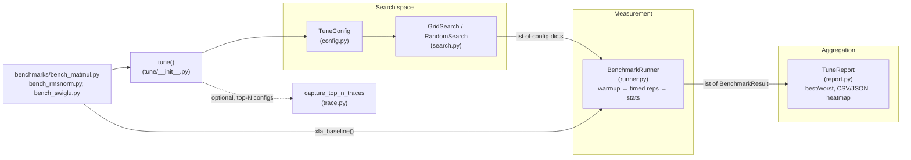

# pallas-forge — what it is and how it fits together

## In one paragraph
`pallas-forge` is a lightweight auto-tuning framework for JAX Pallas TPU kernels. It ships three reference kernels (tiled matmul, fused RMSNorm+residual, fused SwiGLU — outside this ingest's selected packets but referenced throughout) and a kernel-agnostic tuning core — `tune/config.py` defines the search space, `tune/runner.py` benchmarks each candidate configuration with correct warmup/timing discipline, and `tune/report.py` turns the results into rankings, CSV/JSON exports, and heatmaps — all stitched together by the single `tune()` entry point in `tune/__init__.py`. The library's stated purpose, per its README, is answering "is my custom kernel actually beating XLA?" honestly: its own measured numbers show a fused RMSNorm+residual kernel beating XLA by 3.44×, while a hand-written matmul kernel trails XLA's tuned baseline, and a block-size sweep alone produces a 3.56× spread from worst to best configuration.

## Core architecture

## Main concepts

### The search-space / measurement / aggregation split
[pallas_forge/tune/config](concepts/pallas_forge-tune-config.md) owns *what* to try (parameter grids, constraints, grid-vs-random enumeration); [pallas_forge/tune/runner](concepts/pallas_forge-tune-runner.md) owns *how to measure* one configuration correctly (warmup, `jax.block_until_ready`, statistical repetition); [pallas_forge/tune/report](concepts/pallas_forge-tune-report.md) owns *what to do with the results* (ranking, export, visualization). Each is independently usable — a caller could build their own search strategy while still using `BenchmarkRunner` and `TuneReport` — but `tune()` (defined in `tune/__init__.py`, not itself a separate concept page in this ingest) wires all three into the single call every benchmark script uses.

### Correct benchmarking as a first-class design goal
The library's core value proposition, stated directly in `runner.py`'s module docstring, is getting TPU/GPU benchmarking's easy-to-get-wrong details right: separating warmup from timed iterations, forcing real device completion rather than measuring async dispatch latency, and reporting a full statistical distribution rather than a single noisy number. See [pallas_forge/tune/runner](concepts/pallas_forge-tune-runner.md).

### Honest kernel-vs-XLA comparison
Every reference-kernel benchmark script (`bench_matmul.py`, `bench_rmsnorm.py`, `bench_swiglu.py` — outside this ingest's packets but referenced from all three concept pages via their `main`/`xla_baseline` functions) runs the same `BenchmarkRunner` machinery against both the tuned Pallas kernel and an unfused XLA-native equivalent, so the "is my kernel actually beating XLA?" question the README poses gets an apples-to-apples answer rather than a comparison across different measurement methodologies.

### Heatmaps as the visual centerpiece
[pallas_forge/tune/report](concepts/pallas_forge-tune-report.md)'s `heatmap` method is explicitly called out in its own module docstring as making the "3-5x swing" from block-size choice "tangible" — it reduces a multi-parameter sweep to a 2D grid by taking the best-achieved metric over any un-plotted dimensions, and is lazy-imports `matplotlib` so visualization stays an optional dependency (`pip install "pallas-forge[viz]"`).

## How a request flows
A benchmark script (e.g. `bench_matmul.py`) defines `kernel_fn`, `input_fn`, optional `flops_fn`/`bytes_fn`, and a `TuneConfig` (often built via `TuneConfig.from_dict` plus `add_constraint`), then calls `tune(...)`. `tune()` normalizes the config, picks a search strategy (`GridSearch` or `RandomSearch`, both thin wrappers over `TuneConfig.grid`/`TuneConfig.sample`), generates the config list, runs `BenchmarkRunner.run_all` over it, wraps the sorted results in a `TuneReport`, prints the best config and speedup range, and optionally captures XProf traces for the top-N configs via `trace.py`. The script then typically exports the report to CSV/JSON and/or renders a heatmap, and separately calls `xla_baseline()` (which reuses `BenchmarkRunner.run_single` directly) for the XLA comparison point.

## Map of the wiki
- Read [pallas_forge/tune/config](concepts/pallas_forge-tune-config.md) for how search spaces are defined and enumerated.
- Read [pallas_forge/tune/runner](concepts/pallas_forge-tune-runner.md) for the warmup/timing measurement discipline.
- Read [pallas_forge/tune/report](concepts/pallas_forge-tune-report.md) for ranking, export, and heatmap generation.
- See `catalog/` for the exhaustive per-module symbol index, and `index.md` for the concept table.
